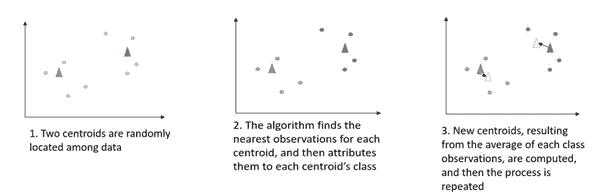
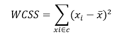
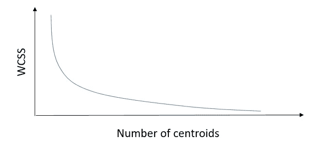
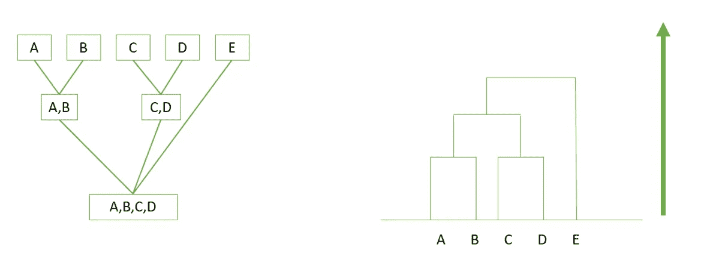
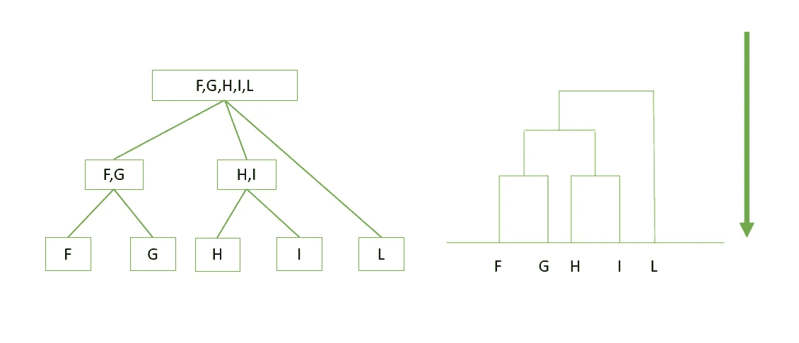
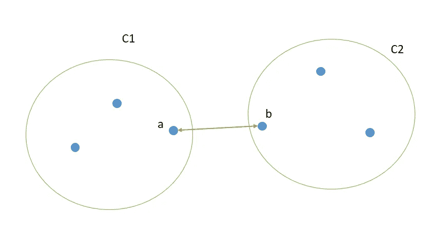
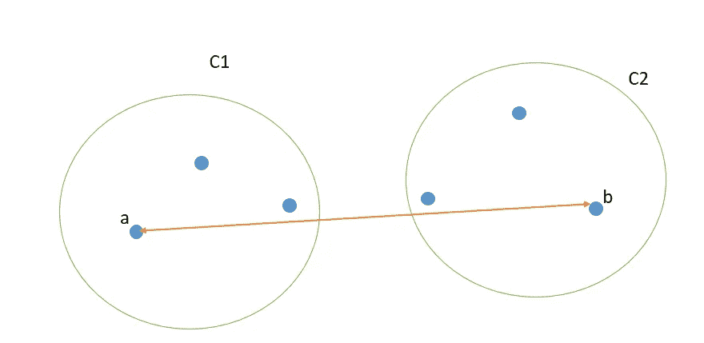
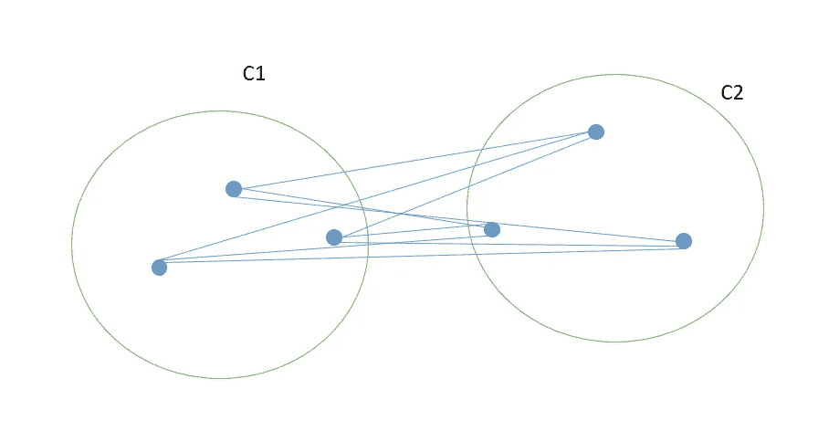

# 无监督学习:K-均值与层次聚类

> 原文：<https://towardsdatascience.com/unsupervised-learning-k-means-vs-hierarchical-clustering-5fe2da7c9554?source=collection_archive---------8----------------------->

在进行无人监督的学习任务时，提供给你的数据不会被标记。这意味着您的算法将致力于推断数据中存在的内部结构，尝试根据它们之间的相似性将它们分组或聚类成类。

我想详细介绍两种主要的集群化算法:

*   k 均值
*   分层聚类

让我们更多地了解他们。

## k 均值

该算法的第一步是在我们未标记的观察值中，创建随机定位的新观察值，称为“质心”。质心的数量将代表输出类的数量(记住，我们不知道)。现在，将开始一个迭代过程，由两个步骤组成:

*   首先，对于每个质心，该算法找到离该质心最近的点(根据通常计算为欧几里德距离的距离),并将它们分配到其类别中；
*   其次，对于每个类别(由一个质心表示)，该算法计算属于该类别的所有点的平均值。该计算的输出将是该类的新质心。

每次重复该过程时，最初与一个质心分类在一起的一些观察结果可能被重定向到另一个质心。此外，在几次重复之后，质心位置的变化应该越来越不重要，因为初始随机质心收敛到真实质心。当质心位置不再变化时，该过程结束。

现在，我们如何决定质心的数量？

有许多方法可以用来完成这项任务。然而，在这篇文章中，我将解释和使用所谓的“肘法”。这个想法是，我们希望在我们的集群内观察到的是低水平的变化，这是用集群内平方和(WCSS)来衡量的:

直观地理解，质心的数量越多，WCSS 越低。特别地，如果我们有和我们观察的数量一样多的质心，每个 WCSS 将等于零。然而，如果我们记得简约定律，我们知道设置尽可能多的质心是不一致的。

这个想法是挑选质心的数量，在此之后，WCSS 的减少是不相关的。我刚才描述的关系可以用下图来表示:

这个想法是，如果图是一个手臂，手臂的肘部是质心的最佳数量。

## 分层聚类

该算法可以使用两种不同的技术:

*   结块的
*   分裂的

后者基于相同的基本思想，但以相反的方式工作:当 *K* 是聚类的数量(可以像 K-means 中那样精确设置)并且 *n* 是数据点的数量，而 *n > K* 时，聚集 HC 从 *n* 个聚类开始，然后聚集数据直到获得 K 个聚类；另一方面，分裂 HC 仅从一个集群开始，然后根据相似性将其分裂，直到获得 *K* 个集群。注意，当我说相似性时，我指的是数据点之间的距离，它可以用不同的方法计算(我将在后面详述)。

让我们想象一下凝聚和分裂的技术:

Agglomerative HC

Divisive HC

正如预期的那样，这里的关键区别是数据点之间的相似性。在数学术语中，相似性主要是指距离，它可以用不同的方法计算。在此，我将提出其中的三条:

*   Min:它指出，给定两个集群 C1 和 C2，它们之间的相似性等于点 a 和 b 之间的最小相似性(翻译:距离),使得 a 属于 C1，b 属于 C2。

*   它陈述了给定两个集群 C1 和 C2，它们之间的相似性等于点 a 和 b 之间的最大相似性，使得 a 属于 C1，b 属于 C2。

*   平均:取所有的点对，计算它们的相似度，然后计算相似度的平均值。后者是集群 C1 和 C2 之间的相似性。

因此，概括地说，两种算法都寻找数据之间的相似性，并且都使用相同的方法来确定聚类的数量。选择哪一个真的取决于你面临的任务类型。