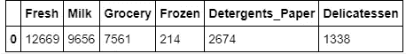
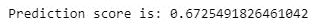
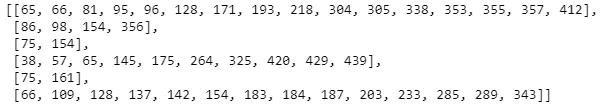

# 无监督学习项目:创建客户群

> 原文：<https://towardsdatascience.com/unsupervised-learning-project-creating-customer-segments-17c4b4bbf925?source=collection_archive---------0----------------------->

## 了解如何开发端到端聚类和降维项目！


Picture from [Unsplash](https://unsplash.com/photos/5fNmWej4tAA)

# 介绍

在整个项目中，我们将分析一些产品类别中几个客户的消费行为。该项目的主要目标是:

*   将具有相似消费特征的客户分组。
*   描述不同组内的差异，以便为每个组找到最佳的交付结构。

为了执行这个项目，我们将使用可以在下面的 [UCI 机器学习知识库](https://archive.ics.uci.edu/ml/datasets/Wholesale+customers)中找到的数据集。

你可以在我的 [GitHub 页面](https://github.com/rromanss23/Machine_Leaning_Engineer_Udacity_NanoDegree/tree/master/projects/customer_segments)上找到完整的项目、文档和数据集:

[https://github . com/rromans 23/Machine _ learning _ Engineer _ uda city _ nano degree/tree/master/projects/customer _ segments](https://github.com/rromanss23/Machine_Leaning_Engineer_Udacity_NanoDegree/tree/master/projects/customer_segments)

我们将重点分析为客户记录的六个产品类别，不包括“渠道”和“地区”字段。

```
***# Import libraries necessary for this project***
import numpy as np
import pandas as pd
from IPython.display import display *# Allows the use of display() for DataFrames*

***# Import supplementary visualizations code visuals.py***
import visuals as vs

***# Pretty display for notebooks***
%matplotlib inline

***# Load the wholesale customers dataset***
try:
    data = pd.read_csv("customers.csv")
    data.drop(['Region', 'Channel'], axis = 1, inplace = True)
    print("Wholesale customers dataset has {} samples with {} features each.".format(*data.shape))
except:
    print("Dataset could not be loaded. Is the dataset missing?")
```


# 数据探索

现在，我们将通过可视化和代码来探索数据集，以了解要素之间的关系。此外，我们将计算数据集的统计描述，并考虑每个特征的整体相关性。

```
***# Display a description of the dataset***
display(data.describe())
```


```
***# Display the head of the dataset***
data.head()
```


## 选择样本

为了更好地了解我们的数据集以及数据将如何通过分析进行转换，我们将选择几个样本点并详细研究它们。

```
***# Select three indices to sample from the dataset***
indices = [85,181,338]

***# Create a DataFrame of the chosen samples***
samples = pd.DataFrame(data.loc[indices], columns = data.keys()).reset_index(drop = True)
print("Chosen samples of wholesale customers dataset:")
display(samples)
```


## 考虑

现在，让我们考虑每个产品类别的总购买成本，以及上述样本客户数据集的统计描述。如果我们必须预测三个样本中的每一个代表哪种机构(客户):

考虑平均值:

*   新鲜度:12000.2977
*   牛奶:5796.2
*   杂货:3071.9
*   洗涤剂 _ 纸张:2881.4
*   熟食店:1524.8

我们可以做出如下预测:

**1)指数 85:零售商:**

-在洗涤剂、纸张和杂货上的支出最大，通常是家庭用品。

-高于牛奶的平均支出。

-低于冷冻产品的平均支出。

**2)指数 181:大市场**

-几乎每个产品类别的高支出。

-在整个数据集的新鲜产品上花费最高。很可能是一个大市场。

-洗涤剂支出低。

**3)索引 338:餐馆**

-每种产品的数量都显著低于前两个客户考虑的数量。

-生鲜产品支出是整个数据集中最低的。

-在牛奶、清洁剂和纸张上的支出处于最低的四分之一。

*   它可能是一个小而便宜的餐馆，需要食品杂货和冷冻食品来提供食物。

## 特征相关性

我们现在将分析这些特性的相关性，以了解顾客的购买行为。换句话说，确定购买某一类产品的某一数量的顾客是否一定会购买另一类产品的某一比例的数量。

我们将通过在删除一个特征的数据子集上训练一个监督回归学习器来研究这一点，然后对该模型预测删除特征的效果进行评分。

```
***# Display the head of the dataset***
data.head(1)
```



```
***# Make a copy of the DataFrame, using the 'drop' function to drop the given feature***
new_data = data.drop('Grocery', axis=1)

***# Split the data into training and testing sets(0.25) using the given feature as the target*
*# Set a random state.***
from sklearn.model_selection import train_test_split

X_train, X_test, y_train, y_test = train_test_split(new_data, data.Grocery, test_size=0.25, random_state=42)

***# Create a decision tree regressor and fit it to the training set***
from sklearn.tree import DecisionTreeRegressor
regressor = DecisionTreeRegressor()
regressor = regressor.fit(X_train, y_train)
prediction = regressor.predict(X_test)

***# Report the score of the prediction using the testing set***
from sklearn.metrics import r2_score
score = r2_score(y_test, prediction)
print("Prediction score is: {}".format(score))
```



*   我们试图预测食品杂货的特点。
*   报道的预测得分为 67.25%。
*   由于我们获得了高分，这表明我们非常适合。因此，考虑到其他的消费习惯，这个特征是很容易预测的，因此，对于识别顾客的消费习惯来说不是很必要。

## 可视化特征分布

为了更好地理解我们的数据集，我们将展示每个产品特性的散点图。

散点图中显示相关性的产品特性将与预测其他特性相关。

```
***# Produce a scatter matrix for each pair of features in the data***
pd.scatter_matrix(data, alpha = 0.3, figsize = (14,8), diagonal = 'kde');
```


@

```
**# Display a correlation matrix
import seaborn as sns**
sns.heatmap(data.corr())
```


使用散布矩阵和相关矩阵作为参考，我们可以推断如下:

*   数据不是正态分布的，它是正偏态的，并且符合对数正态分布。
*   在大多数图中，大多数数据点位于原点附近，这表明它们之间几乎没有相关性。
*   从散点图和相关热图中，我们可以看到“杂货店”和“洗涤剂 _ 纸”特征之间有很强的相关性。特征“食品杂货”和“牛奶”也显示了很好的相关性。
*   这种相关性证实了我对“杂货”特征相关性的猜测，这可以通过“洗涤剂 _ 纸”特征来准确预测。因此，不是数据集中绝对必要的特征。

# 数据预处理

这一步是至关重要的，以确保获得的结果是重要的，有意义的，他们是优化的。我们将通过缩放数据和检测潜在的异常值来预处理数据。

## 特征缩放

通常，当数据不是正态分布时，特别是如果平均值和中值变化很大(表明偏差很大)，最[通常最适合](http://econbrowser.com/archives/2014/02/use-of-logarithms-in-economics)应用非线性标度，尤其是对于金融数据。

实现这种缩放的一种方法是使用 [Box-Cox 测试](http://scipy.github.io/devdocs/generated/scipy.stats.boxcox.html)，该测试计算减少偏斜的数据的最佳幂变换。一种在大多数情况下都可行的更简单的方法是应用自然对数。

```
***# Scale the data using the natural logarithm*** 
log_data = np.log(data) ***# Scale the sample data using the natural logarithm*** 
log_samples = np.log(samples) ***# Produce a scatter matrix for each pair of newly-transformed features*** 
pd.scatter_matrix(log_data, alpha = 0.3, figsize = (14,8), diagonal = 'kde');
```


## 观察

在对数据应用自然对数标度后，每个特征的分布看起来更加正常。对于我们之前识别为相关的任何特征对，我们在这里观察到相关性仍然存在(以及它现在比以前更强还是更弱)。

显示实际数据:

```
***# Display the log-transformed sample data***
display(log_samples)
```


## 离群点检测

在任何分析的数据预处理步骤中，检测数据中的异常值都是极其重要的。异常值的存在通常会扭曲考虑这些数据点的结果。

这里，我们将使用[图基的方法来识别异常值](http://datapigtechnologies.com/blog/index.php/highlighting-outliers-in-your-data-with-the-tukey-method/):一个*异常值步长*被计算为四分位间距(IQR)的 1.5 倍。具有超出该特征的 IQR 之外的异常值步长的特征的数据点被视为异常。

```
outliers = []

***# For each feature find the data points with extreme high or low values***
for feature in log_data.keys():

   ***# Calculate Q1 (25th percentile of the data) for the given feature***
    Q1 = np.percentile(log_data[feature],25)

 ***# Calculate Q3 (75th percentile of the data) for the given feature***
    Q3 = np.percentile(log_data[feature],75)

 **   *# Use the interquartile range to calculate an outlier step (1.5 times the interquartile range)***
    step = 1.5 * (Q3-Q1)

    ***# Display the outliers***
    print("Data points considered outliers for the feature '{}':".format(feature))
    display(log_data[~((log_data[feature] >= Q1 - step) & (log_data[feature] <= Q3 + step))])
    lista = log_data[~((log_data[feature] >= Q1 - step) & (log_data[feature] <= Q3 + step))].index.tolist()
    outliers.append(lista)
```


```
outliers 
```



```
**# Detecting outliers that appear in more than one product**
seen = {}
dupes = []

for lista in outliers:
    for index in lista:
        if index not in seen:
            seen[index] = 1
        else:
            if seen[index] == 1:
                dupes.append(index)
            seen[index] += 1
dupes = sorted(dupes)
dupes
```


```
***# Removing outliers* ** 
good_data = log_data.drop(dupes, axis=0).reset_index(drop=True)
```

## 观察

*   存在于多个特征中的被视为异常值的数据点有:65、66、75、128、154。
*   K-Means 受异常值的影响很大，因为它们会显著增加算法试图最小化的损失函数。该损失函数是每个数据点到质心的距离的平方和，因此，如果异常值足够远，质心将被错误地定位。因此，离群值应该被去除。

# 特征转换

现在我们将使用主成分分析(PCA)来提取关于数据集的隐藏结构的结论。PCA 用于计算那些方差最大化的维度，因此我们将找到最能描述每个客户的特征组合。

## 主成分分析

一旦数据被调整为正态分布，必要的异常值被移除，我们可以将 PCA 应用于`good_data`以发现数据的哪些维度最大化了相关特征的方差。

除了找到这些维度，PCA 还将报告每个维度的*解释方差比率*—数据中有多少方差是由该维度单独解释的。

```
**# Get the shape of the log_samples**
log_samples.shape
```


```
***# Apply PCA by fitting the good data with the same number of dimensions as features***
from sklearn.decomposition import PCA
pca = PCA(n_components=good_data.shape[1])
pca = pca.fit(good_data)

***# Transform log_samples using the PCA fit above***
pca_samples = pca.transform(log_samples)

***# Generate PCA results plot***
pca_results = vs.pca_results(good_data, pca)
```


## 观察

*   前两个主成分解释的方差占总方差的 70.68%。
*   前三个主成分解释的方差占总方差的 93.11%。

**尺寸讨论**

*   维度 1:根据负方差，该维度很好地代表了以下特征:洗涤剂 _ 纸、牛奶和杂货。主要是日常消费的公用事业。
*   维度 2:这个维度很好地代表了负方差方面的以下特征:新鲜、冷冻和熟食。主要是消耗食物。
*   维度 3:这个维度很好地代表了，就正方差而言，熟食特征，就负方差而言，新鲜特征。当天要吃的食物。
*   维度 4:这个维度很好地代表了正方差方面的冷冻特征，以及负方差方面的熟食特征。可以储存的食物。

```
***# Display sample log-data after having a PCA transformation applied***
display(pd.DataFrame(np.round(pca_samples, 4), columns = pca_results.index.values))
```


## 降维

当使用主成分分析时，主要目标之一是降低数据的维数。

维数减少是有代价的:使用的维数越少，意味着数据中被解释的总方差越少。正因为如此，*累计解释方差比*对于了解问题需要多少个维度极其重要。此外，如果大量的差异只能用二维或三维来解释，那么减少的数据可以在以后可视化。

```
***# Apply PCA by fitting the good data with only two dimensions***
pca = PCA(n_components=2).fit(good_data)

***# Transform the good data using the PCA fit above***
reduced_data = pca.transform(good_data)

***# Transform log_samples using the PCA fit above***
pca_samples = pca.transform(log_samples)

***# Create a DataFrame for the reduced data***
reduced_data = pd.DataFrame(reduced_data, columns = ['Dimension 1', 'Dimension 2'])
```

下面的单元格显示了对数变换后的样本数据在仅使用二维数据进行 PCA 变换后的变化。观察与六维中的 PCA 变换相比，前二维的值如何保持不变。

```
***# Display sample log-data after applying PCA transformation in two dimensions***
display(pd.DataFrame(np.round(pca_samples, 4), columns = ['Dimension 1', 'Dimension 2']))
```


## 可视化双标图

双标图是一种散点图，其中每个数据点都由其沿主成分的分数表示。轴是主要部件(在这种情况下是`Dimension 1`和`Dimension 2`)。

双绘图显示原始特征沿组件的投影。双标图可以帮助我们解释数据的降维，并发现主要成分和原始特征之间的关系。

```
***# Create a biplot***
vs.biplot(good_data, reduced_data, pca)
```


一旦我们有了原始特征投影(红色)，就更容易解释散点图中每个数据点的相对位置。

例如，图右下角的点可能对应于在`'Milk'`、`'Grocery'`和`'Detergents_Paper'`上花费很多，但在其他产品类别上花费不多的客户。

# 使聚集

在本节中，我们将选择使用 K 均值聚类算法或高斯混合模型(GMM)聚类算法来识别隐藏在数据中的各种客户群。

然后，我们将从集群中恢复特定的数据点，通过将它们转换回原始维度和规模来理解它们的重要性。

**K 均值 vs GMM**

1)使用 K-Means 作为聚类算法的主要优点是:

——容易实现。

-对于大量变量，如果(K 很小)，它在计算上可能比分层聚类更快。

-一致且比例不变。

-保证会收敛。

2)使用高斯混合模型作为聚类算法的主要优点是:

-它在聚类协方差方面更加灵活。这意味着每个聚类可以具有无约束的协方差结构。换句话说，K-means 假设每个簇都有球形结构，而 GMM 允许椭圆结构。

-积分可以属于不同的集群，具有不同的成员级别。这个隶属级别是每个点属于每个聚类的概率。

3)选择的算法:

*   选择的算法是高斯混合模型。因为数据没有被分割成清晰和不同的簇，所以我们不知道有多少簇。

## 创建集群

当事先不知道簇的数量*时，不能保证给定数量的簇最好地分割数据，因为不清楚数据中存在什么结构。*

*然而，我们可以通过计算每个数据点的*轮廓系数*来量化一个聚类的“良好性”。一个数据点的[轮廓系数](http://scikit-learn.org/stable/modules/generated/sklearn.metrics.silhouette_score.html)从-1(不相似)到 1(相似)测量它与其分配的聚类有多相似。计算*平均值*轮廓系数提供了给定聚类的简单评分方法。*

```
****# Import the necessary libraries***
from sklearn.mixture import GaussianMixture
from sklearn.metrics import silhouette_score

scores = {}
for i in range(2,7):

    print('Number of clusters: ' + str(i))

    ***# Apply your clustering algorithm of choice to the reduced data*** 
    clusterer = GaussianMixture(random_state=42, n_components=i)
    clusterer.fit(reduced_data)

  **  *# Predict the cluster for each data point***
    preds = clusterer.predict(reduced_data)

    ***# Find the cluster centers***
    centers = clusterer.means_
    print('Cluster Center: ' + str(centers))

   ** *# Predict the cluster for each transformed sample data point***
    sample_preds = clusterer.predict(pca_samples)
    print('Sample predictions: ' + str(sample_preds))

  **  *# Calculate the mean silhouette coefficient for the number of clusters chosen***
    score = silhouette_score(reduced_data, preds)
    scores[i] = score
    print('Silhouette score is: ' + str(score), '\n')

print('Scores: ' + str(scores))*
```

****

*轮廓得分最好的聚类数为 2，得分为 0.42。*

## *集群可视化*

*一旦我们使用上面的评分标准为聚类算法选择了最佳的聚类数，我们现在可以在下面的代码块中可视化结果。*

```
****# Apply your clustering algorithm of choice to the reduced data*** 
clusterer = GaussianMixture(random_state=42, n_components=2)
clusterer.fit(reduced_data)

***# Predict the cluster for each data point***
preds = clusterer.predict(reduced_data)

***# Find the cluster centers***
centers = clusterer.means_
print('Cluster Center: ' + str(centers))

***# Predict the cluster for each transformed sample data point***
sample_preds = clusterer.predict(pca_samples)
print('Sample predictions: ' + str(sample_preds))

***# Calculate the mean silhouette coefficient for the number of clusters chosen***
score = silhouette_score(reduced_data, preds)
scores[i] = score
print('Silhouette score is: ' + str(score), '\n')*
```

**

```
****# Display the results of the clustering from implementation***
vs.cluster_results(reduced_data, preds, centers, pca_samples)*
```

**

## *数据恢复*

*上图中的每个星团都有一个中心点。这些中心(或平均值)不是来自数据的特定数据点，而是在相应聚类中预测的所有数据点的*平均值*。*

*对于创建客户细分的问题，一个聚类的中心点对应于该细分的平均客户。由于数据目前已降维并按对数进行了缩放，我们可以通过应用逆变换从这些数据点中恢复代表性的客户支出。*

```
****# Inverse transform the centers***
log_centers = pca.inverse_transform(centers)

***# Exponentiate the centers***
true_centers = np.exp(log_centers)

***# Display the true centers***
segments = ['Segment **{}**'.format(i) **for** i **in** range(0,len(centers))]
true_centers = pd.DataFrame(np.round(true_centers), columns = data.keys())
true_centers.index = segments
display(true_centers)*
```

**

*   *细分 0 可能代表新鲜食品市场，因为除了冷冻和新鲜，其他所有特征都低于中值。*
*   *分段 1 可以代表超市，因为除了新鲜和冷冻之外的每个特征都高于中间值。*

**

*下面的代码显示了每个样本点预计属于哪个库。*

```
****# Display the predictions***
**for** i, pred **in** enumerate(sample_preds):
    print("Sample point", i, "predicted to be in Cluster", pred)*
```

**

***观察结果***

*   *样本点 0 →超市而最初的猜测是零售商。这种差异可能是因为集群的大小(相当大)*
*   *样本点 1 →超市与原猜测相同。*
*   *样本点 2 →生鲜食品市场，最初的猜测是一家餐馆，考虑到该特征的消费金额，这是合理的。*

# *结论*

**批发分销商如何仅使用估计的产品支出和* ***客户群*** *数据来标记新客户？**

*可以使用监督学习算法，将估计的产品支出作为属性，将客户群作为目标变量，使其成为一个分类问题(我们将有 2 个可能的标签)。由于客户细分和产品支出之间没有明确的数学关系，KNN 可能是一个很好的算法。*

## *可视化底层分布*

*在本项目开始时，我们讨论过将`'Channel'`和`'Region'`特征从数据集中排除，以便在分析中强调客户产品类别。通过向数据集重新引入`'Channel'`特征，当考虑先前应用于原始数据集的相同 PCA 降维时，一个有趣的结构出现了。*

*下面的代码块显示了每个数据点是如何被标记为`'HoReCa'`(酒店/餐厅/咖啡馆)或`'Retail'`缩减空间的。*

```
****# Display the clustering results based on 'Channel' data*** vs.channel_results(reduced_data, preds, pca_samples)*
```

**

*我们可以观察到，聚类算法在将数据聚类到底层分布方面做得非常好，因为聚类 0 可以很好地与零售商相关联，聚类 1 可以很好地与 Ho/Re/Ca 相关联。*

# *最后的话*

*一如既往，我希望你喜欢这篇文章，你现在是神经网络的专家了！*

**如果你想了解更多关于机器学习、数据科学和人工智能的知识* ***请在 Medium*** *上关注我，敬请关注我的下一篇帖子！**