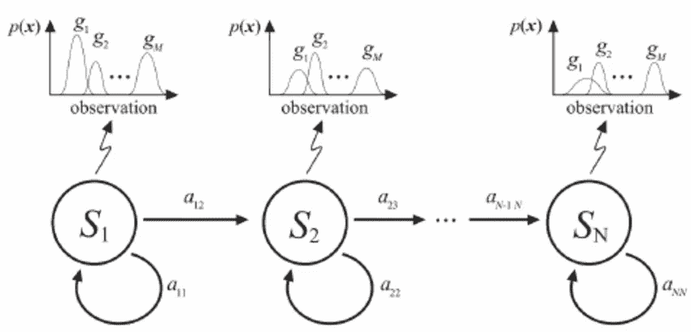
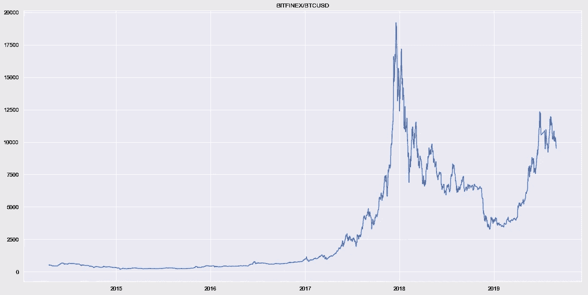
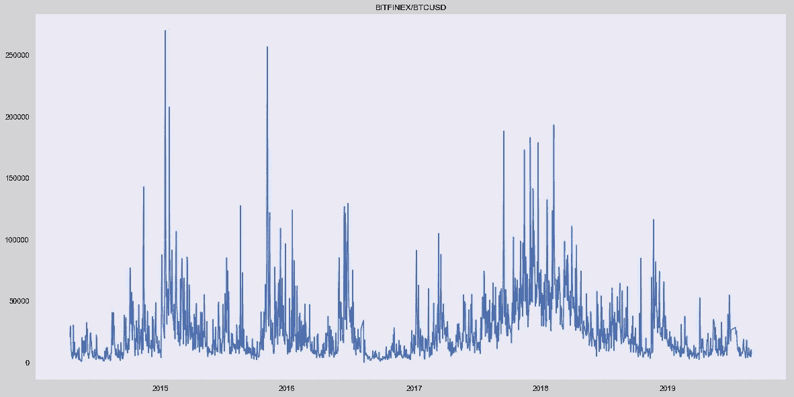
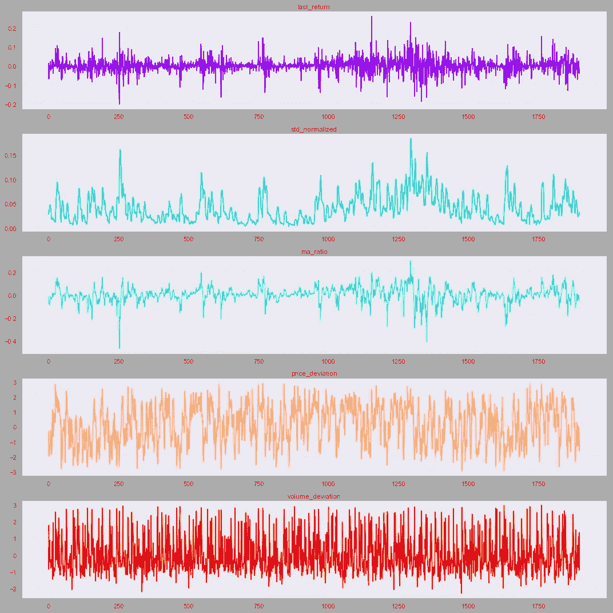
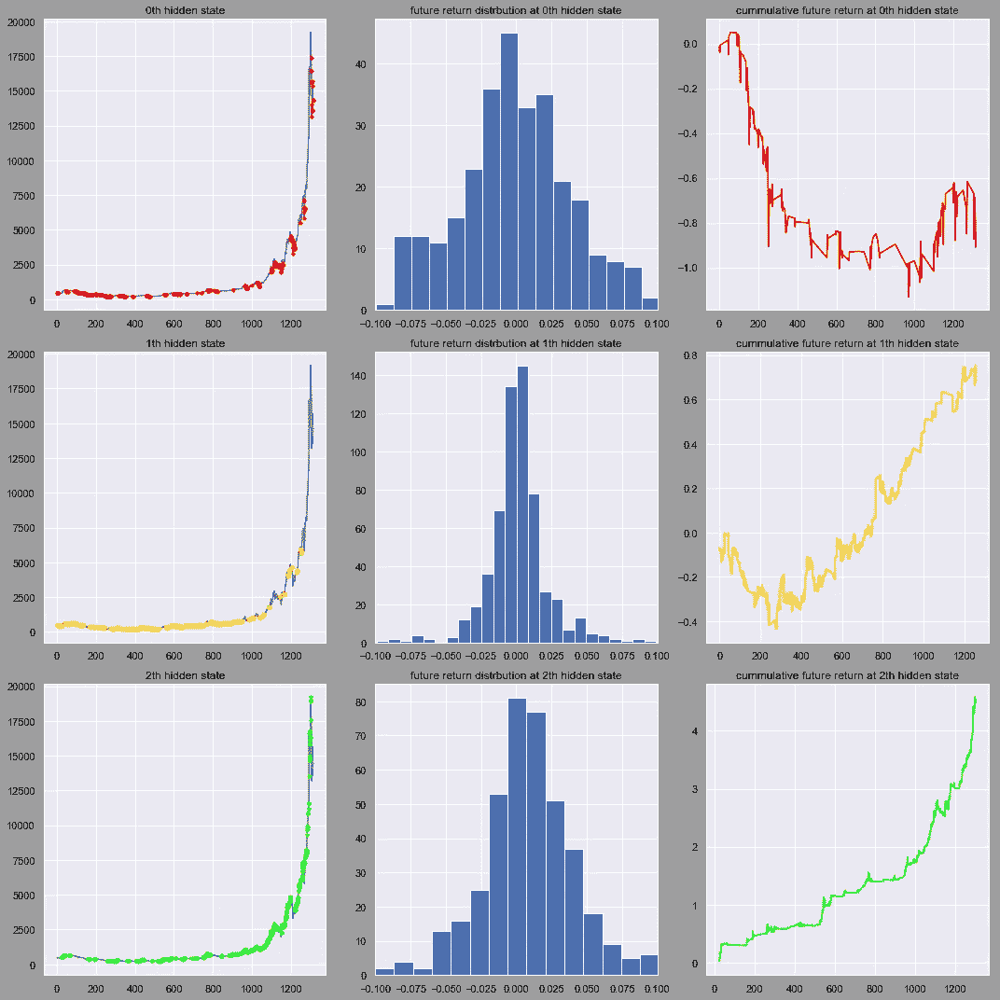
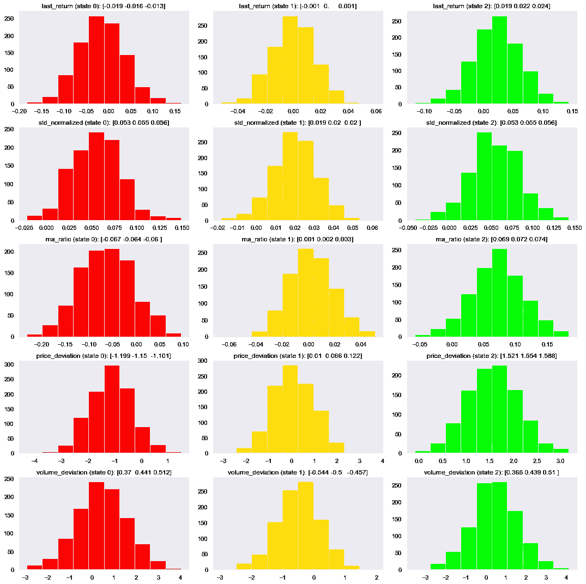
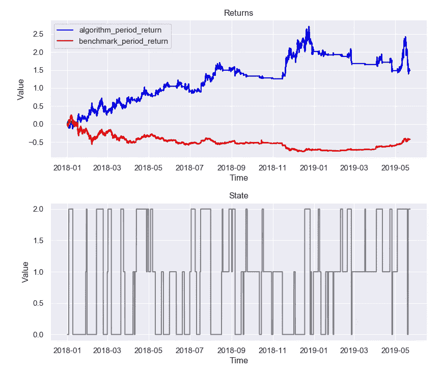

# 市场行为预测的无监督学习

> 原文：<https://towardsdatascience.com/unsupervised-learning-to-market-behavior-forecasting-ee8f78650415?source=collection_archive---------5----------------------->

## 这篇文章描述了预测市场行为的技术。第二部分展示了该方法在交易策略中的应用。

# 介绍

市场数据是一个称为时间序列的序列。通常，研究人员仅使用价格数据(或资产回报)来创建预测下一个价格值、运动方向或其他产出的模型。我认为更好的方法是使用更多的数据。这个想法是试图结合多种多样的市场条件(波动性、交易量、价格变化等)。)

第一类潜在特征是价格数据的各种衍生物。第二类是体积导数的集合。

> 这些特征将描述比原始市场数据或简单回报更复杂的当前市场状况。

您将在本文的下一部分看到这些特性。至于建模，我们将使用隐马尔可夫模型。

隐马尔可夫模型(HMM)是一种统计马尔可夫模型，其中被建模的系统被假设为具有未观察到的(即隐藏的)状态的马尔可夫过程。观察数据是我们的市场特征，隐藏状态是我们的市场行为。

> 我们的目标是解释建模后的隐藏状态，并基于这些知识创建交易策略。

隐马尔可夫模型的基本图形是这样的

Hidden Markov Model

本文以实践为导向。要了解更多信息，你可以阅读由[托默·阿米特](https://medium.com/u/d520265687a?source=post_page-----ee8f78650415--------------------------------)撰写的这篇文章中的[对隐马尔可夫模型的介绍。还有，我推荐从这个视频开始](/introduction-to-hidden-markov-models-cd2c93e6b781)

# 特征工程和建模

我认为代码和解释的结合是深入研究的好方法。开始编码吧。

我们的图书馆

这段代码从 Quandl 下载 BTC/美元的数据

然后我们可以绘制价格和交易量数据

之后我们得到了这个数字

Price for BTC/USD from 01/01/2014

Volume for BTC/USD from 01/01/2014

现在我们已经准备好对特征工程和建模功能进行编码了。

让我们将火车时段拆分为 2018 年 1 月 1 日之前的时段。下一段代码运行特性工程并将其可视化。

之后，我们得到了五个新的时间序列和训练好的模型。

Feature sequences

在上面的代码中，我们还创建了 *future_return* 列，它为 *last_return* 移动了一个滞后。这是**了解隐藏状态的第一把钥匙**。让我们将这个值绘制成每个状态的累积和。

Future return cumulative sum for each state

正如我们看到的，状态#0 有下降的趋势。状态#1 没有明确的趋势。最后一个状态#2 有很强的上升趋势。这个简单的累积和 *future_return* 的技巧让我们理解每个状态如何对应下一个价格运动。

**第二个关键**是通过特征研究每个状态。之后，我们可以将这两个事件(未来运动和当前条件)联系起来。让我们为每个状态的特性编写模拟和可视化代码。

Feature distributions for each state

现在你可以看到每个状态是如何描述当前状态的。例如，状态#0 和#2 具有高音量偏差，这意味着这些状态经常出现在高音量上，而状态#1 出现在低音量上。此外，状态#0 和#2 通常呈现高波动性。

有趣的事实是状态#0 具有 *last_return* 和 *ma_ratio 的低值。*大概是*，状态#0* 对应下行电流状态(目前)。落后的情况是状态#2。

对这两个结论的解释是

> 如果市场处于当前状态#0，那么在当前情况下，我们处于最不利的市场条件(第二个关键点)，并且这种趋势将继续下去(第一个关键点)。
> 
> 如果市场有当前状态#1，我们有趋势的不确定性。
> 
> 如果市场处于当前状态#2，那么在当前情况下，我们有大部分上行市场条件(第二个关键点)，并且这种趋势将继续下去(第一个关键点)。

下一行代码将训练好的模型保存到文件中。

# 应用

让我们试着根据这些知识来制定交易策略。我们应该从 2018 年 1 月 1 日开始测试这一策略，因为这一时期超出了样本范围。

> 逻辑很简单:状态#0 时短，状态#1 时无位置，状态#2 时长。

我们的战略将使用 [Catalyst](https://enigma.co/catalyst/) 框架来实现。在这篇[帖子](https://medium.com/@sermal/adaptive-trend-following-trading-strategy-based-on-renko-9248bf83554)中，我演示了 Catalyst 的快速介绍。该策略将包含在单独的 py 文件中。让我们编写基本函数并包含库

主参数、模型加载都包含在*初始化*功能中

handle_data 函数包含的基本逻辑。该功能每分钟运行一次。主要活动是获取数据、创建特征、市场行为评估和头寸管理。

最后一个功能是附加的。我们绘制数字并打印结果。

让我们运行策略

正如我们看到的，建议的算法直接击败了基准。这种策略似乎试图抓住趋势并跟随它。策略的不利条件是没有趋势期。

Backtesting result

> 总回报:1.486611137708
> 
> 索尔提诺系数:1 . 54866 . 38868688661
> 
> 最大水位下降:-0.30000000001
> 
> 阿尔法值:0.56725414679740467
> 
> 贝塔系数:-0.1541654082608784

Alpha 为正，beta 非常接近 0(关于这些标准的定义，参见本[贴](https://medium.com/@sermal/how-to-develop-a-stock-market-analytical-tool-using-shiny-and-r-c2385e0d2f89))。下降幅度太高，但比基准下降幅度低得多。

# 结论

1.  提出了基于多变性价格和交易量特征作为序列的方法。
2.  对模型的隐藏状态进行了解释。
3.  利用隐马尔可夫模型对 4 年的数据进行建模。
4.  创建了简单的交易策略，用样本数据(1.5 年)进行测试，没有再培训，佣金和滑点。
5.  该策略击败了买入并持有基准，它有正的 alpha，beta 接近于 0。
6.  研究成果被上传到 GitHub

 [## lamres/hmm _ 市场 _ 行为

### 此时您不能执行该操作。您已使用另一个标签页或窗口登录。您已在另一个选项卡中注销，或者…

github.com](https://github.com/lamres/hmm_market_behavior/tree/master) 

**如何提高已取得成果的方法:**

1.  向模型中添加新特征。
2.  尝试窗口长度。
3.  用不同数量的隐藏状态建立模型。
4.  尝试为隐藏状态和策略中使用的规则制定新的解释。
5.  基于一些资产创建投资组合。
6.  添加简单的交易规则，如止盈、止损等。

这些改进有助于获得更复杂的策略结果:将压降降低到 15–20%，增加 alpha 和 sortino，增加产能。

如果你喜欢这类应用程序，你可以阅读我的[文章](https://medium.datadriveninvestor.com/event-based-portfolio-rebalance-approach-754b4aa06f64)，基于类似的方法。

最诚挚的问候，

谢尔盖

***来自《走向数据科学》编辑的注释:*** *虽然我们允许独立作者根据我们的* [*规则和指南*](/questions-96667b06af5) *发表文章，但我们并不认可每个作者的贡献。你不应该在没有寻求专业建议的情况下依赖一个作者的作品。详见我们的* [*读者术语*](/readers-terms-b5d780a700a4) *。*