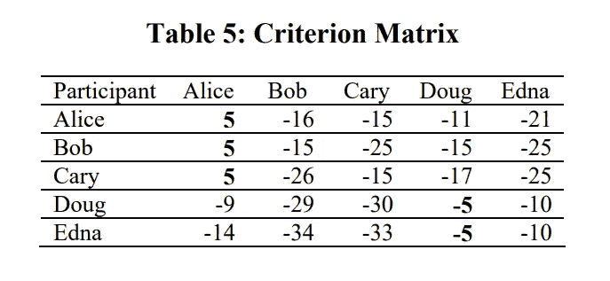

# 相似性传播算法解释

> 原文：<https://towardsdatascience.com/unsupervised-machine-learning-affinity-propagation-algorithm-explained-d1fef85f22c8?source=collection_archive---------3----------------------->


[https://www.pexels.com/photo/a-boy-in-beige-hoodie-smiling-beside-the-blackboard-6256070/](https://www.pexels.com/photo/a-boy-in-beige-hoodie-smiling-beside-the-blackboard-6256070/)

2007 年，布伦丹·弗雷和德尔伯特·杜克在《科学》杂志上首次发表了《亲缘关系传播》。与其他传统的聚类方法相比，相似性传播不需要您指定聚类的数量。通俗地说，在亲和力传播中，每个数据点向所有其他点发送消息，通知其目标每个目标对发送者的相对吸引力。然后，每个目标用回复来响应所有发送者，通知每个发送者它可以与该发送者相关联，因为它已经从所有其他发送者接收到消息的吸引力。发送者用消息回复目标，通知每个目标该目标对发送者的修正的相对吸引力，给定它从所有目标接收的可用性消息。消息传递过程继续进行，直到达成共识。一旦发送者与其目标之一相关联，该目标就成为该点的样本。具有相同样本的所有点被放置在相同的簇中。

# 算法

假设我们有以下数据集。每个参与者被表示为 5 维空间中的一个数据点。


[http://citeseerx.ist.psu.edu/viewdoc/download?doi=10.1.1.490.7628&rep=rep1&type=pdf](http://citeseerx.ist.psu.edu/viewdoc/download?doi=10.1.1.490.7628&rep=rep1&type=pdf)

## 相似矩阵(c)

除了对角线上的那些，相似性矩阵中的每个单元都是通过对参与者之间的差异的平方和求反来计算的。

如果这对你来说没有任何意义，不要烦恼，一旦浏览一个例子，它就会变得清晰。对于 Alice 和 Bob 之间的相似性，差异的平方和为(3–4)+(4–3)+(3–5)+(2–1)+(1–1)= 7。因此，相似性值是-7。

还不清楚？让我们看另一个例子。


我强烈推荐你自己计算一些。您应该会得到与下表相近的结果。


如果为对角线选择较小的值，则该算法将在少量的聚类周围收敛，反之亦然。因此，我们用-22 填充相似性矩阵的对角线元素，这是不同单元格中的最小数字。


[http://citeseerx.ist.psu.edu/viewdoc/download?doi=10.1.1.490.7628&rep=rep1&type=pdf](http://citeseerx.ist.psu.edu/viewdoc/download?doi=10.1.1.490.7628&rep=rep1&type=pdf)

## 责任矩阵

我们首先构建一个可用性矩阵，所有元素都设置为零。然后，我们使用以下公式计算责任矩阵中的每个单元:


其中 I 表示相关矩阵的行，k 表示相关矩阵的列。

比如 Bob(列)对 Alice(行)的责任是-1，就是 Bob 对 Alice 的相似度(-7)减去 Alice 的行的剩余相似度的最大值(-6)。

再次，我强烈建议你试着自己计算一些。


在计算完其余几对参与者的责任后，我们得出了下面的矩阵。


[http://citeseerx.ist.psu.edu/viewdoc/download?doi=10.1.1.490.7628&rep=rep1&type=pdf](http://citeseerx.ist.psu.edu/viewdoc/download?doi=10.1.1.490.7628&rep=rep1&type=pdf)

## 可用性矩阵(a)

我们使用单独的等式来更新可用性矩阵对角线上的元素，而不是可用性矩阵对角线外的元素。

下面的公式用于填充对角线上的元素:


其中 I 表示相关矩阵的行，k 表示相关矩阵的列。

本质上，该等式告诉您对该列中所有大于 0 的值求和，除了其值等于所讨论的列的那一行。例如，爱丽丝的自我可用性是爱丽丝专栏的积极责任的总和**不包括爱丽丝的自我责任(10 + 11 + 0 + 0 = 21)。**

还不明白？让我们再看几个例子。


以下等式用于更新非对角线元素:


换句话说，假设你试图填写 a(凯里，埃德娜)。考虑到埃德娜一栏的内容，你排除了埃德娜/埃德娜关系和卡里/埃德娜关系，并将所有剩余的积极责任加在一起。例如，Bob(列)对 Alice(行)的可用性是 Bob 的自我责任加上 Bob 的列中除 Bob 对 Alice 的责任之外的剩余积极责任之和(-15 + 0 + 0 + 0 = -15)。

我强烈建议您尝试自己计算一些单元格。


在计算完其余部分后，我们得到了下面的可用性矩阵。


[http://citeseerx.ist.psu.edu/viewdoc/download?doi=10.1.1.490.7628&rep=rep1&type=pdf](http://citeseerx.ist.psu.edu/viewdoc/download?doi=10.1.1.490.7628&rep=rep1&type=pdf)

## 标准矩阵(c)

标准矩阵中的每个单元只是该位置的可用性矩阵和责任矩阵的总和。


Bob(列)对 Alice(行)的标准值是 Bob 对 Alice 的责任和可用性之和(-1 + -15 = -16)。



[http://citeseerx.ist.psu.edu/viewdoc/download?doi=10.1.1.490.7628&rep=rep1&type=pdf](http://citeseerx.ist.psu.edu/viewdoc/download?doi=10.1.1.490.7628&rep=rep1&type=pdf)

每行的最高标准值被指定为样本。共享同一个样本的行在同一个簇中。因此在我们的例子中。Alice、Bob 和 Cary 形成一个集群，而 Doug 和 Edna 构成第二个集群。

值得注意的是，在这个例子中，变量的范围相同。然而，一般来说，变量在不同的尺度上，必须在训练前标准化。

# 密码

让我们跳到一些代码中。首先，导入以下库。

```
import numpy as np
from matplotlib import pyplot as plt
import seaborn as sns
sns.set()
from sklearn.datasets.samples_generator import make_blobs
from sklearn.cluster import AffinityPropagation
```

我们使用`scikit-learn`来生成具有良好定义的集群的数据。

```
X, clusters = make_blobs(n_samples=300, centers=4, cluster_std=0.60, random_state=0)
plt.scatter(X[:,0], X[:,1], alpha=0.7, edgecolors='b')
```


接下来，我们初始化并训练我们的模型。

```
af = AffinityPropagation(preference=-50)clustering = af.fit(X)
```

最后，我们用不同的颜色绘制每个聚类的数据点。

```
plt.scatter(X[:,0], X[:,1], c=clustering.labels_, cmap='rainbow', alpha=0.7, edgecolors='b')
```


# 最后的想法

相似性传播是一种无监督的机器学习算法，特别适合于我们不知道最佳聚类数的问题。