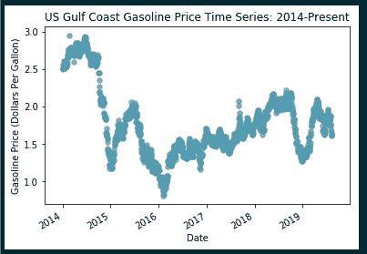

# 使用 Python 实现时间序列异常检测的无监督机器学习方法

> 原文：<https://towardsdatascience.com/unsupervised-machine-learning-approaches-for-outlier-detection-in-time-series-using-python-5759c6394e19?source=collection_archive---------12----------------------->

在这篇文章中，我将介绍一些我最喜欢的检测时间序列数据中异常值的方法。有许多不同的方法来检测异常数据点；为了简洁起见，我在这篇文章中只关注无监督的机器学习方法。

本文涉及的异常/异常值检测算法包括:

1.  低通滤波器:取时间序列的居中滚动平均值，并基于 Z 分数移除异常
2.  隔离森林
3.  季节性极端学生化离差(S-ESD)算法
4.  一类支持向量机(SVM)

# 那么什么是时间序列中的“异常”，为什么我们关心检测时间序列序列中的异常？

我经常处理时间序列数据*，数据集经历意想不到的下降或峰值、平线或相移并不罕见。这些情况中的每一种都可以称之为“异常”——与整个序列的行为相比，有些不寻常。*

*出于各种原因，检测时间序列中的异常是重要的。有时，异常是某些模式的指示，如特定日期或时间内趋势的峰值或下降。其他时候，异常是“错误的”读数，这是由于仪器或仪表的错误造成的。通常，我们希望从时间序列数据中分离出异常，因为它们扭曲了“平均”行为——平均变化率、平均值、平均分布等。*

*本文中介绍的所有算法都有二进制输出:时间序列中的数据点要么异常，要么正常。*

# *时间序列示例*

*在本文中，我们比较了几种不同的异常检测方法在单个时间序列上的结果。我们将使用的时间序列是美国墨西哥湾海岸汽油价格的[每日时间序列，它是使用能源信息管理局(EIA) API 检索的。](https://www.eia.gov/opendata/qb.php?category=241335&sdid=PET.EER_EPMRU_PF4_RGC_DPG.D)*

****关于使用 EIA 的免费 API 在 Python 中检索能源相关数据的更多背景知识，请查看本教程*******。*****

**我们使用以下 Python 代码提取并可视化时间序列:**

****

**为了增加趣味，我们在时间序列中加入了一些异常值。希望这些点能被异常检测算法发现。**

****

***Gasoline Price Time Series, with artificially generated anomalies in yellow***

**既然我们已经选择了我们的时间序列并添加了一些异常值，让我们在其上测试我们的异常检测算法。**

# **简单的低通滤波器:取一个滚动平均值，并根据 Z 分数去除异常**

**我用来检测异常的一个最简单(但仍然非常有效)的方法如下:**

1.  **实现时间序列数据的居中滚动平均**
2.  **计算时间序列中每个数据点的单独 Z 值，并与滚动平均值进行比较**
3.  **移除偏离滚动平均值超过特定标准偏差数的数据点(通常偏离 2 到 3 个标准偏差，但取决于数据行为)**

**让我们用一个例子来试试这个方法。**

## **代码示例**

**如上所述，我们使用美国墨西哥湾沿岸汽油价格的时间序列作为我们的示例时间序列集。**

**值得注意的是，我们为低通滤波器实现的滚动平均值以*为中心*。这意味着长度为 x 的滚动平均值是之前 x/2 个数据点和之后 x/2 个数据点的平均值。例如，如果我们在值 t 处实施 60 点滚动平均，那么我们会发现范围在(t-30)和(t+30)之间的数据点的平均值。使用居中的滚动平均值有助于解释时间序列中两端的较大偏移。**

**我们使用以下代码生成低通滤波器并可视化异常:**

****

***Gasoline time series, color-coded by detected low-pass filter anomalies. Anomalous data points are in yellow, and normal data points are in purple.***

**在检查上述结果时，低通滤波器表现相当好。在添加到时间序列中的 9 个异常值中，低通滤波器成功检测到 6 个，加上其他几个看起来异常的数据点。**

# **隔离森林**

**隔离森林是流行的随机森林算法的无监督扩展。隔离林的构造块是具有二元结果(是/不是离群值)的隔离树。**

**构建隔离林时，算法会将每个单独的数据点从所有其他数据点中分离出来。空间中的单个点越容易与所有其他点隔离，它就越有可能是异常值(因为它远离所有其他数据点)。如果一个数据点是一个插入点，它将被其他数据点紧密包围，并需要更多的分裂来隔离( [1](https://quantdare.com/isolation-forest-algorithm/) )。请参见下图中的插图。**

****

*****Each line represents a split performed by the algorithm to isolate individual data points. In the first figure, X0 is an outlier, and is isolated in ~3 splits. In the second figure, Xi is an in-lier, and requires many more splits to isolate from all other data points.*** *Image courtesy of* [*https://www.semanticscholar.org/paper/Anomaly-Detection-through-on-line-Isolation-Forest%3A-Susto-Beghi/c321685dd03fa1a54e99b4c046950b96c3b0f040/figure/1*](https://www.semanticscholar.org/paper/Anomaly-Detection-through-on-line-Isolation-Forest%3A-Susto-Beghi/c321685dd03fa1a54e99b4c046950b96c3b0f040/figure/1)*.***

*****关于隔离森林的更多信息，请查看福特斯的本教程*** ***。*****

## **代码示例**

**我们再次使用汽油时间序列，但这次我们应用隔离森林算法来检测异常。我们使用 scikit-learn 包中提供的 IsolationForest()模型来构建一个模型，并在我们的数据集上测试它:**

****

***Gasoline time series, color-coded by detected Isolation Forest anomalies. Anomalous data points are in yellow, and normal data points are in purple.***

**像低通滤波器一样，隔离林检测到大多数人为产生的异常；但是，它会对更多的误报进行分类(数据点被标记为异常，而实际上并非如此)。该算法特别难以识别大的时间序列偏移(参见 2014 年末时间段作为示例)。**

# **季节性极端学生化离差(S-ESD)算法**

**Twitter 的一组数据科学家最初开发了 S-ESD 算法。该算法最初的(也是最流行的)实现之一是在[的“异常检测”包](https://www.rdocumentation.org/packages/AnomalyDetection/versions/1.0)中。幸运的是，R 包已经被多次修改以用于 Python。**

**这种算法很容易理解，而且根据所用的时间序列，相当稳健。它的工作原理如下:**

1.  **使用 STL(季节-趋势-黄土)分解对时间序列进行分解。**
2.  **ESD 算法在生成的黄土时间序列上运行，以检测异常。黄土时间序列代表系统中的噪声，在趋势和季节行为被过滤掉之后。**

**我们来试一个例子来论证。**

## **代码示例**

**在实现 S-ESD 算法之前，让我们分解汽油价格时间序列，以了解时间序列的趋势、季节性和噪声:**

****

***STL Decomposition of Gulf Coast Gasoline Price Time Series, 2014-Present***

**在上面的代码片段中，我们以每年的频率分解时间序列。在检测异常时，我们真正关心的分解时间序列是*残差时间序列*(或黄土时间序列)。这个时间序列代表序列中的噪声，在考虑了季节性和趋势之后。**

**在分解之后，我们对剩余时间序列应用极端学生化偏离(ESD)检验来检测异常值。ESD 测试的主要优点之一是，它只需要检测异常值总数的上限；这与 Grubbs 测试形成对比，Grubbs 测试中异常值的数量必须准确声明( [2](https://www.itl.nist.gov/div898/handbook/eda/section3/eda35h3.htm) )。**

*****有关极端学生化偏离(ESD)算法的更多信息，请查看*** [***此链接***](https://www.itl.nist.gov/div898/handbook/eda/section3/eda35h3.htm) ***。*****

**在下面的代码片段中，我们对时间序列执行 S-ESD 异常检测，包括使用 ESD 的 STL 分解和异常值检测:**

****

***Gasoline Time Series, color coded on S-ESD anomalies, with outliers in yellow and all other data points in purple***

**基于上述结果，S-ESD 算法的结果并不太乐观。该算法仅成功地识别了九个产生的异常中的一个。我以前使用其他时间序列集成功地使用了这种算法，但在这个特殊的例子中似乎有些困难。**

# **单类支持向量机(SVM)**

**一类 SVM 是支持向量机的无监督版本，因为它们只在一个类(“正常”类)上训练。由于数据是无标签的，单类支持向量机“推断出正常情况的性质，并从这些性质中预测哪些例子与正常例子不同”( [3](https://docs.microsoft.com/en-us/azure/machine-learning/studio-module-reference/one-class-support-vector-machine) )。一类 SVM 使用一个二元函数来映射平面上的数据概率密度，高概率区域设置为+1，低概率区域设置为-1 ( [4](http://rvlasveld.github.io/blog/2013/07/12/introduction-to-one-class-support-vector-machines/) )。**

*****查看*** [***这篇由 Hsu 等人撰写的文章***](https://www.researchgate.net/profile/Chenghai_Yang/publication/272039161_Evaluating_unsupervised_and_supervised_image_classification_methods_for_mapping_cotton_root_rot/links/55f2c57408ae0960a3897985/Evaluating-unsupervised-and-supervised-image-classification-methods-for-mapping-cotton-root-rot.pdf) ***提供了关于单类支持向量机的更深入的信息。*****

## **代码示例**

**我们再次求助于 sci kit——学习构建我们的模型；这一次，对于一等 SVM 的。我们生成几个变量插入算法中以提高性能——主要是汽油价格时间序列的中心 6 点滚动平均值。然后，我们通过 one _ class _ SVM _ anomaly _ detection()函数运行原始时间序列及其滚动平均值。在函数中，我们缩放每个变量，并训练无监督模型。最后，我们对每个数据点进行分类，并使用散点图进行可视化:**

****

***Gasoline time series, color-coded by detected one-class SVM anomalies. Anomalous data points are in yellow, and normal data points are in purple.***

**单类 SVM 表现相对较好，可以检测出 9 个人工生成的异常值中的 6 个。然而，像隔离林一样，它在序列中检测到几个假阳性。**

# **结论**

**在本文中，我们比较了各种异常检测技术的结果——隔离森林、低通滤波器、一类 SVM 和 S-ESD 算法。令人惊讶的是，当并排比较结果时，性能最好的算法(至少对于本例来说)是一个简单的低通滤波器。性能最差的算法是 S-ESD 算法。**

**重要的是要注意，这些算法对每个单独的时间序列执行不同。仅仅因为低通滤波器在这个例子中工作得最好，并不意味着它在所有时间序列中都工作得最好。为了获得最佳结果，在最终决定使用哪种算法之前，请尝试上述所有选项。**

**我关于时间序列异常检测的无监督机器学习方法的教程到此结束。感谢阅读！**

****关于本教程中使用的完整 Python 代码，请查看以下 Github repo:**[**https://Github . com/kperry 2215/unsupervised _ anomaly _ detection _ time _ series**](https://github.com/kperry2215/unsupervised_anomaly_detection_time_series)**

# **来源**

1.  **T.福特斯。2018 年 4 月 4 日。*隔离森林:与世隔绝的艺术。*https://quantdare.com/isolation-forest-algorithm/**
2.  **工程统计手册。*异常值的通用 ESD 测试。*[https://www . ITL . NIST . gov/div 898/handbook/EDA/section 3/EDA 35h 3 . htm](https://www.itl.nist.gov/div898/handbook/eda/section3/eda35h3.htm)**
3.  **Azure 机器学习工作室。2019 年 5 月 5 日。*单类支持向量机*。[https://docs . Microsoft . com/en-us/azure/machine-learning/studio-module-reference/one-class-support-vector-machine](https://docs.microsoft.com/en-us/azure/machine-learning/studio-module-reference/one-class-support-vector-machine)**
4.  **罗默·弗拉斯维尔德。2013 年 7 月 12 日。*单类支持向量机简介。*[http://rvlasveld . github . io/blog/2013/07/12/introduction-to-one-class-support-vector-machines/](http://rvlasveld.github.io/blog/2013/07/12/introduction-to-one-class-support-vector-machines/)**

****看看我的其他时间系列教程和文章:****

** [## 使用 Python - Tech Rando 进行变化点检测简介

### 我的很多工作都大量涉及时间序列分析。我使用的一个很棒但不太为人所知的算法是…

techrando.com](https://techrando.com/2019/08/14/a-brief-introduction-to-change-point-detection-using-python/)  [## 使用 Python 分析电价时间序列数据:时间序列分解和价格…

### 欢迎来到科技兰多博客！在今天的帖子中，我将使用能源信息管理局的 API…

techrando.com](https://techrando.com/2019/07/19/analyzing-electricity-price-time-series-data-using-python-time-series-decomposition-and-price-forecasting-using-a-vector-autoregression-var-model/) 

*原载于 2019 年 8 月 23 日*[*https://techrando.com*](https://techrando.com/2019/08/23/unsupervised-machine-learning-approaches-for-outlier-detection-in-time-series/)*。***