# 无监督机器学习:聚类分析

> 原文：<https://towardsdatascience.com/unsupervised-machine-learning-clustering-analysis-d40f2b34ae7e?source=collection_archive---------0----------------------->

# 无监督学习简介

到目前为止，我们只探索了[监督机器学习算法](/supervised-learning-basics-of-linear-regression-1cbab48d0eba)和技术来开发模型，其中数据具有先前已知的标签。换句话说，我们的数据有一些带有特定值的目标变量，我们用它们来训练我们的模型。

然而，在处理现实世界的问题时，大多数时候，数据不会带有预定义的标签，因此我们希望开发能够正确分类这些数据的机器学习模型，通过自己找到特征中的一些共性，用于预测新数据的类别。

## **无监督学习分析过程**

在开发无监督学习模型时，我们将遵循的整个过程可以总结在下表中:

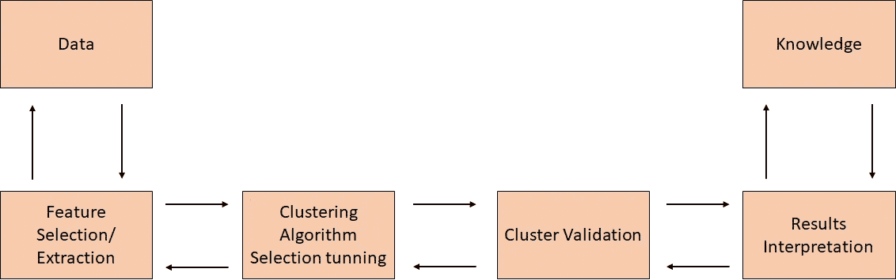

无监督学习的主要应用有:

*   利用共享属性分割数据集。
*   检测不适合任何组的异常。
*   通过聚合具有相似属性的变量来简化数据集。

总之，主要目标是研究数据的内在(通常是隐藏的)结构。

这种技术可以浓缩为无监督学习试图解决的两种主要类型的问题。这些问题是:

*   使聚集
*   降维

在整篇文章中，我们将关注聚类问题，并将在以后的文章中讨论降维。

# 聚类分析

基本上，聚类的目标是在数据的元素中找到不同的组。为此，聚类分析算法查找数据中的结构，以便同一个聚类(或组)的元素彼此之间比来自不同聚类的元素更相似。

以一种可视化的方式:想象我们有一个电影的数据集，想要对它们进行分类。我们有以下电影评论:

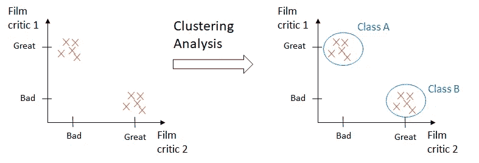

机器学习模型将能够推断出有两个不同的类别，而无需从数据中了解任何其他信息。

这些无监督学习算法具有令人难以置信的广泛应用，并且对于解决现实世界的问题非常有用，例如异常检测、推荐系统、文档分组或者基于购买发现具有共同兴趣的客户。

一些最常见的聚类算法，以及将在本文之外探讨的算法有:

*   k 均值
*   层次聚类
*   基于密度的扫描聚类(DBSCAN)
*   高斯聚类模型

# k 均值聚类

K-Means 算法非常容易实现，而且计算效率非常高。这些是解释它们为什么如此受欢迎的主要原因。但是当处理不具有球形分布形状的组时，它们不太适合于识别类。

K-Means 算法的目标是找到彼此之间具有高度相似性的数据点并将其分组。就算法而言，这种相似性被理解为数据点之间距离的反义词。数据点越接近，它们就越相似，并且更有可能属于同一个聚类。

**关键概念**

*   平方欧几里德距离

K-Means 中最常用的距离是平方欧几里德距离。在 *m 维*空间中的两点 *x 和 y* 之间的距离的一个例子是:

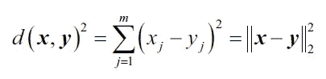

这里， *j* 是样本点 *x 和 y*的第*j*维(或特征列)

*   集群惯性

聚类惯性是聚类上下文中误差平方和的名称，表示如下:

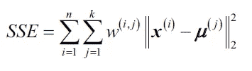

其中 *μ(j)* 是聚类 *j，*的质心，如果样本 *x(i)* 在聚类 *j* 中，则 *w(i，j)* 为 1，否则为 0。

K-Means 可以理解为一种算法，它将尝试最小化聚类惯性因子。

**算法步骤**

1.  首先，我们需要选择 k，我们希望被发现的集群的数量。
2.  然后，该算法将随机选择每个聚类的质心。
3.  将每个数据点分配到最近的质心(使用欧几里德距离)。
4.  将计算群集惯性。
5.  新的质心将被计算为属于上一步质心的点的平均值。换句话说，通过计算每个聚类中心的数据点的最小二次误差，将中心移向该点
6.  回到步骤 3。

**K-均值超参数**

*   簇的数量:要生成的簇和质心的数量。
*   最大迭代次数:单次运行的算法。
*   Number initial:使用不同质心种子运行算法的次数。就惯性而言，最终结果将是所定义的连续运行次数的最佳输出。

**K 均值的挑战**

*   任何固定训练集的输出不会总是相同的，因为初始质心是随机设置的，这将影响整个算法过程。
*   如前所述，由于欧几里德距离的性质，当处理采用非球形形状的聚类时，它不是合适的算法。

**应用 K 均值时需要考虑的要点**

*   必须在相同的尺度上测量要素，因此可能有必要执行 z 分数标准化或最大-最小缩放。
*   在处理分类数据时，我们将使用 get dummies 函数。
*   探索性数据分析(EDA)非常有助于对数据进行概述，并确定 K-Means 是否是最合适的算法。
*   当有大量的列时，minibatch 方法非常有用，但是它不太准确。

**如何选择合适的 K 数**

选择正确的聚类数是 K-Means 算法的关键点之一。有一些方法可以找到这个数字:

*   领域知识
*   商业决策
*   肘法

由于与数据科学的动机和性质一致，肘方法是首选方法，因为它依赖数据支持的分析方法来做出决策。

**肘法**

肘方法用于确定数据集中聚类的正确数量。它的工作原理是绘制 K 的递增值与使用该 K 时获得的总误差的关系图。

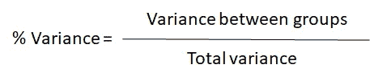

目标是找到对于每个聚类不会显著增加方差的 k

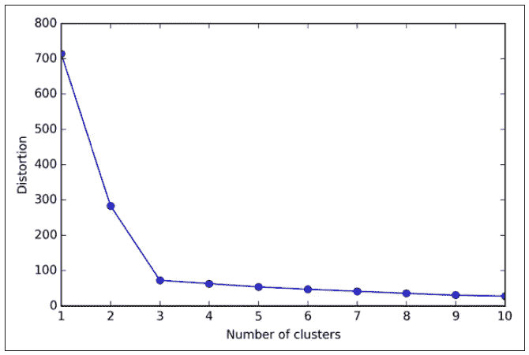

在这种情况下，我们将选择弯头所在的 k=3。

**K-Means 局限性**

虽然 K-Means 是一个很好的聚类算法，但当我们预先知道准确的聚类数，并且处理球形分布时，它是最有用的。

下图显示了如果我们在每个数据集中使用 K-means 聚类，即使我们事先知道准确的聚类数，我们会得到什么:

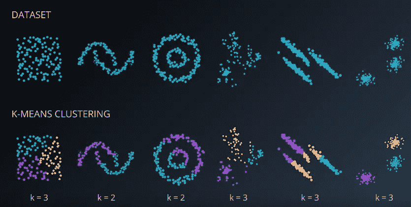

将 K-Means 算法作为基准来评估其他聚类方法的性能是很常见的。

# 层次聚类

层次聚类是基于原型的聚类算法的替代方法。层次聚类的主要优点是我们不需要指定聚类的数量，它会自己找到。此外，它还能够绘制树状结构。树形图是二进制层次聚类的可视化。

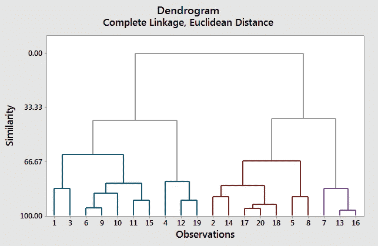

融合在底部的观察结果是相似的，而融合在顶部的观察结果则完全不同。对于树形图，结论是根据纵轴的位置而不是横轴得出的。

**等级聚类的种类**

这种类型的聚类有两种方法:聚合和分裂。

*   Divisive:这种方法首先将所有数据点聚集在一个单独的集群中。然后，它会迭代地将聚类分成更小的聚类，直到每个聚类只包含一个样本。
*   凝聚:这种方法从每个样本是一个不同的聚类开始，然后通过彼此更接近的样本来合并它们，直到只有一个聚类。

**单联动&全联动**

这些是用于凝聚层次聚类的最常用算法。

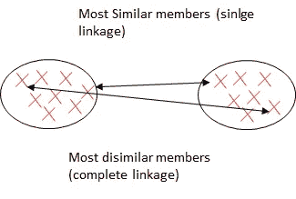

*   单键

作为一种凝聚算法，单链从假设每个样本点是一个簇开始。然后，它计算每对聚类的最相似成员之间的距离，并合并最相似成员之间的距离最小的两个聚类。

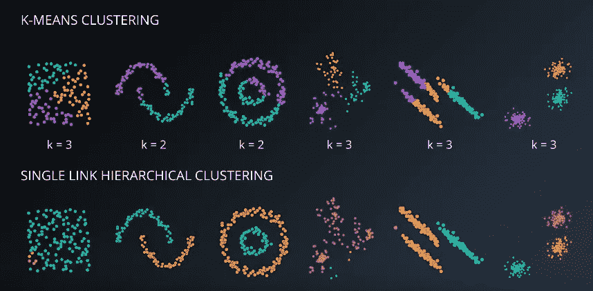

*   完全连锁

虽然与它的兄弟(单链)相似，但它的原理完全相反，它比较一对集群中最不相似的数据点来执行合并。

**层次聚类的优势**

*   由此产生的层次结构表示可以提供很多信息。
*   树形图提供了一种有趣且信息丰富的可视化方式。
*   当数据集包含真正的层次关系时，它们特别有用。

**层次聚类的缺点**

*   它们对异常值非常敏感，当异常值出现时，模型性能会显著下降。
*   从计算角度来说，它们非常昂贵。

# 基于密度的噪声应用空间聚类(DBSCAN)

带噪声应用程序的基于密度的空间聚类，或 DBSCAN，是另一种对正确识别数据中的噪声特别有用的聚类算法。

**DBSCAN 分配标准**

它基于多个具有指定半径ε的点，每个数据点都有一个特殊的标签。分配该标签的过程如下:

*   它是指定数量(最小点数)的相邻点。如果有这个最小点数的点落在ε半径内，将指定一个核心点。
*   边界点将落在核心点的ε半径内，但其邻域数将少于 MinPts 数。
*   每隔一个点将是噪声点。

**DBSCAN 算法**

该算法遵循以下逻辑:

1.  确定一个核心点，并为每个核心点或每个连接的核心点组(如果它们符合核心点的标准)分组。
2.  确定边界点并将其分配给各自的核心点。

下图很好地总结了这个过程和注释符号。

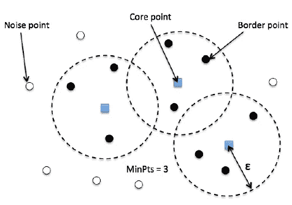

**DBSCAN 与 K 均值聚类**

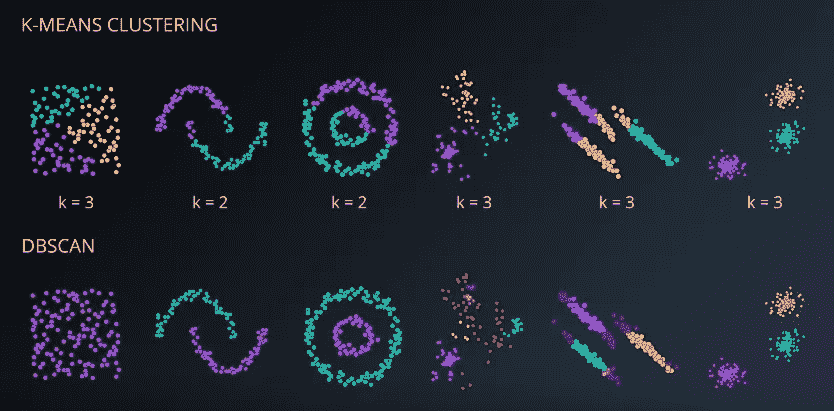

**DBDSCAN 的优势**

*   我们不需要指定集群的数量。
*   簇可以采用的形状和大小具有高度的灵活性。
*   识别和处理噪声数据和异常值是非常有用的。

**DBSCAN 缺点**

*   它在处理两个集群可达的边界点时面临困难。
*   它找不到不同密度的井丛。

# **高斯混合模型(GMM)**

高斯混合模型是一种概率模型，它假设所有样本都是由有限个高斯分布和未知参数混合而成的。

它属于软聚类算法组，其中每个数据点将属于数据集中存在的每个聚类，但是每个聚类具有不同的成员级别。这种隶属关系被指定为属于某一类的概率，范围从 0 到 1。

例如，高亮显示的点将同时属于聚类 A 和聚类 B，但由于其与聚类 A 的接近性，因此属于聚类 A 的成员更高。

GMM 是我们将在本系列中学习的最高级的聚类方法之一，它假设每个聚类遵循一个概率分布，该分布可以是高斯分布或正态分布。它是 K-均值聚类的推广，包括关于数据的协方差结构以及潜在高斯中心的信息。

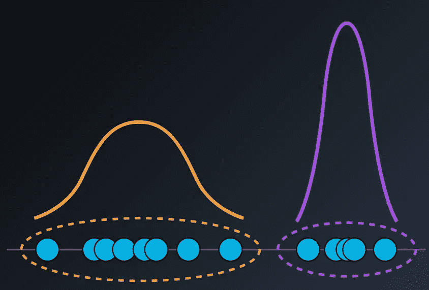

**一维 GMM 分布**

GMM 将在数据集中搜索高斯分布并混合它们。

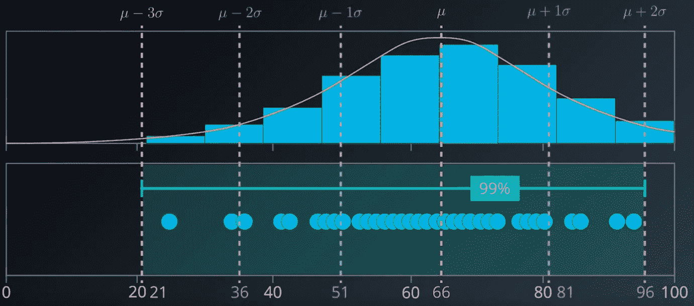

**二维中的 GMM**

当多元分布如下所示时，对于 de 数据集分布的每个轴，平均中心应为+ σ。

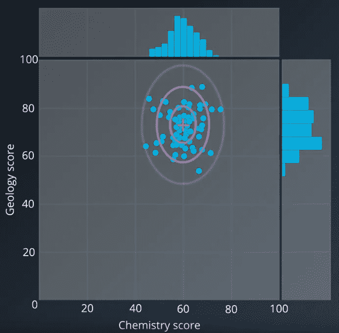

**GMM 算法**

这是一种期望最大化算法，其过程可以概括如下:

1.  初始化 K 高斯分布。它通过(平均值)和σ(标准差)值来实现这一点。它们可以取自数据集(朴素方法)或通过应用 K-Means。
2.  对数据进行软聚类:这是“期望”阶段，在此阶段，所有的数据点将被分配给每个具有各自隶属级别的聚类。
3.  重新估计高斯分布:这是“最大化”阶段，在此阶段检查期望值，并使用期望值计算高斯分布的新参数:new 和σ。
4.  评估数据的对数似然性以检查收敛性。对数似然性越高，我们创建的模型的混合物就越有可能符合我们的数据集。这是最大化的函数。
5.  从步骤 2 开始重复，直到收敛。

**GMM 的优势**

*   这是一种软聚类方法，它将样本成员分配给多个聚类。这一特性使其成为学习混合模型的最快算法
*   集群的数量和形状具有高度的灵活性。

**GMM 的缺点**

*   它对初始值非常敏感，这将极大地影响它的性能。
*   GMM 可能收敛到局部最小值，这将是次优解。
*   当每个混合物没有足够的点时，该算法发散并找到具有无限可能性的解，除非我们人工地调整数据点之间的协方差。

# 聚类验证

聚类验证是对聚类结果进行客观定量评估的过程。我们将通过应用聚类验证指数来进行验证。有三个主要类别:

**外部指数**

这些是我们在原始数据被标记时使用的评分方法，这在这类问题中并不常见。我们将把一个聚类结构与预先知道的信息进行匹配。

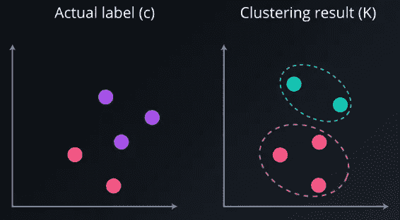

使用最多的指数是调整后的兰德指数。

*   调整后的€兰德指数[-1，1]

为了理解它，我们应该首先定义它的组成部分:

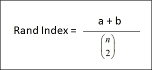

*   a:是在 C 和 K 中的同一个簇中的点数
*   b:是在 C 和 k 中不同簇中的点数。
*   n =样本总数

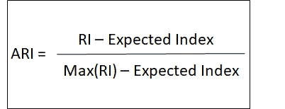

ARI 可以得到范围从-1 到 1 的值。该值越高，与原始数据的匹配程度越高。

**内部验证指标**

在无监督学习中，我们将处理未标记的数据，这是内部索引更有用的时候。

最常见的指标之一是轮廓系数。

*   轮廓系数:

每个数据点都有一个轮廓系数。

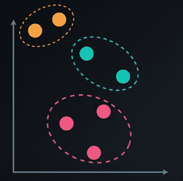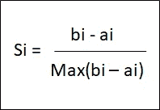

*   a =到同一组中其他样品 I 的平均距离
*   b =到最近的相邻聚类中的其他样本 I 的平均距离

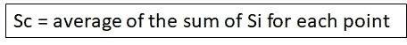

轮廓系数(SC)的值可以从-1 到 1。值越高，选择的 K 越好。如果我们超过了理想的 K 值，就会比我们低于理想的 K 值受到更多的惩罚。

它只适用于某些算法，如 K-Means 和层次聚类。它不适合与 DBSCAN 一起工作，我们将使用 DBCV。

# 结论

我们首先介绍了无监督学习和主要的聚类算法。

在下一篇文章中，我们将完成一个实现，作为构建 K-means 模型的示例，并回顾和实践所解释的概念。

敬请期待！