# 从头开始实现谱聚类算法

> 原文：<https://towardsdatascience.com/unsupervised-machine-learning-spectral-clustering-algorithm-implemented-from-scratch-in-python-205c87271045?source=collection_archive---------1----------------------->


[https://www.pexels.com/photo/back-view-of-a-student-answering-a-problem-on-the-chalkboard-8197497/](https://www.pexels.com/photo/back-view-of-a-student-answering-a-problem-on-the-chalkboard-8197497/)

谱聚类是一种流行的无监督机器学习算法，其性能往往优于其他方法。此外，谱聚类实现起来非常简单，并且可以通过标准的线性代数方法有效地解决。在谱聚类中，确定哪些点属于哪个聚类的是相似性，而不是绝对位置(即 k 均值)。后者在处理数据形成复杂形状的问题时特别有用。

# 算法

该算法可以分为 4 个基本步骤。

1.  构建相似度图
2.  确定邻接矩阵 W、度矩阵 D 和拉普拉斯矩阵 L
3.  计算矩阵 L 的特征向量
4.  使用第二小特征向量作为输入，训练 k-means 模型并使用它来对数据进行分类

# 密码

在下一节中，我们将从头开始实现谱聚类。我们将需要以下库。

```
import numpy as np
float_formatter = lambda x: "%.3f" % x
np.set_printoptions(formatter={'float_kind':float_formatter})
from sklearn.datasets.samples_generator import make_circles
from sklearn.cluster import SpectralClustering, KMeans
from sklearn.metrics import pairwise_distances
from matplotlib import pyplot as plt
import networkx as nx
import seaborn as sns
sns.set()
```

通常，数据集由样本(行)及其要素(列)组成。但是，谱聚类算法只能应用于连接节点的图。

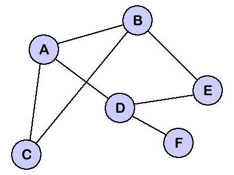

因此，我们必须对数据进行转换，以便从由行和列组成的表格转换成图形。假设我们有以下数据集。我们可以清楚地看到，这些数据可以分成三组。

```
X = np.array([
    [1, 3], [2, 1], [1, 1],
    [3, 2], [7, 8], [9, 8],
    [9, 9], [8, 7], [13, 14],
    [14, 14], [15, 16], [14, 15]
])plt.scatter(X[:,0], X[:,1], alpha=0.7, edgecolors='b')
plt.xlabel('Weight')
plt.ylabel('Height')
```

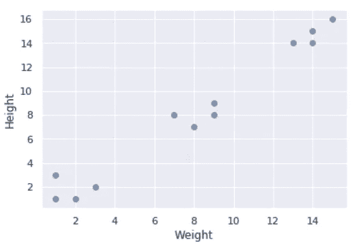

首先，我们构造相似性矩阵，一个 NxN 矩阵，其中 N 是样本的数量。我们用每一对点之间的欧几里德距离填充单元格。

然后，我们通过复制相似性矩阵的内容来创建邻接矩阵，并且仅在这一次，我们设置阈值，使得如果距离大于预定义的限制，则我们将值设置为 0，否则设置为 1。

邻接矩阵可以用来构建一个图。如果邻接矩阵的单元格中有 1，那么我们在列和行的节点之间画一条边。

```
W = pairwise_distances(X, metric="euclidean")
vectorizer = np.vectorize(lambda x: 1 if x < 5 else 0)
W = np.vectorize(vectorizer)(W)
print(W)
```


在本教程的剩余部分，我们将使用`networkx`库来可视化图形。

```
def draw_graph(G):
    pos = nx.spring_layout(G)
    nx.draw_networkx_nodes(G, pos)
    nx.draw_networkx_labels(G, pos)
    nx.draw_networkx_edges(G, pos, width=1.0, alpha=0.5)
```

首先，我们随机生成一个图并打印它的邻接矩阵。

```
G = nx.random_graphs.erdos_renyi_graph(10, 0.5)draw_graph(G)W = nx.adjacency_matrix(G)
print(W.todense())
```

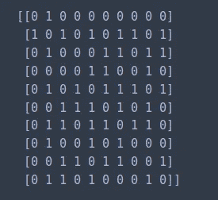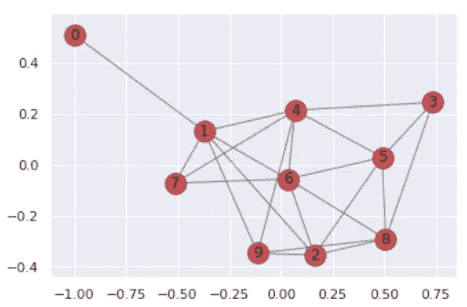

请注意这些节点是如何形成单个组件的(即，所有其他节点都可以从一个给定的节点到达)。

一旦我们建立了邻接矩阵，我们就建立了度矩阵。对于度矩阵的每一行，我们通过对邻接矩阵中相应行的所有元素求和来沿着对角线填充单元。

然后，我们通过从度矩阵中减去邻接矩阵来计算拉普拉斯矩阵。

```
# degree matrix
D = np.diag(np.sum(np.array(W.todense()), axis=1))
print('degree matrix:')
print(D)# laplacian matrix
L = D - W
print('laplacian matrix:')
print(L)
```

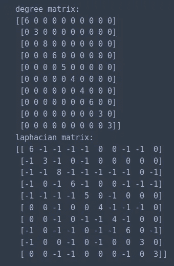

一旦我们有了拉普拉斯矩阵，我们就可以利用它的一个特殊属性来分类我们的数据。

*   ***若图(W)有 K 个连通分量，则 L 有 K 个特征值为 0 的特征向量。***

因此，由于在我们当前的例子中，我们只有一个组件，一个特征值将等于 0。

```
e, v = np.linalg.eig(L)# eigenvalues
print('eigenvalues:')
print(e)# eigenvectors
print('eigenvectors:')
print(v)
```

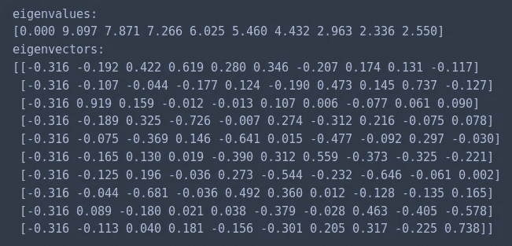

```
fig = plt.figure()ax1 = plt.subplot(121)
plt.plot(e)
ax1.title.set_text('eigenvalues')i = np.where(e < 10e-6)[0]
ax2 = plt.subplot(122)
plt.plot(v[:, i[0]])fig.tight_layout()
plt.show()
```

正如我们所见，在 10 个特征值中，有一个等于 0。

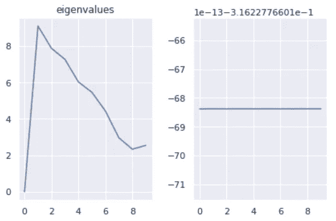

让我们看另一个例子。上图由两部分组成。因此，2 个特征值等于 0。

```
G = nx.Graph()
G.add_edges_from([
    [1, 2],
    [1, 3],
    [1, 4],
    [2, 3],
    [2, 7],
    [3, 4],
    [4, 7],
    [1, 7],
    [6, 5],
    [5, 8],
    [6, 8],
    [9, 8],
    [9, 6]
])draw_graph(G)W = nx.adjacency_matrix(G)
print(W.todense())
```

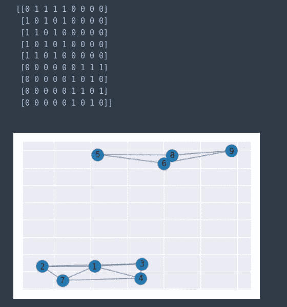

```
# degree matrix
D = np.diag(np.sum(np.array(W.todense()), axis=1))
print('degree matrix:')
print(D)# laplacian matrix
L = D - W
print('laplacian matrix:')
print(L)
```

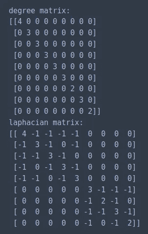

```
e, v = np.linalg.eig(L)# eigenvalues
print('eigenvalues:')
print(e)# eigenvectors
print('eigenvectors:')
print(v)
```

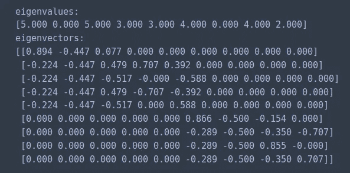

```
fig = plt.figure(figsize=[18, 6])ax1 = plt.subplot(131)
plt.plot(e)
ax1.title.set_text('eigenvalues')i = np.where(e < 10e-6)[0]
ax2 = plt.subplot(132)
plt.plot(v[:, i[0]])
ax2.title.set_text('first eigenvector with eigenvalue of 0')ax3 = plt.subplot(133)
plt.plot(v[:, i[1]])
ax3.title.set_text('second eigenvector with eigenvalue of 0')
```

如果我们仔细看看每个特征向量的图，我们可以清楚地看到，前 5 个节点映射到相同的值，其他 5 个节点映射到另一个值。我们可以利用这一事实将节点分为两类。

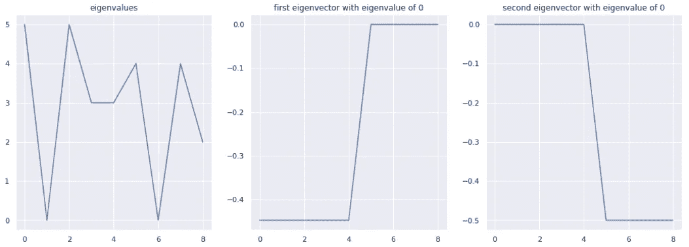

让我们看一个稍微复杂一点的例子。前面的图是由一个单独的部分组成的。然而，看起来我们有两节课。

```
G = nx.Graph()
G.add_edges_from([
    [1, 2],
    [1, 3],
    [1, 4],
    [2, 3],
    [3, 4],
    [4, 5],
    [1, 5],
    [6, 7],
    [7, 8],
    [6, 8],
    [6, 9],
    [9, 6],
    [7, 10],
    [7, 2]
])draw_graph(G)W = nx.adjacency_matrix(G)
print(W.todense())
```

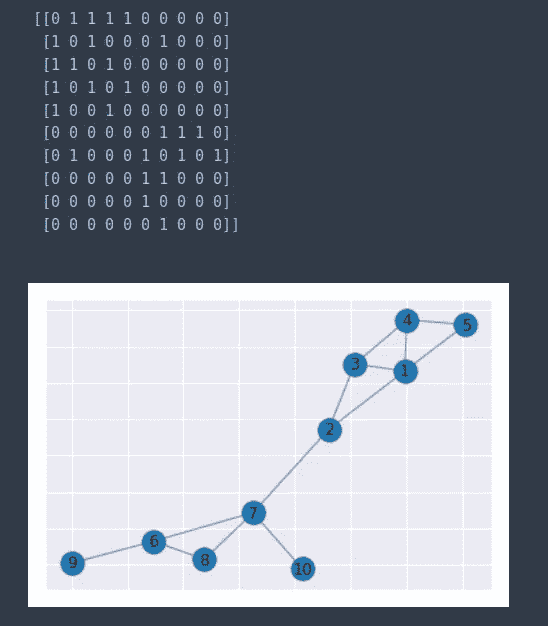

```
# degree matrix
D = np.diag(np.sum(np.array(W.todense()), axis=1))
print('degree matrix:')
print(D)# laplacian matrix
L = D - W
print('laplacian matrix:')
print(L)
```

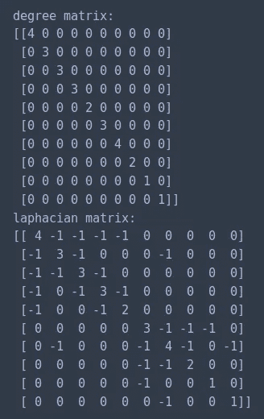

```
e, v = np.linalg.eig(L)# eigenvalues
print('eigenvalues:')
print(e)# eigenvectors
print('eigenvectors:')
print(v)
```

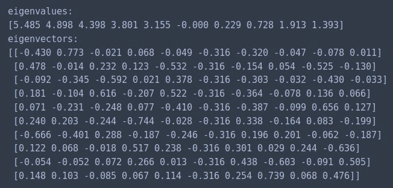

```
fig = plt.figure(figsize=[18, 6])ax1 = plt.subplot(131)
plt.plot(e)
ax1.title.set_text('eigenvalues')i = np.where(e < 0.5)[0]
ax2 = plt.subplot(132)
plt.plot(v[:, i[0]])ax3 = plt.subplot(133)
plt.plot(v[:, i[1]])
ax3.title.set_text('second eigenvector with eigenvalue close to 0')
```

因为我们只有一个分量，所以只有一个特征值等于 0。然而，如果我们看看第二小的特征值，我们仍然可以观察到两类之间的区别。如果我们画一条横线，我们就能正确地对节点进行分类。

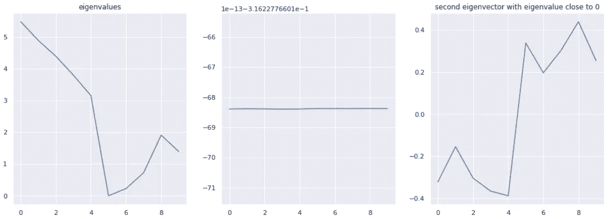

让我们看另一个例子。同样，图将由单个组件组成，但这一次，看起来节点应该放在三个容器中的一个。

```
G = nx.Graph()
G.add_edges_from([
    [1, 2],
    [1, 3],
    [1, 4],
    [2, 3],
    [3, 4],
    [4, 5],
    [1, 5],
    [6, 7],
    [7, 8],
    [6, 8],
    [6, 9],
    [9, 6],
    [7, 10],
    [7, 2],
    [11, 12],
    [12, 13],
    [7, 12],
    [11, 13]
])draw_graph(G)W = nx.adjacency_matrix(G)
print(W.todense())
```

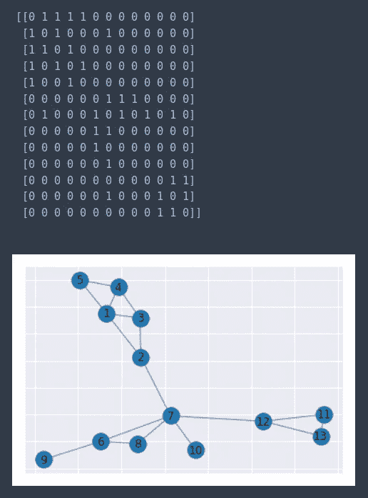

```
# degree matrix
D = np.diag(np.sum(np.array(W.todense()), axis=1))
print('degree matrix:')
print(D)# laplacian matrix
L = D - W
print('laplacian matrix:')
print(L)
```

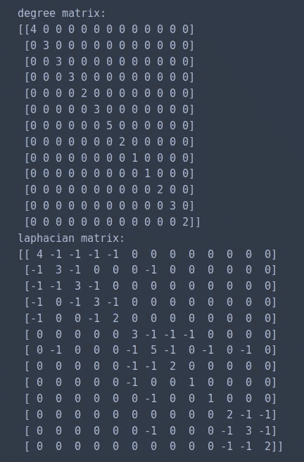

```
e, v = np.linalg.eig(L)# eigenvalues
print('eigenvalues:')
print(e)# eigenvectors
print('eigenvectors:')
print(v)
```

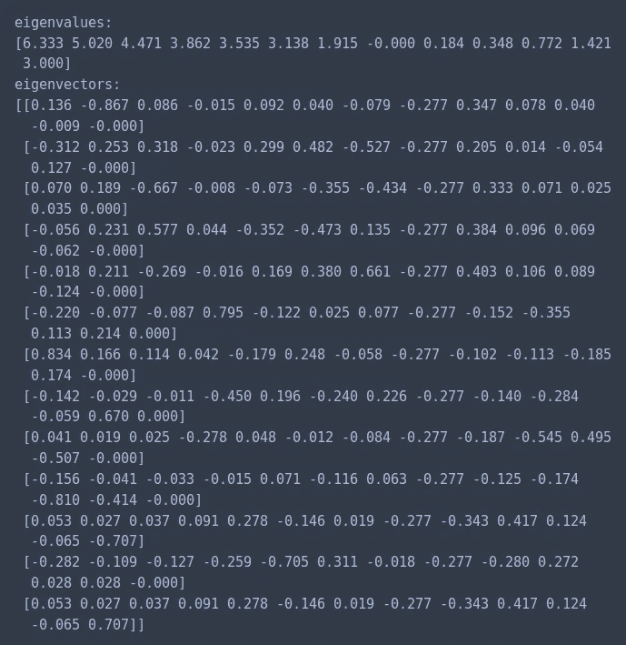

```
fig = plt.figure(figsize=[18, 6])ax1 = plt.subplot(221)
plt.plot(e)
ax1.title.set_text('eigenvalues')i = np.where(e < 0.5)[0]
ax2 = plt.subplot(222)
plt.plot(v[:, i[0]])ax3 = plt.subplot(223)
plt.plot(v[:, i[1]])
ax3.title.set_text('second eigenvector with eigenvalue close to 0')ax4 = plt.subplot(224)
plt.plot(v[:, i[2]])
ax4.title.set_text('third eigenvector with eigenvalue close to 0')fig.tight_layout()
```

因为我们只有 1 个分量，所以 1 个特征值等于 0。但是，我们可以再次使用第二小的特征值来计算出哪个节点应该放在哪个类别中。

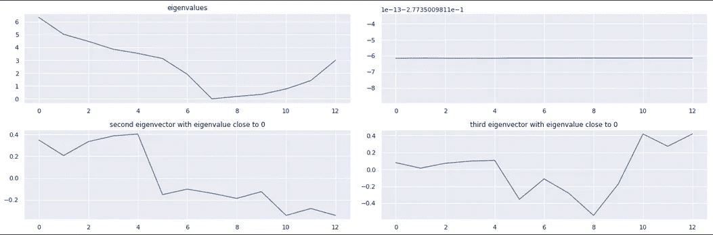

在实践中，我们使用 k-means 根据节点在特征向量中的对应值对节点进行分类。

```
U = np.array(v[:, i[1]])km = KMeans(init='k-means++', n_clusters=3)km.fit(U)km.labels_
```

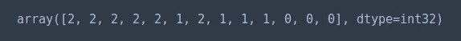

接下来，让我们使用 scitkit-learn 的实现来比较 k-means 和谱聚类。假设我们的数据在绘制时采用了以下形状。

```
X, clusters = make_circles(n_samples=1000, noise=.05, factor=.5, random_state=0)
plt.scatter(X[:,0], X[:,1])
```

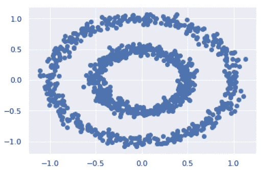

当使用 k-means 时，我们得到以下结果。

```
km = KMeans(init='k-means++', n_clusters=2)km_clustering = km.fit(X)plt.scatter(X[:,0], X[:,1], c=km_clustering.labels_, cmap='rainbow', alpha=0.7, edgecolors='b')
```

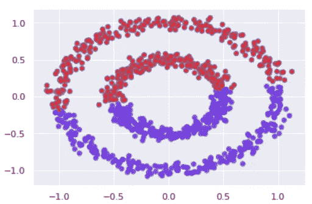

相反，当使用谱聚类时，我们将每个圆放在自己的聚类中。

```
sc = SpectralClustering(n_clusters=2, affinity='nearest_neighbors', random_state=0)sc_clustering = sc.fit(X)plt.scatter(X[:,0], X[:,1], c=sc_clustering.labels_, cmap='rainbow', alpha=0.7, edgecolors='b')
```

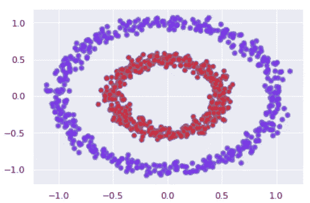

# 最后的想法

与 k-means 相反，谱聚类考虑了数据点的相对位置。