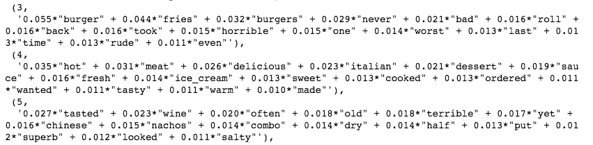
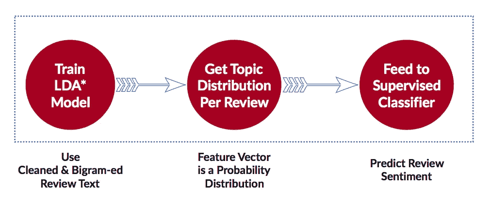
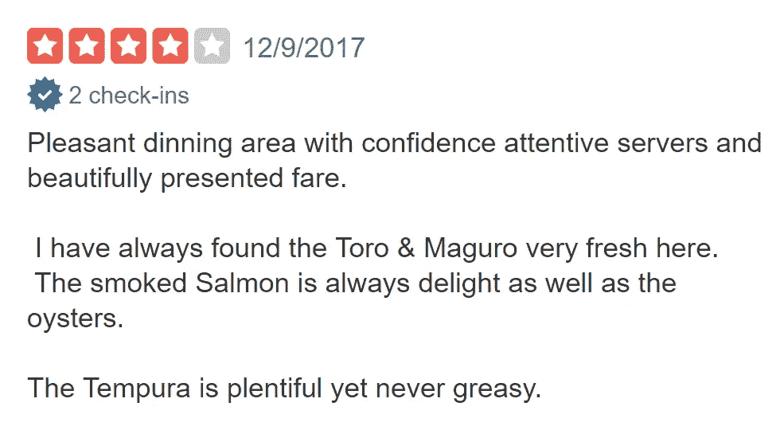
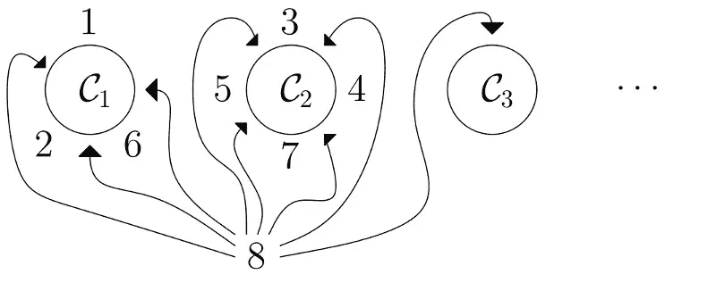
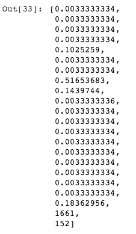
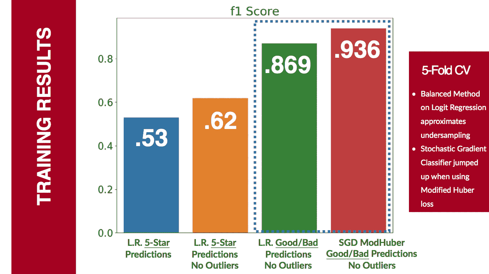
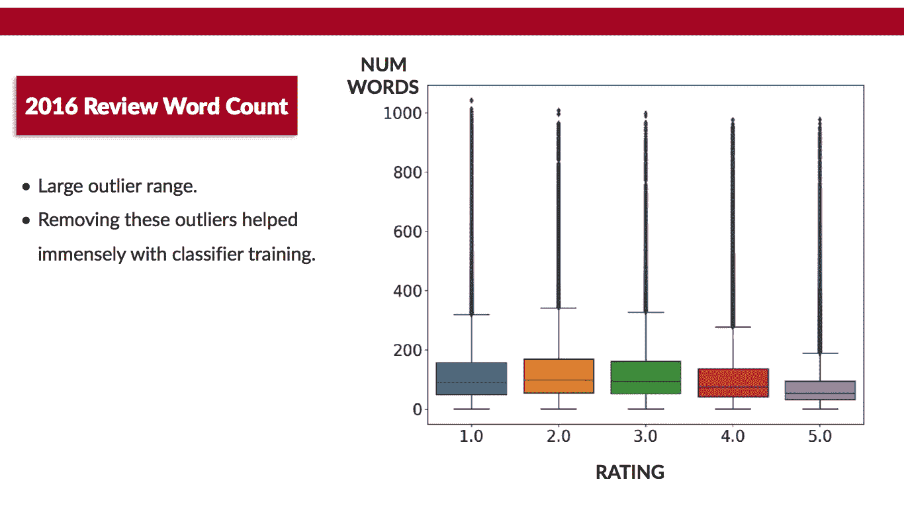
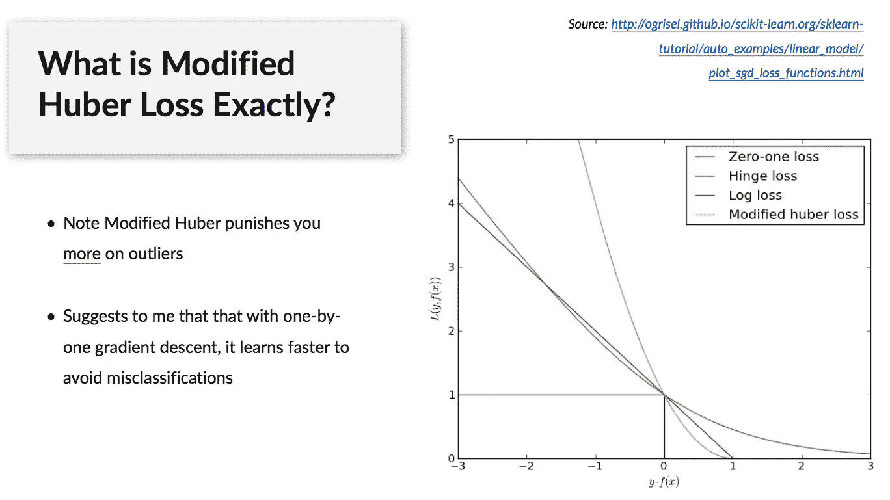
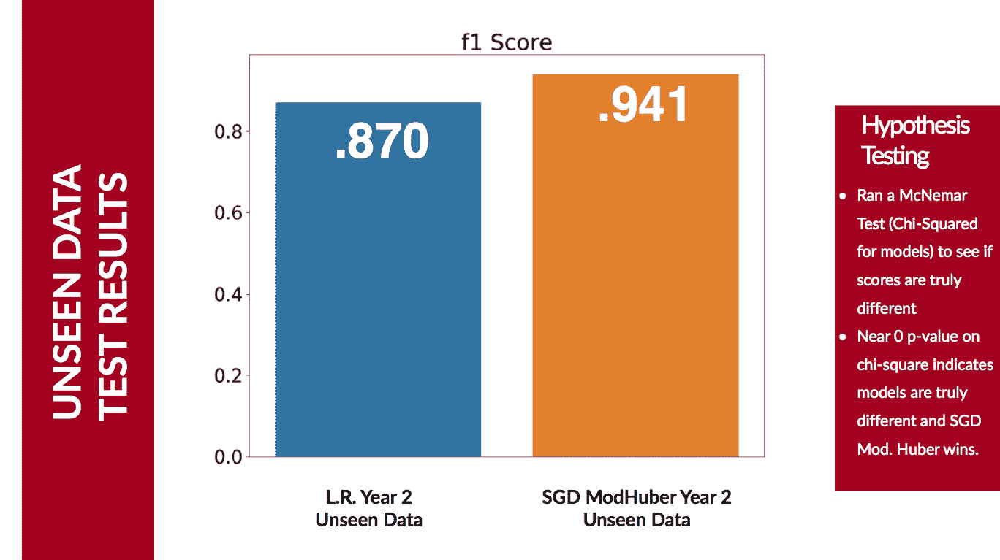
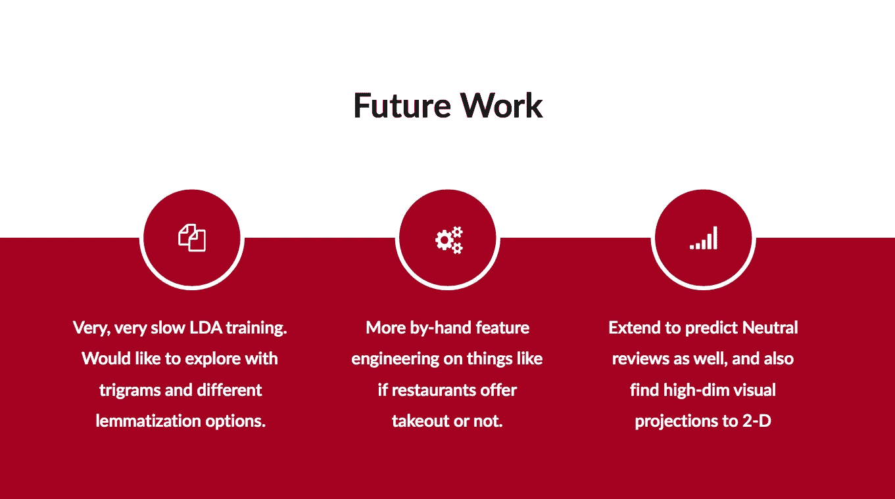

# 使用 LDA 主题模型作为分类模型输入

> 原文：<https://towardsdatascience.com/unsupervised-nlp-topic-models-as-a-supervised-learning-input-cf8ee9e5cf28?source=collection_archive---------2----------------------->

## 预测未来 Yelp 评论情绪

# 主题建模概述

自然语言处理中的主题建模旨在发现文档中隐藏的语义结构。它们是概率模型，可以帮助你梳理大量的原始文本，并以一种无人监管的方式将相似的文档分组在一起。

这篇文章特别关注潜在狄利克雷分配(LDA ),这是一种在 2000 年提出的用于群体遗传学的技术，并由 ML-hero 吴恩达等人在 2003 年独立重新发现。LDA 指出，语料库中的每个文档都是固定数量的主题的组合。一个主题具有生成各种单词的概率，其中单词是语料库中所有观察到的单词。这些“隐藏的”主题随后根据单词共现的可能性浮出水面。形式上，这是贝叶斯推理问题[1]。

# LDA 输出

一旦 LDA 主题建模应用于一组文档，您就能够看到组成每个隐藏主题的单词。在我的例子中，我使用 Yelp 数据集[2]在 2016 年从 Yelp 餐馆中提取了 10 万条评论。以下是通过 LDA 发现的两个主题示例:



你可以看到，第一个主题组似乎已经识别出负面汉堡评论的单词共现，第二个主题组似乎已经识别出正面的意大利餐馆体验。第三个话题不是很明确，但似乎总的来说是关于可怕的、干咸的食物。

# 将无监督输出转换为有监督问题

我更感兴趣的是看看这种隐藏的语义结构(非监督生成的)是否可以转换成用于监督分类问题。假设我只训练了一个 LDA 模型来找到上述的 3 个主题。训练后，我可以收集所有 10 万条评论，并查看每条评论的主题分布。换句话说，一些文档可能是 100%的主题 1，其他文档可能是主题 1/2/3 的 33%/33%/33%，等等。该输出只是显示分布的每个评论的向量。这里的想法是测试隐藏语义信息的每次评论的分布是否可以预测积极和消极的情绪。

# 项目目标

介绍完毕后，我的目标是:



具体来说:

1.  在 2016 年的 100，000 条餐厅评论上训练 LDA 模型
2.  使用 LDA 模型获取每个评论的主题分布
3.  将主题分布直接用作监督分类模型(逻辑回归、SVC 等)中的特征向量，并获得 F1 分数。
4.  使用相同的 2016 年 LDA 模型获得 2017 年的主题分布(**LDA 模型没有看到这个数据！**)
5.  对 2017 年向量再次运行监督分类模型，看看这是否一般化。

> 如果在看不见的数据上的监督 F1 分数一般化，那么我们可以假设 2016 主题模型已经识别了在这个餐馆评论领域中随着时间持续存在的潜在语义结构。

# 数据准备

更新(9/23/19):我给[的 Repo](https://github.com/marcmuon/nlp_yelp_review_unsupervised) 添加了一个自述文件，展示了如何使用源数据创建一个 MongoDB。我还包含了一个[预处理脚本](https://github.com/marcmuon/nlp_yelp_review_unsupervised/blob/master/preprocess.py)，它将允许你创建我在下面使用的精确的训练和测试数据帧。然而，我意识到这可能需要大量的工作，所以我还在这里的目录[中包含了我的训练和测试数据帧的 pickle 文件。这将允许您直接跟踪回购中的笔记本，即这里的](https://github.com/marcmuon/nlp_yelp_review_unsupervised/tree/master/data)和这里的。**如果你只想知道重点/要点，我会在这篇博文的剩余部分用代码片段指出所有的关键点。**

# LDA 预处理

我使用了非常棒的 gensim 库来创建评论的二元表示并运行 LDA。Gensim 的 LDA 实现需要作为稀疏向量进行审查。方便的是，gensim 还提供了将 NumPy 密集矩阵或 scipy 稀疏矩阵转换成所需形式的便利实用程序。

我将展示如何使用 gensim 函数获得必要的表示。我从 pandas DataFrame 开始，它在一个名为`'text’`的列中包含每个评论的文本，这个列可以被提取到一个字符串列表的列表中，其中每个列表代表一个评论。这是我下面例子中名为`words`的对象:

```
from nltk.corpus import stopwords
stop_words = stopwords.words('english')
stop_words.extend(['come','order','try','go','get','make','drink','plate','dish','restaurant','place','would','really','like','great','service','came','got']) def remove_stopwords(texts):
    out = [[word for word in simple_preprocess(str(doc))
            if word not in stop_words]
            for doc in texts]
    return outdef bigrams(words, bi_min=15, tri_min=10):
    bigram = gensim.models.Phrases(words, min_count = bi_min)
    bigram_mod = gensim.models.phrases.Phraser(bigram)
    return bigram_moddef get_corpus(df):
    df['text'] = strip_newline(df.text)
    words = list(sent_to_words(df.text))
    words = remove_stopwords(words)
    bigram_mod = bigrams(words)
    bigram = [bigram_mod[review] for review in words]
    id2word = gensim.corpora.Dictionary(bigram)
    id2word.filter_extremes(no_below=10, no_above=0.35)
    id2word.compactify()
    corpus = [id2word.doc2bow(text) for text in bigram]

    return corpus, id2word, bigramtrain_corpus, train_id2word, bigram_train = get_corpus(rev_train)
```

为了简洁起见，我在这篇文章中省略了几个额外的预处理步骤(标点、换行等)。

这个代码块中实际上有两个关键项目:

1.  Gensim 的短语类允许您将相关短语分组到 LDA 的一个令牌中。例如，请注意，在这篇文章开头找到的主题列表中， *ice_cream* 被列为单个标记。因此，`bigram = [bigram_mod[review] for review in words]`这一行的输出是一个列表列表，其中每个列表代表一篇评论，每个列表中的字符串都是单字和双字的混合。这是因为我们所做的是将`bigram_mod`短语建模模型应用于每个评审。
2.  一旦你有了一元和二元的列表，你就可以把它传递给 gensim 的 Dictionary 类。这将为每个评论输出每个单词*的词频计数。我发现，当我额外做了一些处理来删除语料库中最常见和最罕见的单词时，我用 LDA 得到了最好的结果，如上面代码块的第 21 行所示。最后，下面是`doc2bow()` 正在做的事情，来自他们的官方[例子](https://radimrehurek.com/gensim/tut1.html)【3】:*

> 函数`*doc2bow()*`简单地计算每个不同单词的出现次数，将单词转换为整数单词 id，并将结果作为稀疏向量返回。稀疏向量`*[(0, 1), (1, 1)]*`因此读作:在“人机交互”文档中，计算机(id 0)和人类(id 1)这两个词出现一次；其他十个词典单词(隐式地)零次出现。”

上面的第 23 行给出了 LDA 所需的表示中的语料库。

为了举例说明我们正在处理的文本类型，这里有一个 Yelp 评论的快照:



# 选择 LDA 的主题数量

为了训练一个 LDA 模型，你需要在你的语料库中提供一个固定的假设数量的主题。有很多方法可以解决这个问题:

1.  用不同数量的主题在你的语料库上运行 LDA，看看每个主题的单词分布是否合理。
2.  检查你的 LDA 模型的一致性分数，并有效地网格搜索以选择最高的一致性[4]。
3.  创建一些具有不同主题值的 LDA 模型，然后查看这些模型在监督分类模型训练中的表现。这是我的目标，因为我的最终目标是看看主题分布是否有预测价值。

其中:我根本不相信#1 是一种方法。在这种情况下，我有什么资格说什么是明智的，什么是不明智的？我依靠 LDA 来识别 100，000 个文档的潜在主题表示，它可能不一定是直观的。对于#2:我和一些前 NLP 专业人士交谈过，他们劝我不要依赖基于他们行业经验的一致性分数。方法#3 对我的目的来说是合理的，但是现实情况是，即使我使用的是 16GB 的 8 核 AWS 实例，LDA 也需要花费大量的时间来训练。

因此，我想到了一个我认为相当新颖的想法——至少，我还没有在网上或报纸上看到任何人这样做:

Gensim 还提供了一个分层的狄利克雷过程(HDP)类[5]。HDP 类似于 LDA，只是它试图从数据中学习正确的主题数量；也就是说，你不需要提供固定数量的主题。我想我应该在我的 100，000 条评论上运行几次 HDP，看看它正在学习的主题数量。在我的情况下，这总是 20 个主题，所以我去了。

为了对 HDP 有一个直观的感受:我在网上找到了一些资料，说它最类似于中国餐馆的流程。埃德温·陈[在这里](http://blog.echen.me/2012/03/20/infinite-mixture-models-with-nonparametric-bayes-and-the-dirichlet-process/)【6】对此做了精辟的解释，在【7】[在这里](http://gerin.perso.math.cnrs.fr/ChineseRestaurant.html)做了漂亮的形象化处理。这是来自[7]的视觉化图像:



在这个例子中，我们需要给一个主题分配 8 分。有 3/8 的概率 8 将到达话题 C1，有 4/8 的概率 8 将到达话题 C2，有 1/8 的概率一个新话题 C3 将被创建。通过这种方式，发现了许多主题。所以一个集群越大，就越有可能有人加入这个集群。我觉得这和其他为 LDA 选择固定主题号的方法一样合理。如果任何有较重贝叶斯推理背景的人对此有想法，请权衡！

更新[2020 年 4 月 13 日] — [爱德华多·科罗纳多](https://medium.com/@eduardo.coronado92)通过评论提供了一些关于 HDP 的更精确的信息:

“的确，HDPs 的非参数特性允许我们从数据中学习主题，但是 Dirichlet 过程混合物已经做到了这一点。HDPs 的主要优势是它们允许不同的语料库(组)在建模时共享统计优势——在这种情况下，共享潜在无限主题的公共集合。所以它是狄利克雷过程混合物的一个扩展。”

# 创建 LDA 模型

下面是用 Gensim 运行 LDA 的代码:

```
import gensim

with warnings.catch_warnings():
    warnings.simplefilter('ignore')
    lda_train = gensim.models.ldamulticore.LdaMulticore(
                           corpus=train_corpus,
                           num_topics=20,
                           id2word=train_id2word,
                           chunksize=100,
                           workers=7, # Num. Processing Cores - 1
                           passes=50,
                           eval_every = 1,
                           per_word_topics=True)
    lda_train.save('lda_train.model')
```

通过打开`eval_every`标志，我们能够以块的形式处理语料库:在我的例子中，100 个文档的块在收敛方面表现得相当好。遍数是对整个语料库的单独遍数。

完成后，您可以查看组成每个主题的单词，如下所示:

```
lda_train.print_topics(20, num_words=15)[:10]
```

有了这段代码，你会看到 20 个主题中的 10 个，以及每个主题的 15 个热门词汇。

# 将主题转换为特征向量

现在有趣的部分来了。我们将使用 LDA 模型来获取每篇评论的这 20 个主题的分布。这 20 个向量将是我们监督分类的特征向量，监督学习的目标是确定积极或消极的情绪。

注意，我认为这种使用主题模型向量的监督分类方法并不常见。当我这么做的时候，我不知道网上有人尝试过这个例子，尽管后来当我完成时，我发现了这篇在 2008 年完成的[论文](http://gibbslda.sourceforge.net/fp224-phan.pdf)。请让我知道是否有其他的例子！

> 最终目标不仅是看看这在当前数据的训练/测试 CV 分割中表现如何，而且是这些主题是否触及了一些基本的东西，这些基本的东西转化为未来看不见的测试数据(在我的情况下，是一年后的数据)。

以下是我为每篇评论获取特征向量的方法:

```
train_vecs = []
for i in range(len(rev_train)):
    top_topics = (
        lda_train.get_document_topics(train_corpus[i],
                                      minimum_probability=0.0)
    ) topic_vec = [top_topics[i][1] for i in range(20)]
    topic_vec.extend([rev_train.iloc[i].real_counts])
    topic_vec.extend([len(rev_train.iloc[i].text)])
    train_vecs.append(topic_vec)
```

key bit 在第 3 行使用`minimum_probability=0.0`。这确保了我们能够捕捉到某些主题中某篇评论的呈现率为 0%的情况，而每篇评论的呈现率加起来将达到 100%。

第 5 行和第 6 行是我添加的两个手工设计的特性。

因此，用于监督分类审查的单个观察现在看起来像这样:



前 20 个项目代表每个评论的 20 个主题的分布。

# 训练监督分类器

我们现在准备好训练了！在这里，我使用了 100，000 条 2016 年餐厅评论及其主题-模型分布特征向量+两个手工设计的特征:

```
X = np.array(train_vecs)
y = np.array(rev_train.target)

kf = KFold(5, shuffle=True, random_state=42)
cv_lr_f1, cv_lrsgd_f1, cv_svcsgd_f1,  = [], [], []

for train_ind, val_ind in kf.split(X, y):
    # Assign CV IDX
    X_train, y_train = X[train_ind], y[train_ind]
    X_val, y_val = X[val_ind], y[val_ind]

    # Scale Data
    scaler = StandardScaler()
    X_train_scale = scaler.fit_transform(X_train)
    X_val_scale = scaler.transform(X_val)

    # Logisitic Regression
    lr = LogisticRegression(
        class_weight= 'balanced',
        solver='newton-cg',
        fit_intercept=True
    ).fit(X_train_scale, y_train)

    y_pred = lr.predict(X_val_scale)
    cv_lr_f1.append(f1_score(y_val, y_pred, average='binary'))

    # Logistic Regression SGD
    sgd = linear_model.SGDClassifier(
        max_iter=1000,
        tol=1e-3,
        loss='log',
        class_weight='balanced'
    ).fit(X_train_scale, y_train)

    y_pred = sgd.predict(X_val_scale)
    cv_lrsgd_f1.append(f1_score(y_val, y_pred, average='binary'))

    # SGD Modified Huber
    sgd_huber = linear_model.SGDClassifier(
        max_iter=1000,
        tol=1e-3,
        alpha=20,
        loss='modified_huber',
        class_weight='balanced'
    ).fit(X_train_scale, y_train)

    y_pred = sgd_huber.predict(X_val_scale)
    cv_svcsgd_f1.append(f1_score(y_val, y_pred, average='binary'))

print(f'Logistic Regression Val f1: {np.mean(cv_lr_f1):.3f} +- {np.std(cv_lr_f1):.3f}')
print(f'Logisitic Regression SGD Val f1: {np.mean(cv_lrsgd_f1):.3f} +- {np.std(cv_lrsgd_f1):.3f}')
print(f'SVM Huber Val f1: {np.mean(cv_svcsgd_f1):.3f} +- {np.std(cv_svcsgd_f1):.3f}')
```

关于这一点有几点需要注意:

1.  我找到了标准逻辑回归、对数损失随机梯度下降和修正 Huber 损失随机梯度下降之间的比较。
2.  我正在运行一个 5 重 CV，因此在每次运行中，1/5 的评论作为验证数据，另外 4/5 是训练数据。每次折叠都重复这一过程，最后对 f1 得分结果进行平均。
3.  我的班级不平衡。特别是，在 Yelp 评论数据集中，4 星和 5 星评论的数量不成比例。模型中的`class_weight='balanced'`线近似于欠采样，以对此进行校正。这一选择的理由见[9]。
4.  我还将分析限制在数据集中总评论数超过 25%的餐馆。这更多是为了加快速度，因为最初的数据集大约有 400 多万条评论。

# 2016 年培训结果

以下是 f1 得分结果:



我将首先使用逻辑回归分析较低的. 53 和. 62 f1 分数。当我开始训练时，我试图预测个人评价:1、2、3、4 或 5 星。如你所见，这并不成功。我对最初的. 53 分有点气馁，所以回去检查我最初的 EDA 图表，看看我是否能注意到数据中的任何东西。我之前运行过这个图表:



这显示了单词计数 IQR 评级范围。由于主要的 IQR 范围相当紧凑，我决定尝试重新运行 LDA 预处理和模型仅限于(大致)IQR 范围。进行这一更改后，我的 1、2、3、4、5 星分类的 f1 逻辑回归得分增加到了 0.62。还是不太好。

在这一点上，我决定看看如果我去掉 3 颗星会发生什么，并将 1、2 颗星归类为“差”，4、5 颗星归类为“好”。正如你在上面的图表中看到的，这是一个奇迹！现在逻辑回归得出了 0.869 的 f1 分数。

# 修正的休伯损失

当我运行这些时，我注意到 SKLearn 的随机梯度下降实现中有一个“修正的 huber”损失选项[10]。在这种情况下，出错的代价比铰链(SVC)或日志丢失要严重得多:



我仍然在努力解决为什么这个方法如此有效，但是我最初的想法是这些惩罚性的惩罚使得 SGD(记住，1 比 1 的重量更新)学得很快。正规化在这方面也有很大帮助。上面代码中第 42 行的 alpha 是一个正则化参数(就像在 Ridge 或 Lasso 正则化中一样)，这有助于我的 f1 分数达到 0.936。

# 对看不见的数据应用模型

在这一点上，我对这些结果感到非常兴奋，但想进一步看看在完全看不见的数据上会发生什么。

具体来说:

1.  从 2016 年的评论中提取 LDA 模型，并获取测试数据的特征向量。需要注意的是，同样的 2016 款可以做到这一点！
2.  在测试向量上重新运行模型。

所有需要做的就是为测试语料库制作二元模型，然后像以前一样将它投入到测试向量提取方法中:

```
def get_bigram(df):

    df['text'] = strip_newline(df.text)
    words = list(sent_to_words(df.text))
    words = remove_stopwords(words)
    bigram = bigrams(words)
    bigram = [bigram[review] for review in words]
    return bigram

bigram_test = get_bigram(rev_test)

test_corpus = [train_id2word.doc2bow(text) for text in bigram_test]

test_vecs = []
for i in range(len(rev_test)):
    top_topics = (
            lda_train.get_document_topics(test_corpus[i],
                                          minimum_probability=0.0)
    topic_vec = [top_topics[i][1] for i in range(20)]
    topic_vec.extend([rev_test.iloc[i].real_counts])
    topic_vec.extend([len(rev_test.iloc[i].text)])
    test_vecs.append(topic_vec)
```

最后，结果是:



令我有些震惊的是，这种概括！

我对这个结果感到兴奋，因为我相信这种方法对任何试图以这种方式训练分类器的公司都是可行的。最后我还使用 mlxtend [11]做了一个假设检验，最终结果确实具有统计学意义。

# 未来的工作

我打算在未来扩展这一点，我留给你:



我还在我的 GitHub [这里](https://github.com/marcmuon/nlp_yelp_review_unsupervised)托管了所有的代码和经过训练的 LDA 模型。

感谢阅读！

# 来源

[1][https://en.wikipedia.org/wiki/Latent_Dirichlet_allocation](https://en.wikipedia.org/wiki/Latent_Dirichlet_allocation)
【2】[https://www.yelp.com/dataset](https://www.yelp.com/dataset)
【3】[https://radimrehurek.com/gensim/tut1.html](https://radimrehurek.com/gensim/tut1.html)
【4】[https://radimrehurek.com/gensim/models/coherencemodel.html](https://radimrehurek.com/gensim/models/coherencemodel.html)
【5】[https://radimrehurek.com/gensim/models/hdpmodel.html](https://radimrehurek.com/gensim/models/hdpmodel.html)
【6】[http://blog . echen . me/2012/03/20/infinite-mix-models-with-nonparameter-Bayes-and-the-Dirichlet-process/](http://blog.echen.me/2012/03/20/infinite-mixture-models-with-nonparametric-bayes-and-the-dirichlet-process/)
SGDClassifier.html
【11】[http://rasbt.github.io/mlxtend/user_guide/evaluate/mcnemar/](http://rasbt.github.io/mlxtend/user_guide/evaluate/mcnemar/)