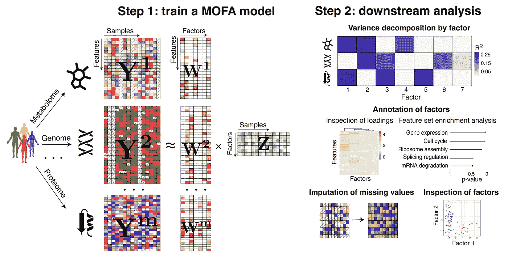

# 无监督组学整合

> 原文：<https://towardsdatascience.com/unsupervised-omics-integration-688bf8fa49bf?source=collection_archive---------17----------------------->

## [生命科学的数理统计和机器学习](https://towardsdatascience.com/tagged/stats-ml-life-sciences)

## 将数据投射到跨组学的公共变化轴上

The idea behind OMICs integration from Wang et al., Quantitative Biology **4**, p.58, 2016, [image source](https://link.springer.com/article/10.1007/s40484-016-0063-4)

这是专栏 [**生命科学的数理统计和机器学习**](https://towardsdatascience.com/tagged/stats-ml-life-sciences?source=post_page---------------------------) 的第十篇文章，我试图在这里涵盖生物信息学、生物医学、遗传学、进化论等常用的分析技术。之前，我对组学集成做了一个[介绍](/select-features-for-omics-integration-511390b7e7fd)，并介绍了[监督的 PLS-DA 模型](/supervised-omics-integration-2158e1a6d23f)。今天，我们将考虑**无监督组学整合**，这在**没有类别标签**(没有明确的**表型**)可用时尤其方便，但我们仍然希望通过组合不同来源的生物信息来了解数据中样本之间的**异质性。**

# 监督与非监督数据集成

比较有监督和无监督的数据分析就像比较披头士和天鹅绒地下音乐。两者都很优秀，但方式不同。虽然**监督建模在现代研究中占主导地位**，因为它提供了**缓慢但有保证的进展**，但无监督模型一直被认为是**“高风险-高收益”的方法**。

[**列夫·朗道**](https://en.wikipedia.org/wiki/Lev_Landau) **(诺贝尔物理学奖获得者)**他问正在努力解决数学问题的学生的问题:**“你怎么能在不知道答案的情况下解决一个科学问题？”**反映了有监督的假设驱动的主流研究的心态。例如，如果一个人胆敢对编辑的评论“我不太理解你的生物学假设”回复“我没有”，这将很可能导致同行评审科学期刊拒绝该论文。这是因为在研究中，我们倾向于用事物如何工作的最初想法来约束自己，而要做的研究只是为了证明我们的假设是正确的。相比之下，无监督方法是一种 [**解放你的思想**](https://www.youtube.com/watch?v=oXv3SSijPFc) 的方法，当你**不知道你的数据**中有什么，因此可以发现**意想不到的现象**。

# 多组学因素分析(MOFA)

**是典型的**无假设**数据探索框架。它允许通过从[多组学](/select-features-for-omics-integration-511390b7e7fd)层中提取**公共变化轴**进行数据整合。给定来自**相同或重叠样本**的多个组学的数据矩阵，MOFA 根据**潜在/隐藏因素**推断出数据的**低维**表示，然后可以对其进行可视化和解释。**

****

**Idea of unsupervised OMICs integration with [Multi-OMICs Factor Analysis (MOFA)](https://www.embopress.org/doi/10.15252/msb.20178124)**

**类似于其他整合组学方法，如 [**DISCO、JIVE 和 O2PLS**](https://www.ncbi.nlm.nih.gov/pmc/articles/PMC4905617/) ，MOFA 推断异质性的潜在轴是否为个体 OMIC 或**所独有，表现在多个组学**中。此外，MOFA 提供了几个有用的功能，包括:**

*   **低维潜在空间中样本的可视化**
*   **使用(基因集)富集分析的因子注释**
*   **缺失和稀疏数据的插补和支持**
*   **非高斯分布的组学支持**

**后两个优点源于 MOFA 是在**贝叶斯**T2 框架内实现的，不依赖于大量数据或高斯分布等频繁统计假设。重要的是，MOFA 是一个**线性** **集成组学算法**，一个更一般的非线性组学集成可以通过例如自动编码器来执行，我在[我以前的帖子](/deep-learning-for-data-integration-46d51601f781)中描述过。关于 MOFA 要提到的最后一点是，它是一种 [**因子分析(FA)**](https://en.wikipedia.org/wiki/Factor_analysis) 算法，尽管 FA 在视觉上[可能看起来与 PCA](/reduce-dimensions-for-single-cell-4224778a2d67) 相同，但这两种线性降维技术不应混淆。PCA 是一种纯粹的**矩阵分解**技术(除非它是一种概率 PCA ),它将总方差分解成正交的主分量，FA 寻求构造**隐藏的潜在变量**，这些变量**生成**观察到的数据，因此因子分析是一种**生成模型**,类似于隐马尔可夫模型(HMM)、高斯混合模型(GMM)、变分自动编码器(ve)、生成对抗网络(GANs)等。**

# **多组学数据集的整合**

**在本节中，我们将 MOFA 应用于单细胞多组学 [**scNMT**](https://www.nature.com/articles/s41467-018-03149-4) 数据集，该数据集描绘了来自**相同生物细胞**的**染色质可及性(scATACseq)、DNA 甲基化(scBSseq)和基因表达(scRNAseq)** ，这些细胞属于两种类型:**分化小鼠胚胎干细胞(ESCs)和胚胎体(EBs)** 。我们将从读取、过滤和对数转换 scNMT 的 scRNAseq 子集开始:**

**接下来，我们将读取 scNMT 的 scBSseq 和 scATACseq 子集，并显示它们的分布。因为 **CpG 位点**可以是**甲基化或未甲基化**，并且类似地，使用 [**GpC 甲基转移酶**](https://www.nature.com/articles/s41467-018-03149-4) 标记的位点可以来自**开放或封闭染色质**区域，所以 scBSseq 和 scATACseq 的分布看起来**生物模态**指示数据的**二元性质**就不足为奇了。**

****

**Histograms of scBSseq and scATACseq subsets of [scNMT](https://www.nature.com/articles/s41467-018-03149-4)**

**因此，我们将 scBSseq 和 scATACseq 数据建模为来自 [**Benoulli 分布**](https://en.wikipedia.org/wiki/Bernoulli_distribution) 。我们将通过**将低于 50 的值编码为 0，高于 50 的值编码为 1** 以及**移除低方差特征**以避免冗余，进一步使 scBSseq 和 scATACseq 数据集成为纯二进制数据集:**

**此外，我们将创建 MOFA 对象并设置模型参数，例如 scBSseq 和 scATACseq 的伯努利分布，以及 scRNAseq 组学的高斯分布(由于对数变换):**

****

**MOFA provides a useful visualization of the dimensions of the data**

**最后，我们将准备 MOFA 对象并运行 MOFA。事实证明，MOFA 只选择了 3 个隐藏的潜在因素(LFs ),解释了 scNMT 数据集超过 3%的变化。MOFa 的主要成果是下面的个体组学之间**协方差的巨大可视化:****

****

**我们可以看到，scRNAseq 对总的整合组学 scNMT 数据集贡献了最大的变异( **13%** )，scBSseq 和 scATACseq 贡献了约 **5%** 的变异。在 MOFA 选择的 3 个 LF 中，scRNAseq 对所有 LF 都有贡献，而第二个 LF 主要由 scBSseq 驱动，scATACseq 仅对第一个 LF 有贡献。有趣的是， **scRNAseq 在第一个 LF 中与 scATACseq 共变，而** **scRNAseq 在第二个 LF 中与 scBSseq 共变**。现在让我们通过显示它们的**加载**来解释 LF，即负责每个 LF 的特征，这里我们考虑 scRNAseq 和 LF1:**

****

**Visualization of MOFA loadings and heatmap demonstrating separation of ESC and EB cells**

**在右边的热图上，看起来加载基因在 ESC 和 EB 细胞之间提供了一个很好的分离。最后，我们将显示低维潜在空间中的**细胞，这种嵌入是来自 scNMT 多组学数据集的 3 组学整合的结果。****

****

**Low-dimensional MOFA representation of scNMT cells**

**我们的结论是，MOFA **将来自 scNMT 数据集的 3 个组学**投影到一个共同的潜在空间，其中技术差异被忽略，仅**共同变异**被考虑。整合方法能够成功地区分 3 种细胞类型:ESCs、EBs 和对照。**

# **摘要**

**在这篇文章中，我们了解到多组学因子分析(MOFA)是一种优雅的基于贝叶斯的组学整合算法，通过提取跨模态的共同变化轴。这对于数据探索和理解组学之间的**相互作用特别有用。**MOFA**对缺失数据**不敏感，并允许组合来自不同**非高斯**统计分布的组学。**

**在下面的评论中让我知道生命科学中的哪些分析对你来说似乎特别神秘，我会在这个专栏中尝试回答它们。在我的 [github](https://github.com/NikolayOskolkov/UnsupervisedOMICsIntegration) 上查看帖子中的代码。在 Medium [关注我，在 Twitter @NikolayOskolkov 关注我，在 Linkedin](https://medium.com/u/8570b484f56c?source=post_page-----688bf8fa49bf--------------------------------) 关注我。下一次我们将讨论**如何批量更正单细胞数据**，敬请关注。**