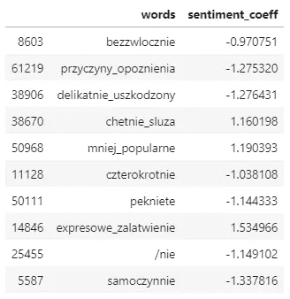
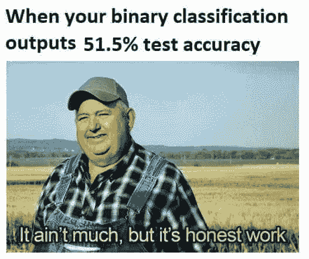

# 无监督情感分析

> 原文：<https://towardsdatascience.com/unsupervised-sentiment-analysis-a38bf1906483?source=collection_archive---------0----------------------->

## 如何从没有任何标签的数据中提取情感


Photo by [Amanda Jones](https://unsplash.com/@amandagraphc?utm_source=medium&utm_medium=referral) on [Unsplash](https://unsplash.com?utm_source=medium&utm_medium=referral)

注意:github repo 中提供了完整的代码:

[](https://github.com/rafaljanwojcik/Unsupervised-Sentiment-Analysis) [## rafaljanwojcik/无监督情感分析

### 如何从观点中提取情感而不被贴上文章回购的标签....在无监督的情绪上…

github.com](https://github.com/rafaljanwojcik/Unsupervised-Sentiment-Analysis) 

[NLP 方法](https://becominghuman.ai/a-simple-introduction-to-natural-language-processing-ea66a1747b32)的一个常见应用是情感分析，你试图从数据中提取关于作者情感的信息。主要是，至少在开始时，你会试图区分积极和消极的情绪，最终也是中立的，或者甚至仅基于文本检索与给定观点相关的分数。

你可以采取两种主要方法，教一种算法来区分写作中的积极和消极情绪——有监督的和无监督的。

第一个将向你询问以收集标记数据，并以监督的方式教导算法(例如， [LSTM](https://skymind.ai/wiki/lstm) 网络)序列中的每个单词(实际上是所有单词一个接一个出现，如果我们谈论 [RNNs](https://skymind.ai/wiki/lstm) )如何对应于整个句子是否定还是肯定的结果。这种方法需要手动标记数据，这通常很耗时，而且并不总是可行的。其次，对于在 NLP 方面没有得到很好利用的语言，例如波兰语，没有太多的预训练模型可以使用，所以不可能使用已经预训练了模型的[库](https://medium.com/@b.terryjack/nlp-pre-trained-sentiment-analysis-1eb52a9d742c)来估计句子中每个单词的情感得分。

后一种方法是一种无人监管的方法，这也是本文关注的对象。无监督学习背后的主要思想是，对于你输入的变量的结果，你不给模型任何预先的假设和定义——你只是插入数据(当然之前进行了预处理)，并希望模型学习数据本身的结构。如果您没有带标签的数据，或者您不确定数据的结构，并且您想要了解更多关于您正在分析的过程的性质，而不事先对其结果做出任何假设，那么这是非常有用的。

在我们进入本文的主要部分之前，还有一件事可能很重要。在自然语言处理和计算机视觉的最新突破中，最重要的思想之一是迁移学习的有效利用。在 NLP 领域，大多数迁移学习以某种方式发生，即一些模型(在 Word2Vec 的情况下，让它成为 MLP，或者像 [BERT](https://medium.com/dissecting-bert/dissecting-bert-part-1-d3c3d495cdb3) 这样的转换器)首先以无监督的方式(实际上是假监督的)对数据进行训练，然后针对特定任务进行微调，或者只是在另一个模型中使用，以产生更好的质量特征。通常会给它一个假的监督任务，比如根据周围的单词预测单词，或者根据给定的单词预测周围的单词(参见: [word2vec](http://mccormickml.com/2016/04/19/word2vec-tutorial-the-skip-gram-model/) ，或者根据前面的单词/句子预测下一个单词/句子( [transformer models](http://jalammar.github.io/illustrated-transformer/) )。这种训练不应该被认为是直接监督的，因为没有人的因素告诉算法什么答案是正确的(除了人自己写句子)。我提这个是因为 Word2Vec 算法可以作为迁移学习的例子来教。

也就是说，我们到达了这篇文章的主题，即无监督的情感分析。让事情变得更难的是，因为我来自波兰，我选择了分析波兰情感数据集，尽管这种方法也应该适用于任何语言，因为我没有对波兰语做出任何特定的假设，也没有使用预先训练的模型。在本文中，Szymon Pł otka 在监督下收集并分析了该数据集:

[](https://ermlab.com/en/blog/nlp/polish-sentiment-analysis-using-keras-and-word2vec/) [## 使用 Keras 和 Word2vec - Ermlab 软件进行波兰情感分析

### 博客上的帖子将致力于分析多愁善感的波兰语，这是一个属于…

ermlab.com](https://ermlab.com/en/blog/nlp/polish-sentiment-analysis-using-keras-and-word2vec/) 

解决这个问题有不同的方法，我将在本文的底部提到，这些方法可能会更好，但我发现我的方法实际上很令人兴奋，因为它是这些想法中的一个，只是在你的脑海中出现，并在没有投入太多努力的情况下实际工作(这也可能令人担忧)。

# 1.主要思想


Photo by [Nicole Honeywill / Sincerely Media](https://unsplash.com/@nicolehoneywill_sincerelymedia?utm_source=medium&utm_medium=referral) on [Unsplash](https://unsplash.com?utm_source=medium&utm_medium=referral)

这种方法背后的主要思想是消极和积极的词通常被相似的词包围。这意味着，如果我们有电影评论数据集，单词“boring”将被与单词“derive”相同的单词包围，通常这些单词将与单词“not”(like)接近，这也将使 word 与它们不相似。另一方面，这不太可能发生，单词“乏味”与单词“令人兴奋”的环境更相似，而不是与单词“无聊”的环境更相似。在这样的假设下，单词可以形成具有相似环境的负面单词、具有相似环境的正面单词以及一些结束于它们之间的中性单词的集群(基于它们环境的相似性)。一开始这看起来不太令人信服，我可能不是完美的解释者，但事实证明这是真的。

解决此类问题(拥有与其周围相似的单词)的完美工具是唯一的 word2vec！如果你以前没听说过，这里有一篇关于 word2vec 算法的文章，作者是 Chris McCornick:

[](https://medium.com/nearist-ai/word2vec-tutorial-the-skip-gram-model-c7926e1fdc09) [## Word2Vec 教程—跳格模型

### 本教程涵盖了 Word2Vec 的 skip gram 神经网络架构。本教程的目的是…

medium.com](https://medium.com/nearist-ai/word2vec-tutorial-the-skip-gram-model-c7926e1fdc09) 

和 Pierre Megret 的 perfect tutorial，我在本文中使用它来训练我自己的单词嵌入:

 [## Gensim Word2Vec 教程

### 下载数千个项目的开放数据集+在一个平台上共享项目。探索热门话题，如政府…

www.kaggle.com](https://www.kaggle.com/pierremegret/gensim-word2vec-tutorial) 

# 2.数据


Photo by [Robert Bye](https://unsplash.com/@robertbye?utm_source=medium&utm_medium=referral) on [Unsplash](https://unsplash.com?utm_source=medium&utm_medium=referral)

T 他每个数据科学/机器学习项目第一步、唯一一步、也是最重要的一步就是数据准备。如果没有良好的数据质量，最终总是可能得到一个有偏差的模型，要么根据我们选择的一些指标(例如测试集的 F 分数)表现不佳，要么一开始就很难诊断，被告知有偏差的关系，这实际上并不能反映出它区分积极和消极情绪的可用性，而是允许它在给定的数据集上表现良好。

下面的单元格显示了我选择使用的基本文本准备步骤之一，但我没有包括所有步骤，因为所有内容都包含在我的[库](https://github.com/rafaljanwojcik/Unsupervised-Sentiment-Analysis)中，我不想降低文章的可读性。坦率地说，我没有在这上面花太多时间，仍然有足够的空间让您自己做准备，特别是如果您想为像英语这样的语言实现它，这些语言有文本规范化的库。对于波兰语来说，使用像 [Morfologik](https://github.com/dmirecki/pyMorfologik) 这样的工具来使单词符合其基本结构可能非常重要，因为我们有许多不同的单词后缀来改变模型的单词，但实际上意思完全相同(例如，“beznadziejny”和“beznadziejna”都表示无望，但第一个指的是男人，另一个指的是女人)。

[https://gist.github.com/rafaljanwojcik/f00dfae9843dadc0220eba3d36694e27](https://gist.github.com/rafaljanwojcik/f00dfae9843dadc0220eba3d36694e27)

我选择包括的所有步骤:

*   删除缺少(NaN)值的行，
*   删除重复的行，
*   删除 rate 等于 0 的行，因为它包含一些错误，可能来自数据收集阶段，
*   使用 unidecode 包替换波兰字母，
*   用一个空格替换所有非字母数字符号、标点符号和重复的空格
*   保留所有包含长度至少为 2 个单词的句子的行。

另一个想法可以是实现拼写检查，以防止训练太多的单词嵌入，这实际上意味着完全相同的事情。这里有一篇关于拼写检查器的很棒的文章，它使用 Word2Vec 和 Levenstein 距离来检测语义上最相似的单词:

[](https://link.medium.com/L6iSZUIov1) [## 用 word2vec 数据建立一个拼写检查器(用 python)

### 在 SubitoLabs，我们正在做一个非常酷的聊天信息分析项目。基本上，我们需要检测一些关键字…

link.medium.com](https://link.medium.com/L6iSZUIov1) 

清理完单词后，还有其他几个步骤为 word2vec 模型准备数据，这些都包含在我的 [github repo](https://github.com/rafaljanwojcik/Unsupervised-Sentiment-Analysis) 中。主要步骤包括使用 gensim 的*短语*模块检测和替换最常见的词的二元模型。所有这些步骤和我使用的 Word2Vec 模型中的大部分超参数都是基于我之前链接的 kaggle 的 [Word2Vec 教程](https://www.kaggle.com/pierremegret/gensim-word2vec-tutorial)。

# 3.Word2Vec 模型


Photo by [Max Kleinen](https://unsplash.com/@hirmin?utm_source=medium&utm_medium=referral) on [Unsplash](https://unsplash.com?utm_source=medium&utm_medium=referral)

在这个练习中，我使用了 gensim 的 word2vec 算法的实现与 [CBOW](/introduction-to-word-embedding-and-word2vec-652d0c2060fa) 架构。我训练了 300 个维嵌入，查找窗口等于 4，负采样设置为 20 个词，子采样设置为 1e-5，学习率从 0.03 衰减到 0.0007。

```
w2v_model = Word2Vec(min_count=3,
                     window=4,
                     size=300,
                     sample=1e-5, 
                     alpha=0.03, 
                     min_alpha=0.0007, 
                     negative=20,
                     workers=multiprocessing.cpu_count()-1)
```

# 4.k 均值聚类


Photo by [Arnaud Mariat](https://unsplash.com/@arnaudmariat?utm_source=medium&utm_medium=referral) on [Unsplash](https://unsplash.com?utm_source=medium&utm_medium=referral)

K -means clustering 是数据聚类的基本技术，它似乎最适合于给定的问题，因为它将所需聚类的数量作为输入，并输出计算出的聚类质心(发现的聚类的中心点)的坐标。这是一种迭代算法，在第一步中，选择 n 个随机数据点作为聚类质心的坐标(其中 n 是搜索的聚类的数量)，然后在每一步中，基于欧几里德距离，将所有点分配给它们最近的质心。接下来，计算每个质心的新坐标，作为分配给每个质心的所有数据点的坐标的平均值，并且重复迭代，直到达到分配给质心的点和它们的质心坐标之间的距离的平方和的最小值(这仅仅意味着聚类的坐标停止变化)，或者迭代次数达到给定的限制。

在给定的问题中，我使用 sklearn 的具有 50 个重复起始点的 K-means 算法的实现，大概是为了防止算法选择错误的起始质心坐标，这将导致算法收敛到非最佳聚类，以及 1000 次将点重新分配到聚类的迭代。

[https://gist.github.com/rafaljanwojcik/275f18d3a02f6946d11f3bf50a563c2b](https://gist.github.com/rafaljanwojcik/275f18d3a02f6946d11f3bf50a563c2b)

在估计的单词向量上运行之后，我得到了两个质心，它们的坐标可以用下面的方法检索:

```
model.cluster_centers_
```

接下来，为了检查哪个聚类是相对正的，哪个是相对负的，使用 gensim 的 most_similar 方法，我检查了哪些词向量在余弦相似性方面与第一个聚类的坐标最相似:

```
word_vectors.similar_by_vector(model.cluster_centers_[0], topn=10, restrict_vocab=None)
```

哪些输出:

```
[('pelen_profesjonalim', 0.9740794897079468),
 ('superszybko_supersprawnie', 0.97325599193573),
 ('bardzon', 0.9731361865997314),
 ('duzu_wybor', 0.971358060836792),
 ('ladne_garnki', 0.9698898196220398),
 ('najlpszym_porzadku', 0.9690271615982056),
 ('wieloma_promocjami', 0.9684171676635742),
 ('cudowna_wspolpraca', 0.9679782390594482),
 ('pelen_profesjonaliz', 0.9675517678260803),
 ('przyzwoicie_cenowo', 0.9674378633499146)]
```

正如你所看到的(如果你懂波兰语，我鼓励你学习波兰语，如果你想拥有一些超能力来炫耀的话)10 个余弦距离最接近 0 号聚类的单词是那些有积极情绪的单词。一些被分类到聚类 0 的词甚至是上下文积极的，例如，由字面意思为“蜂蜜”和“覆盆子”的词组成的搭配“miod_malina”，意味着某事是惊人的和完美的，并且它获得了+1.363374 的情感分数(与它被分配到的聚类的距离成反比，详细信息请参见库中的代码)。

负面聚类更难描述，因为不是所有最接近其质心的最相似的单词都是直接负面的，但当你检查像“无望”、“差”或“坏”这样的单词是否被分配给它时，你会得到相当好的结果，因为它们都在它们应该在的地方。

```
temp[temp.words.isin(['beznadziejna', 'slaba', 'zepsuty'])]
```

给出:

```
{'zepsuty': -1.2202580315412217,
 'slaba': -1.0219668995616882,
 'beznadziejna': -1.0847829796850548}
```

这可能看起来很棘手，我使用余弦距离来确定每个聚类的情感，然后使用欧几里德距离将每个单词分配到一个聚类，但这背后并没有动机，我只是使用了两个库中可用的方法，并且它工作了。

# 5.分配聚类


Photo by [Guillermo Ferla](https://unsplash.com/@gferla?utm_source=medium&utm_medium=referral) on [Unsplash](https://unsplash.com?utm_source=medium&utm_medium=referral)

上一章中提到的下一步，是根据单词所属的聚类，给每个单词分配一个情感分数，负值或正值(-1 或 1)。为了衡量这个分数，我把它乘以他们离他们的集群有多近(来衡量他们潜在的积极/消极程度)。由于 K-means 算法输出的分数是与两个聚类的距离，为了适当地对它们进行加权，我将它们乘以接近度分数的倒数(情感分数除以接近度分数)。

[https://gist.github.com/rafaljanwojcik/865a9847e1fbf3299b9bf111a164bdf9](https://gist.github.com/rafaljanwojcik/865a9847e1fbf3299b9bf111a164bdf9)

随着这些步骤的完成，完整的字典被创建(以熊猫数据框架的形式)，其中每个单词都有自己的加权情感得分。为了评估这些加权情感系数有多准确，我用获得的系数随机抽样了数据帧。正如你所看到的，对于大多数人来说，可能在谷歌翻译的帮助下，下表中的单词大多出现在正确的簇中，尽管我必须承认许多单词看起来并不那么有前途。也许，纠正它的最佳选择是适当地标准化数据，或者为不应该分配任何情感的词创建第三个中性簇，但是为了不使这个项目变得太大，我没有改进它们，并且它仍然工作得很好，正如你稍后将看到的。



sample of words with calculated weighted sentiment coefficients

# 6.Tfidf 加权和情感预测


Photo by [Brett Jordan](https://unsplash.com/@brett_jordan?utm_source=medium&utm_medium=referral) on [Unsplash](https://unsplash.com?utm_source=medium&utm_medium=referral)

N 下一步是用 sklearn 的 tfidf 矢量器计算每个句子中每个单词的 [tfidf 得分](https://en.wikipedia.org/wiki/Tf%E2%80%93idf)。进行该步骤是为了考虑每个单词对于每个句子有多独特，以及与整个语料库相比，增加与对于给定句子高度特定的单词相关联的肯定/否定信号。

[https://gist.github.com/rafaljanwojcik/9d9a942493881128629664583e66fb3a](https://gist.github.com/rafaljanwojcik/9d9a942493881128629664583e66fb3a)

最后，每个句子中的所有单词一方面被替换为它们的 tfidf 分数，另一方面被替换为它们相应的加权情感分数。

[https://gist.github.com/rafaljanwojcik/ec7cd1f4493db1be44d83d32e8a6c6c5](https://gist.github.com/rafaljanwojcik/ec7cd1f4493db1be44d83d32e8a6c6c5)

上面和下面的列表给出了用它们相关的 tfi df/情感分数替换句子中的单词的函数，以获得每个句子的 2 个向量

[https://gist.github.com/rafaljanwojcik/fa4c85f22cc1fedda25f156d3715ccae](https://gist.github.com/rafaljanwojcik/fa4c85f22cc1fedda25f156d3715ccae)

这两个句子向量的点积指示总体情绪是积极的还是消极的(如果点积是积极的，则情绪是积极的，反之则是消极的)。

[https://gist.github.com/rafaljanwojcik/9add154cb42b2450d68134a7150de65c](https://gist.github.com/rafaljanwojcik/9add154cb42b2450d68134a7150de65c)

# 7.模型分数


Photo by [Markus Spiske](https://unsplash.com/@markusspiske?utm_source=medium&utm_medium=referral) on [Unsplash](https://unsplash.com?utm_source=medium&utm_medium=referral)

用于评估模型性能的 hosen 指标是 precision、recall 和 F-score，主要是因为数据集中的类高度不平衡，但事实上，数据集是如此的不平衡，以至于我可能应该想出一个指标来更好地惩罚这种不平衡。事实证明，该模型达到了 0.99 的精度，这表明它真的很擅长区分负面情绪观察(它几乎不会将负面观察误认为正面观察)。有人可能会说，很明显，它应该有，因为它只有很少的负面观察，它们可能是与其他模型最不同的，这是部分正确的，但如果你考虑到该模型也实现了近 80%的召回率(这意味着数据集中 80%的正面观察被正确分类为正面)，它可能会显示，它也学到了很多东西，而不只是将数据分成两半，负面观察最终出现在正确的聚类中。如果你将这些结果与 Szymon Pł otka 在他的文章中取得的结果进行比较，无监督模型的精度实际上比他的监督模型高，准确率和召回率低大约 17.5 个百分点，尽管很难进行比较，因为我们使用了不同的测试集(我的测试集由完整的数据集组成，而他的测试集来自 20%的原始数据)。

```
╔════════════════ Confusion Matrix ══════════════╗
╔═══════════╦════════════════════╦═══════════════╗
║           ║         0          ║       1       ║
╠═══════════╬════════════════════╬═══════════════╣
║     0     ║        9523        ║       306     ║
╠═══════════╬════════════════════╬═══════════════╣
║     1     ║       127125       ║     508277    ║
╚═══════════╩════════════════════╩═══════════════╝╔═══════════╦════════════════════╗
║   Scores  ║                    ║
╠═══════════╬════════════════════╣
║ accuracy  ║ 0.802503           ║
║ precision ║ 0.999398           ║
║ recall    ║ 0.799930           ║
║ F1        ║ 0.888608           ║
╚═══════════╩════════════════════╝
```

总之，无监督方法取得了相当好的结果(在我看来)，因为没有使用任何预先训练的模型，并且实际上没有给定文本中正面或负面的先前信息，它取得了相当高的度量，明显高于随机预测。坦率地说，我很想听听你是如何为你的数据集工作的！

# 8.进一步讨论


Photo by [Zdeněk Macháček](https://unsplash.com/@zmachacek?utm_source=medium&utm_medium=referral) on [Unsplash](https://unsplash.com?utm_source=medium&utm_medium=referral)

T 他写这篇文章主要是为了提出一个关于无监督语言处理的想法，而不是为了在此基础上创造出可能的最佳解决方案，因此有足够的空间来改进它。除了我之前提到的改进之外，我想到的改进包括:

*   K-Means 聚类基于余弦，而不是欧几里德距离
*   包括第三，中性聚类，或者分配一些结束于正和负聚类之间某处的词，情感得分等于零
*   Word2Vec 算法的超参数调整，基于例如在数据集上获得的 F1 分数(尽管它需要将数据集分成训练和测试数据集，因为训练将受到监督)
*   不考虑单词的双字母组合

这篇短文到此结束——我真的希望你喜欢它，并期待听到你提出的任何改进。我也希望它对你有所帮助，感谢你阅读它！

祝一切顺利，愿 F1 高分与你同在！

拉斐尔

