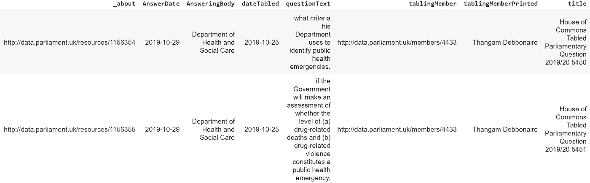
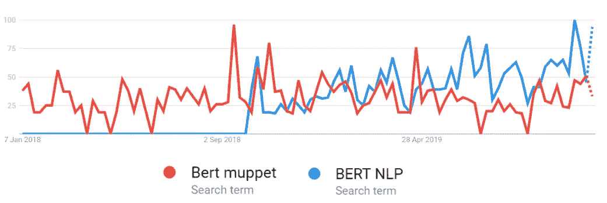
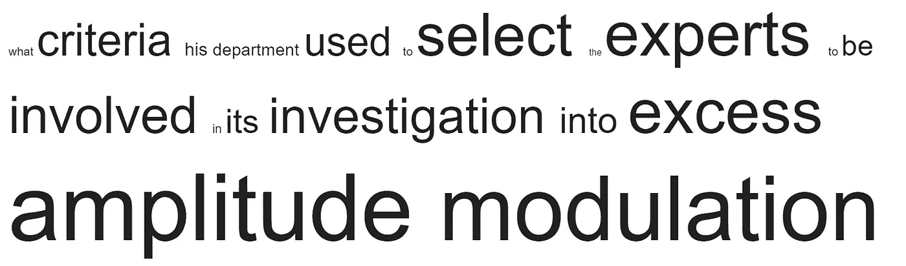
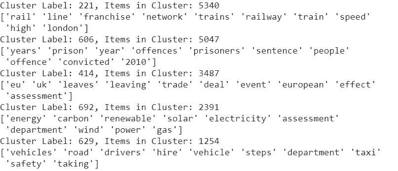
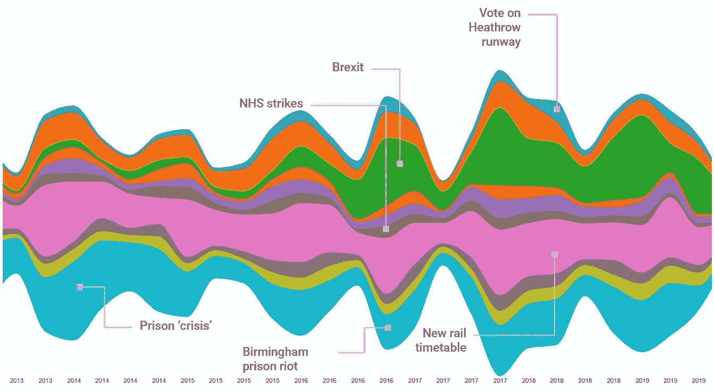
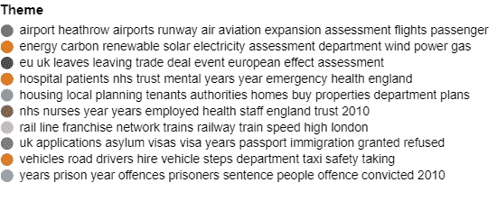

# 用数据科学理清英国政治

> 原文：<https://towardsdatascience.com/untangling-uk-politics-with-data-science-a5afe9a86923?source=collection_archive---------22----------------------->

## 我们能通过分析问题找到答案吗？

TL；在这篇文章中，我们使用 spaCy、BERT 和新颖的聚类算法提取了英国议会中讨论的关键主题


The House of Commons in the early 19th Century, it was around this time (1833) that the practice of giving a Minister notice of a question by printing it in the House’s Notice Paper of future business began

> "判断一个人要看他的问题，而不是他的回答。"
> 
> *伏尔泰*

在过去的三年里，英国政治变得令人困惑。除了高度动荡的政治环境之外，误导性信息在网上和社交媒体上的传播显著增加。

在本文中，我们将试图通过分析英国政治引擎源头的数据来“穿透”这种噪音；议会问题。

## 什么是议会问题？

议会问题是议员用来寻找信息或敦促采取行动的工具。他们要求部长们解释和维护他们部门的工作、政策决定和行动。[1]

这些问题可以使用 http://www.data.parliament.uk/[提供的 API 下载。](http://www.data.parliament.uk/)

从 API 下载所有问题、预处理和清理数据后，从 2013 年至今，我们剩下 255，000 个问题:



A sample of the data set for analysis

数据显示:

*   提出问题的议员
*   它所针对的部门
*   问题和答案的日期
*   问题本身的文本。

由于我们需要的大多数信息都包含在问题本身的文本中，我们需要找到一种方法来提取这些问题中传达的关键主题，然后才能更详细地分析这些主题。

**输入伯特**

模型在 NLP 中的发展速度之快令人惊讶。不仅新的和更强大的模型正在定期开发，开源社区也在不断进步，使得这些模型的使用越来越直接。

在本文中，我们将使用先进的 [BERT](https://ai.googleblog.com/2018/11/open-sourcing-bert-state-of-art-pre.html]) 模型来帮助我们从问题数据中提取信息。在过去的几个月里，这个模型的部署变得越来越简单，最近它被集成到了 spaCy 库中，使得在 NLP 管道中使用它变得很容易。

我们将使用 BERT 将单词转换为上下文相关的单词向量，然后我们可以对每个问题进行加权，以产生代表每个问题语义的向量。



2019, the year that NLP became more popular than the Muppets [2]

**1。用 BERT** 创建单词向量

spaCy NLP 库为我们做了大量的工作。它最近发布了对许多 transformer 模型的支持，这些模型允许最先进的功能，同时仍然使用简单的 spaCy API，这使得它非常受欢迎。只需几行代码就可以启动并运行 BERT:

```
!pip install spacy-transformers --quiet!python -m spacy download en_trf_bertbaseuncased_lg #requires the runtime to be restarted if using Colab...import spacy
import torchis_using_gpu = spacy.prefer_gpu()if is_using_gpu: torch.set_default_tensor_type("torch.cuda.FloatTensor")nlp = spacy.load("en_trf_bertbaseuncased_lg")
```

一旦我们加载了模型，使用*张量*属性从模型中获取单词向量就非常简单了:

```
doc = nlp("This is an example question")doc.tensor[0] #returns the vector for the first word (This)
```

**2。使用 TF-IDF 为每个问题创建一个加权向量**

我们现在有能力从 BERT 中获取问题中每个单词的向量，但我们现在需要一种方法来将这些向量组合成每个问题的单个向量。有不同的技术来做到这一点，平均和求和向量已被证明工作良好。

然而，我们在这里需要小心。伯特是一个非常强大的模型，但它不能读取我们的思想！从数据来看，回答问题的方式有不同的模式，例如:

*   *“他的部门过去采用什么标准…”*
*   *“她的部门正在采取什么措施来……”*
*   *“他的部门正在采取什么措施来……”*

如果我们不小心，我们的分析会被问题的结构而不是内容所迷惑。我们需要一种方法来过滤掉这些噪音，这样我们就可以把重点放在代表问题本身的单词上。

**TF-IDF 前来救援**

关于 TF-IDF 与词向量的结合，我之前已经写过[](/supercharging-word-vectors-be80ee5513d)**了，所以这里就不赘述了。这是一种简单却非常强大的聚合单词向量的方法，同时还能过滤掉噪音。**

**为了证明这个概念，我们来举个例子:**

```
import IPythontkn = tfidf.build_tokenizer()sent = df.questionText.values[236178].lower()
sent = tkn(sent)html=''for wrd in sent:  
   try:    
      weight = (tfidf.idf_[tfidf.vocabulary_[wrd]])*10
      print(weight/10)  
   except:    
      weight = 1    
      print('{} not found'.format(wrd))  
   html+='<span style="font-size:{}px">{}</span>'.format(weight,wrd) 
IPython.display.HTML(html)
```

**这从我们的数据框架中随机抽取一个问题，并对每个单词进行加权。然后将它添加到 HTML 中，这样我们就可以看到 TF-IDF 对每个单词的影响:**

****

**The results from TF-IDF. Notice how it is able to reduce the importance of ‘noisy’ words whilst amplifying words which have greater meaning to the question.**

**由此我们可以看出，这种方法在过滤噪声的同时放大更有见地的单词是非常有效的。**

**把这个和来自 spaCy 的 BERT 向量放在一起，我们得到下面的，它为每个问题创建一个向量，然后把这个向量保存到一个 numpy 数组中。**

```
import spacy
import torch
from sklearn.feature_extraction.text import TfidfVectorizer
import IPython
from tqdm import tqdmis_using_gpu = spacy.prefer_gpu()
if is_using_gpu:
   torch.set_default_tensor_type("torch.cuda.FloatTensor")nlp = spacy.load("en_trf_bertbaseuncased_lg")vectorizer = TfidfVectorizer(min_df=0.0,lowercase=True)
tfidf = vectorizer.fit(df.questionText.values)
tkn = tfidf.build_tokenizer()print('creating a lookup dictionary') #this speeds up the script significantly...tfidf_lookup = {}
for key,value in tfidf.vocabulary_.items():
   tfidf_lookup[key]=tfidf.idf_[value]vect = []for doc in tqdm(nlp.pipe(df.questionText.values,batch_size=5000)):
   weighted_doc_tensor = []
   try:
      for cnt, wrd_vec in enumerate(doc.tensor):
         word = doc[cnt].text
         try:
            weight = tfidf_lookup[word.lower()]
         except:
            weight = 0.5
         pass
         doc.tensor[cnt] = doc.tensor[cnt]*weight
      vect.append(np.mean(doc.tensor,axis=0))
   except:
      vect.append(np.zeros(768,))#if it is blank...
   passvect = np.vstack(vect)
np.save('question_vects_tfidf.npy', vect)
```

****3。分组问题以确定关键主题****

**我们现在有了 255，000 个问题的向量，我们可以通过使用降维和聚类的组合从这些向量中识别关键主题:**

****3.1 降维:UMAP****

**我以前使用过 [TSNE](/elmo-contextual-language-embedding-335de2268604) 来降低文档嵌入的维度，但是在本文中我想尝试 UMAP 算法。这类似于 TSNE，但有一个额外的好处，即保持数据的“宏观”结构不变，并识别本地集群。它也适用于大型数据集。一个 Python 库以优秀的[UMAP-学习](https://umap-learn.readthedocs.io/en/latest/)的形式提供。**

```
!pip install umap-learn --quietimport umapreducer = umap.UMAP(n_neighbors=25)y = reducer.fit_transform(vect)
```

**该库以符合数据的方式紧密遵循 Scikit Learn。在该算法中选择的邻居的数量可以用于平衡对局部聚类和数据集的整体结构的强调。为了创建对数据进行聚类的特性，我使用该参数的值 5 和 25 运行了该算法两次。**

****3.2 聚类:HDBSCAN****

**HDBSCAN 与 DBSCAN 相关。这两种算法都被设计成基于密度来寻找聚类，并且可以自动识别聚类的数量。此外，它们可以突出不属于任何聚类的离群点。**

*****注意:*** *在使用基于密度的聚类算法如 HDBSCAN 或 DBSCAN 时，使用 UMAP 或 TSNE 来降维可能是危险的。其原因是原始数据集的密度没有被保留[3]。因此，仔细审查这种方法的结果以确保所创建的集群符合分析的目标是很重要的。***

**HDBScan 的额外优势是能够处理不同密度的集群。与大多数聚类算法一样，调整参数(min_cluster_size 和 min_samples)更像是一门艺术，而不是科学，您需要检查结果并迭代以找到这些参数的最佳值:**

```
!pip install hdbscan --quietdb = hdbscan.HDBSCAN(min_cluster_size=40, min_samples=1).fit(df[['x_tfidf_umap_5','y_tfidf_umap_5','y_tfidf_umap_25','x_tfidf_umap_25']])labels = db.labels_n_clusters_ = len(set(labels)) - (1 if -1 in labels else 0)
n_noise_ = list(labels).count(-1)print('Estimated number of clusters: %d' % n_clusters_)
print('Estimated number of noise points: %d' % n_noise_)df['cluster'] = db.labels_
```

****3.3 获取集群标签****

**我们可以用 TF-IDF(再次！)来更好地理解集群是如何工作的。**

**通过查找每个聚类的关键词，我们不仅可以了解这些聚类代表什么，还可以为每个聚类生成一些用户友好的标签:**

```
from sklearn.feature_extraction.text import TfidfVectorizervectorizer = TfidfVectorizer(stop_words='english')
tfidf = vectorizer.fit_transform(df.questionText.values)totals = 0for cluster in df.cluster.value_counts()[0:10].index:
   stg = " ".join(df.loc[df.cluster==cluster].questionText.values)
   response = vectorizer.transform([stg])
   count = df.cluster.value_counts().loc[cluster]
   totals += count
   feature_array = np.array(vectorizer.get_feature_names())
   tfidf_sorting = np.argsort(response.toarray()).flatten()[::-1]
   n = 10
   print("Cluster Label: {}, Items in Cluster: {}".format(cluster,count))
   print(feature_array[tfidf_sorting][:n])
```

**这返回(去除噪声后的前 5 个聚类):**

****

**Success! We can clearly see that each cluster represents a specific political theme.**

**太棒了，我们已经成功地建立了一种将每一个项目聚集成核心主题的方法。**

## **将这一切结合在一起**

****

**Viewing the key themes over time we see that these these are very reactive to key events. Brexit (green) dominates from mid 2016 onward.**

****

**那么，这个练习告诉了我们关于英国政治的什么？随着时间的推移，对 10 大主题进行可视化显示，大多数问题都是针对当天的时事提出的。对 2016 年年中退出欧盟的大量关注并不令人惊讶，但图表显示了这在多大程度上扭曲了议会辩论，使卫生、能源和交通等话题黯然失色。**

## **未来的工作**

**当然，这只是触及了这个数据集所能做的事情的表面。此数据的其他可能用途包括:**

*   **根据议员在议会中提出的问题对他们进行剖析。**
*   **理解政府的机构是否反映了下议院辩论的焦点。**
*   **在议会提问之前预测问题。**

## **参考资料:**

**[1]来自 parliment . uk:[https://www . parliament . uk/documents/commons-information-office/P01 . pdf](https://www.parliament.uk/documents/commons-information-office/p01.pdf)**

**[2]谷歌趋势 2019 年 11 月 24 日**

**[3]https://umap-learn.readthedocs.io/en/latest/clustering.html**