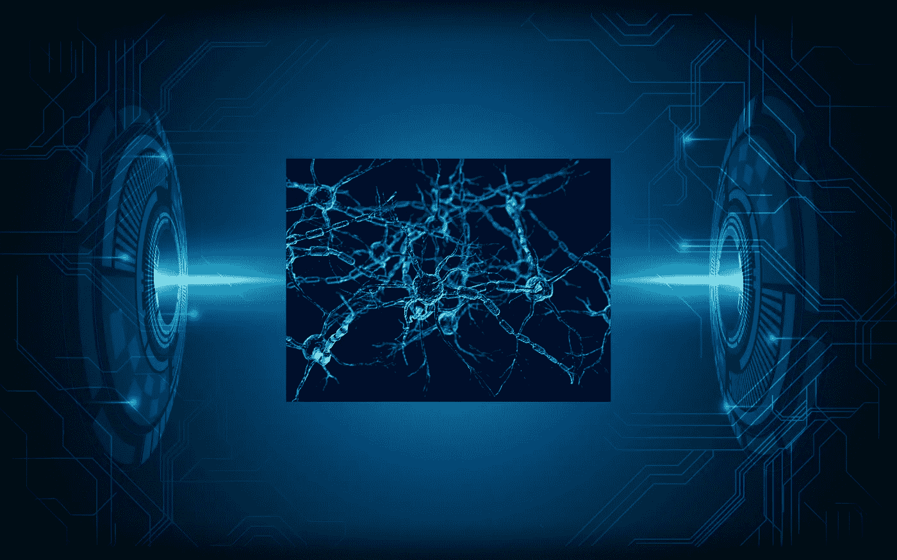

# 用深度显微镜揭示生物学

> 原文：<https://towardsdatascience.com/unveiling-biology-with-deep-microscopy-bcfbc39a02d6?source=collection_archive---------29----------------------->

## 人工智能引发的生命科学革命

Source: Shutterstock

随着历史上最重要的两项发明——望远镜和显微镜的发展，科学革命在 17 世纪初开始了。借助望远镜，伽利略将注意力转向天空，光学的进步促使罗伯特·胡克和安东尼·范·列文虎克在大约 1665 年首次将复合显微镜用作科学仪器。今天，我们正在见证显微镜领域的信息技术时代革命，深度学习算法推动了人工智能改变了一个又一个行业。

深度学习的一个重大突破出现在 2012 年，当时 Hinton 和他的同事[1]在 ImageNet 大规模视觉识别挑战赛( [ILSVRC](http://image-net.org/challenges/LSVRC/) )中揭示了深度卷积神经网络结合 GPU 进行图像分类的性能优势。在人工智能当前的创新和实施阶段，深度学习算法正在推动几乎所有计算机视觉密集型应用，包括自动驾驶汽车(交通、军事)、面部识别(零售、IT、通信、金融)、生物医学成像(医疗保健)、自动武器和瞄准系统(军事)以及自动化和机器人(军事、制造、重工业、零售)。

毫不奇怪，通过人工智能辅助的图像处理、分析和解释，显微镜领域的变革已经成熟。在生物学研究中，显微镜产生大量的图像数据；使用透射电子显微镜进行的一次实验可以生成一个包含超过 100 万亿字节图像的数据集[2]。如今可用的无数仪器和图像处理技术可以解析从单个分子到整个生物体的近 10 个数量级大小的结构，并在飞秒到秒的时间尺度上捕捉空间(3D)和时间(4D)动态。

深度学习算法正在解决广泛的适用于生物图像的计算机视觉问题。这些包括图像分类和图像分割；目标检测和跟踪；图像风格转换、彩色化和重建；图像超分辨率和图像合成。这些任务中有许多非常适合深度学习方法。超分辨率定位显微镜已经取得了惊人的成果，与标准协议相比，新开发的深度学习技术 ANNA-PALM 可以在更少的图像上执行超分辨率图像重建[3]。

生物成像中深度学习的另一个强有力的例子来自冷冻电子显微镜(cryo-EM)的应用，用于为结构生物学家产生 1 到 5 埃分辨率的分子模型。要了解 cryo-EM 技术的价值，只需描绘出病毒、酶和大分子复合物以及超分子组装体的精致 3D 模型。要生成一个原子尺度的模型，需要数万甚至数十万张图像，图像处理工作流程复杂，难以完全自动化。在一个称为粒子拾取的步骤中，需要选择数十万个粒子(用于表示所有方向)来识别分子图像，然后这些图像被共同用于构建结构。人工神经网络(CNN)现在显示出解决工作流程中这一令人生畏的部分的前景[4]。

涉及深度显微镜的研究可以利用商业应用中的架构进行图像分类和分割，这是生物应用中的两个主要用例。目前缺少的是带注释的训练数据集。因此，迁移学习在启动生物数据图像分类器方面发挥了重要作用[5，6]。例如，通过将在另一个(非生物)数据集上训练的图像分类器的最后一层替换为适合于新分类任务的图像分类器的最后一层，随后可以在更小的注释数据集上重新训练该模型。细胞认知浏览器([https://software.cellcognition-project.org/](https://software.cellcognition-project.org/)是一个基于 Python 的工具，用于通过深度学习对细胞表型进行分类。

图像分割的新模式正在出现，以预测和识别图像中的不同对象，如细胞、细胞核、细丝和所有类型的细胞边缘和边界。几个例子是:http://www.deepcell.org 的 DeepCell [、http://github.com/vanvalenlab/deepcell-tf 的](http://www.deepcell.org/)一个支持深度学习的单细胞分析的软件库【7】和 http://github.com/lmb-freiburg/Unet-Segmentation 的 U-Net [一个用于单细胞图像分割的 ImageJ 插件【8，9】。这两个软件库都将分割作为像素级分类任务，并为一组特征产生像素级预测。基于深度学习的分割正在对癌症研究产生影响，正如一种量化乳腺癌复杂肿瘤微环境中免疫细胞行为的优雅方法所显示的那样[10]。](http://github.com/lmb-freiburg/Unet-Segmentation)

深度学习的影响在神经科学领域表现得最为显著。许多与神经元电路、突触可塑性模型、网络的实时成像等相关的突出问题，正面临着拥有基于人工智能的方法的研究人员的挑战。

上周发表在《科学》杂志上的一篇具有里程碑意义的论文让人们得以一窥深度显微镜所带来的生物洞察力和发现的可能性。该研究小组的目标是使用 3D 电子显微镜重建位于小鼠皮层第 4 层内的一个小脑组织体积的整个连接模式——轴突、树突、突触前和突触后过程，尤其是突触。从一组总共 194 千兆字节数据的 3，400 幅图像中，分析管道生成了大量的信息，并导致了 89 个神经元的重建，其中连接矩阵由 34，221 个突触前过程和 11，400 个突触后过程组成。这个神经解剖学*的杰作*需要大约 100 名学生的众包努力，并使用几个人工智能算法来处理和生成结果。管道涉及 SegEM(使用 CNN 和分水岭)从 1500 万个体积片段生成特征；这些被输入连通性分类器 ConnectEM 和对象分类器 TypeEM(轴突、树突、棘头、神经胶质)。SynEM 用于对突触前和突触后片段进行分类。对输出进行的定量分析对神经元回路的形成产生了重要的见解，并描述了学习(即长期增强和长期抑郁)可能如何印在神经网络中。

深度显微镜正在为一个曾经主要由描述性研究驱动的领域提供新的实验范式。除了上面的例子，基于成像的人工智能驱动的协议也开始影响药物发现操作。递归制药(Recursion Pharmaceuticals)等公司正在形态分析中使用深度学习(称为基于图像的分析)，以识别与药物反应和疾病相关状况相关的生物特征和变量。

以类似的方式，通过 3D 电子显微镜研究实现的密集大脑区域重建开辟了一种可能性，即现在可以使用基于图像的分析来表征和预测连接组表型。例如，在环境或药物暴露后，在疾病状态下以及作为基因变化的结果，可以跟踪突触水平上神经回路的变化，并产生新的治疗方法。同样显而易见的是，对由此产生的连通性图的进一步探索可以阐明连通性规则，并作为一种测试大脑信息处理操作的数学模型的方法。我们可能会接近一个良性循环，深度显微镜的发现会导致新的人工神经网络架构，从而可以更深入地探索生物学。

参考

[1] A. Krizhevsky、I. Sutskever 和 G. Hinton，使用深度卷积神经网络的 ImageNet 分类(2012)，载于 *Proc。神经信息处理系统的进展 25*1090–1098

[2] E. Moen，D. Bannon，T. Kudo 等，细胞图像分析的深度学习(2019)，*Nature Methods*16:1233–1246【https://doi.org/10.1038/s41592-019-0403-1】T4

[3] W .欧阳，a .阿里斯托夫，m .勒莱克等，深度学习大规模加速超分辨率定位显微术(2018)*Nat bio technol***36，**460–468[https://www.nature.com/articles/nbt.4106](https://www.nature.com/articles/nbt.4106)

[4] T. Bepler，A. Morin，M. Rapp 等人，用于 cry 电子显微图中粒子拾取的正-无标记卷积神经网络。(2019)，*自然方法*16:1153–1160[https://doi.org/10.1038/s41592-019-0575-8](https://doi.org/10.1038/s41592-019-0575-8)

[5] W. Zhang，R. Li，T. Zeng 等，面向生物图像分析的基于深度模型的迁移和多任务学习(2016)， *IEEE Trans .大数据*

[6] N .鲍洛夫斯基、J. C .凯塞多、s .辛格等人，《利用通用深度卷积网络实现形态分析自动化》(2016 年)，预印本可在[https://www.biorxiv.org/content/](https://www.biorxiv.org/content/)early/2016/11/02/085118 获得

[7]达·范·汪妮等，深度学习实现活细胞成像实验中单个细胞的定量分析自动化，(2016)， *PLoS Comput。Biol* 。12，e1005177。doi:10.1371/journal.pcbi

[8] O. Ronneberger，P. Fischer 和 T. Brox，U-net:生物医学图像分割的卷积网络(2015)，载于*医学图像计算和计算机辅助干预-MICCAI 2015*计算机科学讲义，第 9351 卷。瑞士查姆:施普林格。

[9] T. Falk，D. Mai，R. Bensch 等人，U-Net:细胞计数、检测和形态测量的深度学习(2019)，*Nature Methods*16:67–70[https://doi.org/10.1038/s41592-018-0261-2](https://doi.org/10.1038/s41592-018-0261-2)

[10] L. Keren，M. Bosse，D. Marquez 等，多重离子束成像揭示的三阴性乳腺癌中的结构化肿瘤免疫微环境(2018)*Cell*174(6):1373–1387 . e19 . doi:10.1016/j . Cell . 2018 . 08 . 039

[11] A. Motta，M. Berning，K. M. Boergens 等人**，**体感皮层第 4 层的致密连接体重建(2019)， *Science* 366，eaay3134