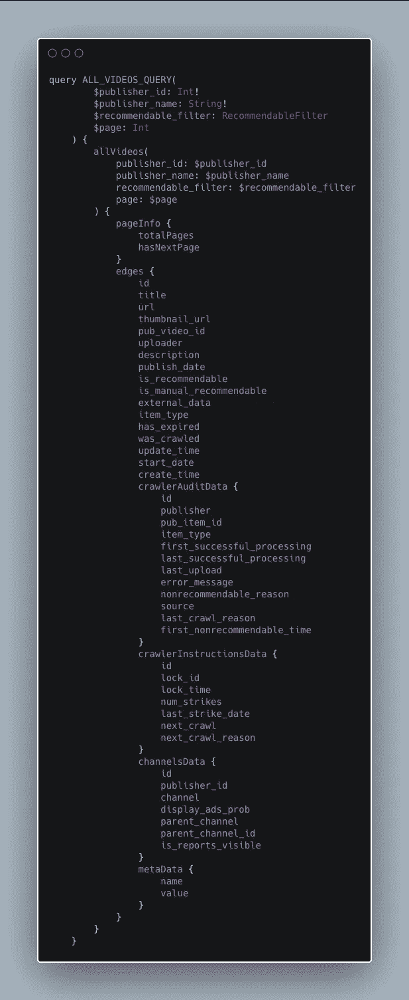

# 更新非本地客户端缓存中的特定查询并重新呈现数据

> 原文：<https://towardsdatascience.com/updating-apolloclient-cache-and-re-rendering-data-4537c11c6daf?source=collection_archive---------13----------------------->


使用 ApolloClient 的最大好处之一是开箱即用的自动内存缓存。当对数据进行分页时，这允许您返回到以前的页面，并且转换非常快。但是有时您不希望这些数据永远被缓存。有时候你希望能够清空缓存，从你的服务器上获取 ***新的*** 数据。您还希望这个触发一个 ***重新呈现*** 正在呈现该数据的任何组件。

# 我的问题

这是我最近在为公司开发数据可视化工具时发现自己处于的一种情况。我们有一个网络爬虫，它 24/7 爬行出版商的网页，并更新几个不同的数据库和表格。我们可以使用各种 regex、xpath 和元数据配置来操纵这个爬虫的行为，我们为每个发布者提供了这些配置。

我们面临的问题是，当对这些配置进行更改时，您希望能够看到您的更改在所有这些不同的数据库和表中的效果，这些数据库和表是由 crawler 更新的。以前，我们只是用大量的`JOIN`语句手动编写大量的 SQL 查询，以便在任何给定的时间点只查看我们需要的数据。这相当麻烦，有时真的会降低我们的速度。

因此，我构建了一个服务器，将所有这些数据库和各种表聚合成一个图(使用 Node.js、GraphQL、ApolloServer 和 MySQL)。然后我构建了一个 web 应用程序，它提供了大量的过滤器，我们可以使用这些过滤器只查看我们想要的数据(使用 Next.js 和 ApolloClient)。

因为我们从**出版商**那里**抓取**网站，这款应用被称为**酒吧抓取**。

它处理大量的数据。以下是一个示例查询:



前端面临的主要挑战(由于 ApolloClient 出色的内存缓存)是让用户能够随意更新数据*，这样他们就可以检查一些东西，对配置进行更改，然后看看效果如何。*

# ***挑战***

*搜索“清除阿波罗缓存”的方法并不是解决这个问题的好方法。不幸的是，我就是这么做的。*

*我了解到这样做是因为 Apollo 允许您访问缓存对象上的一个名为`resetStore()`的方法。该方法将清空整个缓存，并从服务器重新获取所有查询。我真的希望这能解决我的问题，因为它看起来很简单。*

*但事实并非如此，这让我很难过。*

*这不是为用例`resetStore()`构建的。这里的问题是它**不会触发重新渲染**，所以即使缓存中充满了新数据，用户也看不到它。我希望用户点击一个按钮，看到一个加载屏幕，然后看到新的数据。我也不想重置整个缓存，因为应用程序中的一些数据不会改变。*

# *以狗为例的解决方案*

*让我们假设有一个页面向我们展示了一只狗。我们的数据库里有一只狗，但是这只狗变了。也许他洗了个澡，也许他在泥土里打滚。但是他很活跃，他的属性经常变化。*

*通过最初的查询，Apollo 让事情变得如此简单。您可以访问一些具有类似于`loading`、`error`和`data`属性的状态。超级好看。它允许您编写这样的代码:*

*那太好了。可爱的开发者体验。*

*但是现在我们想用一个按钮刷新我们的狗。让我们给我们的 jsx 添加一个按钮:*

*那个按钮是做什么的？*

*事实证明，我们的`useQuery()`钩子也给了我们一个叫做`refetch()`的函数。这个功能太赞了。它允许您只刷新这一个查询的结果，或者甚至向它传递新的参数并获得结果。这解决了我之前提出的清除整个缓存的问题，但并没有为我们重新打开那个`loading`布尔值。因此，只有当数据提取完成时，它才会重新呈现。这对我来说是个问题，因为我需要我的用户知道他们的数据正在被重新加载，而不仅仅是信任这个按钮。有可能数据没有改变，在这种情况下，用户不会看到任何事情发生！*

*经过大量的黑客攻击，我发现阿波罗给了我们一个工具，当重取开始时触发我们的重渲染。这是由`useQuery()`钩子返回的`networkStatus`。要使用它，我们需要向钩子传递一个选项，告诉它在`networkStatus`改变时提醒我们(在重取时它会改变)。这个选项是`notifyOnNetworkStatusChange`。*

*现在我们可以说“如果网络状态是重新获取，显示加载组件”。其状态代码为`4`。因此，我们可以将其添加到我们的`loading`检查中:*

*现在让我们为调用`refetch()`函数的按钮创建一个点击处理程序:*

```
*import { useQuery } from '[@apollo/react-hooks](http://twitter.com/apollo/react-hooks)';
import Loading from './Loading';
import Error from './Error';
import Dog from './Dog';
import { DOG_QUERY } from '../lib/queries';export default () => {
  const { data, error, loading, refetch, networkStatus } = useQuery(
    DOG_QUERY,
    { notifyOnNetworkStatusChange: true }
  ); 

  if (loading || networkStatus === 4) return <Loading />;
  if (error) return <Error error={error} />;

  return (
    <>
      <button 
        type="button" 
        role="button"
        onClick={() => refetch()}
      >
        See what's new with the dog
      </button>
      <Dog dog={data.dog} />
    </>
  );
}*
```

*仅此而已。现在，当我们单击按钮时，我们将看到`<Loading />`组件，缓存将刷新，然后我们将在`<Dog />`组件中看到新的狗数据。*

# *就这样*

*我希望这对你有帮助。我知道我被困在这几个小时仅仅是因为我谷歌了错误的词。希望你不会遇到同样的问题！*

*欢迎在推特上关注我 [@sour_utley](https://twitter.com/sour_utley) 。*

*如果你(出于某种奇怪的原因)想看看我为我的公司制作的工具的回购，它住在[这里。](https://github.com/mrkutly/pubcrawl)此外，如果您对 Carbon 的 iframes 有任何问题，页面上的代码如下:*

```
*import { useQuery } from '[@apollo/react-hooks](http://twitter.com/apollo/react-hooks)';
import Loading from './Loading';
import Error from './Error';
import Dog from './Dog';
import { DOG_QUERY } from '../lib/queries';export default () => {
  const { data, error, loading, refetch, networkStatus } = useQuery(
    DOG_QUERY,
    { notifyOnNetworkStatusChange: true }
  ); 

  if (loading || networkStatus === 4) return <Loading />;
  if (error) return <Error error={error} />;

  return (
    <>
      <button 
        type="button" 
        role="button"
        onClick={() => refetch()}
      >
        See what's new with the dog
      </button>
      <Dog dog={data.dog} />
    </>
  );
}*
```

*再见！*