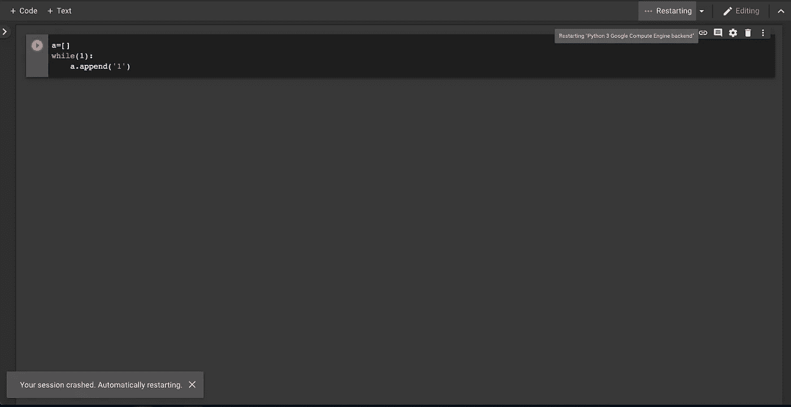
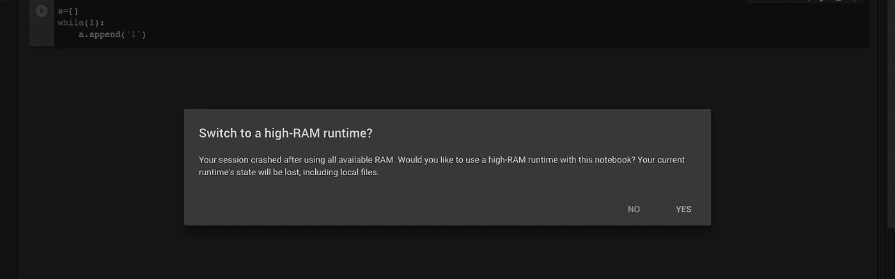
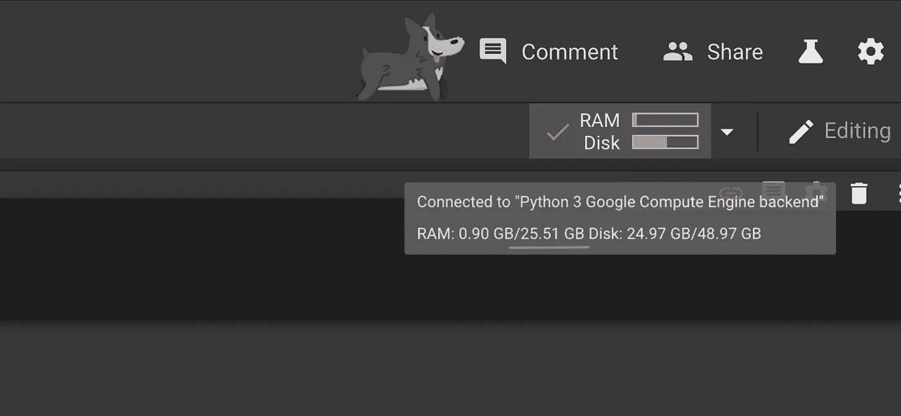

# 免费在 Google Colab 上升级您的内存

> 原文：<https://towardsdatascience.com/upgrade-your-memory-on-google-colab-for-free-1b8b18e8791d?source=collection_archive---------3----------------------->

## 将 12GB 限制增加到 25GB

oogle Colab 真的是天赐之物，为每个人的深度学习项目提供免费的 GPU 资源。然而，有时我确实发现缺乏记忆。但是不要担心，因为实际上有可能免费增加 Google Colab 上的内存，并为您的机器学习项目增加涡轮增压器！每个用户当前分配有 12 GB 的 RAM，但这不是一个固定的限制，您可以将其升级到 25GB。看来“天下没有免费的午餐”这句话在这种情况下并不成立…

因此，不再拖延，我将介绍如何免费从目前的 12GB 升级到 25GB。这个过程其实很简单，只需要 3 行代码！连接到运行时后，只需键入以下代码片段:

```
a = []
while(1):
    a.append(‘1’)
```

*在* [*Github*](https://github.com/googlecolab/colabtools/issues/253#issuecomment-551056637) *上为这段代码片段鸣谢 klazaj！*

就是这样——多简单啊！简单地执行代码块，然后坐下来等待。大约一分钟后，您将收到来自 Colab 的通知，说“您的会话崩溃了”(相信我，你真的会很高兴看到这条消息)。



You will receive a message on the bottom left side of your screen saying your session has crashed

接下来会出现一个屏幕，询问您是否想切换到高 RAM 运行时。



Yes, definitely more RAM please!

点击是，你将获得 25GB 的内存。太棒了！



Notice the new 25.51 GB limit. (And yes, Corgi Mode!)

当然，让我们都负起责任，用好谷歌好心为我们提供的这些额外的内存。我非常感谢谷歌为我们提供了这个免费的平台来运行我们的机器学习和深度学习项目。我从这项免费服务中受益匪浅，并将永远感激不尽！

这个帖子到此为止。祝每个人在机器学习的努力中取得巨大成功！

这篇文章也发表在我的博客里。