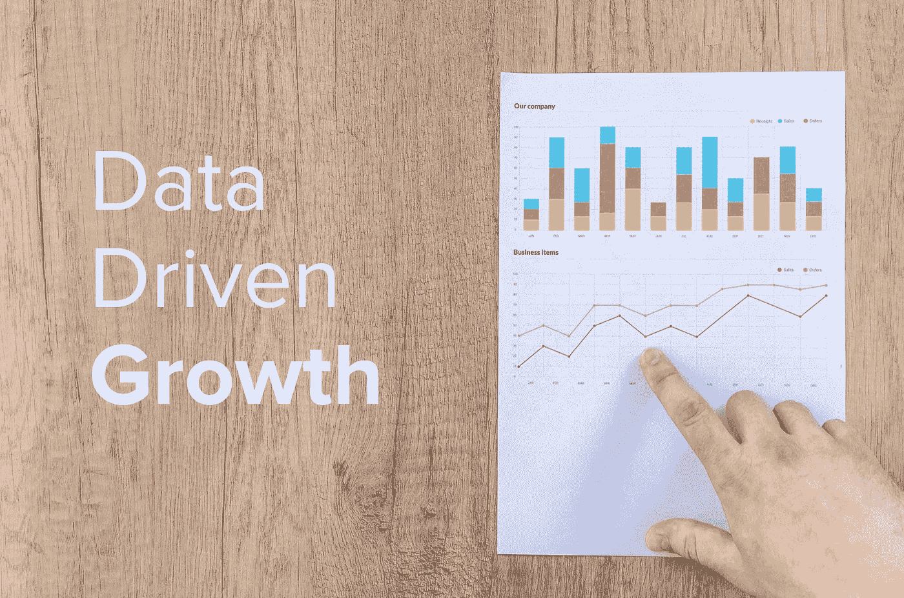
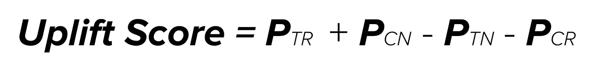
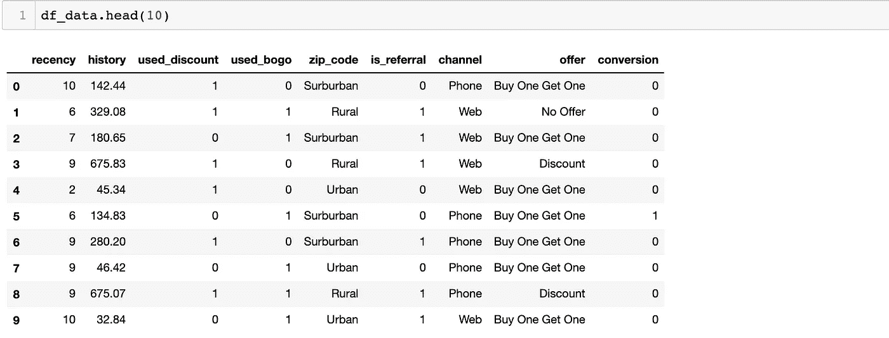
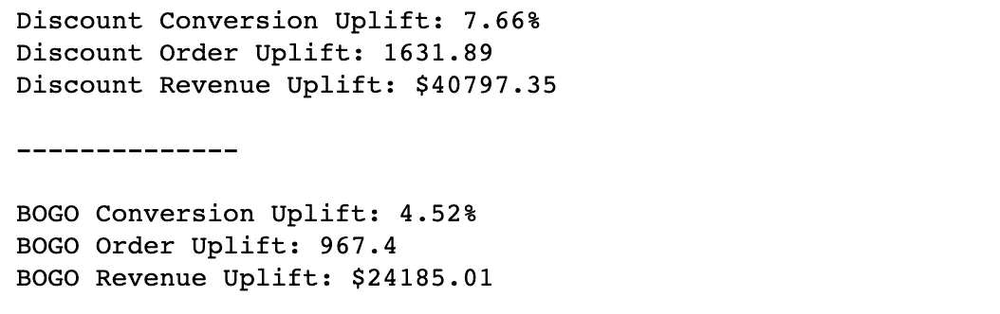
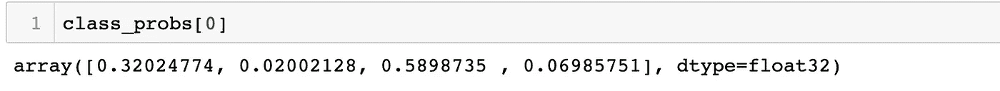
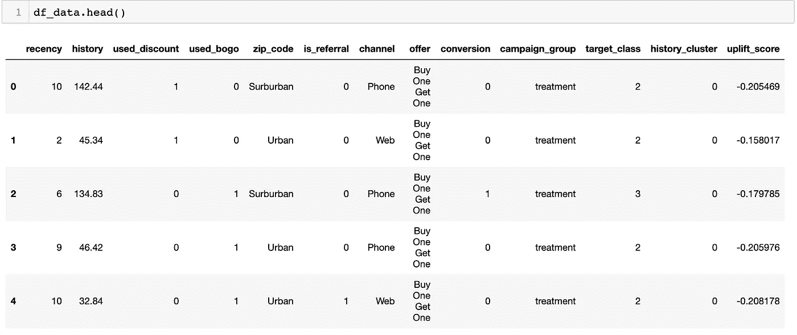

# 隆起建模

> 原文：<https://towardsdatascience.com/uplift-modeling-e38f96b1ef60?source=collection_archive---------2----------------------->



## [使用 Python 实现数据驱动的增长](https://towardsdatascience.com/tagged/data-driven-growth)

## 最大化营销活动的增量回报

这一系列文章旨在解释如何以一种简单的方式使用 Python，通过将预测方法应用于您的所有行动来推动您公司的发展。它将是编程、数据分析和机器学习的结合。

我将在以下九篇文章中讨论所有主题:

1- [了解你的衡量标准](/data-driven-growth-with-python-part-1-know-your-metrics-812781e66a5b)

2- [客户细分](/data-driven-growth-with-python-part-2-customer-segmentation-5c019d150444)

3- [客户终身价值预测](/data-driven-growth-with-python-part-3-customer-lifetime-value-prediction-6017802f2e0f)

4- [流失预测](/churn-prediction-3a4a36c2129a)

[5-预测下一个购买日](/predicting-next-purchase-day-15fae5548027)

[6-预测销售额](/predicting-sales-611cb5a252de)

[7-市场反应模型](/market-response-models-baf9f9913298)

**8-隆起建模**

[9- A/B 测试设计和执行](/a-b-testing-design-execution-6cf9e27c6559)

文章将有自己的代码片段，使您可以轻松地应用它们。如果你是编程的超级新手，你可以在这里很好地介绍一下 [Python](https://www.kaggle.com/learn/python) 和 [Pandas](https://www.kaggle.com/learn/pandas) (一个我们将在任何事情上使用的著名库)。但是仍然没有编码介绍，您可以学习概念，如何使用您的数据并开始从中产生价值:

> 有时候你必须先跑，然后才能走——托尼·斯塔克

作为先决条件，确保你的电脑上安装了 J [upyter Notebook](https://jupyter.readthedocs.io/en/latest/install.html) 和 P [ython](https://www.python.org/downloads/) 。代码片段只能在 Jupyter 笔记本上运行。

好吧，我们开始吧。

# 第 8 部分:隆起建模

成长黑客最关键的工作之一是尽可能高效。首先你需要**省时**。这意味着你必须快速构思、实验、学习和重复。第二，你需要是**性价比**。它意味着给定的预算/时间/努力带来最大的回报。

[细分](/data-driven-growth-with-python-part-2-customer-segmentation-5c019d150444)帮助成长型黑客提高转化率，从而更具成本效益。但是想象一下这样一种情况，你将要发起一个促销活动，并且你知道你想要针对哪个细分市场。你需要把报价发给每个人吗？

答案是否定的。在你目前的目标群体中，无论如何都会有顾客购买。给你升职会让你失去自我。我们可以根据这种方法对细分市场进行如下总结:

*   治疗响应者:只有收到报价才会购买的顾客
*   **处理无响应者:**无论如何都不会购买的客户
*   **控制响应者:**无报价购买的客户
*   **控制不响应者:**如果客户没有收到报价，他们将不会购买

画面很明显。你需要瞄准治疗反应者( **TR** )和控制无反应者( **CN** )。因为除非你出价，否则他们不会购买，所以这些团体正在促销活动中提升你的地位。另一方面，你需要避免针对治疗无反应者( **TN** )和对照反应者( **CR** )。你不会从针对 TN 和 CN 中获益，CN 会让你自相残杀。

还有最后一件简单的事情要做。我们需要确定哪些客户属于哪个类别。答案是隆起建模。它有两个简单的步骤:

1-预测所有客户在每个组中的概率:我们将为此建立一个多分类模型。

2-我们将计算提升分数。提升分数的公式为:



我们将被 **TR** 和 **CN** 的概率相加，减去落入其他桶的概率。更高的分数意味着更高的提升。

好的，让我们看看如何用一个例子来实现它。我们将在[上一篇文章](/market-response-models-baf9f9913298)中使用相同的数据集，您可以在这里 **找到 [**。**](https://gist.github.com/karamanbk/ef1a118592e2f7954e5bb582e09bdde3)**

我们从导入我们需要的库和函数开始:

然后我们将导入我们的数据:

```
df_data = pd.read_csv('response_data.csv')
df_data.head(10)
```



正如您在[上一篇文章](/market-response-models-baf9f9913298)中回忆的那样，我们有收到折扣和买一送一优惠的客户的数据，以及他们的反应。我们还有一个对照组，没有收到任何东西。

列描述如下:

*   最近:自上次购买以来的月数
*   历史:历史采购的价值
*   used_discount/used_bogo:指示客户是否使用了折扣或先买一送一
*   zip_code:邮政编码的分类，如郊区/城市/农村
*   is_referral:指示客户是否是从推荐渠道获得的
*   渠道:客户使用的渠道，电话/网络/多渠道
*   报价:发送给客户的报价，折扣/买一送一/无报价

在构建模型之前，让我们应用我们的**calc _ upgrade**函数来查看作为基准的该活动的当前提升:

```
calc_uplift(df_data)
```



折扣的转换提升为 7.66%，买一送一(BOGO)的转换提升为 4.52%。

接下来，我们将开始构建我们的模型。

## **预测抬升得分的多分类模型**

目前，我们的标签是客户是否转换(1 或 0)。我们需要为 **TR** 、 **TN** 、 **CR、**和 **CN 创建四个类。**我们知道收到折扣和 bogo 优惠的客户是治疗，其余的是控制。让我们创建一个 **campaign_group** 列来显示这些信息:

```
df_data['campaign_group'] = 'treatment'
df_data.loc[df_data.offer == 'No Offer', 'campaign_group'] = 'control'
```

太好了，现在我们需要创建我们的新标签:

```
df_data['target_class'] = 0 #CN
df_data.loc[(df_data.campaign_group == 'control') & (df_data.conversion > 0),'target_class'] = 1 #CR
df_data.loc[(df_data.campaign_group == 'treatment') & (df_data.conversion == 0),'target_class'] = 2 #TN
df_data.loc[(df_data.campaign_group == 'treatment') & (df_data.conversion > 0),'target_class'] = 3 #TR
```

在本例中，类的映射如下:

*   0 ->控制无响应者
*   1 ->控制响应者
*   2 ->治疗无反应者
*   3 ->治疗响应者

在训练我们的模型之前，有一个小的特征工程步骤。我们将从**历史**列创建聚类，并应用 **get_dummies** 将分类列转换为数字列:

```
#creating the clusters
kmeans = KMeans(n_clusters=5)
kmeans.fit(df_data[['history']])
df_data['history_cluster'] = kmeans.predict(df_data[['history']])#order the clusters
df_data = order_cluster('history_cluster', 'history',df_data,True)#creating a new dataframe as model and dropping columns that defines the label
df_model = df_data.drop(['offer','campaign_group','conversion'],axis=1)#convert categorical columns
df_model = pd.get_dummies(df_model)
```

让我们拟合我们的模型，并获得每一类的概率:

```
#create feature set and labels
X = df_model.drop(['target_class'],axis=1)
y = df_model.target_class#splitting train and test groups
X_train, X_test, y_train, y_test = train_test_split(X, y, test_size=0.2, random_state=56)#fitting the model and predicting the probabilities
xgb_model = xgb.XGBClassifier().fit(X_train, y_train)
class_probs = xgb_model.predict_proba(X_test)
```

变量 **class_probs** 拥有每个客户的概率。让我们来看一个例子:



对于该特定客户，我们可以将概率映射如下:

*   中国:32%
*   CR: 2%
*   总人口:58.9%
*   TR: 6.9%

因此，该客户的提升分数为:

> 0.32+0.069-0.02-0.589 =**-0.22**

让我们将此应用于所有用户，并计算提升分数:

```
#probabilities for all customers
overall_proba = xgb_model.predict_proba(df_model.drop(['target_class'],axis=1))#assign probabilities to 4 different columns
df_model['proba_CN'] = overall_proba[:,0] 
df_model['proba_CR'] = overall_proba[:,1] 
df_model['proba_TN'] = overall_proba[:,2] 
df_model['proba_TR'] = overall_proba[:,3]#calculate uplift score for all customers
df_model['uplift_score'] = df_model.eval('proba_CN + proba_TR - proba_TN - proba_CR')#assign it back to main dataframe
df_data['uplift_score'] = df_model['uplift_score']
```

通过运行上面的代码，我们在主数据帧中添加了一个**upgrade _ score**列，如下所示:



是时候检查拥有这个模型最关键的部分了。模型真的有效吗？评价隆起建模的真实性能有点困难。我们将检查上升分数分位数之间的上升是如何变化的，以查看我们是否可以在现实生活中使用该模型。

## 模型评估

为了评估我们的模型，我们将创建两个不同的组，并将它们与我们的基准进行比较。组包括:

1-高提升分数:客户的提升分数大于第三个分位数

2-提升得分低:客户的提升得分< 2nd quantile

We are going to compare:

*   Conversion uplift
*   Revenue uplift per target customer to see if our model can make our actions more efficient.

Here is our benchmark for the discount campaign.

```
Total Targeted Customer Count: 21307
Discount Conversion Uplift: 7.66%
Discount Order Uplift: 1631.89
Discount Revenue Uplift: $40797.35
Revenue Uplift Per Targeted Customer: $1.91
```

Let’s create the first group and see the numbers:

```
df_data_lift = df_data.copy()
uplift_q_75 = df_data_lift.uplift_score.quantile(0.75)
df_data_lift = df_data_lift[(df_data_lift.offer != 'Buy One Get One') & (df_data_lift.uplift_score > uplift_q_75)].reset_index(drop=True)#calculate the uplift
calc_uplift(df_data_lift)**results:** User Count: 5282
Discount Conversion Uplift: 12.18%
Discount Order Uplift: 643.57
Discount Revenue Uplift: $16089.36
Revenue Uplift Per Targeted Customer: $3.04
```

The results are great. Revenue uplift per target customer is **57%** 更高，我们很容易看到目标群体的 **25%** 贡献了 **40%** 的收入提升。

我们将检查提升分数较低的组的相同数字:

```
df_data_lift = df_data.copy()
uplift_q_5 = df_data_lift.uplift_score.quantile(0.5)
df_data_lift = df_data_lift[(df_data_lift.offer != 'Buy One Get One') & (df_data_lift.uplift_score < uplift_q_5)].reset_index(drop=True)#calculate the uplift
calc_uplift(df_data_lift)**results:** User Count: 10745
Discount Conversion Uplift: 5.63%
Discount Order Uplift: 604.62
Discount Revenue Uplift: $15115.52
Revenue Uplift Per Targeted Customer: $1.4
```

正如预期的那样，每个目标客户的收入增长降至 **$1.4** 。此外，该集团有 **50%** 的目标客户贡献了 **37%** 的收入提升。

通过使用这种模式，我们可以通过以下方式轻松提高营销活动的效率:

*   根据提升分数锁定特定细分市场
*   根据客户的提升分数尝试不同的优惠

在下一篇文章中，我将解释增长黑客的核心要素之一: [**A/B 测试**](/a-b-testing-design-execution-6cf9e27c6559) **。这将是我们这个系列的最后一篇文章。**

你可以在这里找到这篇文章[的 Jupyter 笔记本。](https://gist.github.com/karamanbk/c7019ecbd32ab7370475727c0bf500e9)

需要帮助来发展你的公司吗？在此与我预约免费课程。