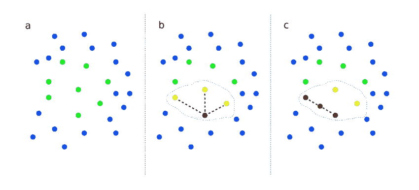
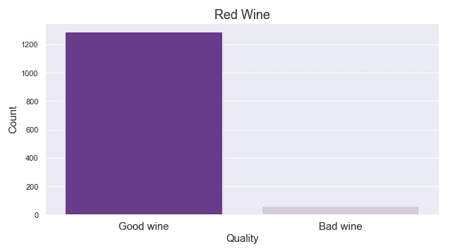

# 使用 SMOTE 对分类项目进行上采样

> 原文：<https://towardsdatascience.com/upsampling-with-smote-for-classification-projects-e91d7c44e4bf?source=collection_archive---------15----------------------->

## 或者我是如何学会开始担心阶级不平衡的



[https://www.researchgate.net/figure/Graphical-representation-of-the-SMOTE-algorithm-a-SMOTE-starts-from-a-set-of-positive_fig2_317489171](https://www.researchgate.net/figure/Graphical-representation-of-the-SMOTE-algorithm-a-SMOTE-starts-from-a-set-of-positive_fig2_317489171)

你是否曾经对自己说:“世界上没有足够的坏酒。”？

真的吗？只有我吗？好吧，我应该解释一下。我最近在处理一个葡萄酒数据集的分类问题。基本上，我有葡萄酒的化学成分值和平均用户评级，表面上是 1-10 的评级尺度，10 是最高的。

现在看来，人们并不真的很擅长分辨高档酒和廉价酒。这让我的前提变得非常简单:确定对大多数人来说尝起来像醋的葡萄酒，其他任何葡萄酒对大多数餐馆来说都很好。所以我把“坏”酒(在这个实验中，那些评分为 3 和 4 的)和“好”酒(其他的)区分开来。

但是有一个问题:我没有喝足够的烈酒。



Oh bother.

我的红酒数据库中只有 61 种“坏”酒，而有 1286 种“好”酒。“好”和“坏”的比例是 21:1。事实上，我的模型很可能每次都简单地预测多数类。我需要找到一种方法来平衡这些课程。要是以前有人碰到过这个问题就好了…

对，当然。每个数据科学家都遇到过这个问题。我知道。答案显然是重新采样。

**重采样与合成采样**

首先简单介绍一下重采样。谈到重采样，基本上有两大阵营:过采样和欠采样。欠采样是从多数类(在这种情况下是“好”葡萄酒)中随机选择观察值的过程，以便它具有与少数类相等数量的观察值(例如，我最终得到 61 个“好”葡萄酒和 61 个“坏”葡萄酒)。这在我的情况下不起作用，因为欠采样意味着我会丢失大部分观察结果，从而丢失我的信息。

那么过采样。过采样是指我们为少数类创建新的观察值，这些观察值在我们现有的数据中并不存在。通常，这是通过从少数类中复制观测值并将其添加到数据集中来实现的，因此您可以增加少数类的大小。

好消息是，您的模型将了解更多关于少数民族的信息，而不仅仅是针对给定的观察预测多数民族。坏消息是，它也可能会过度适应那些你已经重复多次的观察的特征。这就是 SMOTE 的用武之地。

**击杀**

SMOTE 代表合成少数过采样技术。SMOTE 执行与基本重采样相同的基本任务(为少数类创建新的数据点)，但它不是简单地复制观测值，而是沿着随机选择的点及其最近邻创建新的观测值。基本上，您是在模拟数据中的一些额外变化(在您的少数类的既定范围内)，减少了过度拟合的危险(尽管没有消除)。

下一个问题(对我来说也是一个大问题)是我们应该把少数民族班级扩大到多大？要回答这个问题，我需要思考我在尝试优化我的模型是为了什么。在我的例子中，我试图正确地识别“坏”酒。我不介意错误地将一些实际上还不错的葡萄酒归类为“劣质”，因为世界上有很多葡萄酒可供选择，但我想确保我们找到了劣质酒。这意味着我需要优化召回，以避免假阴性。

现在我知道我在优化什么了，我应该追求什么样的多数:少数比例？我看过很多在少数和多数类之间建立 1:1 关系的教程，但这意味着 1000+新的综合观察。在大量阅读和一些实验之后，我最终得到了一个占最终完整数据集 15%的少数民族班级。

下面是一些代码！

这大概就是你要找的。下面是实际执行上采样的几个函数。请注意，这应该在您完成培训/测试分割后进行。首先，我们将这些类分开:

```
def resamplingDataPrep(X_train, y_train, target_var): 
    # concatenate our training data back together
    resampling = X_train.copy()
    resampling[target_var] = y_train.values
    # separate minority and majority classes
    majority_class = resampling[resampling[target_var]==0]
    minority_class = resampling[resampling[target_var]==1]
    # Get a class count to understand the class imbalance.
    print('majority_class: '+ str(len(majority_class)))
    print('minority_class: '+ str(len(minority_class)))
    return majority_class, minority_class
```

然后执行上采样本身:

```
def upsample_SMOTE(X_train, y_train, ratio=1.0):
    """Upsamples minority class using SMOTE.
    Ratio argument is the percentage of the upsampled minority class in relation
    to the majority class. Default is 1.0
    """
    sm = SMOTE(random_state=23, sampling_strategy=ratio)
    X_train_sm, y_train_sm = sm.fit_resample(X_train, y_train)
    print(len(X_train_sm), len(y_train_sm))
    return X_train_sm, y_train_sm
```

就是这样！

[击打纸张](https://arxiv.org/pdf/1106.1813.pdf)