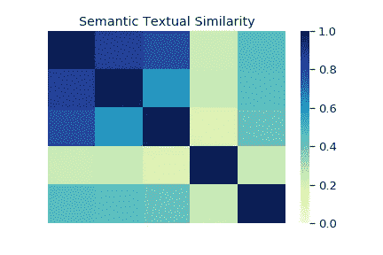

# Google 的通用句子编码器在生产中的用例

> 原文：<https://towardsdatascience.com/use-cases-of-googles-universal-sentence-encoder-in-production-dd5aaab4fc15?source=collection_archive---------3----------------------->



在自然语言处理(NLP)中建立任何深度学习模型之前，文本嵌入起着主要作用。文本嵌入将文本(单词或句子)转换成数字向量。

为什么我们要把文本转换成向量？

向量是特定维度的数字数组。一个 5×1 大小的向量包含 5 个数，我们可以把它看作 5D 空间中的一个点。如果有两个 5 维的向量，它们可以被认为是 5D 空间中的两点。因此，我们可以根据这两个向量之间的距离来计算它们的远近。

因此，在机器学习的研究中，大量的努力被投入到将数据转换成向量中，因为一旦数据被转换成向量，我们就可以通过计算它们的距离来判断两个数据点是否相似。像 Word2vec 和 Glove 这样的技术是通过将单词转换成矢量来实现的。因此“猫”的对应向量将比“鹰”更接近“狗”。但是在嵌入一个句子时，需要在这个向量中捕获整个句子的上下文以及单词。这就是“通用句子编码器”的用武之地。

通用语句编码器将文本编码成高维向量，这些向量可用于文本分类、语义相似性、聚类和其他自然语言任务。预训练的通用句子编码器在 [Tensorflow-hub 公开提供。](https://tfhub.dev/)它有两种变化，即一种用**变压器编码器**训练，另一种用**深度平均网络(DAN)** 训练。这两者在准确性和计算资源需求之间有一个折衷。虽然具有变换器编码器的那个具有更高的精度，但是它在计算上更加密集。使用 DNA 编码的方法在计算上花费较少，并且准确性也稍低。

这里，我们将使用**变压器编码器**版本。在 5 GB ram 实例中，它与其他 5 个深度学习模型一起运行时，对我们来说效果很好。此外，我们可以使用这个版本的通用语句编码器在嵌入级别训练一个具有 150 万数据的分类器。我遇到的通用句子编码器的几个用例是:

1.  作为深度学习模型开始时的嵌入层。
2.  通过寻找语义相似的句子来执行分类。
3.  在分析之前去掉重复的句子或短语。

让我们看看如何使用 Tensorflow-hub 上提供的预训练通用句子编码器，用于 python 中的上述用例。

首先，让我们导入所需的库:

```
import tensorflow as tf
import tensorflow_hub as hub
```

在生产中使用时，我们需要将预先训练好的通用语句编码器下载到本地，这样我们每次调用它时都不会被下载。

```
#download the model to local so it can be used again and again
!mkdir ../sentence_wise_email/module/module_useT
# Download the module, and uncompress it to the destination folder. 
!curl -L "[https://tfhub.dev/google/universal-sentence-encoder-large/3?tf-hub-format=compressed](https://tfhub.dev/google/universal-sentence-encoder-large/3?tf-hub-format=compressed)" | tar -zxvC ../sentence_wise_email/module/module_useT
```

在这里，”../sentence _ wise _ email/module/module _ useT”是下载句子编码器文件的文件夹。该编码器优化了大于单词长度的文本，因此可以应用于句子，短语或短段落。

例如(官方网站示例):

```
embed = hub.Module("../sentence_wise_email/module/module_useT")# Compute a representation for each message, showing various lengths supported.
word = "Elephant"
sentence = "I am a sentence for which I would like to get its embedding."
paragraph = (
    "Universal Sentence Encoder embeddings also support short paragraphs. "
    "There is no hard limit on how long the paragraph is. Roughly, the longer "
    "the more 'diluted' the embedding will be.")
messages = [word, sentence, paragraph]# Reduce logging output.
tf.logging.set_verbosity(tf.logging.ERROR)with tf.Session() as session:
    session.run([tf.global_variables_initializer(), tf.tables_initializer()])
    message_embeddings = session.run(embed(messages))for i, message_embedding in enumerate(np.array(message_embeddings).tolist()):
        print("Message: {}".format(messages[i]))
        print("Embedding size: {}".format(len(message_embedding)))
        message_embedding_snippet = ", ".join((str(x) for x in        message_embedding[:3]))
        print("Embedding[{},...]\n".
                   format(message_embedding_snippet))
```

它给出的输出:

```
Message: Elephant
Embedding size: 512
Embedding: [0.04498474299907684, -0.05743394419550896, 0.002211471786722541, ...]

Message: I am a sentence for which I would like to get its embedding.
Embedding size: 512
Embedding: [0.05568016692996025, -0.009607920423150063, 0.006246279925107956, ...]

Message: Universal Sentence Encoder embeddings also support short paragraphs. There is no hard limit on how long the paragraph is. Roughly, the longer the more 'diluted' the embedding will be.
Embedding size: 512
Embedding: [0.03874940797686577, 0.0765201598405838, -0.0007945669931359589, ...]
```

可以看出，无论是单词、句子还是短语，句子编码器都能够给出大小为 512 的嵌入向量。

**如何在 Rest API 中使用**

在 Rest API 中使用它时，您必须多次调用它。一次又一次地调用模块和会话将会非常耗时。(在我们的测试中，每次通话大约需要 16 秒)。可以做的一件事是调用模块并在开始时创建会话，然后继续重用它。(第一次呼叫需要大约 16s，然后连续呼叫需要大约. 3s)。

```
#Function so that one session can be called multiple times. 
#Useful while multiple calls need to be done for embedding. 
import tensorflow as tf
import tensorflow_hub as hub
def embed_useT(module):
    with tf.Graph().as_default():
        sentences = tf.placeholder(tf.string)
        embed = hub.Module(module)
        embeddings = embed(sentences)
        session = tf.train.MonitoredSession()
    return lambda x: session.run(embeddings, {sentences: x})embed_fn = embed_useT('../sentence_wise_email/module/module_useT')
messages = [
    "we are sorry for the inconvenience",
    "we are sorry for the delay",
    "we regret for your inconvenience",
    "we don't deliver to baner region in pune",
    "we will get you the best possible rate"
]
embed_fn(messages)
```

输出是一个 5*512 维的矩阵。(每个句子是一个大小为 512 的向量)。因为这些值是归一化的，所以编码的内积可以被视为相似性矩阵。

```
encoding_matrix = embed_fn(messages)
import numpy as np
np.inner(encoding_matrix, encoding_matrix)
```

输出是:

```
array([[1\.        , 0.87426376, 0.8004891 , 0.23807861, 0.46469775],
       [0.87426376, 1.0000001 , 0.60501504, 0.2508136 , 0.4493388 ],
       [0.8004891 , 0.60501504, 0.9999998 , 0.1784874 , 0.4195464 ],
       [0.23807861, 0.2508136 , 0.1784874 , 1.0000001 , 0.24955797],
       [0.46469775, 0.4493388 , 0.4195464 , 0.24955797, 1.0000002 ]],
      dtype=float32)
```

从这里可以看出，“我们对给您带来的不便感到抱歉”和“我们对延迟感到抱歉”之间的相似度是 0.87(第 1 行，第 2 列)，而“我们对给您带来的不便感到抱歉”和“我们将为您提供尽可能好的价格”之间的相似度是 0.46(第 1 行，第 5 列)，这很惊人。还有其他方法可以从编码中找到相似性得分，如余弦相似性、曼哈顿距离等。(文末提到的我的 Github repo 里有代码)。

**删除重复文本**

在开发问答验证系统时，一个主要问题是回答语句的重复。遍历我们的可用数据，我们发现语义相似性得分> 0.8(通过上述编码的内积计算)的句子实际上是重复语句，因此我们删除了它们。

```
#It takes similarity matrix (generated from sentence encoder) as input and gives index of redundant statements
def redundant_sent_idx(sim_matrix):
    dup_idx = [] 
    for i in range(sim_matrix.shape[0]):
        if i not in dup_idx:
            tmp = [t+i+1 for t in list(np.where( sim_matrix[i][i+1:] > 0.8 )[0])]
            dup_idx.extend(tmp)
    return dup_idx
#indexes of duplicate statements.
dup_indexes  = redundant_sent_idx(np.inner(encoding_matrix,
                                           encoding_matrix))unique_messages = np.delete(np.array(messages), dup_indexes)
```

独特的信息是:

```
array(['we are sorry for the inconvenience',
       "we don't deliver to baner region in pune",
       'we will get you the best possible rate'], dtype='<U40')
```

基本上，它放弃了陈述“我们为延迟感到抱歉”和“我们为你的不便感到抱歉”,因为它们是第一句的重复。

**通过查找语义相似的句子进行分类**

在构建答案评估系统时，我们遇到了检测后续语句的问题。但是没有足够的数据来训练一个统计模型。多亏了通用句子编码器，我们可以解决这个问题。我们采用的方法是，创建一个所有可用数据的编码矩阵。然后获取用户输入的编码，看是否与任何可用数据的相似度超过 60%，以此作为后续。简单的问候标识可以是:

```
greets = ["What's up?",
 'It is a pleasure to meet you.',
 'How do you do?',
 'Top of the morning to you!',
 'Hi',
 'How are you doing?',
 'Hello',
 'Greetings!',
 'Hi, How is it going?',
 'Hi, nice to meet you.',
 'Nice to meet you.']
greet_matrix = embed_fn(greets)
test_text = "Hey, how are you?"
test_embed = embed_fn([test_text])
np.inner(test_embed, greet_matrix)
sim_matrix  = np.inner(test_embed, greet_matrix)
if sim_matrix.max() > 0.8:
    print("it is a greetings")
else:
    print("it is not a greetings")
```

[](https://github.com/sambit9238/Deep-Learning/blob/master/tensorflow_hub_useT.ipynb) [## sambit 9238/深度学习

### 深度学习技术在自然语言处理、计算机视觉等领域的实现。-sambit 9238/深度学习

github.com](https://github.com/sambit9238/Deep-Learning/blob/master/tensorflow_hub_useT.ipynb) 

[https://tfhub.dev/google/universal-sentence-encoder-large/3](https://tfhub.dev/google/universal-sentence-encoder-large/3)

 [## 通用句子编码器

### 我们提出了将句子编码成嵌入向量的模型，这些向量专门针对其他自然语言处理的迁移学习

arxiv.org](https://arxiv.org/abs/1803.11175)