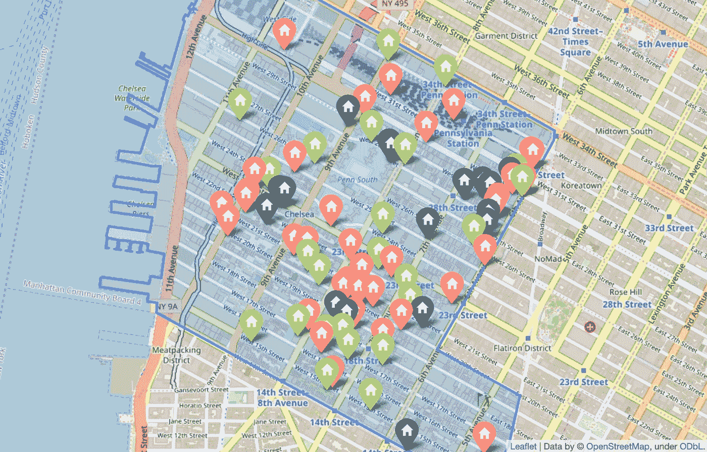
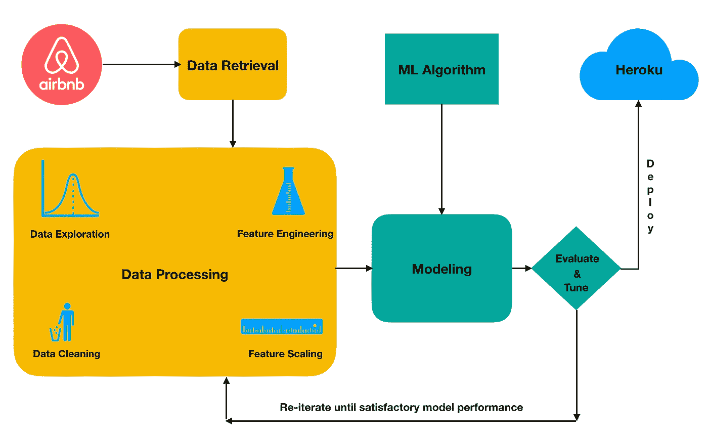
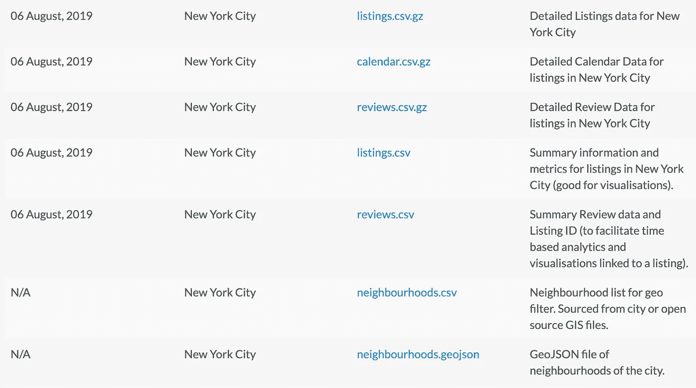
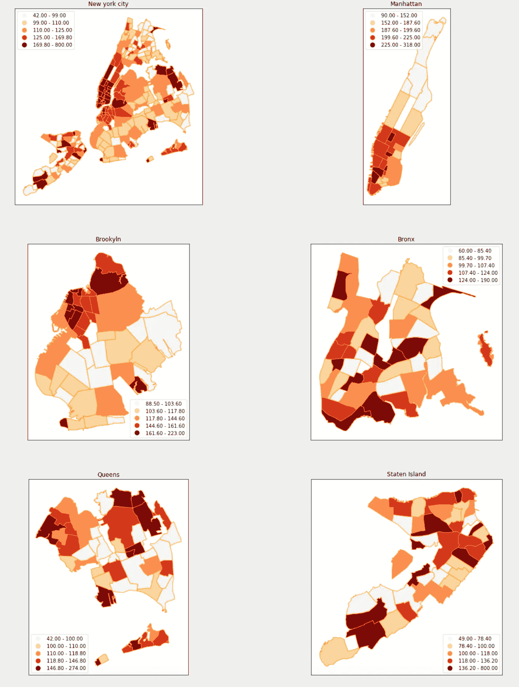
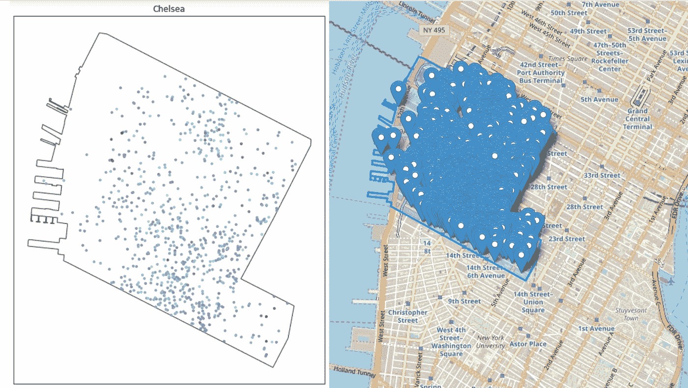
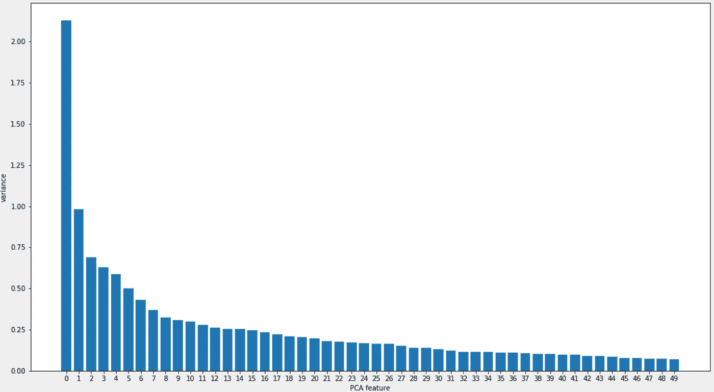
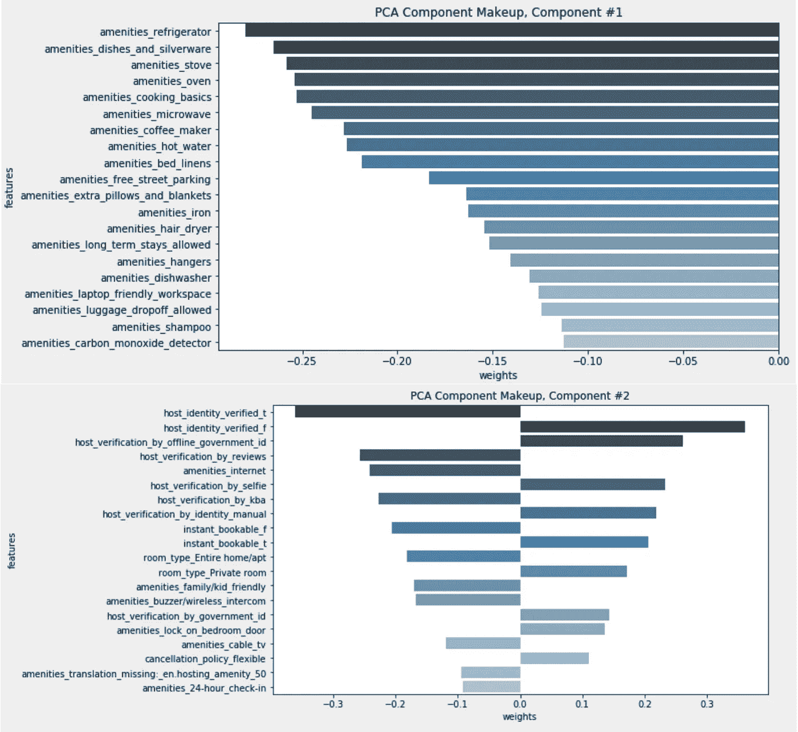

# 利用数据科学找到你的下一个 Airbnb 度假地

> 原文：<https://towardsdatascience.com/use-data-science-to-find-your-next-airbnb-getaway-3cb9c8333ad1?source=collection_archive---------15----------------------->

## 在数据中查找模式并对相似的列表进行分组

> 截至 2019 年 8 月，纽约市五个区约有 5 万个 Airbnb 房源。假设您根据自己的旅行兴趣将搜索范围缩小到一两个街区。每个街区的 Airbnb 房源密度如此之高，以至于你最终仍会有数百个房源可供选择。我们是否可以让机器学习算法在数据中找到模式，并将相似的房源分组，而不是通读每一个房源的描述、提供的便利设施和各种其他功能？

Figure 1: Each point represents an Airbnb Listing. The points closer to each other have similar characteristics: eg: amenities offered, their description, price and hundreds of other features. The price is encoded as the size of the bubble, so larger bubbles are higher price. An interactive plot is embedded in the results section below.

**方法:**在数据科学中寻找许多解决方案的一个常见流程是**跨行业数据挖掘标准流程(CRISP-DM)。**它有六个主要阶段:
- *业务理解*-发展业务理解。
- *数据理解*-形成数据理解。
- *数据准备*-准备您要分析的数据。
- *建模*-对数据建模。
- *评价*-评价结果回答你感兴趣的问题。
- *部署*-根据您的分析结果部署您的模型。

我利用这个过程从 airbnb 收集数据，并在 Heroku 上部署了一个交互式数据仪表板，让用户可以找到类似的 Airbnb 房源。

Figure 2: A subset of the phases of a CRISP-DM process starting from data preparation to deployment.

**业务理解:**这个阶段的目标是弄清楚我们到底要解决什么。基于问题陈述，我们的主要目的是帮助用户快速、可靠地找到 airbnb 房源。因此，我们的商业目标是:*更好的用户体验*和增加*对搜索结果的信任度*。这些目标转化为一系列问题/任务:

*   *创建一个可视化界面，显示各个社区的价格分布:*这样做可以让用户根据价格缩小搜索范围。
*   *创建一个数据仪表板，让用户选择一个街区，并找到类似的 airbnb 房源:*这将允许用户轻松找到类似的位置。
*   *建立一个交互式地图来显示 airbnb 房源的聚类:*这将允许用户不仅根据相似性，还根据地理位置来挑选房源。

**数据理解:**在这个阶段，我们需要理解回答问题所需的数据，以及构建我们在业务理解阶段确定的应用程序所需的数据。在我们的例子中，我们可以从 Airbnb 网站内的[获取数据，该网站发布了几个城市的 Airbnb 房源数据。数据集由几个 csv 文件组成，每个文件捕获关于列表的信息。在我的分析中，我使用了*详细列表*，它包含了 **48，884** airbnb 列表的 **106** 个特征。](http://insideairbnb.com/get-the-data.html)

Figure 3: Overview of the datasets released by Inside Airbnb website. (Source: [http://insideairbnb.com/get-the-data.html](http://insideairbnb.com/get-the-data.html))

遵循 CRISP-DM 流程，我创建了一系列博客文章，详细介绍了数据收集、预处理、建模和部署步骤(以及代码)，解释了为获得结果所做的选择。这些博文可以在本文末尾找到。

# 结果:

在这里，我想分享我的分析结果，并解释我们可以从这些结果中收集的见解。

## **不同社区的价格分布:**

缩小搜索范围的一个很好的起点是了解哪些社区价格昂贵。此处显示的价格是*每个街区的中间价格*。乍看之下，我们知道有些地区相对于其他地区来说相当昂贵，尤其是曼哈顿下城的那些地区。可以为其他行政区收集类似的见解，帮助您缩小价格范围内的社区范围，并满足您的出行需求。

Figure 4: The median price per neighborhood is displayed here. We can gather from this plot that price tends to differ greatly based on location.

> 假设你希望住在曼哈顿中央公园附近，并决定在切尔西区搜索 Airbnb 房源。仅在这一个社区就有 980 个房源。图 5 中的*显示的是该社区 Airbnb 房源的密度。正如你所看到的，这是一个相当大的列表，这是我们可以使用**机器学习** *在数据中找到模式，并将相似的列表分组为集群的地方。**

Figure 5: Density of Airbnb listings in the Chelsea neighborhood

现在，我们的任务是根据我们从描述、便利设施和其他几个因素为每个列表构建的特征找到相似的列表。对于每个列表，从最初的 106 个特性中总共设计了 2151 个特性。完整的特性列表可以在这里找到:[**【2151 特性】**](https://shravan-kuchkula.github.io/nyc-airbnb-feature-engineering/#final-list-of-2151-features) **。**

处理包含许多要素的数据集时，很难可视化/探索要素之间的关系。这就是**降维**的用武之地。在机器学习中，降维是通过获得一组主变量来减少所考虑的随机变量的数量的过程。**主成分分析(PCA)** 是一种线性降维技术，适用于具有许多相关特征的数据集。简而言之，主成分分析试图减少数据集中的要素数量，同时保留“主成分”，主成分被定义为现有要素的加权线性组合，旨在实现线性独立，并解释数据中最大可能的可变性。您可以将这种方法视为采用许多功能(2151)并将相似或冗余的功能组合在一起，以形成一个新的、更小的功能集。下面显示的是前 50 个主成分以及每个主成分解释的差异量。

Figure 6: Variance explained by each of the first 50 principal components

由于每个主成分都是原始特征的线性组合，因此可以查看这些成分的构成。通过查看*图 7，*由前两个主要部分组成的部分，我们可以看到最显著的特征是每个 airbnb 房源提供的便利设施。解释部件组成的一种方法是说:

> 有助于区分切尔西区 Airbnb 房源的主要特征是所提供的便利设施。

Figure 7: Component make up of the first two principal components.

为了构建我们的数据仪表板，我们可以采用前 3 个主要组件，但是，如果我们丢弃剩余的 47 个组件，我们将丢弃许多有用的信息。

另一种方法是应用**t-分布式随机邻居嵌入(t-SNE)**——这是一种非线性降维技术，特别适合高维数据集的可视化。t-SNE 将多维数据映射到低维空间，并试图通过基于具有多个特征的数据点的相似性识别观察到的聚类来发现数据中的模式。在我们的例子中，我们将采用前 50 个主成分，并应用 t-SNE 将数据集减少到 3 维。

## **在切尔西附近找到类似的 Airbnb 房源:**

通过减少到 3 维，我们现在能够在 3-D 散点图中可视化。每个数据点对应一个 airbnb 房源。距离较近的点具有相似的特征，即提供的便利设施、主机身份验证等。您可以与下面的 Plotly 可视化交互，如果您喜欢，甚至可以修改它！

Figure 8: A 3D-scatter plot constructed from t-SNE features. Each point represents an Airbnb Listing. The points closer to each other have similar features: eg: amenities offered, their description, price and hundreds of other features. The price is encoded as the size of the bubble, so larger bubbles are higher price. Hover over each of the data points to see more details.

## 这个情节有什么用处？

*   **省钱:**由于彼此距离较近的点具有相似的特征，因此我们可以找到在我们价格范围内的房源。

> 在一个较大的泡泡旁边找一个较小的泡泡，你就可以省点钱了！

*   **找到独一无二的东西:**一个远离其余的数据点，表明它有非常独特的东西，要么是坏的，要么是好的。你可以自己调查一下。
*   **比较:**假设您喜欢某个列表，并且希望找到相似的列表，您可以找到该数据点并查看其最近的邻居。

## 对数据仪表板的需求

一次可视化所有列表不是一个好主意，因为阅读情节变得非常困难。这就是数据仪表板的用武之地。使用数据仪表板，我们可以基于某些属性过滤可视化，并更轻松地调查数据点之间的关系。

例如，下面的演示显示了我们如何在 Chelsea 社区找到两个类似的 3 居室 airbnb 房源，并与 West Village 等其他社区的价格进行比较。

您可以在这里与部署到 Heroku 的应用程序进行交互:[**【Airbnb 数据仪表板】**](https://shravan-airbnb-nyc.herokuapp.com/) 。这里记录了构建和部署它的步骤: [[ **将 data dashboard 应用程序部署到 Heroku]**](https://shravan-kuchkula.github.io/nyc-airbnb-deploy-to-heroku/)

**Demo:** Select the neighborhood from the drop-down menu, move the slider to filter based on number of bedrooms. Using the tools at the top right, you can zoom, pan and rotate the plot to find similar listings. Hover over each data point to see more details.

## 使用 K-means 聚类相似的 airbnb 列表:

上面的 t-SNE 可视化让我们可以根据它们在组件空间的接近程度找到类似的 airbnb 列表。但是它没有将单个列表分组到聚类中，并且将每个列表标记为聚类的一部分。这就是 K 均值聚类派上用场的地方！

> *考虑这个场景:*假设您在**第 10 大道和西 20 街**找到了一个非常好的列表，并且您希望在**第 34 街宾州车站附近找到一个类似的列表。**通过选择同一个集群中更靠近宾州车站的另一个成员，你可以相信这两个位置之间有一些相似之处。

Figure 9: Results of K-means clustering — shown here are three clusters represented by three colors.

相似的 T21 这个词在这里有着比仅仅说相似的价格、相似的生活设施等更深刻的含义。它是我们使用 NLP 和特征工程创建的 **2151 个特征**的组合，然后要求像 K-Means 这样的无监督机器学习算法根据它们在向量/分量空间中的距离的接近程度对它们进行分组。

# 结论:

每个数据科学问题都始于一个问题。我们感兴趣的问题是:*我们能根据 Airbnb 提供的信息找到类似的房源吗？*通过使用 CRISP-DM 流程，我们从了解问题开始了我们的旅程，从 Airbnb 获取数据，预处理数据，建立数据模型，最后部署了一个数据仪表板，让用户可以轻松找到类似的房源。虽然仅仅为了找到一个 Airbnb 房源，这看起来有点过分，但是发现独特事物的快乐让这一切都是值得的！

# CRISP-DM 步骤:

博客系列，涵盖了实现上述结果的每个步骤:

*   **纽约市 Airbnb 数据清理**([https://shra van-kuch kula . github . io/NYC-Airbnb-Data-Cleaning/](https://shravan-kuchkula.github.io/nyc-airbnb-data-cleaning/)):涵盖数据集的提取、数据清理、缺失值的识别和处理。
*   **纽约市 Airbnb 特征缩放**([https://shra van-kuch kula . github . io/NYC-Airbnb-data-preprocessing/](https://shravan-kuchkula.github.io/nyc-airbnb-data-preprocessing/)):处理离群值，确定要使用的正确缩放器。
*   **纽约市 Airbnb Feature Engineering**([https://shra van-kuch kula . github . io/NYC-Airbnb-Feature-Engineering/](https://shravan-kuchkula.github.io/nyc-airbnb-feature-engineering/)):创建了便利设施和其他基于列表的列的二进制单词包表示，对文本列进行了规范化和矢量化。
*   **纽约市 Airbnb 建模:PCA**([https://shravan-kuchkula.github.io/nyc-airbnb-pca/](https://shravan-kuchkula.github.io/nyc-airbnb-pca/)):使用降维将特征从 2100 个减少到 50 个。
*   **纽约市 Airbnb 建模:t-SNE 可视化**([https://shravan-kuchkula.github.io/nyc-airbnb-tsne-visual/](https://shravan-kuchkula.github.io/nyc-airbnb-tsne-visual/)):涵盖了我们如何使用 plotly express 实现上面的 3D 散点图可视化。
*   **纽约市 airbnb 建模:K 均值聚类**([https://shravan-kuchkula.github.io/nyc-airbnb-kmeans/](https://shravan-kuchkula.github.io/nyc-airbnb-kmeans/)):使用 K 均值聚类找到相似的 Airbnb 房源。使用了一个 follow 地图来显示聚类结果以便于交互，并根据位置查找相似的列表。
*   **将数据仪表板 app 部署到 Heroku:**([https://shra van-kuch kula . github . io/NYC-Airbnb-Deploy-to-Heroku/](https://shravan-kuchkula.github.io/nyc-airbnb-deploy-to-heroku/)):使用 Flask + Pandas + Plotly + Dash 将数据仪表板应用部署到云端。

# 本帖中用于构建可视化效果的工具:

所有的可视化都是用 python 创建的🐍

*   [***geo pandas:***](http://geopandas.org/)让使用 python 处理地理空间数据变得更加容易。如果您有纬度和经度信息，那么您可以构建一个 geopandas 数据框架，并开始使用 pandas 的所有功能，如过滤、分组、合并空间组件。我被它的简单和强大迷住了。在这里阅读如何安装它:[【安装 geo pandas】](https://gist.github.com/shravan-kuchkula/778e90eef818aa955676963c0132f08b)
*   [***leave:***](https://python-visualization.github.io/folium/)`folium`使用 Python 处理的数据在交互式活页地图上可视化变得容易。它既可以将数据绑定到地图上进行`choropleth`可视化，也可以将丰富的矢量/栅格/HTML 可视化作为地图上的标记进行传递。
*   [***plot ly Express:***](https://medium.com/plotly/introducing-plotly-express-808df010143d)plot ly 这些年来有了很大的改进，最新的版本用 plotly.express 做出来易如反掌。现在你几乎可以在任何地方嵌入 plotly 可视化。阅读这篇博客，看看它能做些什么:[【Plotly 4.0】](https://medium.com/plotly/plotly-py-4-0-is-here-offline-only-express-first-displayable-anywhere-fc444e5659ee)
*   [***Dash:***](https://dash.plot.ly/introduction)它写在 Flask、Plotly.js 和 React.js 之上，Dash 非常适合用纯 Python 构建具有高度自定义用户界面的数据可视化 app。它特别适合任何使用 Python 处理数据的人。
*   [***Giphy:***](http://www.giphy.com)*我用这个创建了 gif。就像上传一个视频并从中挑选你想要的一样简单。Medium 只允许 Embed.ly 支持嵌入，giphy 是其中之一。*
*   *[***Heroku:***](https://www.heroku.com/) 在我看来，在云上拥有 python app 最快的方法就是使用 Heroku PaaS。他们让它变得非常简单，下面是从头开始的步骤。[【将数据仪表板部署到 Heroku】](https://shravan-kuchkula.github.io/nyc-airbnb-deploy-to-heroku/)*
*   *[**Github 链接到代码**](https://github.com/shravan-kuchkula/airbnb_nyc)*