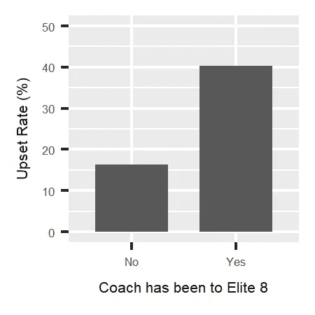
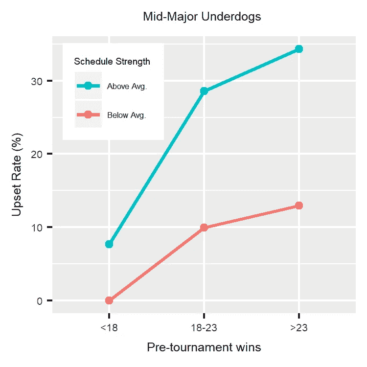
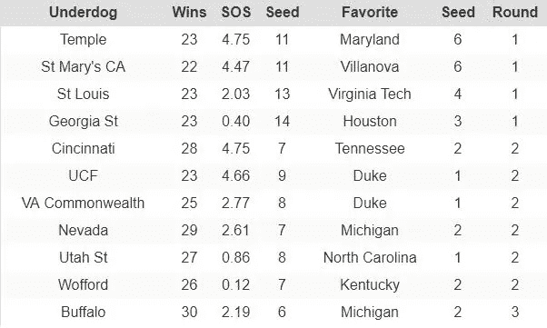
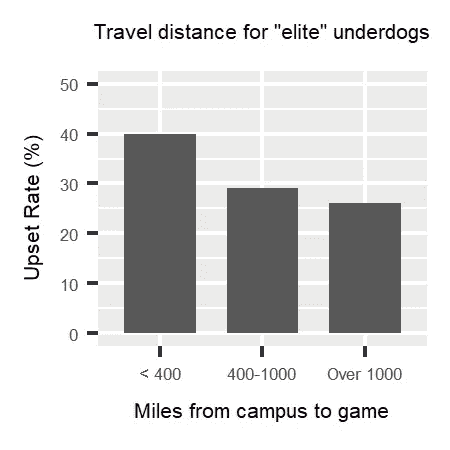
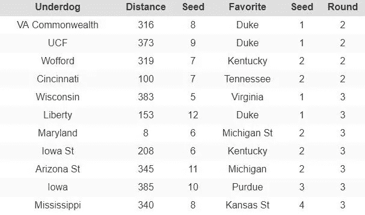

# 使用我的不安预测模型来挑选 NCAA 锦标赛中的失败者

> 原文：<https://towardsdatascience.com/use-my-upset-prediction-model-to-pick-underdogs-in-your-ncaa-tournament-bracket-87c4aa3935f5?source=collection_archive---------12----------------------->

## 机器学习模型给出了 3 个需要寻找的关键干扰信号

NCAA 锦标赛场地已经设置好，现在是开始填写你的括号的时候了。每年都有一些顶级球队被提前淘汰，所以挑几个冷门是有意义的，尤其是在前几轮。正确挑选冷门是在支架竞赛的前几轮中获得优势并使你的支架与竞争对手区分开来的好方法。

问题是，很难准确预测不愉快。当不被看好的人赢了，他们只有 1/5 的机会被选中。每个人都预计会发生一些令人沮丧的事情，而且有很多关于[应该挑选多少](https://www.ncaa.com/news/basketball-men/2019-03-15/7-our-best-ncaa-bracket-tips-just-might-make-difference-year)的建议。但大多数括号玩家仍然很难选择正确的。

根据 2003 年以来所有锦标赛球队的数据，我使用机器学习创建了一个预测模型，具有很好的准确性来检测冷门，我将冷门定义为一个不被看好的球队获胜，他们的种子比对手低至少 4 个位置(a 5 击败 a 1，a 6 击败 a 2，等等。).去年的锦标赛有 12 场冷门。我的模型预测了其中的 10 个，还有 5 个假阳性。不完美，但比随机猜测好得多。

今天，我利用我的模型中的见解，给你提供由硬数据支持的颠覆性指导。我在这里关注的是处于劣势的球队的品质，不管对手是谁，这些品质都预示着更大的翻盘机会。我的目标不是告诉你应该挑选哪些令人沮丧的事情，因为这有什么意思呢？相反，我想给你三个明确的不安信号，当你在自己的分类中寻找不安时可以考虑。

# **冷门信号 1:由上届锦标赛冠军教练带领的弱队**

篮球专家经常讨论好教练在锦标赛中的重要性，但通常是指像肯塔基、北卡罗来纳和密歇根州立大学这样的精英项目的教练。但事实证明，教练在锦标赛中的成功记录也能对弱队产生很大影响。

当我查看弱队教练成功的几个指标时，有一个因素很突出:弱队教练之前参加第四轮比赛的次数，也就是“精英 8 强”。

Underdog coaches with Elite 8 experience are more likely to lead their team to a win

在左边我展示了“冷门率”，定义为导致冷门的游戏的百分比。由简历上没有“精英 8”访问记录的教练领导的失败者只有大约 16%的胜率，但由“精英 8”教练领导的失败者表现得好得多，失误率接近 40%。

根据定义，每个有精英 8 经验的教练以前都在锦标赛中至少赢过 3 场。这些跑步可能有助于给教练宝贵的经验，或者可能只是代表教练在管理激烈的比赛压力，为下一个对手制定比赛计划，或者两者兼而有之的技能的证据。

下面我展示了今年所有拥有精英教练的潜在弱势球队(种子 5-16)。对于每支队伍，我会展示他们第一次被认为处于劣势的比赛回合和对手。在第一轮中只有两支队伍符合这个标准，但是在第二轮和以后的比赛中，有几个潜在的冷门在等着我们。

Underdogs led by coaches with previous Elite 8 experience

请注意，无论谁在第一轮赢得贝勒-锡拉丘兹，冈萨加都将在第二轮面对一位精英 8 教练，要么是斯科特德鲁，要么是吉姆·伯海姆。对于头号种子冈萨加来说，这两场比赛都是艰难的第二轮比赛，这意味着选择他们逃离这个地区可能是有风险的。锡拉丘兹去年处于类似的 10 号种子的位置，当时我的模型[正确预测了](/from-first-four-to-sweet-16-how-i-predicted-syracuse-would-upset-michigan-state-32fc95c96fa4)他们将在第二轮击败 2 号种子密歇根州立大学。

# **冷门信号 2:中期主要弱队在艰难的赛程中保持强劲的胜利记录**

对于遴选委员会而言，日程安排的强度是决定邀请哪些网络普通用户团队的一个重要因素。事实证明，赛程的强度也是预测弱队在锦标赛中获胜的一个有用因素。

对于“中大型”团队来说尤其如此，这些团队不属于“Power 5”会议(ACC、SEC、Big 12、Big 10、PAC-12)。当我特别观察中等职业球队时，赛程的强度和高胜率都是预测冷门的潜在因素。

Among mid-majors, underdogs with both strong schedules and winning records are most likely to pull an upset

对于所有涉及不被看好的中等球队的锦标赛，我会在纵轴上显示不被看好的球队在锦标赛前的总胜场数。横轴显示了球队在赛程中的赛前[实力，数值越高表示球队遇到的对手越难对付。进度表的平均中主要强度以蓝色显示。请注意，扰乱(绿色)清楚地聚集在右上角。这意味着当弱队的赛程强度高于平均水平并且至少赢了 20 场比赛时，冷门往往会发生。](https://www.sports-reference.com/cbb/seasons/2019-school-stats.html)

为了使用这两个因素创建更具体的指导，我按照赛程强度(平均或更低，平均以上)对中-大比分落选者进行了分组，并针对总胜率的 3 个类别分别绘制了每组的沮丧率:少于 18，18-23 和超过 23 胜。

这里的数据讲述了一个有趣的故事。拥有强大胜利记录的中职棒球队确实更有可能取得冷门，正如两个中职棒球队从左(少于 18 场胜利)到右(超过 23 场胜利)的整体冷门率增加所示。然而，对于时间表更紧的中等专业(绿色/蓝色线)，增长幅度更大。这种模式符合常识:那些通过战胜更难对付的对手来证明自己价值的中等职业者，也是那些更有可能在大舞台上翻盘的人。

上面的图表显示，冷门对于拥有超过 18 场胜利和艰难赛程的中期主要弱队来说是最常见的。下面我展示了今年符合这两个标准的 11 支中型球队。对于每支球队，我还展示了他们第一轮的对手(11-16 号种子队)或他们预计的未来比赛(5-10 号种子队)。

Mid-major underdogs with at least 18 wins and a difficult season schedule

坦普尔和圣玛丽看起来像是第一轮中强劲的冷门竞争者，尽管坦普尔必须在前四轮中首先通过另一个中期专业(贝尔蒙特)。在第二轮比赛中，UCF 对杜克大学和辛辛那提对田纳西大学都以获胜记录和赛程证明脱颖而出。

将这些数据与上面的教练表联系起来，我还注意到密歇根肯定会在第二轮面对一个艰难的中期联盟(内华达州)或一个经验丰富的教练(佛罗里达州)，还有另一个艰难的中期联盟(水牛城)或全国最有效率的三号种子选手(德州理工)在第三轮等待着。密歇根是一支伟大的球队，但像这样一连串艰难的比赛是可以打破支架的地雷，伟大的球队每年都会提前出局，包括第二轮三分之一的 2 号种子。狼獾队可能是你可以考虑尽早淘汰的队伍之一。

# 不安信号 3:在家门口的比赛中处于劣势的精英

因为每场锦标赛都是在一个中立的场地进行，所以没有哪支球队有真正的主场优势。然而，不被看好的球队通常会在离家更远的地方比赛，这可能会使他们处于[劣势](https://fivethirtyeight.blogs.nytimes.com/2011/03/11/in-tournament-theres-no-place-like-close-to-home/)，可能是因为长途旅行和减少的球迷到场人数。

但有时，失败者很幸运，最终比最受欢迎者走了相似(甚至更短)的距离。当这些球队碰巧是非常熟练的失败者时，不安分的手表就处于警戒状态。

我用术语“精英”失败者来描述具有关键不安信号的团队，我在之前的[帖子](/predicting-upsets-in-the-ncaa-tournament-with-machine-learning-816fecf41f01)中讨论过:肯波[调整后的效率余量](https://kenpom.com/)超过 10。只有 40%的不被看好的球队达到了这个基准，但是这些球队在大约 30%的时间里击败了热门球队，相比之下，其他不被看好的球队只有 10%。作为挑选冷门的唯一规则，你可以做得更糟…但我认为我们也可以做得更好。

Elite underdogs (those with Kenpom efficiency margin over 10) who play close to home upset the favorite 40% of the time

在“精英”阶层的失败者中，在离家近的地方比赛是一个明显的沮丧信号。正如我在左边展示的，在距离校园不到 400 英里的地方打球的“精英”失败者的失望率在 40%左右，而其他精英的失望率在 30%以下。精英失败者只有 20%的时间在校园附近玩这种游戏，但当他们这样做时，就会大大增加冷门的几率。

下面我展示了今年锦标赛的相关游戏。辛辛那提(我们已经知道他们有获胜记录和赛程强度的冷门信号)再次出现在俄亥俄州哥伦布市与田纳西的第二轮比赛中。我还注意到，对于杜克大学在南卡罗莱纳州的第二轮比赛，他们的两个潜在对手(VCU 和 UCF)都符合旅行标准。足够疯狂的是，两支球队都有上面讨论过的胜利记录和赛程实力。

Elite underdogs who will travel less than 400 miles to their game

杜克是头号种子选手，拥有我们所见过的最有天赋的首发阵容之一。我会选择杜克大学在一场比赛中输给 UCF 或 VCU 吗？不，我不会。但在括号池中，最小化风险是成功的重要组成部分，这包括识别哪些顶级团队进入四强的道路更加艰难。因此，在自动将头衔授予杜克大学之前，你可能会三思而行。

# **闭幕词**

即使是遇到这些令人沮丧的信号的失败者也有超过 50%的机会输掉比赛，还有许多其他因素影响着 NCAA 锦标赛中每场比赛的结果。那么，你应该如何利用这些信息来挑选烦恼呢？

我的建议是把信号作为工具，而不是硬性规定。如果你对处于劣势的团队有预感，对照这些信号检查他们，看看他们是否通过测试。试着想出你自己的信号，看看他们今年表现如何。

在未来，我还计划发布带有信心指标和其他数据的完整预测，所以如果你想了解更多，请在 Medium 或 Twitter [@bracket_vision](https://twitter.com/bracket_vision) 上关注我。