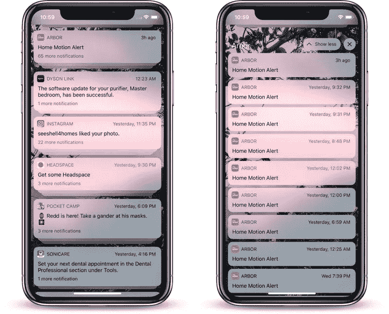
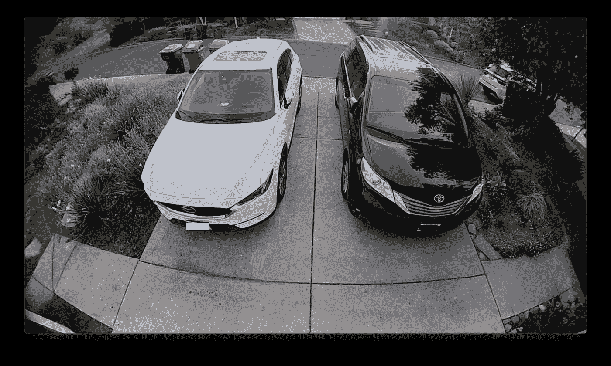
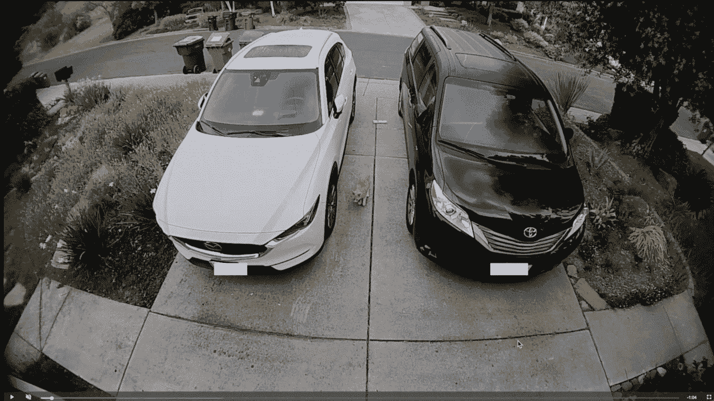
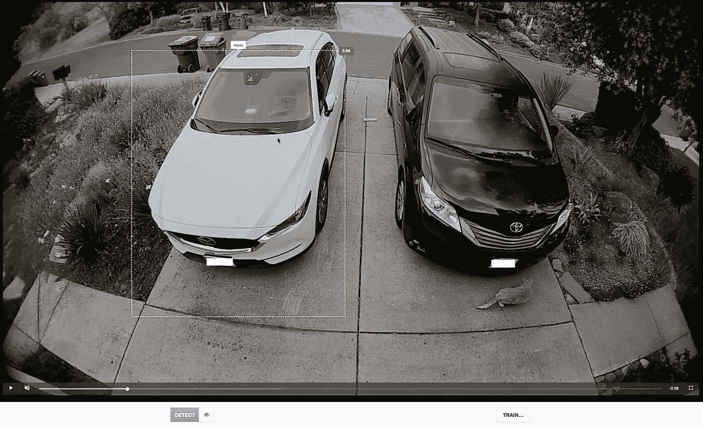
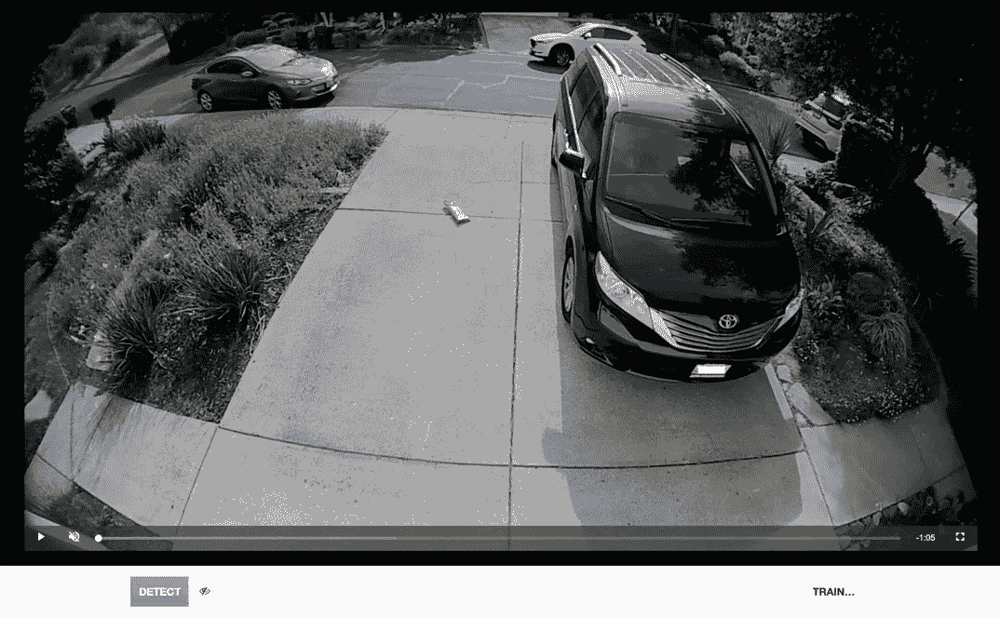

# 使用物体识别来确保你的车没有被偷

> 原文：<https://towardsdatascience.com/use-object-recognition-to-make-sure-your-car-hasnt-been-stolen-70c866710fe1?source=collection_archive---------24----------------------->

什么？一篇博文的标题真奇怪。这就像说“不要为了避免不打电话而不使用你的电话”。但我认为它准确地描述了我将向你展示如何使用机器学习来确保你的车仍然在你的车道上。

几年前，有人决定在半夜大摇大摆地走进我的车道，偷走我的车。这不是一次愉快的经历，这当然让我想到了防止这种事情再次发生的聪明方法。

一种方法是在每个地方安装安全摄像头，然后设置它们在有任何动静时提醒我。但是，我相信你能猜到，如此多的小事情触发了运动检测，以至于通知很快变成了噪音，然后我忽略了它，这违背了最初获得通知的目的。

Source: [https://cdn.macrumors.com/article-new/2018/07/groupednotifications-800x646.jpg](https://cdn.macrumors.com/article-new/2018/07/groupednotifications-800x646.jpg)

> 但是如果我可以告诉你，你可以建立一个系统，只有*在你的车丢了的时候提醒你，而不会提醒你任何其他的事情，那会怎么样呢？*

*嗯…我**不能**告诉你…所以…我现在告诉你。*

## *怎么会？*

*魔法。*

*所谓魔法，我指的是相对简单的技术，基于非常坚实的数学基础，比如 2+2=4，6/2=3，三角形=有趣。*

*显然，你首先需要的是一台照相机。接下来你需要做的是安装一些 DIY 家庭自动化设备。我推荐看看这些家伙。他们有很多开源家庭自动化的东西，你可以很容易地设置，以实现如下的工作流程。*

> *我想说这是为技术爱好者准备的。你可能应该成为一名开发人员，或者至少在电视上扮演一名开发人员。*

*现在，给你自己找一些训练数据。也就是说，你的车停在平时停放的地方的一些视频文件。*

*我的情况是这样的。*

**

*注意到背景中的回收箱了吗？我的建议是从一周中获取视频示例，使用不同的照明，街道上不同的“场景”，如汽车、垃圾箱、动物、鬼魂，以及任何其他常见的场景。就我而言，我需要有和没有这些箱子的视频。*

*现在有趣的部分来了。*

*继续从称为[对象盒](https://machinebox.io/docs/objectbox)的[机器盒](https://machinebox.io)下载这个漂亮的工具。*

## *给…作注解*

*按照说明使用 Objectbox 中的注释工具进行设置，并将您的视频放入`boxdata/files`目录。*

*然后通过访问`http://localhost:8080`点击*注释工具*打开注释应用，并选择您的一个示例视频。播放视频，然后暂停，并在您的汽车周围画一个方框。给它一个有意义的标签，再次播放视频，几秒钟后再次点击暂停，然后在你的车周围再画一个方框。冲洗，每个视频重复 2 到 3 次。*

**

*我的建议是在尽可能多的不同场景中抓取大约 20 个例子。例如，你看到我的好车旁边的那只笨猫了吗？这次我确保它包含在盒子里，但不是为了后续的注释。我希望模型每次都能学习什么是相同的，什么是不同的。Objectbox 将整个框架放入上下文中，所以你真的需要在一天的不同时间和一周的不同日子的真实生活的例子来获得最佳结果。*

## *我们表现如何？*

*我最喜欢 Objectbox 的一点(因为我是它的产品经理，也是我要求的)是能够立即获得对你的培训的反馈。你提供了足够多的例子吗？你做得对吗？很棒的问题。Objectbox 通过让你点击“训练”,然后在一帧上播放和暂停视频来给你答案。它会根据这个框架进行训练，然后马上给你一个答案。*

*例如，这里有一个 Objectbox 从未见过的新框架。*

**

*Objectbox draws a box around the car and labels it ‘Mazda’*

*搞定了。现在，让我们看看当一些视频中没有美味的马自达出现时会发生什么:*

**

*完美—没有检测到。*

*下面是我设置 pleasedontstealmycar 工作流程的方法:*

1.  *从 Objectbox 下载状态文件(training)(在检查了几个视频之后)。*
2.  *建立我的相机定期检查下载一帧，张贴到 Objectbox 运行与我的状态文件，这将检查看看是否马自达=真。*
3.  *如果马自达=被盗，发送警报到我的手机和国民警卫队。*
4.  *当你预计马自达在别的地方的时候，可能安排这个不提醒你。*

*这将大大减少你从爱洛，环，巢等收到的通知数量。等等。等等。只在应该在那里的东西不在的时候提醒你。*

*你还能用 Objectbox 做什么？当你驶入车道时打开车库，当你的邮件到达时提醒你，如果你的回收箱不在街上时通知你，因为你一直在忙着做很酷的事情…我相信你可以想到许多伟大的使用案例。*

## *更上一层楼*

*如果你是一个大机构或小办公室，你想开始考虑使用机器学习来发出更多相关的警报，看看这个。使用 [aiWARE](https://www.veritone.com/aiware/) ，一个由 [Veritone](http://www.veritone.com) (谁[收购了机器盒子](https://www.businesswire.com/news/home/20180910005237/en/Veritone-Acquires-Machine-Box-Extending-Capabilities-New))开发的平台，你就可以开始考虑规模化做这种事情了。*

*只需将您的状态文件上传到 aiWARE 的库应用程序，然后使用 Objectbox 来运行您的所有相机馈送。你不必担心编排 Docker 容器或管理视频的处理。您甚至不需要做太多事情来让通知工作，aiWARE 有一个定制的 Node-RED 实现，让您可以轻松地处理这样的工作流，而无需做太多的编码。*