# 在 AWS EMR 群集中使用 Pyspark 和 Jupyter 笔记本电脑

> 原文：<https://towardsdatascience.com/use-pyspark-with-a-jupyter-notebook-in-an-aws-emr-cluster-e5abc4cc9bdd?source=collection_archive---------4----------------------->

Jupyter Notebook 是学习和解决代码问题的一个不可思议的工具。这里有一个博客来展示如何在学习 Spark 时利用这个强大的工具！

如果您正在做任何可以并行化的计算密集型工作，Spark 会很有帮助。查看[这个 Quora 问题](https://www.quora.com/Why-is-Apache-Spark-used)获取更多信息。

这篇博客将通过 AWS Elastic Map Reduce (AWS EMR)和 Jupyter Notebook 来设置使用 Spark 的基础设施。

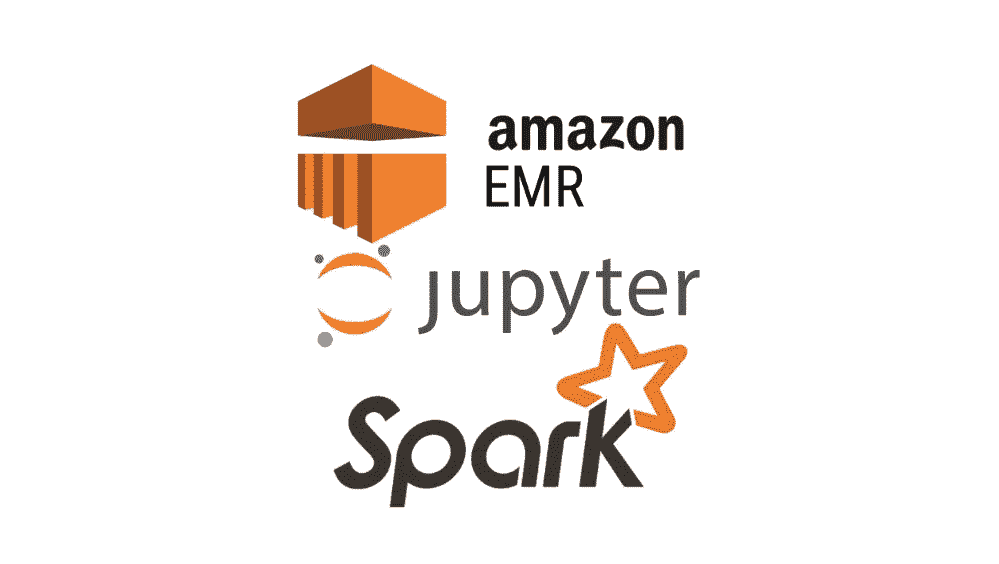

## 导航至 AWS EMR

您将在屏幕顶部看到以下内容:

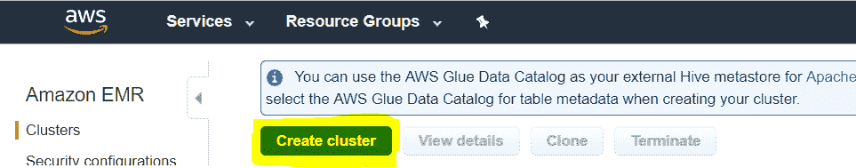

Click ‘Create cluster’

## 选择高级选项

在屏幕的顶部


## 复制以下截图

我用黄色突出显示了需要更改的默认项目，除了第 2 步中的节点类型。这将取决于你的任务的计算强度。如果你只是在测试，资源可能会很少。以' g-'开头的实例是 GPU 实例，最适合运行 Spark。

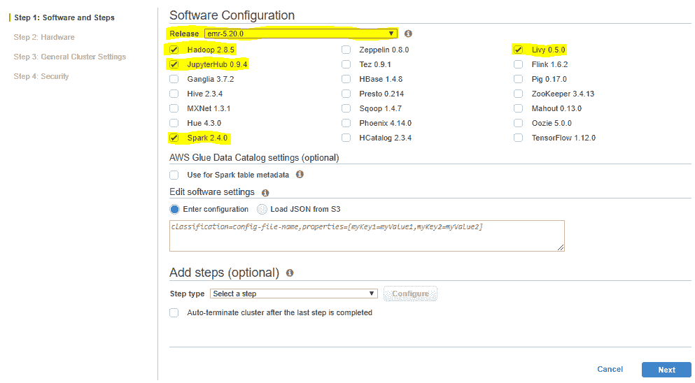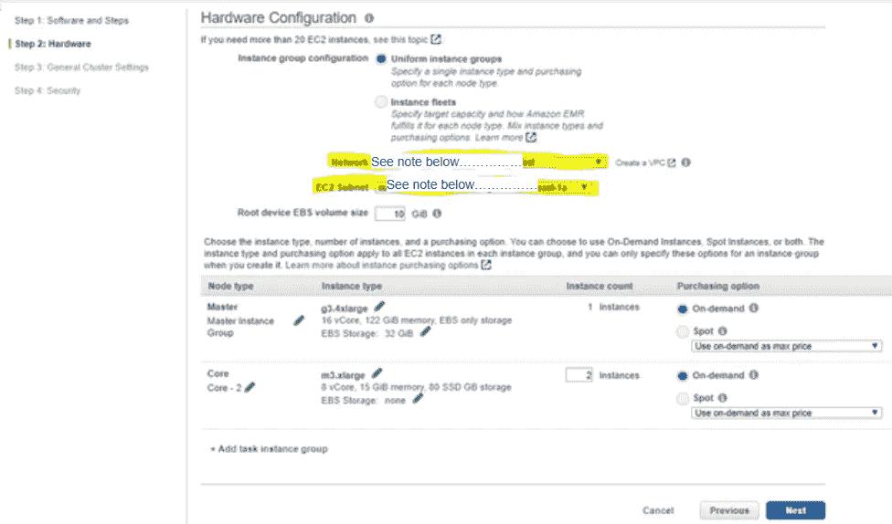

For more information about how to choose which types of instances to use, check out the AWS docs: [https://docs.aws.amazon.com/emr/latest/ManagementGuide/emr-plan-instances-guidelines.html](https://docs.aws.amazon.com/emr/latest/ManagementGuide/emr-plan-instances-guidelines.html)

如果您计划从 S3 存储桶调入数据或文件，请确保您与 S3 存储桶位于同一个 VPC。

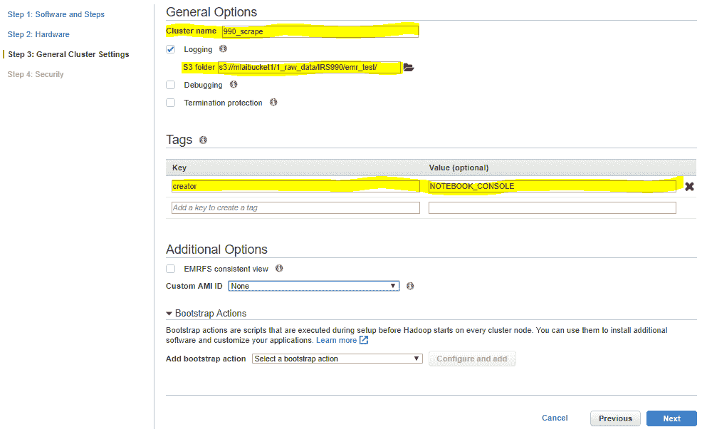

See the “Add bootstrap action” ?

好的，这里是你安装引导动作的地方。默认情况下，引导操作以 Hadoop 用户的身份执行。您可以使用 sudo 以 root 权限执行引导操作。

引导操作是将额外的 Python 包安装到其他内核的最有效方式。根据我们在软件配置中选择安装的软件，Anaconda 已经安装在它们上面了。对于我希望运行的脚本，我需要的附加包是 xmltodict。

为了安装 python 库 xmltodict，我需要保存一个包含以下脚本的引导操作，并将其存储在 S3 桶中。这就是在您将要引用的 S3 所在的 VPC 上安装 EMR 集群的重要性所在。这是一个 shell 脚本，将在 S3 保存为. sh 文件:

```
sudo pip install xmltodict
```

一定要包括须藤！

如果你需要比`xmltodict`更多的包，你可以把它们放在同一行代码中，用空格隔开。示例:`sudo pip install xmltodict s3fs`

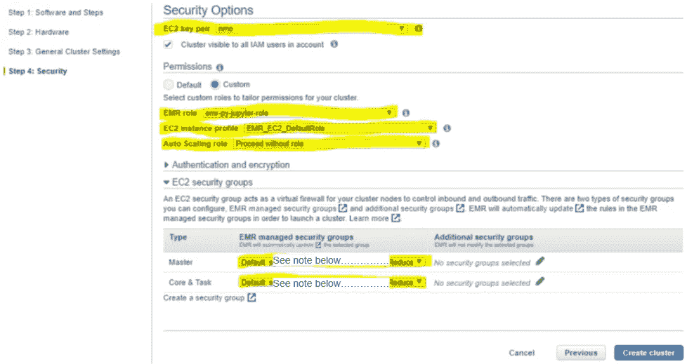

Make sure you choose an EC2 key pair you have access to

`为什么选择这些安全组？：

在 EC2 仪表板中，应该有以下入站规则。

在本例中，源是 0.0.0.0/0，这是所有的 IP 地址。为了更加安全，请输入您自己的 IP 地址。

如何检查:转到 EC2 仪表板，单击安全组，找到您的组并添加自定义规则:

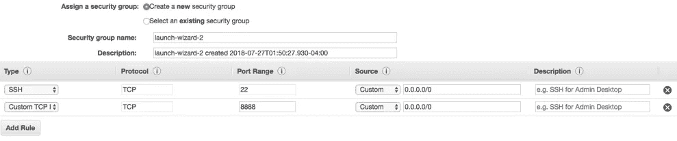

The 22 one allows you to SSH in from a local computer, the 888x one allows you to see Jupyter Notebook. As a note, this is an old screenshot; I made mine 8880 for this example.

关于入境交通规则的更多信息，[查看 AWS 文档](https://docs.aws.amazon.com/AWSEC2/latest/UserGuide/using-network-security.html)。

## 现在转到您的本地命令行；我们将通过 SSH 进入 EMR 集群。

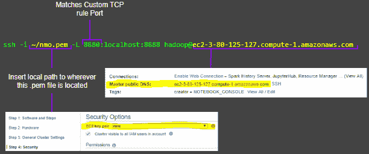

In general, don’t share your public DNS on the internet. This is one of my old ones.

结果:现在你在 EMR 命令行中。

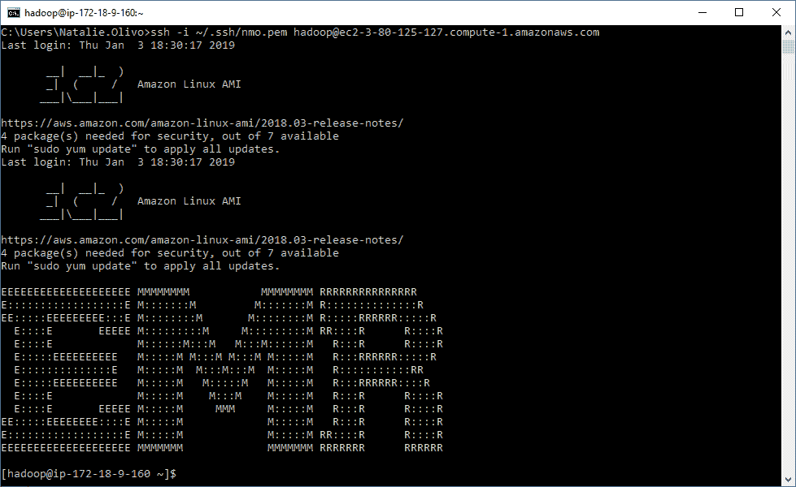

## 找到你的蟒蛇版本

[https://repo.continuum.io/archive/](https://repo.continuum.io/archive/)并在下一步复制/粘贴文件路径。选择 Python 3.6 或更低版本，因为在这个时候，我认为不可能将 worker 节点一直更新到 3.7。如果是的话，请在评论中给我留言吧！

## 安装 Anaconda

将上一步中的文件路径放在这里:

```
wget [https://repo.continuum.io/archive/Anaconda2-2018.12-Linux-x86_64.sh](https://repo.continuum.io/archive/Anaconda2-2018.12-Linux-x86_64.sh)
```

按回车键

```
bash Anaconda2–2018.12-Linux-x86_64.sh
```

按 enter 键，并继续按 enter 键浏览条款和条件

键入 yes，

按回车键确认位置

等待软件包安装。

键入 yes 添加到环境变量中，以便 Python 能够工作

```
which python /usr/bin/python
```

按回车键

```
source .bashrc
```

## 配置带 Jupyter 的火花

在 EMR 命令提示符下键入以下每一行，并在每一行之间按 enter 键:

```
export PYSPARK_DRIVER_PYTHON=jupyterexport PYSPARK_DRIVER_PYTHON_OPTS='notebook --no-browser --port=8888'source .bashrc
```

## 在 EMR 命令提示符下键入 pyspark

结果:

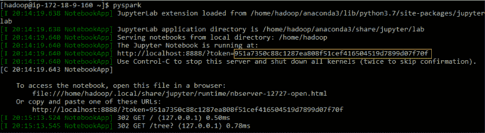

See that highlighted token? copy it.

## 在网络浏览器中打开 Jupyter 笔记本

在地址栏中键入以下内容:localhost:8880
结果:粘贴上一步中的令牌并登录的页面。

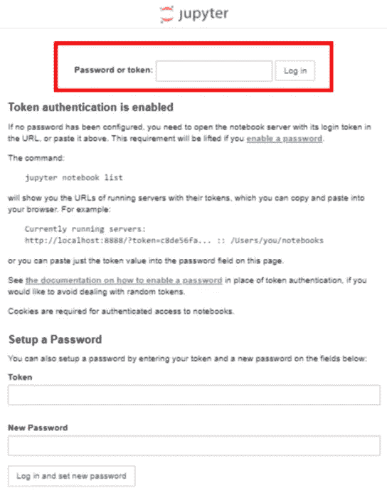

耶！你做到了！

现在，您可以在 Jupyter 笔记本中查看您的 spark 上下文:

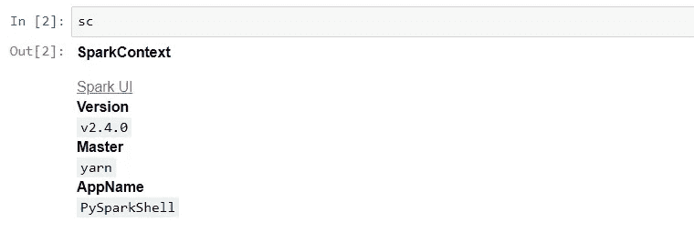

# 资源:

[https://medium . com/@ alexjsanchez/python-3-notebooks-on-AWS-ec2-in-15-mosely-easy-steps-2e C5 e 662 C6](https://medium.com/@alexjsanchez/python-3-notebooks-on-aws-ec2-in-15-mostly-easy-steps-2ec5e662c6c6)

[https://medium . com/@ vats al 410/running-py spark-on-an-AWS-cluster-through-jupyter-notebook-Fe 28 f 6 ef 47 a 4](https://medium.com/@Vatsal410/running-pyspark-on-an-aws-cluster-through-jupyter-notebook-fe28f6ef47a4)

Python 错误的版本错误:

[https://AWS . Amazon . com/premium support/knowledge-center/EMR-pyspark-python-3x/](https://aws.amazon.com/premiumsupport/knowledge-center/emr-pyspark-python-3x/)