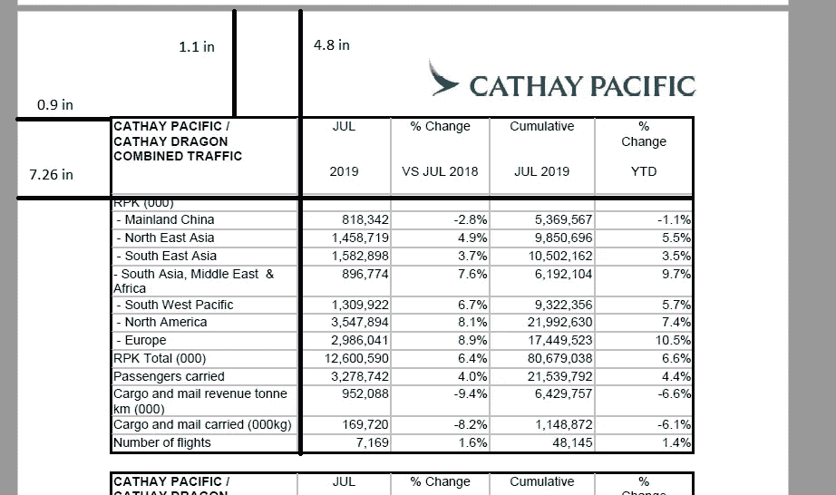

# 使用 Python 包装上市公司报告中的业务数据(tabula-py)

> 原文：<https://towardsdatascience.com/use-python-to-wrap-business-figures-from-listed-company-reports-6a48b01bf624?source=collection_archive---------20----------------------->

(声明:这是一个只教 Python 的教育帖。内容仅供参考。它无意成为投资建议。)

对于一家上市公司来说，它不断在网上发布不同的报告和数据，让投资者和潜在投资者更好地了解企业。然而，大多数报告都是 PDF 格式的，我们都知道很难复制和处理数字。对于大型投资公司和机构来说，他们肯定有专门的和复杂的工具来阅读 pdf 报告。但是像你我这样的个人投资者呢？有什么方法可以自动读取 pdf 报告并存储或分析？幸运的是，在 Python 的帮助下，答案是肯定的。


This is the result. Impressed? You can do it also.

我将使用的主要模块叫做“tabula”。还有一些其他的模块可以读取 pdf 文件，但是到目前为止，经过多次测试,“tabula”是从 pdf 文件包装表格并存储为 dataframe 的最佳模块。因此，包装后，您可以将结果存储为 csv 文件或与历史数据相结合。

我将使用的公司是国泰航空公司。国泰航空是香港的上市航空公司。每个月，它都会通过不同的目的地释放大量的乘客和货物。因此，通过了解每月的数据，您可以更好地了解其收入流，并帮助您做出更好的投资判断。

第一步是获取 pdf 报告。我将使用更直接的方法在线访问文件并阅读 pdf 文件，而不是手动下载。因此，有必要知道存储这些报告的路径。


[https://www.cathaypacific.com/cx/en_HK/about-us/investor-relations/announcements.html](https://www.cathaypacific.com/cx/en_HK/about-us/investor-relations/announcements.html)

上图是下载各种公告的页面。“交通数字”报告是我们感兴趣的一个。


输入关键词后，可以看到所有的流量数字报告。

下一步是研究如何在线获取这些报告。幸运的是，文件路径是标准化的。


如上图所示，唯一的变化就是最后显示年和月的数字。第一部分不变。

但是，在某些月份，文件路径的子前缀不是“pdf”，而是“PDF”(全部大写)。因此，在编写 Python 脚本时，有必要处理这种情况。


Please keep the format unchanged!!

所以文件路径是“' https://www . cathay Pacific . com/dam/CX/about-us/investor-relations/announcements/en/{ year _ month } _ cxtraffic _ en . pdf(或 PDF)”。

我们感兴趣的页面显示了每个月的流量和容量。它们存储在两个独立的表中。这是我们下一阶段需要努力的地方。


遗憾的是，显示这些表的页面并不是恒定的。相反，它们显示在每个报告的倒数第二页。所以在包装之前，有必要知道每份报告的页数。

下面显示了 Python 脚本应该执行的列表:

1.  [通过文件路径](#6dde)访问文件
2.  [检查总页数](#bc66)
3.  [转到倒数第二页，将两张表格换行](#faa6)

# **通过文件路径**访问文件

所需模块:请求

由于文件路径中的{year_month}变量每个月都会发生变化，因此变量“link”与格式一起使用，以便包含变量“month”。

```
link = 'https://www.cathaypacific.com/dam/cx/about-us/investor-relations/announcements/en/{}_cxtraffic_en.pdf'.format(month)
```

下一步是使用请求模块来访问文件

```
import requests
response = requests.get(link)
```

如前所述，在某些月份子 fix 是 pdf，所以上面的链接不会给你 PDF 文件，而只是一个错误页面。所以有必要检查一下反应。如果响应是 404(错误)，则更改链接并以 PDF 结尾。通过键入 response.status_code 可以获得响应代码。

```
if response.status_code == 404:
    link = 'https://www.cathaypacific.com/dam/cx/about-us/investor-relations/announcements/en/{}_cxtraffic_en.PDF'.format(month)
    response = requests.get(link)
```

# 检查总页数

所需模块:io，PyPDF2

成功访问文件路径后，下一步是读取文件并获得页数。

这里，内置模块“io”与“BytesIO”一起使用，从请求中读取响应的内容。

```
import io
io.BytesIO(response.content)
```

现在是时候引入另一个模块来读取 pdf 文件了，PyPDF2。不像 tabula，PyPDF2 可以让你获得关于 PDF 文件的信息，甚至合并 pdf 文件。您可以通过在线阅读 PyPDF2 文档来了解更多信息。

 [## PyPDF2 文档- PyPDF2 1.26.0 文档

### 编辑描述

pythonhosted.org](https://pythonhosted.org/PyPDF2/index.html) 

我们需要使用的类是“PdfFileReader ”,并使用“getNumPages”返回页数。

```
import PyPDF2
with io.BytesIO(response.content) as open_pdf_file:
    pdf_file  = PyPDF2.PdfFileReader(open_pdf_file)
    num_pages = pdf_file.getNumPages()
```

# 翻到倒数第二页，把两张表包起来

所需模块:白板

在这个阶段，您需要做的就是转到那个特定的页面，复制这两个表。很简单，对吧？不完全是。

之前说过，pdf 是给人类看的，不是给机器看的。因此，当您使用 tabula 来包装表格时，tabula 很有可能无法成功读取表格或读取不正确。

Tabula 允许您定义 pdf 文件中指定的区域。但是，在这种情况下，由于两个表在同一页上，所以先包装整个页面，然后再拆分成两个表会更容易。使用 tabula.read_pdf 来完成此操作。

```
table  = read_pdf(link, pages = num_pages-1)
```

PS:如果你想指定一个特定的区域，你可以在函数中包含“区域”选项。首先，您可以在 Acrobat Reader 中使用 Measure 来获得上、左、下和右(以英寸为单位)的距离，然后乘以 72。


Click “Tool” tab and select “Measure” in Acrobat Reader



```
table  = read_pdf(link, pages = 4 , area = [1.1*72, 0.9*72, 4.8*72, 7.26*72])
```

最好包含一个稍微大一点的区域，这样 tabula 可以正确地包裹表格。

如果成功，返回的表将是您想要的结果。通常在结果数据帧中有一些不必要的行或列，所以你需要在换行后清理表格。

现在，您不需要手动复制和保存任何公司报告中的数据。您还可以使用这种方法包装任何 pdf 文件中的数字，例如您部门的月销售额。这可以为你节省很多做无聊工作的时间，这样你就可以做更重要的工作了。

这是这篇文章的结尾。希望你看完能有所收获。给我一个评论或者鼓掌表示支持。下次见。

完整的代码可以在[https://github.com/wyfok/Cathay_Pacific_Monthly_figures](https://github.com/wyfok/Cathay_Pacific_Monthly_figures)找到