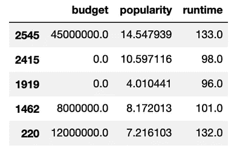
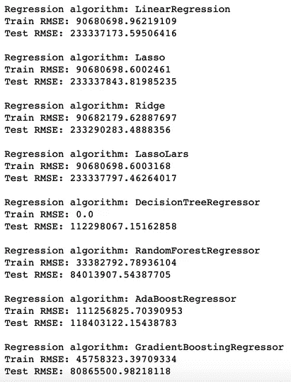
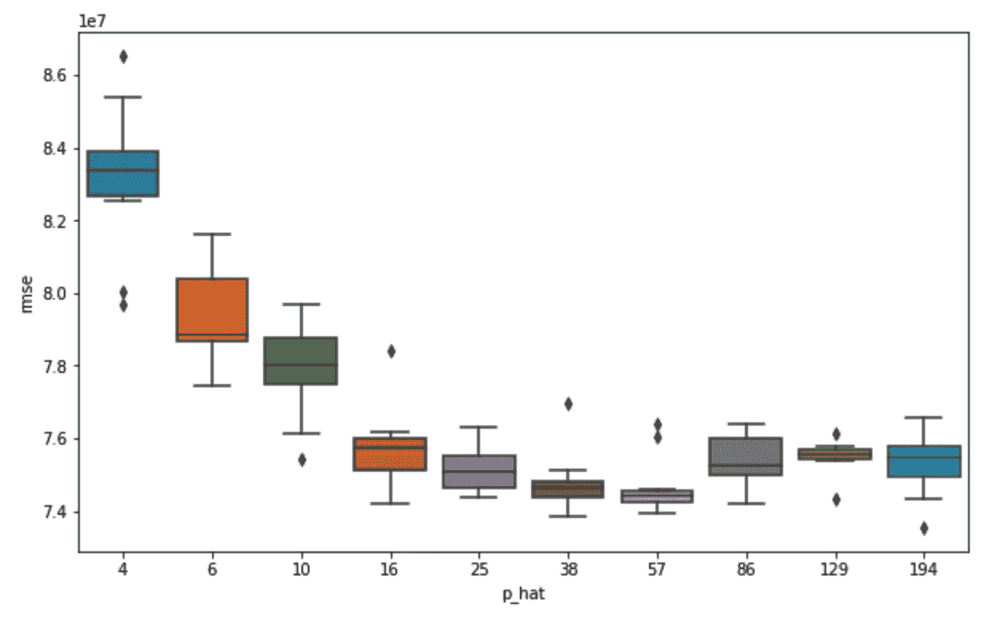
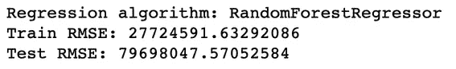

# 使用 Scikit-Learn 管道更快地清理数据和训练模型

> 原文：<https://towardsdatascience.com/use-scikit-learn-pipelines-to-clean-data-and-train-models-faster-82a5171f50dc?source=collection_archive---------9----------------------->

## 将管道纳入机器学习工作流程的快速指南


Photo by Gerd Altmann from Pixabay

如果您正在寻找一种方法来组织您的数据处理工作流并减少代码冗余，Scikit-Learn 管道将是您的数据科学工具包的一个很好的补充。在解释了它们是什么以及为什么使用它们之后，我将向你展示如何使用它们来自动化数据处理，通过使用它们来预测[全球票房收入](https://www.kaggle.com/c/tmdb-box-office-prediction/data)。

## 什么是 Scikit-Learn 管道？

管道可能是一个非常模糊的术语，但一旦你意识到它在建立机器学习模型的背景下做什么，它就非常合适了。Scikit-Learn 管道将多个数据处理步骤链接成一个可调用的方法。

例如，假设您想要从电影数据中转换连续的特征。



Continuous features from movie data

要处理回归模型的连续数据，标准处理工作流包括输入缺失值、转换倾斜变量以及标准化数据。您可以在单独的步骤中处理数据，就像这样。

```
cont_vars = ['budget', 'popularity', 'runtime']imputer = SimpleImputer(strategy = 'median')
transformer = PowerTransformer(method = 'yeo-johnson', standardize = False)
scaler = StandardScaler()X_train[cont_vars] = imputer.fit_transform(X_train[cont_vars])
X_train[cont_vars] = transformer.fit_transform(X_train[cont_vars])
X_train[cont_vars] = scaler.fit_transform(X_train[cont_vars]) 
```

但是如果你只是使用一个管道来一次应用所有的数据转换，那将会更干净、更高效、更简洁。

```
cont_pipeline = make_pipeline(
    SimpleImputer(strategy = 'median'),
    PowerTransformer(method = 'yeo-johnson', standardize = False),
    StandardScaler()
)X_train[cont_vars] = cont_pipeline.fit_transform(train[cont_vars], columns = cont_vars)
```

通过使用管道，您可以清楚地看到您的处理步骤，并快速添加或删除步骤。你也只需要调用`fit_transform()`一次，而不是三次。

## 使用管道同步处理不同的数据类型

我使用管道来处理连续数据，但是在电影数据中也有离散的数字列、分类列和 JSON 类型的列。每种数据类型都需要不同的处理方法，因此您可以为每种数据类型构建唯一的管道。

```
disc_vars = list(X_train.select_dtypes(include = int).columns)disc_pipeline = make_pipeline(
    SimpleImputer(strategy = 'constant', fill_value = -1)
)cat_vars = ['original_language', 'release_season']cat_pipeline = make_pipeline(
    SimpleImputer(strategy = 'constant', fill_value = 'unknown'),
    OneHotEncoder()
)json_vars = ['Keywords', 'crew_department', 'production_countries', 'cast_name', 'crew_job', 'production_companies', 'crew_name', 'genres', 'spoken_languages']json_pipeline = make_pipeline(
    TopCatEncoder()
)
```

`TopCatEncoder()`是我专门为电影数据编写的自定义转换器。一些数据列包含以 JSON 格式编码的信息，所以我定义了`TopCatEncoder()`和一些帮助函数来根据键将 JSON 解析成分类变量，然后保留每个新分类变量的顶级类别。这就是你需要知道的关于 transformer 的全部内容，但是如果你想了解更多，你也可以查看我的 GitHub 中的[代码](https://github.com/collindching/Mini-Projects/tree/master/Box%20Office%20Revenue%20Prediction)。

现在我已经有了处理数据所需的所有管道——`cont_pipeline`、`disc_pipeline`、`cat_pipeline`和`json_pipeline`——我可以将它们组装成一个管道，使用`ColumnTransformer()`来指定哪个管道转换哪个变量。变形金刚被指定为一个元组列表，看起来像这样:`(name, transformer, columns)`。

```
preprocessor = ColumnTransformer(
    transformers = [
        ('continuous', cont_pipeline, cont_vars),
        ('discrete', disc_pipeline, disc_vars),
        ('categorical', cat_pipeline, cat_vars),
        ('json', json_pipeline, json_vars)
    ]
)
```

要使用这条管道转换我的所有数据，我只需调用`preprocessor.fit_transform(X_train)`。

## 使用管道测试机器学习算法

这里，我使用一个名为`quick_eval()`的效用函数来训练我的模型并进行测试预测。

通过将`processor`管道与回归模型相结合，`pipe`可以同时处理数据处理、模型训练和模型评估，因此我们可以快速比较 8 个不同模型的基线模型性能。输出如下所示。



## 接下来的步骤:模型选择、特征选择和最终模型

随着数据处理和模型原型化步骤的完成，我们可以选择一个模型子集来关注。我使用了随机森林回归器，因为它的表现相对较好，而且很容易解释。

在此基础上，我们可以继续进行特征工程、特征选择和超参数调整，以获得最终模型。我使用了基于随机森林的交叉验证的变量选择程序，将我的数据从 194 个特征减少到 57 个特征，并改进了测试 RMSE。



5-fold CV model performance, p_hat is number of features fed into Random Forest regressor

这个变量选择实现不是这篇文章的重点，但是你可以在我的[代码](https://github.com/collindching/Mini-Projects/tree/master/Box%20Office%20Revenue%20Prediction)的函数`rf_variable_selection()`中找到它的实现。

上面的`TopFeatureSelector()`是另一个定制的转换器，它选择前 k 个特性来保持使用预先计算的特性重要性。



这就是你的最终模型！它的性能比具有较少特性的基线要好一点。

## 要采取的其他步骤

由于我专注于 Scikit-Learn 管道，所以我跳过了一些步骤，如**合并外部数据、特性工程和超参数调整。**如果我重新审视这个项目，让我的模型变得更强大，我会专注于这三件事。我也没有在`quick_eval()`函数中使用交叉验证，但是实现交叉验证会使这个工作流更加健壮。

*感谢阅读！我是 Scikit-Learn Pipelines 的新手，这篇博文帮助我巩固了迄今为止所做的工作。我将用我遇到的新用例来更新这个文档。*

*你可以在这里* *查看这个项目的 Jupyter 笔记本* [*。有关管道的更多信息，请查看丽贝卡·维克里的*](https://github.com/collindching/Mini-Projects/tree/master/Box%20Office%20Revenue%20Prediction) [*帖子*](https://medium.com/vickdata/a-simple-guide-to-scikit-learn-pipelines-4ac0d974bdcf) *和 Scikit-Learn 的* [*管道官方指南*](https://scikit-learn.org/stable/modules/compose.html#pipeline) *。*