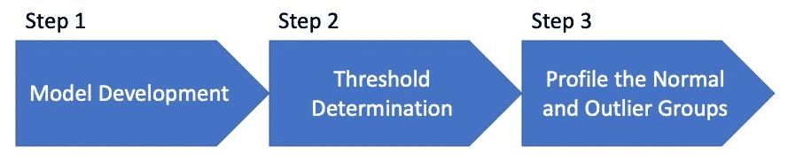

# Python 异常检测手册— (4)隔离森林

> 原文：<https://towardsdatascience.com/use-the-isolated-forest-with-pyod-3818eea68f08?source=collection_archive---------9----------------------->

Figure (A)

(2022 年 10 月 13 日修订)

如果让你把上面的树一棵一棵分开，哪棵树会是第一棵开始的？你可以选择左边的那个，因为它是独立的。去掉那棵树后，下一棵容易分离的树是什么？可能是大星团左下方的那颗。移走那棵树后，下一棵树是哪棵？可能是左上角的那个，以此类推。这里我提出一个很重要的直觉:离群值应该是最容易被孤立的。就像剥洋葱一样，离群值在外层。这就是 Isolate Forest 寻找离群值的直觉。

隔离林速度很快，并且不会消耗太多内存，因为它不使用任何距离度量来检测异常。这一优势使其适用于大数据量和高维问题。

什么是孤立森林？

许多异常值检测方法首先分析正常数据点，然后识别那些不符合正常数据模式的观察值。由[刘，廷，周(2008)](https://cs.nju.edu.cn/zhouzh/zhouzh.files/publication/icdm08b.pdf) 提出的*隔离林*或*森林*与这些方法不同。I forest*直接识别异常，而不是分析正常数据点以发现异常值。它应用树结构来隔离每个观察。异常将是首先被挑选出来的数据点；而正常点往往隐藏在树的深处。他们称每棵树为*隔离树*或*隔离树。他们的算法建立了一个 iTrees 集合。异常是那些在 iTrees 上具有短平均路径长度的观测值。**

图(A)使用一个分区图和一棵树来解释 iTree 是如何隔离数据点的。红点是离其他点最远的点，然后是绿点，然后是蓝点。在分区图中，只需要一个“切口”就可以将红点与其他点分开。第二次切割是为了绿点，第三次切割是为了蓝点，以此类推。分割一个点需要的切割越多，它在树中的位置就越深。切割次数的倒数是异常分数。图(A)右边的树形结构讲述了同样的故事。它需要一次分裂来挑出红点，然后第二次分裂来达到绿点，然后第三次分裂来达到蓝点，以此类推。深度的数量成为异常分数的良好代表。为了符合异常与高分相关联的惯例，异常分数被定义为深度数的倒数。

Figure (A): iTree (Image by author)

一棵 iTree 是一棵二叉树，其中树中的每个节点恰好有零个或两个子节点。一棵 iTree 开始增长，直到满足其中一个条件:(I)结束节点只有一个数据点，(ii)节点中的所有数据都具有相同的值，或者(iii)树达到了(由研究人员设置的)高度限制。直到所有的端节点都有一个数据点，iTree 才需要完全开发。通常当高度达到设定的极限时，它就会停止生长。这是因为我们的兴趣在于更接近根部的异常。因此，没有必要构建大的 iTree，因为 iTree 中的大多数数据都是正常的数据点。小样本量产生更好的 iTrees，因为淹没和掩蔽效应减少了。注意，这个 iTree 算法不同于决策树算法，因为 iTree 不使用目标变量来训练树。它是一种无监督的学习方法。

**(B)为什么是“森林”？**

你可能更经常听到*随机森林*而不是*孤立森林*。“森林”指的是为树木构建森林的*集合学习*。为什么需要这样做？我们都知道单个决策树的缺点是过度拟合，这意味着模型对训练数据的预测很好，但对新数据的预测很差。集成策略通过构建许多树，然后平均这些树的预测来克服这个问题。

Figure (B): Isolation Forest

图(B)显示了一个数据矩阵，其中每一行都是具有多维值的观察值。IForest 的目标是给每个观察值分配一个异常值。首先，它随机选择*任意数量的行*和*任意数量的列*来创建表，如(1)、(2)和(3)。观察将出现在至少一个表中。为每个表构建一个 iTree 来呈现异常值。表格(1)有 6 行 3 列。表(1)的第一个切割可能是第 6 个观察值，因为它的值与其他值非常不同。之后，表(1)的第二次切割可能是第四次观察。类似地，在表(3)中，第一次切割可能是第 6 次观察(这是第三次记录)。第二次切割是第 4 次观察(这是表中的第一条记录)。简而言之，如果有 *N* 个表，就会有 *N* 个树。一次观察最多可以有 *N* 个分数。IForest 计算分数的算术平均值，得到最终分数。

 [## 通过我的推荐链接加入 Medium-Chris Kuo/data man 博士

### 阅读 Chris Kuo/data man 博士的每一个故事。你的会员费直接支持郭怡广/戴塔曼博士和其他…

dataman-ai.medium.com](https://dataman-ai.medium.com/membership) 

**(C)建模程序**

像其他章节一样，我使用以下建模过程进行模型开发、评估和结果解释。

1.  模型开发
2.  阈值确定
3.  描述正常和异常组

对两个组的剖析对于交流模型的可靠性是很重要的。你的商业知识会告诉你一个特征的平均值在异常组中应该更高还是更低。如果与直觉相反，建议您调查、修改或放弃该特性。您应该迭代建模过程，直到所有的特性都有意义。

**(C.1)第一步:建立模型**

我生成了一个包含六个变量和 500 个观察值的模拟数据集。尽管这个模拟数据集有目标变量 Y，但无监督模型只使用 X 变量。Y 变量只是用于验证。“污染=0.05”时，异常值的百分比设置为 5%我们可以绘制前两个变量的散点图。黄色点是异常值，紫色点是正常数据点。

Figure (C.1)

下面我们声明并拟合模型。树“max_samples”的大小被设置为 40 个观察值。在 IForest 中，没有必要指定大的树大小，小的样本大小可以产生更好的 I tree。

让我解释一下污染率。在大多数实际应用中，我们不知道离群值的百分比。我将在第(C.2)节中说明，当事先不知道异常值的百分比时，如何确定一个合理的阈值。PyOD 默认污染率为 10%。在这里，我将污染设置为 5%，因为它在训练样本中是 5%。此参数不影响异常值分数的计算。内置函数`threshold_`计算污染率下训练数据的阈值。在这种情况下，当污染率为 0.05 时，阈值为-5.082e-15。函数`decision_functions()`生成异常值分数，函数`predict()`基于阈值分配标签(1 或 0)。

**(C.1.1)超参数**

我将用`.get_params()`解释一些重要参数:

*   “max_samples”:从 X 中抽取的样本数，用于训练每个基本估计量。这是一棵树的大小，是一个重要的参数。
*   “n_estimators”:集合中树的数量。默认值是 100 棵树。
*   “max_features”:从 X 中抽取的特征数，用于训练每个基本估计量。默认值为 1.0。
*   “n_jobs”:为“fit”和“predict”并行运行的作业数。默认值为 1.0。如果设置为-1，则作业数量将设置为核心数量。

**(C.1.2)可变重要性**

因为 IForest 应用了一个树形框架，我们将能够理解特性在确定离群值时的相对重要性。特征的重要性通过基尼系数来衡量。这些值的总和为 1.0。

我们可以像基于树的模型一样绘制特征重要性。图(C.1.2)显示了特征在确定异常值时的相对强度。

Figure (C.1.2): Variable importance of IForest for Outliers

**(C.2)步骤 2——为模型确定一个合理的阈值**

阈值将由异常值分数的直方图来确定。图(C.2)建议阈值为 0.0 左右。这意味着大多数正常数据的异常值小于 0.0。异常数据的异常值在高范围内。

Figure (C.2)

**(C.3)步骤 3 —呈现正常组和异常组的描述性统计数据**

描述正常组和异常组是证明模型可靠性的关键步骤。我创建了一个简短的函数`descriptive_stat_threshold()`来显示正常组和异常组的特征的大小和描述性统计。下面我简单地采用设定污染率的阈值。您可以测试阈值范围，以确定离群值组的合理大小。

Table (C.3)

上表包括模型评估和模型结果的基本要素。提醒您使用功能名称来标记功能，以便有效地进行演示。

*   **离群组的大小:**记住离群组的大小是由阈值决定的。如果为阈值选择较高的值，大小将会缩小。
*   **各组的特征统计:**特征统计要与任何之前的业务知识一致。如果任何特征显示出与直觉相反的结果，则该特征应该被重新检查或移除。应该重新迭代模型，直到所有特性都有意义。
*   **平均异常分:**异常组的平均异常分远高于正常组(0.18 > -0.10)。你不需要对分数解读太多。

因为我们在数据生成中有基础事实，所以我们可以生成混淆矩阵来理解模型性能。该模型提供了一个体面的工作，并确定了所有 25 个异常值。

**(D)通过聚合多个模型实现模型稳定性**

由于 IForest 是一种基于邻近度的算法，因此它对异常值很敏感，并且可能会过度拟合。为了产生稳定的预测结果，我们可以汇总多个模型产生的分数。在所有的超参数中，树的数量`n_estimators`可能是最重要的一个。我将为一系列的树木制作 5 个模型。这些模型的平均预测将是最终的模型预测。PyOD 模块提供了四种汇总结果的方法。记住使用`pip install combo`功能。你只需要使用一种方法来产生你的综合结果。

对 5 个模型的预测进行平均，以获得平均异常值分数(“y_by_average”)。我在图(D)中创建了它的直方图。

Figure (D): The histogram of the average score

图(D)表明阈值等于 1.0。这样，我在表(D)中描绘了正常组和异常组的特征。它将 25 个数据点识别为异常值。读者应对表(C.3)进行类似的解释。

Table (D)

**(E)摘要**

*   大多数现有的基于模型的异常检测方法构建正常实例的简档，然后将不符合正常简档的实例识别为异常值。但是 IForest 直接且明确地隔离了异常。
*   IForest 采用树形结构来隔离每一个数据点。异常是首先被挑选出来的奇异数据点；而正常点倾向于在树中聚集在一起。
*   因为隔离林不使用任何距离度量来检测异常，所以它速度很快，适合于大数据量和高维问题。

**(F) Python 笔记本:**点击[此处](https://github.com/dataman-git/codes_for_articles/blob/master/04.iForest.ipynb)为笔记本。

**参考文献**

*   刘福亭，丁克明，周志宏(2008)。隔离森林。 *2008 年第八届 IEEE 数据挖掘国际会议*(第 413-422 页)。

为了便于导航到章节，我在最后列出了章节。

*   [第 1 章—简介](https://dataman-ai.medium.com/handbook-of-anomaly-detection-with-python-outlier-detection-1-introduction-c8f30f71961c)
*   [第 2 章—基于直方图的异常值得分(HBOS)](https://medium.com/dataman-in-ai/anomaly-detection-with-histogram-based-outlier-detection-hbo-bc10ef52f23f)
*   [第 3 章——经验累积异常值检测(ECOD)](https://dataman-ai.medium.com/handbook-of-anomaly-detection-with-python-outlier-detection-3-ecod-5cbf3e3021eb)
*   [第 4 章——隔离林(IForest)](/use-the-isolated-forest-with-pyod-3818eea68f08)
*   [第 5 章——主成分分析](https://dataman-ai.medium.com/handbook-of-anomaly-detection-with-python-outlier-detection-5-pca-d1acbdba1b7e)
*   [第六章——单类支持向量机](https://dataman-ai.medium.com/handbook-of-anomaly-detection-with-python-outlier-detection-6-ocsvm-f746dae9f450)
*   [第七章——高斯混合模型(GMM)](https://dataman-ai.medium.com/handbook-of-anomaly-detection-with-python-outlier-detection-7-gmm-b6fac40eaded)
*   [第八章——K 近邻(KNN)](https://medium.com/dataman-in-ai/anomaly-detection-with-pyod-b523fc47db9)
*   [第 9 章—局部异常因素(LOF)](https://dataman-ai.medium.com/handbook-of-anomaly-detection-with-python-outlier-detection-9-lof-8c1831359cc3)
*   [第十章——基于聚类的局部异常因子(CBLOF)](https://dataman-ai.medium.com/handbook-of-anomaly-detection-with-python-outlier-detection-10-cblof-35b6c01cd055)
*   [第 11 章——基于极端增强的异常检测(XGBOD)](https://dataman-ai.medium.com/handbook-of-anomaly-detection-with-python-outlier-detection-11-xgbod-8ce51ebf81b0)
*   [第 12 章——自动编码器](/anomaly-detection-with-autoencoder-b4cdce4866a6)
*   [第 13 章——极度不平衡数据的欠采样](https://medium.com/dataman-in-ai/sampling-techniques-for-extremely-imbalanced-data-part-i-under-sampling-a8dbc3d8d6d8)
*   [第 14 章—极度不平衡数据的过采样](https://medium.com/dataman-in-ai/sampling-techniques-for-extremely-imbalanced-data-part-ii-over-sampling-d61b43bc4879)

 [## 通过我的推荐链接加入 Medium-Chris Kuo/data man 博士

### 阅读 Chris Kuo/data man 博士的每一个故事。你的会员费直接支持郭怡广/戴塔曼博士和其他…

dataman-ai.medium.com](https://dataman-ai.medium.com/membership) 

建议读者购买郭怡广的书籍:

*   可解释的人工智能:[https://a.co/d/cNL8Hu4](https://a.co/d/cNL8Hu4)
*   图像分类的迁移学习:[https://a.co/d/hLdCkMH](https://a.co/d/hLdCkMH)
*   现代时间序列异常检测:[https://a.co/d/ieIbAxM](https://a.co/d/ieIbAxM)
*   异常检测手册:[https://a.co/d/5sKS8bI](https://a.co/d/5sKS8bI)