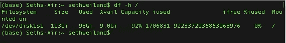
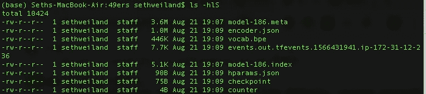
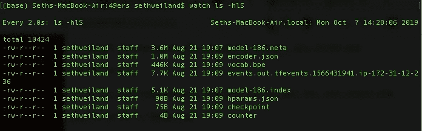

# 对数据科学家有用的命令行工具

> 原文：<https://towardsdatascience.com/useful-command-line-tools-for-data-scientists-f9c929901e08?source=collection_archive---------13----------------------->

## 适用于您的 linux 终端的各种便利工具

从命令行工作可能令人畏惧，但对于任何数据科学家来说，这都是一项重要的技能。当在远程 linux 实例上工作时，您不再能够访问您最喜欢的 GUI，而是必须使用命令行来导航您的远程实例。这个工具列表并不是命令行入门指南，而是我觉得有用的工具大杂烩，我希望你也一样！

## 我们的好朋友 grep

grep 是一个命令行工具，用于在文件中搜索模式。grep 将打印文件中与标准输出(终端屏幕)模式匹配的每一行。当我们可能希望使用给定模式对我们的数据子集进行建模或执行 EDA 时，这可能特别有用:

```
 grep "2017" orders.csv > orders_2017.csv
```

在上面的命令中，我们从“orders.csv”数据集中捕获所有包含模式“2017”的行，然后将包含此字符串的行写入名为“orders_2017.csv”的新文件。当然，如果我们对 **order_date** 列感兴趣，而另一个不同的列，如 **address** 包含模式“2017”(即 2017 Wallaby Lane) **、**，那么我们可能会得到错误年份的数据；然而，这在熊猫身上可以很快得到解决。在马上使用 pandas 之前使用 grep 的一个原因是命令行工具通常是用 C 编写的，所以它们非常快。另一个原因是，使用 os.system()可以很容易地将它们放在 python 脚本中:

Grep is great and can also be used with all kinds of regular expressions using the -E option.

## htop

有没有在熊猫工作，收到内存错误的？您是否并行运行了一些操作(即使用 n_jobs=-1 来拟合 sklearn 模型)并且不确定是否所有的 CPU 都在使用中？那么 **htop** 是给你的！ **htop** 很棒，因为它允许您查看机器上当前的 CPU 和 RAM 使用情况:

在我的例子中，我的机器有四个 CPU，所以前四行显示了每个 CPU 的使用统计。第五行显示了我的电脑 8GB 内存的使用情况。下表显示了正在运行的进程以及相关的进程 id (PID)、内存和 CPU 使用情况以及一些其他有用的统计信息。

假设我们在 Jupyter 笔记本中遇到了熊猫操作的内存问题，使用 **htop** 可以帮助我们监控每个操作对 RAM 使用的影响。如果我们有这样的代码:

在上面的代码段中，我们正在为我们的熊猫数据帧制作大量副本，htop 可以帮助我们更好地认识到我们何时接近 RAM 阈值。此外，如果我们的机器上正在运行其他我们目前不需要的内存密集型进程，我们可以使用 **kill** 命令行工具终止或暂停它们( kill 的-9 选项将终止该进程，确保您终止的进程是非必要的/不是系统进程)。看 **htop** 或者 **ps** 输出得到 PID。

```
kill -9 {insert PID here}
```

## df

df 是一个有用的工具，用来验证我们的机器上有多少可用的磁盘空间。当在没有指定任何文件名的情况下使用时， **df** 返回所有当前挂载的文件系统上的可用空间；但是，如果我想查看整个机器上有多少可用空间，我可以运行:

```
df -h /
```

h 选项返回人类可读的格式，而“/”表示根文件系统中有多少可用空间:



当需要在远程 AWS EC2 实例上为大量下载创建空间时， **df** 有助于确定还需要清理多少空间。如果您正在从一个包含大量大文件的旧项目中释放磁盘空间，您可以运行“ls -hlS”来查看可读的长格式(-l，意味着您可以查看权限/文件大小/最后修改日期)的文件，这些文件在给定的目录中按文件大小降序(-S)排序。这样可以快速确定删除哪些文件可以释放最多的空间:



## 看

**watch** 是一个易于使用的命令，当你需要一个命令的输出每 n 秒刷新一次时，这个命令可以派上用场。我过去从 [pushshift reddit 评论数据库](https://files.pushshift.io/reddit/comments/)下载大型 JSON 文件时使用过这个命令。每个解压后的月评论是一个 100GB 的文件，所以我写了一个[脚本](https://github.com/sethweiland/reddit_nfl_comments/blob/master/download_clean.py)一次下载一个文件，从 subreddits 中过滤掉我不感兴趣的评论，写到 MongoDB，删除大的 JSON 文件。在这种情况下，我使用**手表**反复检查是否正确的文件被下载，解压缩，然后在下载后删除。



正如我们在上面看到的，watch 的默认设置是每两秒钟重复一次命令，尽管我们可以用“ **-n {number_seconds}** ”选项来修改它。

## 单细胞蛋白质

scp 代表 secure copy，是一个有用的命令，我们可以用它在远程实例之间发送文件。

**发送到远程:**

```
scp -i ~/.ssh/path/to_pem_file /path/to/local/file ubuntu@IPv4:./desired/file/location
```

在上面的命令中，“ubuntu”是 ubuntu 实例的默认 AMI ssh 用户名，因此这可以根据您使用的 linux 发行版而改变。您的 IPv4 通常被格式化为由句点分隔的四个 8 位字段(即 32.14.152.68)。I 选项只是指定我们将使用一个身份文件，该文件包含公钥认证所必需的私钥。

**从遥控器下载:**

```
scp -i ~/.ssh/path/to_pem_file ubuntu@IPv4:./path/to/desired/file/   ~/my_projects/
```

注意，这个下载命令仍然是从我们的本地终端执行的。我们刚刚交换了本地文件系统和远程文件系统的写入顺序。此外，值得一提的是，如果我们对该命令使用-r 选项，我们可以递归地复制目录，而不仅仅是文件:

```
scp -i ~/.ssh/path/to_pem_file -r ubuntu@IPv4:./path/to/desired/folder/ ~/my_projects/
```

# 结论

linux 命令行提供了一系列功能强大的工具，可以真正帮助提高生产率，并了解机器的当前状态(即磁盘空间、正在运行的进程、RAM、CPU 使用情况)。在远程 linux 实例上工作通常是熟悉命令行的一个很好的方式，因为您被迫使用它，并且不能依靠 Mac 的 Finder 来导航文件系统。上面讨论的工具是我最喜欢/最常用的(除了 ls 和 cd 之外)，我希望如果你以前不知道它们，你能把它们结合到你的工作流程中。感谢您的阅读！

## 进一步阅读

有用的命令列表:[T3【http://www.slackstu.net/171/171-class-19f.xhtml】T5](http://www.slackstu.net/171/171-class-19f.xhtml)

命令行的数据科学:[**https://www . datascienceathecommandline . com/chapter-5-scrubping-data . html**](https://www.datascienceatthecommandline.com/chapter-5-scrubbing-data.html)