# Python 中有用的字符串方法

> 原文：<https://towardsdatascience.com/useful-string-methods-in-python-5047ea4d3f90?source=collection_archive---------7----------------------->

## 了解一些 Python 内置的可用于字符串的方法

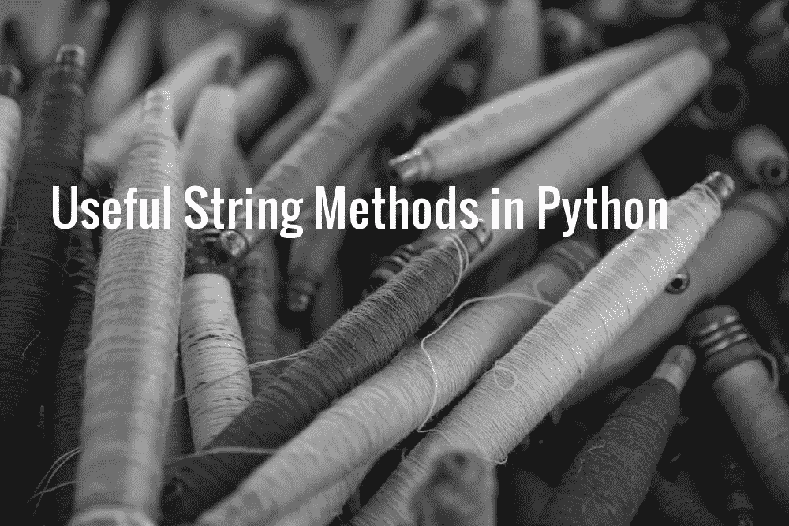

original Image: [Terri Bleeker](https://unsplash.com/@terri_bleeker?utm_source=unsplash&utm_medium=referral&utm_content=creditCopyText) on [Unsplash](https://unsplash.com/search/photos/string?utm_source=unsplash&utm_medium=referral&utm_content=creditCopyText)

字符串是一系列字符。Python 中内置的 string 类表示基于 Unicode 国际字符集的字符串。字符串实现了 Python 中常见的操作序列，以及一些它们独有的附加方法。下图显示了所有这些可用的方法:

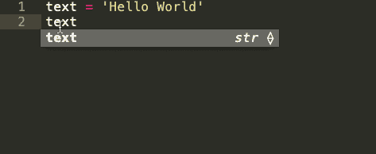

Built-in String Functions in Python

在这篇文章中，我们将了解一些更常用的。这里需要注意的重要一点是，所有的字符串方法总是返回新值，并且不改变或操作原始字符串。

这篇文章的代码可以从相关的 [Github 库](https://github.com/parulnith/Useful-String-Methods-in-Python)获得，或者你可以点击下面的图片在我的活页夹上查看。

# 1.居中( )

`[center()](https://docs.python.org/3.7/library/stdtypes.html#str.center)`方法居中对齐字符串。对齐是使用指定的字符完成的(缺省情况下是空白)

## 句法

`str.**center**(length, fillchar)`，其中:

*   **长度**是字符串的长度*要求*
*   **fillchar** 是指定对齐的字符[ *可选*

## 例子

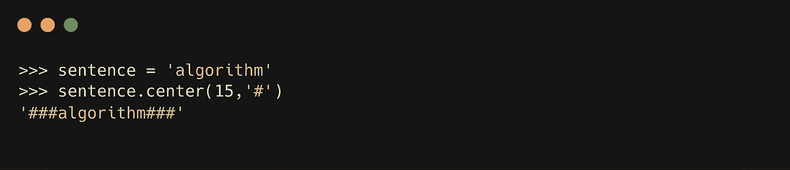

# 2.计数( )

`[count()](https://docs.python.org/3.7/library/stdtypes.html#str.count)`方法返回特定值在字符串中出现的次数。

## 句法

`str.**count**(value, start, end)`，其中:

*   **值**是要在字符串[ *必选* ]中搜索的子字符串
*   **start** 是字符串中开始搜索指定值的起始索引[ *可选*
*   **end** 是字符串中结束搜索指定值的结束索引[ *可选*

## 例子

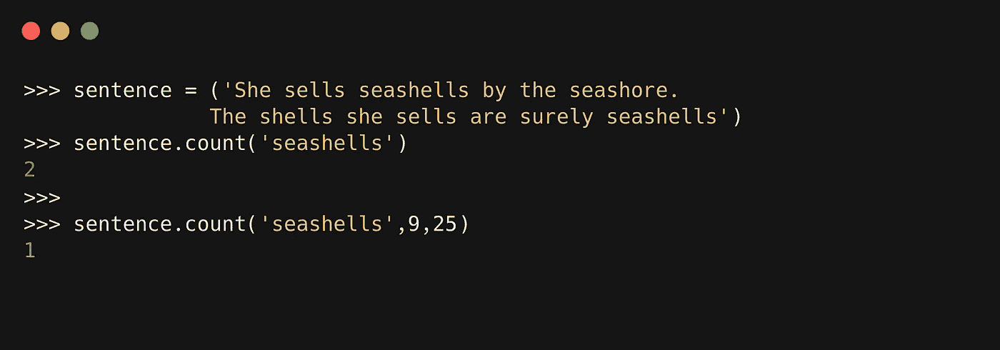

# 3.查找( )

`[find()](https://docs.python.org/3.7/library/stdtypes.html#str.find)`方法返回字符串中特定子串的最低索引。如果找不到子字符串，则返回-1。

## 句法

`str.**find**(value, start, end)`，其中:

*   **在字符串[ *必选* ]中要搜索的值**或子字符串
*   **start** 是字符串中开始搜索指定值的起始索引[ *可选* ]
*   **end** 是字符串中结束搜索指定值的结束索引[ *可选*

## 类型

[**rfind()**](https://docs.python.org/3.7/library/stdtypes.html#str.rfind):[rfind()](https://docs.python.org/3.7/library/stdtypes.html#str.rfind)方法类似于 find()，只是它返回子串的最高索引值

## 例子

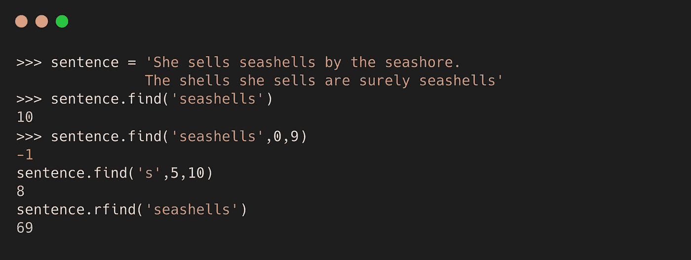

# 4.交换情况( )

方法返回一个字符串的副本，所有的大写字母都转换成小写，反之亦然。

## 句法

`string.swapcase()`

## 例子

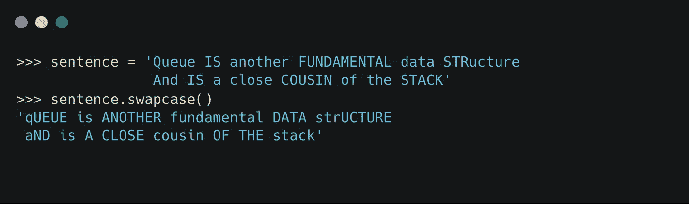

# 5.startswith()和 endswith()

如果字符串以指定的值开始，则`[startswith()](https://docs.python.org/3.7/library/stdtypes.html#str.startswith)`方法返回 True 否则，它返回 False。

另一方面，如果字符串以指定的值结束，函数`endswith()`返回 True，否则返回 False。

## 句法

`string.startswith(value, start, end)`

`string.endsswith(value, start, end)`

*   **值**是在字符串[ *必选* ]中查找的字符串
*   **start** 是字符串中开始搜索指定值的起始索引[ *可选*
*   **end** 是字符串中结束搜索指定值的结束索引[ *可选*

## 例子

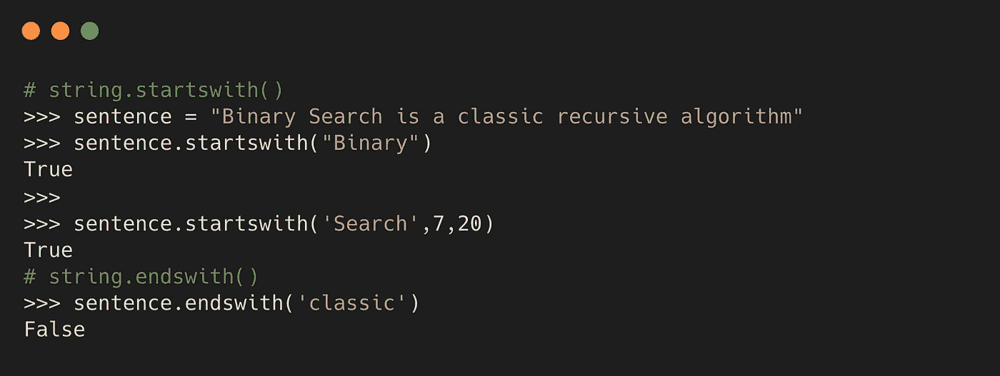

# 6.拆分( )

[split()](https://docs.python.org/3.7/library/stdtypes.html#str.split) 方法返回一个字符串中的单词列表，其中默认分隔符是任何空格。

## 句法

`string.split(sep, maxsplit)`

*   **sep** :用于分割字符串的分隔符。如果没有指定，空白是默认分隔符[ *可选* ]
*   **最大分割:**表示分割的次数。默认值为-1，表示“所有事件”*可选 T43*

## 版本

*   [**【rsplit(**](https://docs.python.org/3.7/library/stdtypes.html#str.rsplit)**)**:从右侧拆分一个字符串。

## 例子

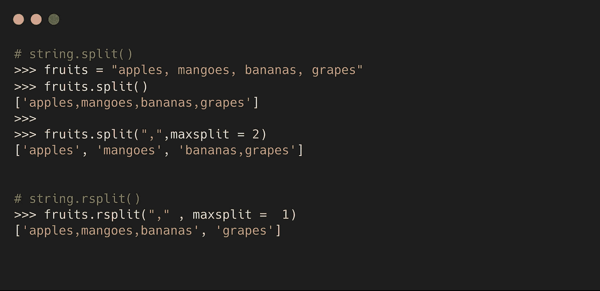

# 7.字符串大写

## 1.大写( )

方法只将字符串的第一个字符大写。

**语法**

`string.capitalize()`

## 2.上部( )

[upper()](https://docs.python.org/3.7/library/stdtypes.html#str.upper) 方法将字符串中的所有字母大写。

**语法**

`string.upper()`

## 3.string.title()

[title()](https://docs.python.org/3.7/library/stdtypes.html#str.title) 方法将给定字符串的所有首字母大写。

**语法**

`string.title()`

## 例子

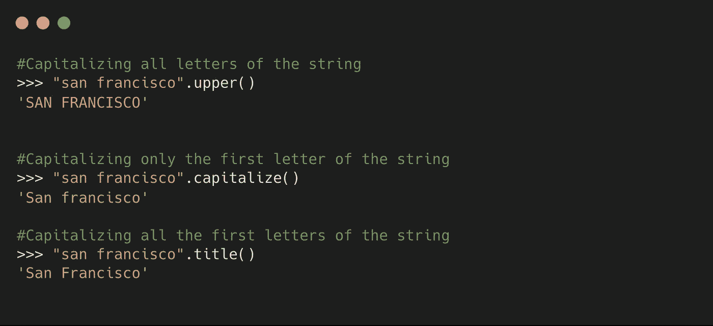

# 8.ljust()和 rjust()

方法使用一个指定的字符返回给定字符串的左对齐版本，默认为空白。rjust()方法将字符串右对齐。

## 句法

`string.rjust/ljust(length, character)`

*   **length:** 要返回的字符串的长度[ *必选*
*   **字符:**用于填充缺省空格的字符[ *可选* ]

## 例子

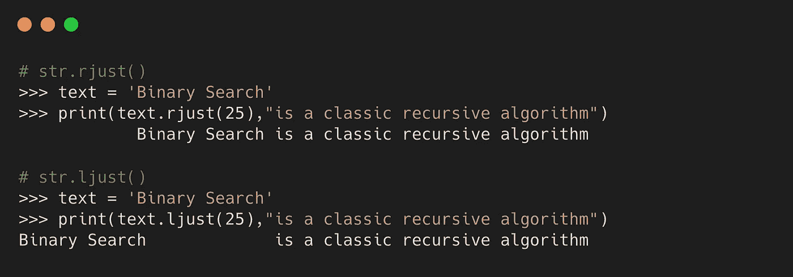

# 9.条状( )

方法返回一个去掉了前导和尾随字符的字符串的副本。要删除的默认字符是空白。

## 句法

`string.strip(character)`

**字符:**要删除的字符集[ *可选*

## 版本

*   [rstrip()](https://docs.python.org/3.7/library/stdtypes.html#str.rstrip) :从字符串右侧剥离字符。
*   [lstrip()](https://docs.python.org/3.7/library/stdtypes.html#str.lstrip) :从字符串左侧剥离字符。

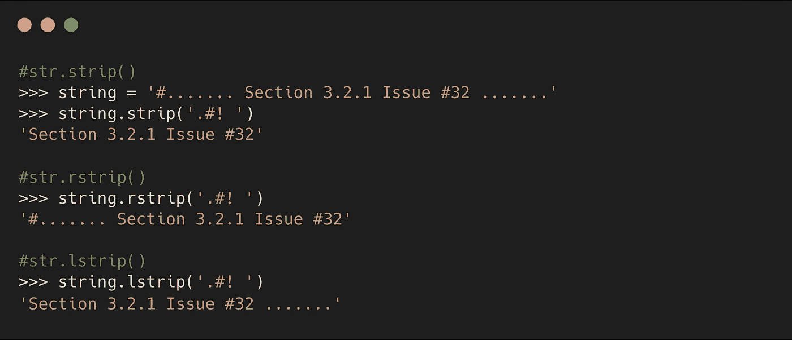

# 10.零填充( )

zfill()方法在字符串的开头添加零(0)。返回字符串的长度取决于提供的宽度。

## 句法

`string.zfill(width)`

*   **width** :指定返回字符串的长度。但是，如果宽度参数小于原始字符串的长度，则不会添加零。

## 例子

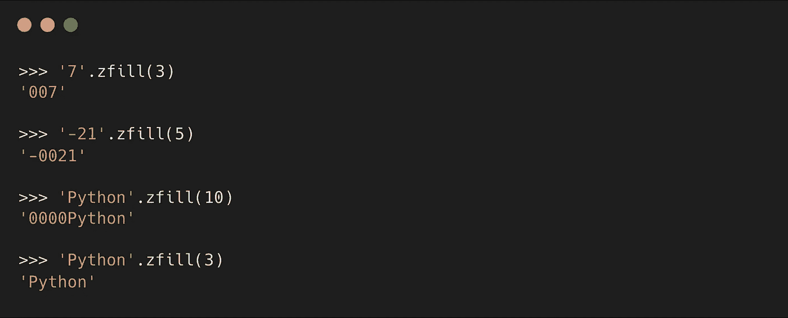

# 结论

这些是 Python 中一些有用的内置字符串方法。还有一些文章中没有提到，但同样重要。如果您想更深入地了解细节，Python 文档是一个很好的资源。