# 使用 Spark 进行用户流失预测

> 原文：<https://towardsdatascience.com/user-churn-prediction-using-spark-22ff8dafb5c?source=collection_archive---------28----------------------->

## Udacity 数据科学家纳米学位计划顶点项目


该项目是 [**Udacity**](https://eu.udacity.com/) **数据科学家纳米学位项目:数据科学家顶点计划的最终项目。**目标是预测用户是否会从虚拟的数字音乐服务中流失 **Sparkify**

流失预测是商业中最受欢迎的**大数据**用例之一。正如这篇[帖子](https://neilpatel.com/blog/improve-by-predicting-churn/)中更好地解释的那样，它的目标是确定客户是否会取消他的服务订阅

让我们从使用 **CRISP-DM 流程**(数据挖掘的跨行业流程)开始:

1.  **业务理解**
2.  **数据理解**
3.  **准备资料**
4.  **数据建模**
5.  **评估结果**
6.  **展开**

**业务理解**

Sparkify 是一项数字音乐服务，可以免费使用，方法是在歌曲之间收听一些广告，或者支付每月订阅费以获得无广告体验。在任何时候，用户都可以决定从高级降级到免费，从免费升级到高级或者取消服务。

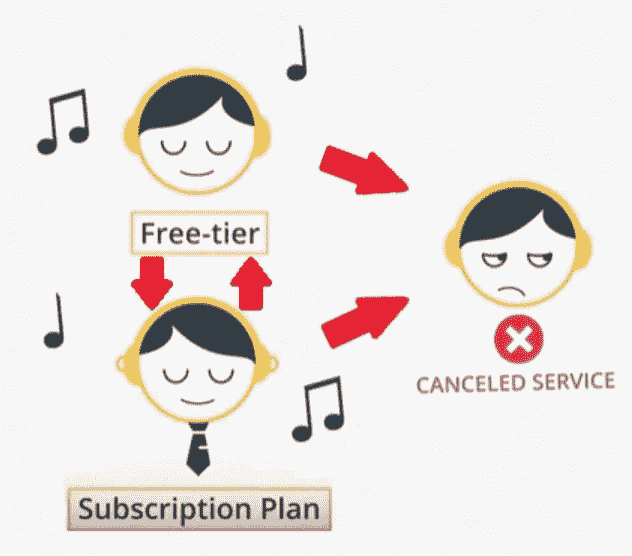

[https://www.udacity.com/course/data-scientist-nanodegree--nd025](https://www.udacity.com/course/data-scientist-nanodegree--nd025)

**数据理解**

所提供的数据集基本上由平台上每个用户操作的日志组成。每个动作都标有时间戳 **ts**

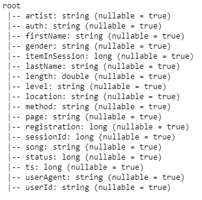

Dataset attributes

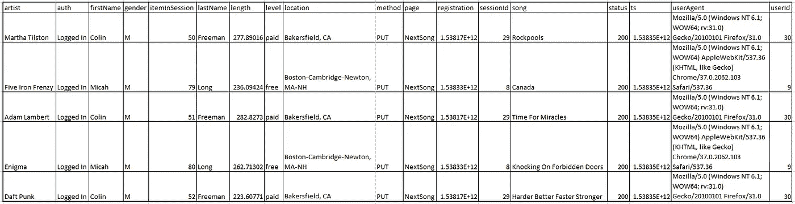

First 5 records as example

在这个小数据集中，我们有来自 225 个用户的 286500 条记录:

46%的女性和 54%的男性

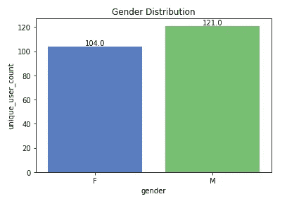

Gender distribution in the small dataset

54%的互动来自免费用户，46%来自高级用户

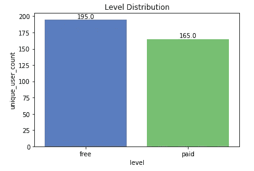

Level distribution in the small dataset

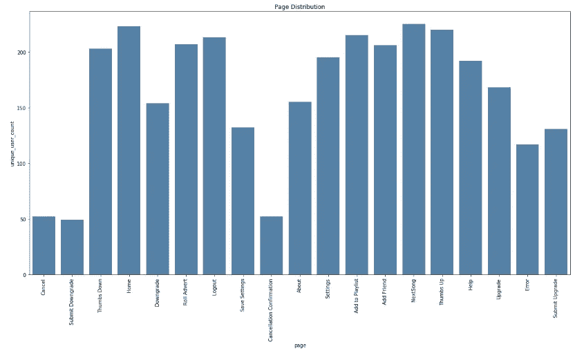

Page distribution in the small dataset

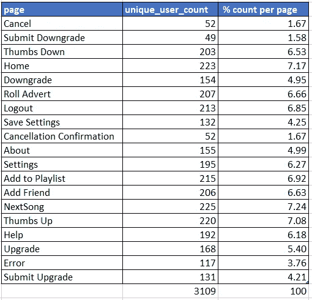

% page distribution in the small dataset

这些记录的时间跨度从 2018 年 10 月到 2018 年 12 月

**准备数据**

第一步是删除所有用户 Id 为空的记录。空字符串 **userId** 很可能指的是尚未注册的用户，或者已经注销并即将登录的用户，因此我们可以删除这些记录。

然后我定义了一个新的`Churn`列，它将被用作模型的标签。基本上，如果用户曾经访问过`Cancellation Confirmation`页面，我们会将其标记为搅动。当然，这个事件对于付费和免费用户都可能发生。

我们获得了 23%的流失用户和 77 %的未流失用户，因此数据集非常不平衡。正如这篇精彩的[帖子](http://www.davidsbatista.net/blog/2018/08/19/NLP_Metrics/)中所解释的，当我们在**评估结果**部分讨论指标时，我们必须记住这一点

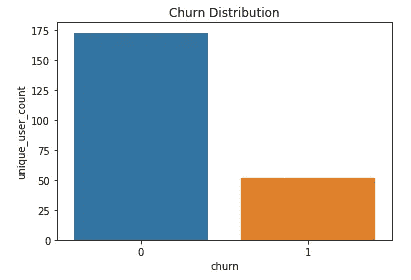

Churn distribution in the small dataset

然后，我对一些特性进行了比较，同时也考虑了`Churn`值:

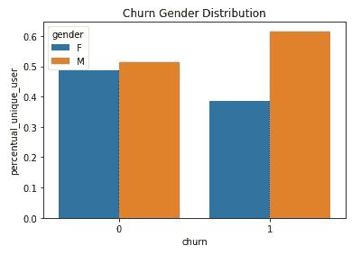

Churn Gender distribution in the small dataset

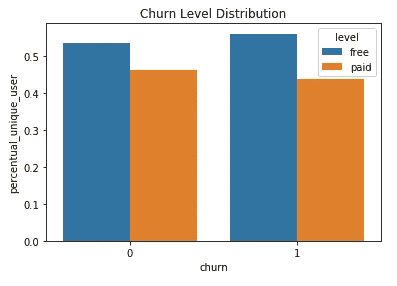

Churn Level distribution in the small dataset

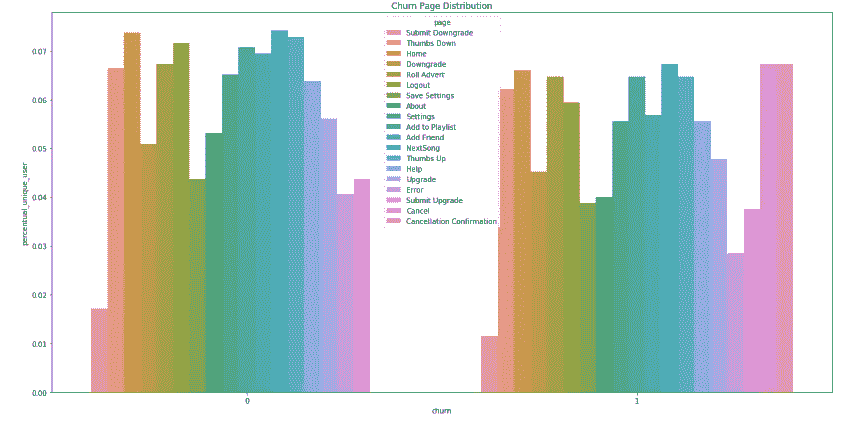

Churn Page distribution in the small dataset

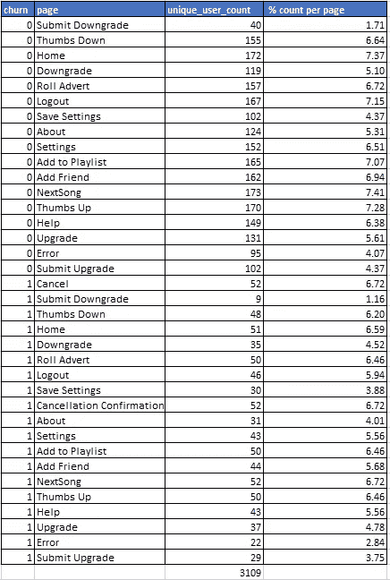

% churn page distribution in the small dataset

**数据建模**

所有对我们的任务有用的分类特征都已经通过**用户 Id** :
-性别
-级别
-页面进行了一次性编码和聚合

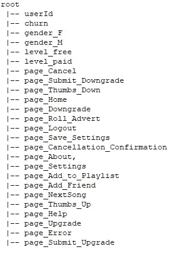

Engineered dataset attributes

然后，我们通过提出以下问题添加了一些有趣的工程特性:
-用户订阅该服务多久了？流失与此有关吗？
-上个月的活动(对于不满意的用户，取消是取消前的最后一个月)以周为单位划分
-一个用户听了多少艺术家的音乐？

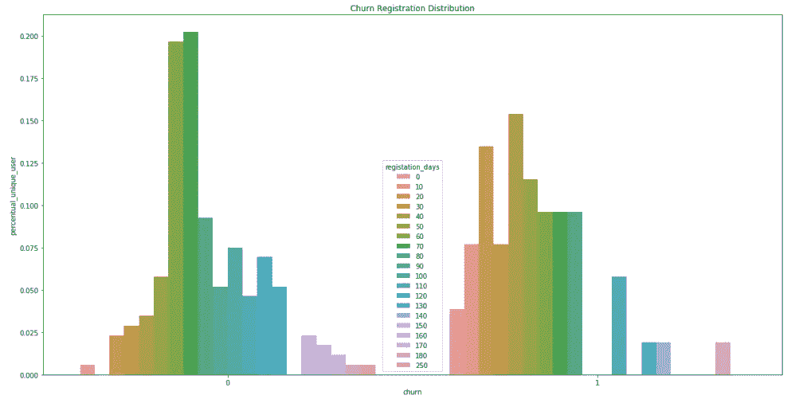

Churn Registration days distribution in the small dataset

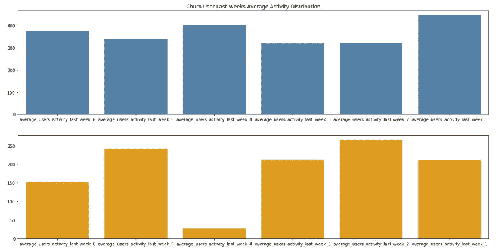

Churn Last week average activity distribution in the small dataset

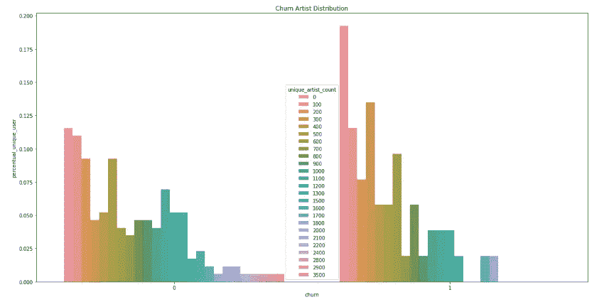

Churn Artist distribution in the small dataset

为 ML 准备的最终数据集如下所示:

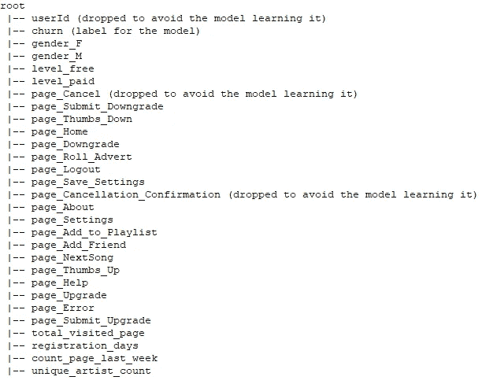

Engineered dataset attributes in input to the model

重要的是不要考虑像`page_Cancellation_Confirmation`或`page_Cancel`这样的属性，因为它们精确地映射了标签列，所以准确率总是 100%，因为我们基本上是在学习我们想要预测的值

**评估结果**

**混淆矩阵**是一个表格，通常用于描述一个分类模型对一组真实值已知的测试数据的性能。

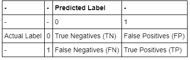

**准确性**衡量分类器做出正确预测的频率。它是正确预测数与总预测数的比率:

`Accuracy = (True Positives + True Negative) / (True Positives + False Positives + True Negatives + False Negatives)`

精度告诉我们正确的预测中有多少是正确的。它是真阳性与所有阳性的比率:

`Precision = True Positives / (True Positives + False Positives)`

回忆(敏感度)告诉我们实际上正确预测中有多少被我们归类为正确的。它是真阳性与所有实际阳性预测的比率:

`Recall = True Positives / (True Positives + False Negative)`

**F-beta 评分**是一个同时考虑精确度和召回率的指标:


生成**朴素预测器**的目的只是为了显示没有任何智能的基础模型是什么样子。如前所述，通过观察数据的分布，很明显大多数用户不会流失。因此，总是预测`'0'`(即用户不访问页面`Cancellation Confirmation`)的模型通常是正确的。

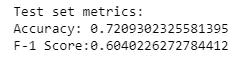

将所有用户标记为流失= 0 的朴素模型在测试集上做得很好，准确率为 81.2%，F1 分数为 0.7284

数据集不平衡的事实也意味着**精确度**没有太大帮助，因为即使我们获得高精确度，实际预测也不一定那么好。在这种情况下，通常建议使用**精度**和**召回**

让我们比较 3 个模型的结果:

*   **逻辑回归**
*   **梯度提升树**
*   **支持向量机**

第一步是删除培训中不必要的列

```
colonne = df.columns[1:-1]
colonne
```

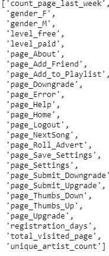

Features used for ML training

然后所有的特征都被矢量化(不需要转换，因为所有的特征都是数字)

```
assembler = VectorAssembler(inputCols = colonne, outputCol = ‘features’)data = assembler.transform(df)
```

`StandarScaler()`用于缩放数据

```
scaler = StandardScaler(inputCol = 'features', outputCol = 'scaled_features', withStd = True)scaler_model = scaler.fit(data)data = scaler_model.transform(data)
```

然后，我将数据分为训练、测试和验证数据集

```
train, rest = data.randomSplit([0.6, 0.4], seed = 42)validation, test = rest.randomSplit([0.5, 0.5], seed = 42)
```

对于所有车型，我都使用了 F1 分数作为衡量标准

```
f1_evaluator = MulticlassClassificationEvaluator(metricName = ‘f1’)
```

以及`ParamGridBuilder()`和 3 倍`CrossValidator()`来确定考虑所有参数的模型的最佳超参数

```
param_grid = ParamGridBuilder().build()
```

**逻辑回归**

```
logistic_regression = LogisticRegression(maxIter = 10)crossvalidator_logistic_regression = CrossValidator(  
estimator = logistic_regression,                                 evaluator = f1_evaluator,                                                    estimatorParamMaps = param_grid,                                                    numFolds = 3)cv_logistic_regression_model = crossvalidator_logistic_regression.fit(train)
```

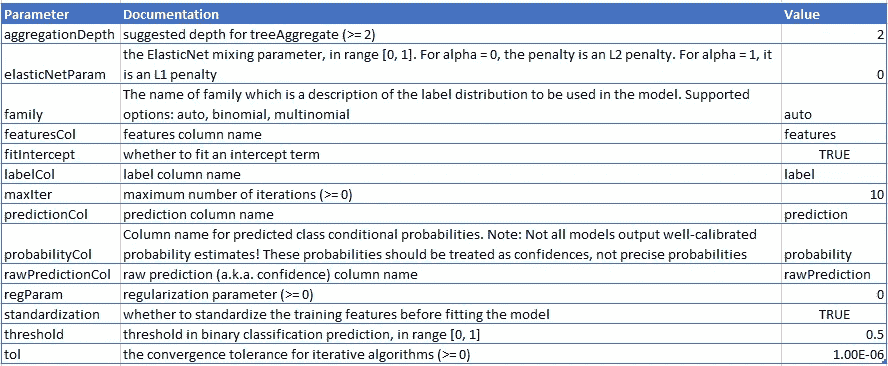

Best parameters

**梯度提升树**

```
gradient_boosted_trees = GBTClassifier(maxIter = 10, seed = 42)crossvalidator_gradient_boosted_trees = CrossValidator(
estimator = gradient_boosted_trees,                                                       evaluator = f1_evaluator,                                                       estimatorParamMaps = param_grid,                                                       numFolds = 3)cv_gradient_boosted_trees_model = crossvalidator_gradient_boosted_trees.fit(train)
```

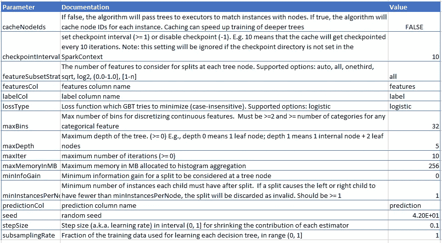

Best parameters

GBT 也允许看到特性的重要性:

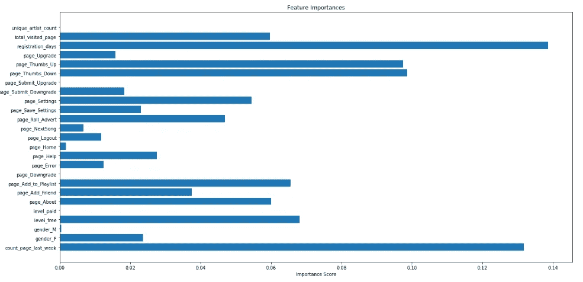

Feature importances from GBT

我们可以看到`registration_days`和`count_page_last_week`具有最高的重要性

**支持向量机**

```
linear_svc = LinearSVC(maxIter = 10)crossvalidator_linear_svc = CrossValidator(
estimator = linear_svc,                                           evaluator = f1_evaluator,                                           estimatorParamMaps = param_grid,                                           numFolds = 3)cv_linear_svc_model = crossvalidator_linear_svc.fit(train)
```

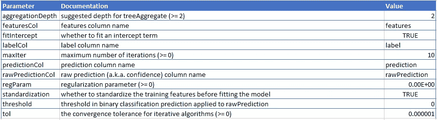

Best parameters

总的来说，**逻辑回归**具有最好的结果，在测试数据集上 **F-1 得分**为 0.8218，在验证数据集上为 0.7546

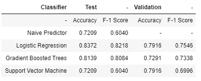

Results on test and validation datasets

**细化**

我第一次尝试手动调整模型的一些参数，但是通过让`ParamGridBuilder()`和`CrossValidator()`搜索所有参数获得了最佳结果

**部署**

根据 DSND 顶点项目的**云部署说明的建议，我已经用 [**AWS**](https://aws.amazon.com) 创建了一个集群**

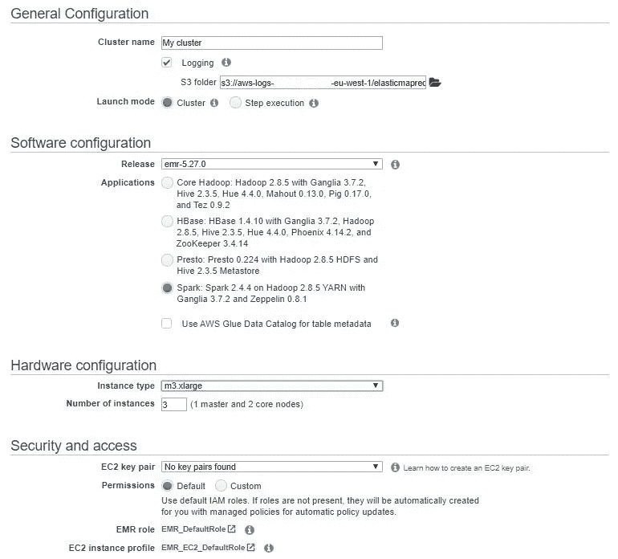

My cluster configuration

正如这里更好地解释的**m3 . xlarge**是第二代通用 **EC2** 实例，配备了高频**英特尔至强 E5–2670**和 2 个基于 40 GB 固态硬盘的实例存储

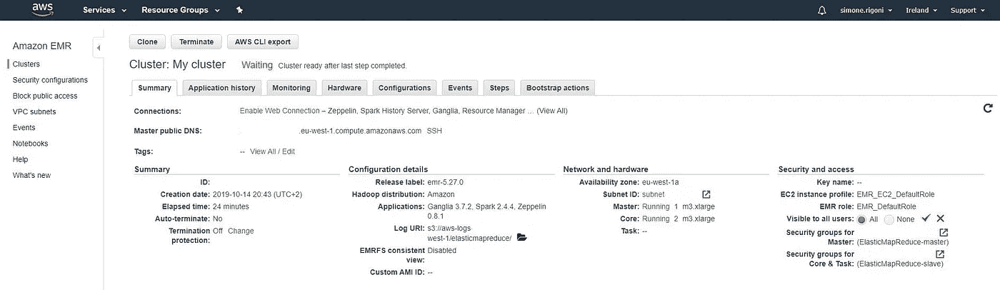

My cluster summary

然后我创建了一个笔记本并复制粘贴了必要的代码

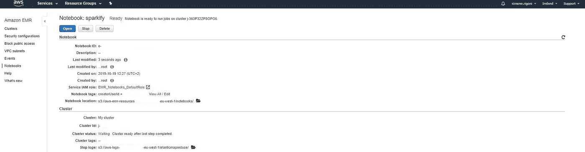

sparkify notebook summary

在真实数据集上，我们有来自 22278 个用户的 26259199 条记录:

47%的女性和 53%的男性

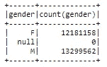

Gender distribution in the full dataset

21%的互动来自免费用户，79%来自高级用户

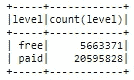

Level distribution in the full dataset

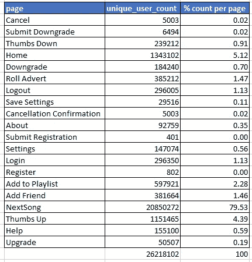

Page distribution in the full dataset

22%的用户感到不适，78 %没有

这个小数据集很好地代表了真实数据集，这意味着它似乎没有偏见

**结论**

我们的目标是预测用户是否会取消服务，以使公司能够为他提供优惠或折扣，从而留住这些用户。在清理数据并将它们建模为准备用于 ML 训练的数据集之后，我们测试了三个不同模型的性能。所有产生的模型都成功地预测了用户是否会离开服务，比给出总是答案的`'0'`(用户不会流失)的**天真预测器**好不了多少。考虑到 **F-1 得分**最好的模型是**逻辑回归。**尽管结果很好，但该模型可以通过精心设计更多的工程特征来捕捉一些可能与用户对服务的满意度相关的行为模式来改进:推荐引擎好吗？意思是推荐给用户的歌真的符合他们的口味。从 **GBT** 的功能重要性来看，原始功能`page_Thumbs_Up`和`page_Thumbs_Down`相当重要，因此捕捉用户音乐品味的新功能确实可以改善模型

这个项目的代码可以在这个 github [资源库](https://github.com/simonerigoni/data_scientist_capstone)中找到，在我的博客上有一个意大利语的[帖子](https://simonerigoni01.blogspot.com/2023/01/previsione-dellabbandono-degli-utenti.html)。