# 我的第一个数据产品的用户指南:中等邮政公制显示器

> 原文：<https://towardsdatascience.com/user-guide-to-my-first-data-product-medium-post-metric-displayer-e99e74e52b3a?source=collection_archive---------16----------------------->

## 用数据更好地了解你的媒体文章

# **原点**

作为一名媒体上的定期作家和数据极客，在忙碌的 2018 年之后，我想在我的媒体博客上反映一下我所取得的成就。此外，根据 2018 年的表现，我计划在 2019 年制定更积极的写作计划。

我想大多数媒体作者都知道媒体分析平台的反数据为中心的界面设计。对我来说太简单了。这种设计让我很不情愿去研究数据并做出决定。

这是我决定开发我的第一个数据产品的主要原因。在下面的文章中，我将向读者展示这个产品和我用来创建这个产品的代码。我将使用我自己的数据在中型分析平台，以及展示我的产品如何运行。

整个思考和执行过程也会被详细记录下来。任何热衷于了解他或她自己的 Medium post 性能的人，都可以随意使用我的代码来提供一些数据。


from [https://medium.com/membership](https://medium.com/membership)

# **问题陈述和痛点**

**问题陈述**:以更健壮、更形象化的方式知道哪篇文章表现好，很烦。此外，文章可能无法分组或分类。在所有的指标中，哪些指标对于不同的文章组可能是最有区别的？

**痛点**:中型用户可能会发现很难充分利用 Medium 提供的分析平台(Stat 选项卡)。这些数据无法下载，也几乎没有告诉我们下一步该做什么。

# **约束**

这个产品的约束非常明显。对我来说，我仍然不能以一种更自动化的方式从介质中抓取或输出每篇文章的性能数据。因此，用户需要手动记录这些数据，就像我在这个 excel 中所做的那样。列名应该与我的相同。用户只需要定期按季度(每季度或每半年)记录这些指标

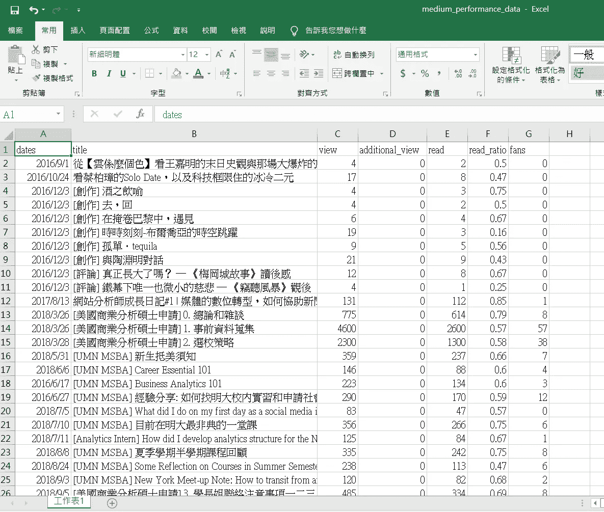

I will put this file in my GitHub as well, feel free to download it

我的产品能彻底处理那些 excel 文件。一旦有了特定数据文件。我们准备好出发了。

# **技能和工具**

*工具:Python Jupyter 笔记本*

*技能:用 Pandas 进行数据处理和管理，用 Matplotlib 进行可视化，用 Sklearn 进行聚类加 PCA，为重复操作创建大量函数*

# **产品展望**

这个产品很简单。我还没有创建它的布局或界面，但相反，我将介绍这个产品背后的操作逻辑。中邮公制显示器包括许多小而方便的功能。一旦用户将 excel 文件(我们用于记录数据)传递给这些函数，就会自动生成结果。

它包含该产品的两个功能。第一个是仪表板和可视化产品。第二个是集群产品。

这是我的产品路线图的第一阶段。(我不确定我是否会继续扩展它的功能)。然而，我认为这个测试版的 Displayer 足够全面，可以为作者做出决定提供一些见解。这就是我决定在这个时候软发布我的产品的原因。

请随意获取我的 Github 代码，并愉快地使用这个产品！

[](https://github.com/yunhanfeng/medium_metric_data_product) [## 云汉风/medium_metric_data_product

### 我的第一个数据产品，为媒体作者提供数据解决方案来跟踪帖子的表现…

github.com](https://github.com/yunhanfeng/medium_metric_data_product) 

# **第 0 部分:预检数据导入**

在介绍产品本身之前，我们先来看看我们的数据集。

可以肯定的是 python 中需要的包是导入的。熊猫、Numpy、Matplotlib 是我熟悉的朋友。这次我用了 Goolgetrans 的翻译。背后的原因是我有时用中文写文章，而我的大部分读者来自台湾。他们也可能用中文写帖子。将中文标题翻译成英文将更符合 Matplotlib 的约束，因为 Matplotlib 不能显示中文。

```
import pandas as pd
import numpy as np
import matplotlib.pyplot as plt
from googletrans import Translator
```

我后来读入 excel 文件并显示它的前几行，进一步检查列的类型和形状。从介质中提取和记录的数据来看，有七个基本特征。从我的媒体网站，我已经写了 45 篇文章了。

```
df = pd.read_excel('medium_performance_data.xlsx')
df.head()
```

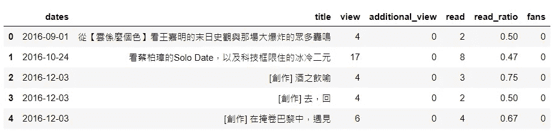

```
df.dtypesdates              datetime64[ns]
title                      object
view                        int64
additional_view             int64
read                        int64
read_ratio                float64
fans                        int64
dtype: objectdf.shape
(45, 7)
```

# **第一部分:仪表盘和可视化产品**

在这个产品中，我设计了八加一功能，使用户能够通过简单的 excel 文件输入返回不同指标的类似图表和图形。基于这些图表，作者能够对他们的文章表现的好坏有所了解，并进一步制定下一步的策略。

下面是 Medium post 上的用户参与度漏斗。基本上，我只是按照漏斗来设计我的产品。

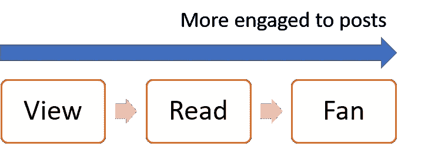

## **功能 0**

此功能主要处理中文标题的翻译问题。多亏了强大的谷歌翻译，它帮助把这些书名翻译成英文。

```
def translate(df):
    import numpy as np
    import matplotlib.pyplot as plt
    from googletrans import Translator

    translator = Translator()
    df['title'] =  df["title"].map(lambda x: translator.translate(x, src="zh-TW", dest="en").text)
    return df
```

## **功能 1**

该函数返回总视图的静态值。它是所有中等职位的基本数字，显示了对你的表现的一般描述。

```
def total_view(file):
    import pandas as pd

    df = pd.read_excel(file)
    df = translate(df)
    total_view = df['view'].sum() + df['additional_view'].sum()
    return 'The total view of your medium post is {}'.format(total_view)
```

我把我的文件传入这个函数，它返回我的总浏览量大约是 15K。

```
total_view('medium_performance_data.xlsx')>> 'The total view of your medium post is 15086'
```

## **功能 2**

函数 2 返回浏览量最多的前 5 篇文章。结果将以表格和条形图的形式显示。你也可以一瞥这 5 个对你的总浏览量的贡献。

```
def top_view(file):
    import pandas as pd df = pd.read_excel(file)
    df = translate(df)
    top_view = df.nlargest(5, 'view')[['title','view']]
    ax = top_view.plot.barh(x='title', y='view')
    return display(top_view) , ax
```

操作该功能

```
top_view('medium_performance_data.xlsx')
```

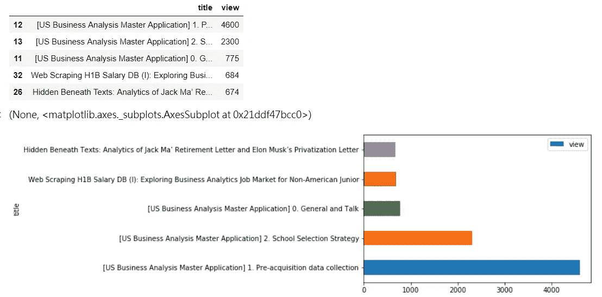

我的前 5 篇文章的结果显示如下。看来我写的关于 MSBA 申请的文章吸引了大部分的关注。

## **功能 3**

与函数 2 类似，该函数返回带有附加视图的前 5 篇文章的表格和条形图。额外的看法，对我来说，是一个相当奇怪的衡量标准。来自 Medium 的定义是“来自 RSS 阅读器、FB 即时文章和 AMP 的观点，它们不计入阅读率。”并不是一个作者发布的每篇文章都会有额外的观点。根据我的经验，只有当你的文章被 Medium 上的其他出版网站策划时，附加浏览量才有可能增加。它提供了一些见解，如何好这些出站文章的表现。

```
def top_additional_view(file):
    import pandas as pd df = pd.read_excel(file)
    df = translate(df)
    top_view = df.nlargest(5, 'additional_view' [['title','additional_view']]
    top_view = top_view[top_view['additional_view']>0]
    ax = top_view.plot.barh(x='title', y='additional_view')
    return display(top_view) , ax
```

操作该功能。

```
top_additional_view('medium_performance_data.xlsx')
```

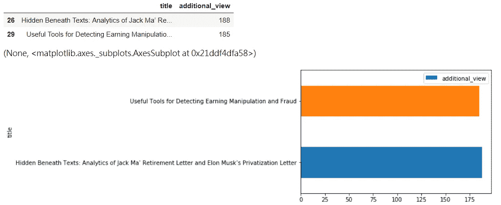

**功能 4**

Read 是关于敬业度的更深层次的指标。如果用户一直滚动到底部，则 Read 是指标，这表示用户通读了帖子。该函数采用文件名作为参数，并返回表格和条形图。

```
def top_read(file):
    import pandas as pd

    df = pd.read_excel(file)
    df = translate(df)
    top_read = df.nlargest(5, 'read')[['title','read']]
    top_read = top_read[top_read['read']>0]
    ax = top_read.plot.barh(x='title', y='read')
    return display(top_read) , ax
```

操作该功能。

```
top_read('medium_performance_data.xlsx')
```

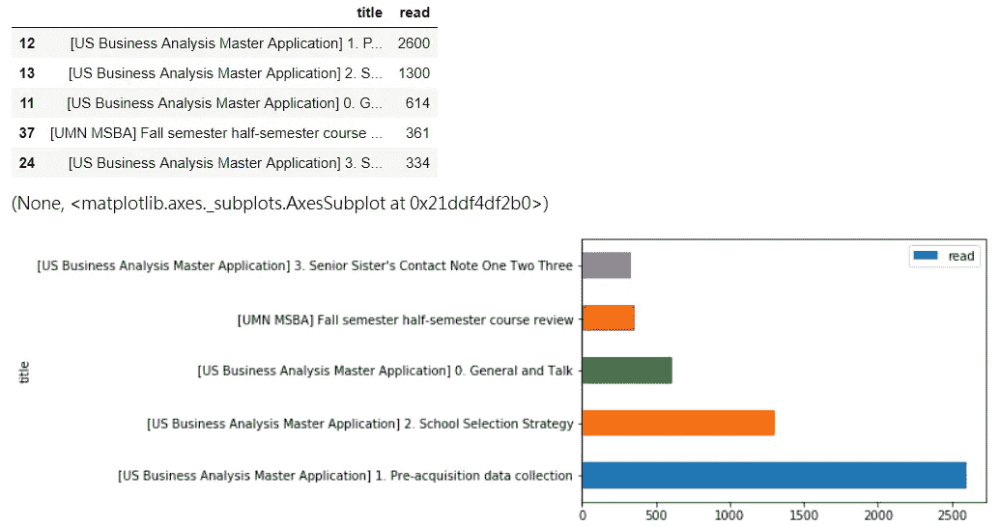

结果与大多数观点的前 5 篇文章略有不同。阅读量最多的前 5 都是中文帖子。背后有多种可能的原因。

第一，我的大多数读者来自台湾，中文对我的大多数用户来说是一种相对熟悉的语言。他们倾向于读完更多的文章。

第二，它可能表明我的英文写作太长或太复杂，用户无法通读。我可能需要润色我的帖子，让它更简洁。

第三，除了语言问题，阅读量最多的前 5 个帖子都与信息相关的话题，如如何准备申请，如何提问以及 MSBA 课程的复习。也许这种话题可以引发更多的阅读兴趣。

## **功能 5**

阅读率是另一个棘手的指标。阅读率=阅读/浏览(点击)。据说，中等算法将奖励阅读率较高的文章以较高的排名和优先级显示在用户面前。

该函数的工作方式与上面的相同，以显示表格和条形图的形式返回阅读率最高的前 5 篇文章。

```
def top_readratio(file):
    import pandas as pd

    df = pd.read_excel(file)
    df = translate(df)
    top_read = df.nlargest(5, 'read_ratio')[['title','read_ratio']]
    top_read = top_read[top_read['read_ratio']>0]
    ax = top_read.plot.barh(x='title', y='read_ratio')
    return display(top_read) , ax
```

操作该功能。

```
top_readratio('medium_performance_data.xlsx')
```

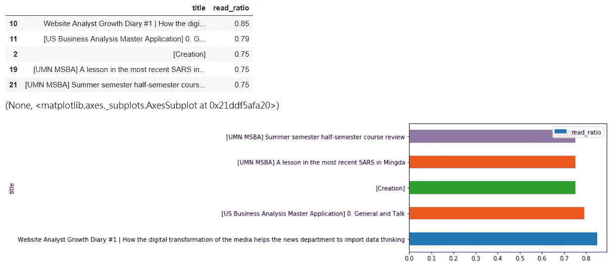

从某些方面来说，对结果的解释是很复杂的。

第一，文章越短，就越有可能获得更高的阅读率。我所有帖子中的第一篇文章只是一个链接。当然，它将获得最高的读取率。

其次，浏览量少的文章也可能导致阅读率高，就像我的文章“[创造]。”

结论是，有一些内生性影响这一指标。我建议用户用上面的函数交叉验证这个指标。

## **功能 6**

该函数返回所有文章的平均阅读率。因为读取率是中等算法的关键指标。我建议作者偶尔使用这个功能来跟踪文章表现的进度。

```
def avg_readratio(file):
    import pandas as pd

    df = pd.read_excel(file)
    avg_rr = round(df.read_ratio.mean(),3)
    return 'The avg. read ratio of your medium post is {}'.format(avg_rr)
```

操作该功能。

```
avg_readratio('medium_performance_data.xlsx')>> 'The avg. read ratio of your medium post is 0.528'
```

还应该根据内容的特征和类别进行设置。一些轻松易消化的文章可能有更高的平均阅读率，反之亦然。我的文章，平均阅读比是 0.528，对我来说，还不错。

我将努力把这作为我的目标，来提高我的媒体网站的阅读率。写结构清晰、可读性强、简洁明了的帖子是一个很好的方法。

## **功能 7**

下一个功能是关于显示粉丝数最高的前 5 篇文章。粉丝指标是表示对文章更深入参与的指标。读者为帖子鼓掌，并展示了他们的“喜欢”它是公制漏斗的最后一步，可以更难实现。

```
def top_fans(file):
    import pandas as pd

    df = pd.read_excel(file)
    df = translate(df)
    top_read = df.nlargest(5, 'fans')[['title','fans']]
    top_read = top_read[top_read['fans']>0]
    ax = top_read.plot.barh(x='title', y='fans')
    return display(top_read) , ax
```

操作该功能。

```
top_fans('medium_performance_data.xlsx')
```

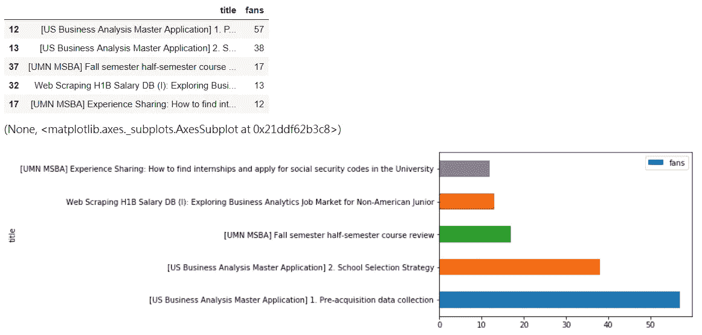

**功能 8**

产品第一部分的最后一个功能是显示“过去几天的平均视图”我创建这个新指标来捕捉帖子的每日额外浏览量。公式是:从今天到文章发表那天的总浏览量/天数。对我来说，它计算的是这篇文章每天的浏览量。

```
def top_view_per_day(file):
    import pandas as pd

    df = pd.read_excel(file)
    df = translate(df)
    df['time_elapse'] =pd.datetime.now().date() - df['dates']
    df['time_elapse'] = df['time_elapse'].dt.days
    df['total_view'] = df['view'] + df['additional_view']
    df['view_per_day']  = round(df['total_view'] / df['time_elapse'], 2)

    top_read = df.nlargest(5, 'view_per_day')[['title','view_per_day']]
    top_read = top_read[top_read['view_per_day']>0]
    ax = top_read.plot.barh(x='title', y='view_per_day')
    return display(top_read) , ax
```

操作该功能

```
top_view_per_day('medium_performance_data.xlsx')
```

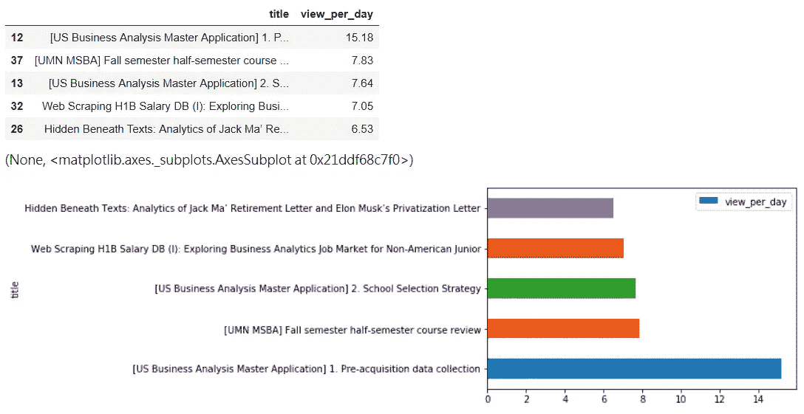

我认为这个指标非常重要。这表明，文章仍然带来了每天的流量。那些文章将用户导向作者的媒体网站。它帮助用户识别你的媒体博客的“摇钱树”。了解这些文章后，定期在社交媒体上推广它们或让它们被关联者引用是保持新鲜流量流入你的媒体的好策略。

# **第二部分:集群产品**

就像我在功能 8 中提到的，识别哪些文章是摇钱树很重要。这正是我提出并创造这个集群产品的初衷。通过对所提供的特征进行无监督学习，可以将文章分割成不同的组。每个群体都有不同的特征。他们可以在用户获取、保留和参与方面扮演不同的角色。通过使用这种聚类产品，用户只需传递 excel 文件，并进一步输入他想要创建的聚类数，结果就会自动生成。有几个功能也与可视化集群相关。

我将在下一篇文章中介绍四加一函数。

## **功能 9**

这个函数只是管理数据的辅助函数。我从原始数据框架中创建了“总视图”和“每日视图”。

```
def medium_data_munge(file):
    import pandas as pd

    df = pd.read_excel(file)
    df = translate(df)
    df['time_elapse'] =pd.datetime.now().date() - df['dates']
    df['time_elapse'] = df['time_elapse'].dt.days
    df['total_view'] = df['view'] + df['additional_view']
    df['view_per_day']  = round(df['total_view'] / df['time_elapse'], 2)
    return dfmedium_data_munge("medium_performance_data.xlsx").head()
```

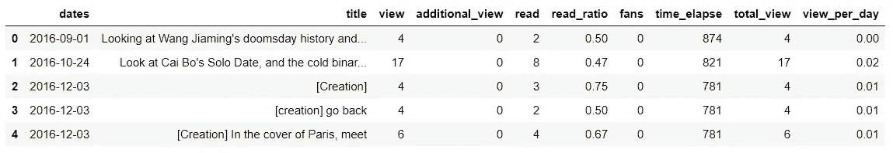

## 功能 10 和 11

这两个函数用于聚类。我使用 K-means 对文章进行聚类。我记录了阅读量、阅读率、粉丝数、总浏览量、每日浏览量。并且分割基于这五个特征。

从这里开始的函数，用户需要将 excel 文件和集群号传递给函数。

函数 10 返回带有簇标签的数据帧。用户可能把它看作是一个助手功能或产品功能。它返回的数据帧很容易被看到和播放。

函数 11 返回每个集群的摘要。它让用户清楚地了解每个集群的性能和质量。我认为这非常有帮助，因为用户最终可以针对不同的集群设计合适的推广策略。每当你想重新分享或者盘活流量的时候，使用这个产品功能真的可以证明你的选择是正确的。我也建议不要在论证中使用太多的聚类，你可以输入不同的数字，然后看看哪个数字给出了最有解释力的结果。

```
### Function 10
def create_cluster_df(file, n):

    from sklearn.preprocessing import StandardScaler
    from sklearn.cluster import KMeans

    df = medium_data_munge(file)

    # Select proper feature
    features = ['read','read_ratio','fans','total_view','view_per_day']
    x = df.loc[:, features].values

    # Normalized data 
    x = StandardScaler().fit_transform(x) 

    # Conduct K-mean
    km = KMeans(n_clusters = n, random_state=0)
    km.fit(x)
    labels = km.labels_
    cluster = labels.tolist()

    final_cluster = pd.DataFrame(dict(cluster_label = cluster, title = df['title']))
    df_new = pd.merge(df, final_cluster, how = 'left', on = ['title'])

    return df_new### Function 11
def cluster_df_desc(file, n):
    # create dataframe with cluster label
    df_new = create_cluster_df(file, n)

    # summarize the clustered dataframe
    col = ['cluster_label', 'total_view' , 'read', 'read_ratio', 'fans','view_per_day']
    final_df = df_new[col].groupby(['cluster_label']).agg({'cluster_label' : 'size', \
                                                                                                      'total_view': lambda x:x.mean(), \
                                                                                                       'read': lambda x: x.mean(), \
                                                                                                       'read_ratio': lambda x: x.mean(), \
                                                                                                       'fans': lambda x:x.mean(), \
                                                                                                         'view_per_day': lambda x:x.mean()})
    return display(final_df)
```

操作功能 10

```
create_cluster_df("medium_performance_data.xlsx", 3).head()
```

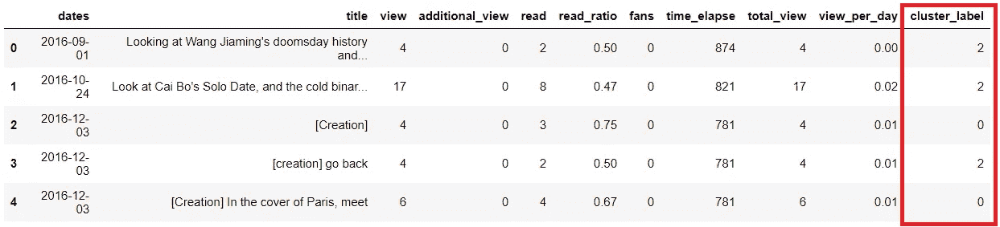

操作功能 11

```
cluster_df_desc("medium_performance_data.xlsx",3)
cluster_df_desc("medium_performance_data.xlsx",5)
```

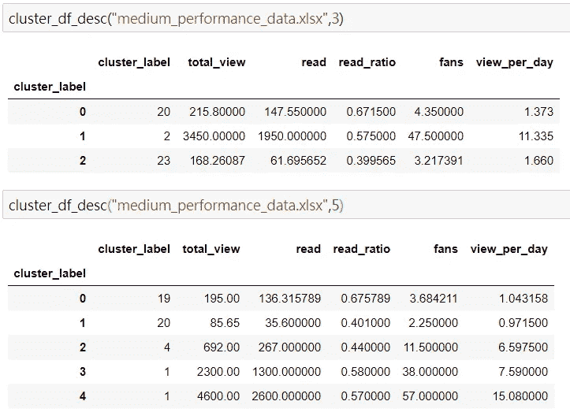

I demo n = 3 and n = 5 and show the result here

## **功能 12**

这个函数是前一个函数的后续函数。一旦您返回理想的集群概述。你可能想想象一下。因此，我利用主成分分析(PCA)将五个特征维度转化为两个维度。并且不同组中的所有物品可以在这个 2D 平面上被标记。

只需传递文件和簇号，就可以得到结果。它还将返回主成分 1 和 2 的解释比率。我将在这里尝试 n = 3 和 n = 5。

```
def pca_vis(file, n):
    from sklearn.preprocessing import StandardScaler
    from sklearn.decomposition import PCA

    df_new = create_cluster_df(file, n)

    # Select proper feature
    features = ['read','read_ratio','fans','total_view','view_per_day']
    x = df_new.loc[:, features].values

    # Normalized data 
    x = StandardScaler().fit_transform(x) 

    pca = PCA(n_components=2)
    principalComponents = pca.fit_transform(x)

    principalDf = pd.DataFrame(data = principalComponents, columns = ['principal component 1', 'principal component 2'])

    finalDf = pd.concat([principalDf, df_new[['cluster_label']]], axis = 1)

    # plot the PCA two-dimensional graph
    fig = plt.figure(figsize = (6,6))
    ax = fig.add_subplot(1,1,1) 
    ax.set_xlabel('Principal Component 1', fontsize = 13)
    ax.set_ylabel('Principal Component 2', fontsize = 13)
    ax.set_title('2 component PCA', fontsize = 15)
    targets = list(range(0,n))
    colors = ['b', 'g', 'r', 'c', 'm', 'y', 'k', 'w']
    colors =  colors[:n]for target, color in zip(targets,colors):
        indicesToKeep = finalDf['cluster_label'] == target
        ax.scatter(finalDf.loc[indicesToKeep, 'principal component 1']
                         , finalDf.loc[indicesToKeep, 'principal component 2']
                         , c = color
                         , s = 50)
    ax.legend(targets)
    ax.grid()

    return 'The explained ratio for component 1 is {0:.2f} and for component 2 is {1:.2f}'. \
                   format(pca.explained_variance_ratio_[0], pca.explained_variance_ratio_[1] )
```

操作代码

```
pca_vis("medium_performance_data.xlsx",3)
pca_vis("medium_performance_data.xlsx",5)
```

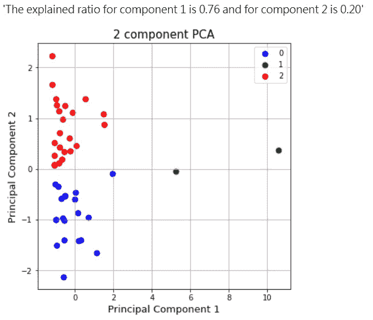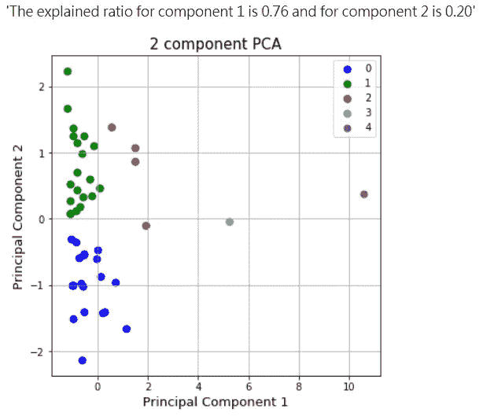

## **功能 13**

最后一个功能也与聚类有关。该功能创建了所谓的平行坐标图。它展示了不同聚类中每个特征的贡献程度。简而言之，它揭示了集群背后的逻辑。并且作者能够基于该结果做出进一步的决定。

例如，我将尝试 cluster = 3 和 5。

```
def parallel_coordinates(file, n):
    df_new = create_cluster_df(file, n)

    cols = ['total_view', 'read', 'read_ratio', 'fans', 'view_per_day' ]
    df_new_sub = df_new[cols]

    from sklearn.preprocessing import StandardScaler
    from pandas.plotting import parallel_coordinates

    ss = StandardScaler()scaled_df = ss.fit_transform(df_new_sub)
    scaled_df = pd.DataFrame(scaled_df, columns=cols)
    final_df = pd.concat([scaled_df, df_new['cluster_label']], axis=1)

    parallel_coordinates(final_df, "cluster_label")
    plt.title("Parallel Coordinates Graph on Each Metric")
    plt.show()
```

操作该功能

```
parallel_coordinates("medium_performance_data.xlsx", 3)
parallel_coordinates("medium_performance_data.xlsx", 5)
```

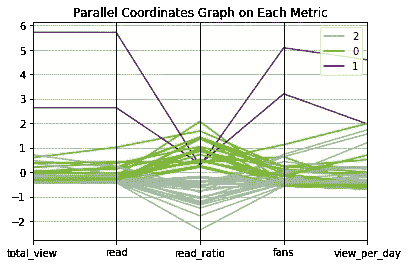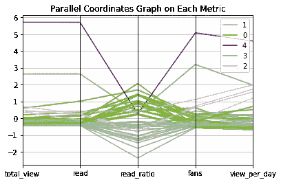

如果 n = 3，我可以得出结论，集群 1，表现最好的两篇文章在总浏览量、阅读量、粉丝量和每日浏览量方面都很出色，但它们的阅读率相对较差。集群 0 和集群 2 之间的区别主要基于读取率，这意味着该指标在我的大部分文章中发挥了很大的影响。今年我可能会把写作策略集中在提高阅读率上。

**用我的数据产品做的一些策略**

1.  我平台上的中文文章可能会达到更高的阅读率。我仍然应该花时间写一些中文文章，使我的基于平台算法的媒体更加可见。
2.  利用每日较高浏览量的文章将更多新鲜的一次性用户带入我的媒体，并促使他们关注以扩大我的关注者基础。
3.  一些每日浏览量较高的文章属于第一类。它符合聚类结果，绝对是我的流量摇钱树。
4.  专注于提高第 2 类文章的阅读率或防止文章落入第 2 类是 2019 年的关键目标。

# **结论**

在媒体分析平台(统计选项卡)中有许多限制。然而，通过创建这个数据产品，我希望我可以让媒体社区受益，让作者具备一些数据驱动的思维模式，并根据这个产品产生的结果改进写作策略。

快乐分析！！！

```
Remember to follow me on Medium to get instant notification of my new article.Thank for the reading
```