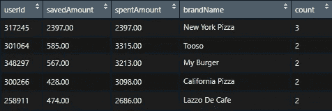
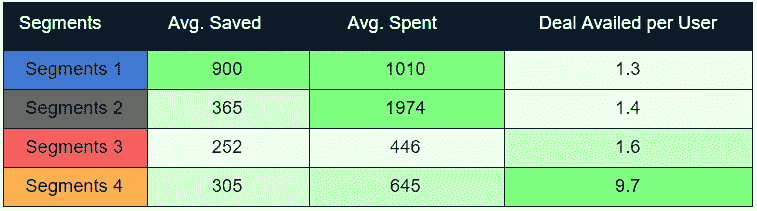
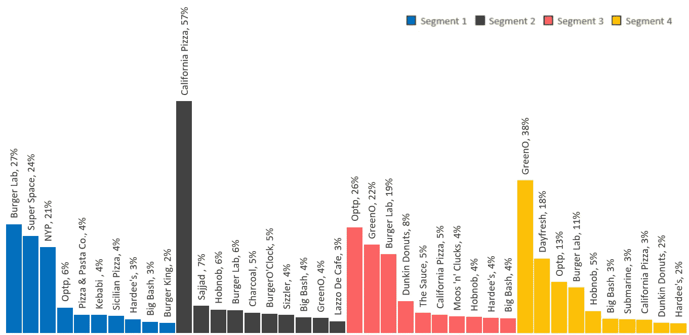

# 基于购买历史的用户细分

> 原文：<https://towardsdatascience.com/user-segmentation-based-on-purchase-history-490c57402d53?source=collection_archive---------16----------------------->

## 一个用例，说明我们如何使用机器学习，根据用户的购买力来确定不同产品的目标用户。

source: [Lisa](https://pixabay.com/users/lisa870-7470972/), via [pixabay](https://pixabay.com/photos/jelly-marmalade-sweet-candy-sugar-3032344/)

# 介绍

这一分析的目标是使用折扣应用程序，根据他们获得的交易确定不同的用户群，以便为他们重新提供类似于他们过去获得的优惠。

机器学习算法 K-means 用于根据用户的购买行为识别用户群。这是算法提取内容的三维图。

3D image of clusters produced by K-Means, by Muffaddal

# 术语:

在深入分析之前，让我们定义一些正在使用的关键字。

> **交易收益:**当用户使用 app 获得折扣时。
> **花费:**用户购买物品时支付的折扣价。
> **保存:**用户通过 app 保存的金额。
> **品牌:**提供折扣的商家如必胜客、格力诺
> **交易:**提供给不同店铺和品牌用户的折扣。

# 分析

## 数据集

使用 [JQL](https://github.com/muffaddal52/Mixpanel---JQL/blob/master/PurchasedDetails_dealavail.js) 从 Mixpanel 中提取行为数据集。该分析使用了以下内容

Mixpanel Data Set, by Muffaddal

> **userId:** 用户的唯一 id
> **save amount**:用户在交易受益
> 上节省的金额 **spentAmount** :用户在交易受益
> **brandName** :交易受益的品牌
> **count** :用户受益的交易数量

使用上述数据集*averagesavenamount*，为每个用户计算 *averageSavedAmount* 和*dealavaillcount*，如下所示

Average Deal Availed Data set, by Muffaddal

**机器学习— K-means 聚类** K-mean 算法的第一步是找到最佳数量的聚类进行分割。为此有许多方法，其中之一是使用类内平方和(wcss)的肘方法。

WCSS for up-to 10 clusters, by Muffaddal

基于肘方法，使用 4、5 和 6 个聚类来探索片段，并挑选 4 个聚类作为给定数据集的最佳聚类。

R code for K-Means clustering

*如果你想了解更多关于用户聚类和用户细分的知识，我会推荐* [*数据营*](https://bit.ly/2PW7V1H) *和*[*Coursera*](https://bit.ly/2DNXOK9)*上的这些课程。*

## K-means 提取了哪些片段？

以下是四个已确定细分市场的平均统计数据:

Average stats of each segment

Segments Characteristics

Graphical Representation of Segments Characteristics, by Muffaddal

细分市场 1 和 2 中的用户是高付费用户，细分市场 1 中的用户在每笔交易中也节省了同样高的费用(可能有买一送一的优惠)。然而，这些用户利用的交易数量少于 2(即分别为 1.3 和 1.4)。

另一方面，细分市场 3 和细分市场 4 的用户花费较少，因此储蓄也较少。然而，在所有 4 个细分市场中，细分市场 4 的用户拥有最大的每用户交易收益比率(平均每个用户收益超过 9 笔交易)。这是转变最多的一批用户。

## 每个细分市场的用户总数和交易数量是多少？

这是用户总数和每个细分市场用户的交易量。

Number of users in segments, by Muffaddal

Number of deals availed, by Muffaddal

57%的用户属于细分市场 3，只有 3%的用户来自转化率最高的细分市场(即细分市场 4)。

## **总体用户支出是多少？**

这是各细分市场的支出分布情况

Spending of users in each segment, by Muffaddal

来自细分市场 4 的一些用户(细分市场 4 中的黄点)与细分市场 1 和 2 类似，但细分市场 3(包括 57%的用户)根本不喜欢高消费交易和/或品牌。

## **每个细分市场用户首选的品牌类型？**

让我们看看这些细分市场用户利用什么类型的品牌来了解他们之间的区别。

Brands users availed, by Muffaddal

细分市场 1 的用户利用了汉堡、比萨饼和欢乐时光的组合，细分市场 2 的用户利用了比萨饼，而细分市场 3 的用户更喜欢汉堡包。而细分 4 用户(大多数转化用户)更喜欢果汁和其他类型的品牌。

## **每个细分市场都有哪些品牌？。**

以下是这些细分用户使用过的十大品牌。

Top 10 Brands Availed by Each Segments, by Muffaddal

看看这些品牌，我们可以理解这些细分市场用户更喜欢什么类型的品牌和交易。第 1 和第 2 部分用户(高付费用户)使用了优质品牌，如 Sajjad、kababi、carbon、California 等，而第 3 和第 4 部分用户(低付费用户)大多选择了中低档品牌。

## 如何应用这些结果？

根据不同的用户群，我们可以:

1-定向广告**针对每个细分市场的个性化广告**会提高转化率，因为用户更有可能转化为特定品牌和优惠。因此，举例来说，先向付费能力较高的用户展示 Sajjad 的广告，然后再向付费能力较低的用户展示。

2- In-app 推荐
**优化应用，在应用内推荐每个细分市场用户更感兴趣的交易**和折扣。

## 摘要

总之，通过数据和适当的努力，我们能够识别用户及其喜好的有趣信息，并能够根据用户的偏好制定如何吸引用户的策略。

[***需要帮助进行用户细分吗？我们来连线。***](https://bit.ly/3vTZdGH)

# 相似读数

 [## 使用 BigQuery ML 进行 RFM 分析

### 使用 BigQuery ML 中的 RFM 分析和 Data Studio 中的可视化进行用户细分。

towardsdatascience.com](/rfm-analysis-using-bigquery-ml-bfaa51b83086)  [## 基于项目的推荐系统综合指南

### 本指南将详细介绍基于项目的推荐系统是如何工作的，以及如何在实际工作中实现它…

towardsdatascience.com](/comprehensive-guide-on-item-based-recommendation-systems-d67e40e2b75d)  [## 找到类似的产品推荐给用户

### 在 R 中使用 recommenderlab 获得类似的产品推荐

towardsdatascience.com](/find-similar-products-to-recommend-to-users-8c2f4308c2e4)