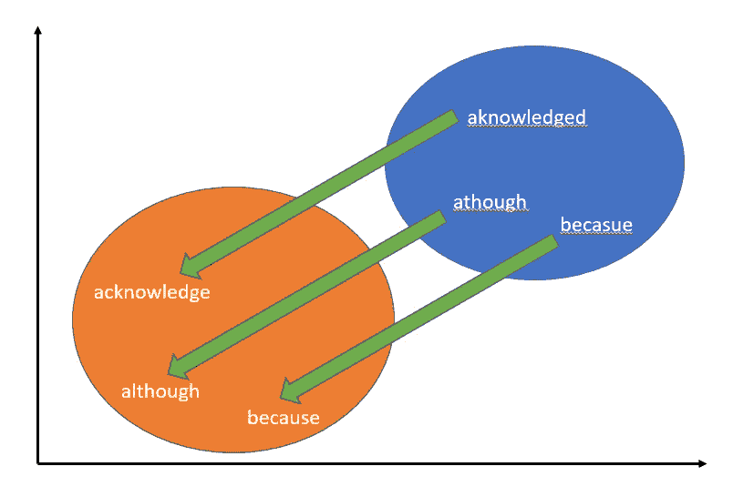

# 使用一般化的翻译向量来处理拼写错误和词汇外(OOV)单词，如缩写

> 原文：<https://towardsdatascience.com/using-a-generalised-translation-vector-for-handling-misspellings-and-out-of-vocabulary-oov-words-494cd142cd31?source=collection_archive---------27----------------------->


Photo by [Andrea Sonda](https://unsplash.com/@andreasonda?utm_source=medium&utm_medium=referral) on [Unsplash](https://unsplash.com?utm_source=medium&utm_medium=referral)

# 介绍

在这篇文章中，我将分享一种管理拼写错误和缩写的新方法。这个想法不是我自己的，但我认为它真的很有趣，并决定在这里测试和展示我自己的成果。

> 这个想法来自艾德·拉什顿，他来自一个[快速人工智能论坛](https://forums.fast.ai/t/nlp-any-libraries-dictionaries-out-there-for-fixing-common-spelling-errors/16411/7)的帖子，是我在做自己的研究时偶然发现的。我强烈建议你阅读他的初步测试。

我采取了额外的步骤来测量将 Ed 的方法应用于下游自然语言处理(NLP)任务的效果，以查看它是否会提高分类准确性。

像使用外部数据源来创建一个广义的转换向量或测试缩写/OOV 词的方法是我自己的。

但是在我开始之前，了解什么是单词嵌入以及它们为什么重要是很重要的。如果您需要快速复习，请花 3-5 分钟通读关于词汇外(OOV)单词嵌入系列的 [**第一部分**。](/creating-word-embeddings-for-out-of-vocabulary-oov-words-such-as-singlish-3fe33083d466)

文章链接还谈到了为 OOV 单词生成单词嵌入，比如新加坡英语。这篇文章实际上是我关于如何最好地使用新加坡式英语的研究的延伸。

回忆一下，我们开始吧。

这种方法的基本原理来自于单词嵌入**如何与另一个**交互。这种“互动”的经典词语类比例子如下:


Figure 1 — Word Analogy “Equation”

直觉上，这个英语中的“等式”应该对你有意义。在向量空间中，数学将是这样的:


Figure 2 — Word Analogy Example in Vector Space — [Source](https://twitter.com/toshi2fly/status/911306344376012800)

为了向您展示这是真实的情况，我已经使用来自斯坦福的预训练单词嵌入运行了一些代码。这些单词嵌入在维基百科 2014 + Gigaword 上进行训练，以获得 60 亿个标记和 40 万个独特的词汇单词。

由于每个单词都表示在一个 100 维的空间中(即 100 个数字)，为了可视化的目的，我应用了 T-分布式随机邻居嵌入(T-SNE)将维度减少到只有 2。

下面的图 3 是感兴趣的单词和数学方程的可视化，帮助你更好地理解单词之间的关系。


Figure 3 — Word Analogy Equation

正如您所看到的，经过适当训练的单词嵌入可以真实地表示单词之间的关系。模型生成的数字向量不仅仅是随机的。这些数字确实有一定的意义。

你可能不知道，我上面提到的是**平移向量**的实现。

> **平移向量**是一种将坐标平面中的点/图形从一个位置移动到另一个位置的变换。

> 这是一个翻译向量，我将使用它来将拼写错误/缩写的单词移向最能解释这些单词意思的单词。

*“等一下...你是说有一个翻译向量可以将拼写错误的单词移动到向量空间中相应的正确拼写上吗？”*

答案是肯定的。

最重要的是，这个翻译工具甚至可以翻译缩写或 OOV 单词。这将使这些单词更接近于最能代表缩写或 OOV 单词真正含义的单词。

# 那么广义翻译向量是如何创建的呢？

> 这一系列的测试是由斯坦福大学使用手套单词嵌入法进行的。

在这一部分，我将首先分享处理拼写错误单词的实验。然后，我将转向我所做的处理缩写或 OOV 单词的实验。在此之后，我将试图解释为什么**我认为**这个翻译向量是有效的。最后测试这种方法对下游 NLP 任务的影响。

## 处理拼写错误的单词

为了处理拼写错误的单词，我最初认为拼写错误的单词的正确拼写应该出现在拼写错误的单词附近。

令我惊讶的是，我错了。事实完全不是这样。

以下是一些拼写错误的单词及其在向量空间中最接近的邻居的输出。

```
Input word: becuase
Closest 10:
becuase 1.0
becasue 0.768174409866333
beause 0.740034282207489
beacuse 0.7367663979530334
becaue 0.7192652225494385
athough 0.6518071889877319
althought 0.6410444378852844
becuse 0.6402466893196106
inspite 0.631598711013794
beleive 0.6224651336669922Input word: athough
Closest 10:
athough 0.9999999403953552
altough 0.7992535829544067
althought 0.7640241980552673
eventhough 0.7555050849914551
&#8220; 0.7399924993515015
addding 0.7239811420440674
lthough 0.7079077363014221
surmising 0.6986074447631836
howver 0.6851125359535217
aknowledged 0.6843773126602173Input word: aknowledged
Closest 10:
aknowledged 1.0
ackowledged 0.8641712665557861
inisted 0.8378102779388428
admited 0.8242745399475098
annonced 0.81769859790802
avowing 0.7911248803138733
testifed 0.7896023392677307
addding 0.7784746885299683
sasid 0.7712235450744629
acknowleges 0.7595445513725281
```

注意在上面所有的例子中，前 10 个邻居中没有一个是正确拼写的单词？

我开始在越来越多拼错的单词上运行最近邻，直到一个模式出现，我得出结论…

> 所有拼写错误似乎都在向量空间中被分组在一起。

> **注意:这里着重强调了“似乎”这个词。因为我真的不确定。**

如果我粗略地把它画出来，它**可能**看起来像这样:


Figure 4 — Misspelled words location in vector space

下一步是创建一个翻译向量，使拼写错误的单词嵌入更接近正确的拼写，如:



Figure 5 — Translation of misspelled words to correctly spelled words

过程是这样的:

1.  运行余弦距离得到最近的 10 个单词拼写错误的选择。
2.  对于 10 个最接近的单词中的每一个，取每个单词的单词向量，并将其从正确拼写的单词的单词向量中减去。
3.  在步骤 2 中计算所有这些单词向量的平均值。这成为步骤 1 中所选单词的翻译向量。
4.  测试平移向量。

```
STEP 1:
Input word: becuase
Closest 10:
becuase 1.0
becasue 0.768174409866333
beause 0.740034282207489
beacuse 0.7367663979530334
becaue 0.7192652225494385
athough 0.6518071889877319
althought 0.6410444378852844
becuse 0.6402466893196106
inspite 0.631598711013794
beleive 0.6224651336669922STEP 2:
sum_vec = ((glove["because"]-glove["becuase"]) + (glove["because"]-glove["becasue"]) + 
       (glove["because"]-glove["belive"]) + (glove["because"]-glove["beause"]) + 
       (glove["because"]-glove["becaue"]) + (glove["because"]-glove["beleive"]) + 
       (glove["because"]-glove["becuse"]) + (glove["because"]-glove["wont"]) +
       (glove["because"]-glove["inspite"]) + (glove["because"]-glove["beleive"])
      )STEP 3:
translation_vec = sum_vec / 10STEP 4:
real_word = glove["becuase"] + translation_vecClosest 10:
because 0.9533640742301941
but 0.8868525624275208
though 0.8666126728057861
even 0.8508625030517578
when 0.8380306363105774
if 0.8379863500595093
so 0.8338960409164429
although 0.8258169293403625
that 0.8221235871315002
. 0.8172339797019958
```

看看上面第 4 步的结果。注意平移向量是如何工作的？单词“becuase”的拼写错误被推到了正确的拼写“因为”。

既然我们知道处理拼写错误的翻译向量是可能的…

现在的问题是:

> 我们能为所有拼错的单词创建一个通用的翻译向量吗？

是的，你可以。

**创建广义翻译向量**

我先从维基百科上拿了一个经常拼错的英文单词列表——[https://en . Wikipedia . org/wiki/Commonly _ misselled _ English _ words](https://en.wikipedia.org/wiki/Commonly_misspelled_English_words)。

总共有 257 个拼错的单词。

接下来，我按照上面提到的步骤(步骤 1 到 4)运行每个单词。在 257 个单词中，只有 101 个出现在 GloVe 中。因此，计算了 101 个平移向量。

下一步很简单，要得到广义的翻译向量，只需得到所有 101 个翻译向量的平均值。

现在，在看不见的拼写错误的单词上测试广义翻译向量。即不在“经常拼写错误的英语单词”列表中的单词。

以下是一些结果:

```
TEST 1:
real_wd = word2vec["altough"] + generalised_translation_vector
Closest 10:
although 0.6854726149933246
though 0.6850398829597103
fact 0.6601790765388513
however 0.6519905808301287
moreover 0.6505953960788824
unfortunately 0.6351817153852294
why 0.6347064566357319
neither 0.6276211965351607
because 0.626889292147095
there 0.6217807488951306TEST 2:
real_wd = word2vec["belive"] + generalised_translation_vector
Closest 10:
belive 0.7508078651443635
believe 0.6821138617649115
we 0.6761371769103022
think 0.6593009947423304
i 0.6531635268562578
suppose 0.6463823815449183
know 0.643466951434791
why 0.6394517724397308
n't 0.6282966846577815
there 0.6273096464496348TEST 3:
real_wd = word2vec["howver"] + generalised_translation_vector
Closest 10:
moreover 0.6818620293021886
nevertheless 0.6726130620400201
neither 0.6667918863182073
unfortunately 0.6568077159269134
though 0.6563466579691621
indeed 0.6555591633099542
nor 0.6473033198348439
noting 0.6457127023810979
fact 0.6423381172434424
however 0.639381512943384
```

如你所见，仅仅在 101 个平移向量上，广义平移向量的表现并不太差。

然而，由于它只在 101 个翻译向量上建模，它在单词“howver”上表现不佳。如果我们对更多的平移向量进行平均，这应该很容易纠正。

## 这个一般化的翻译向量在缩写的 OOV 单词上表现如何？

为了测试这一点，我键入了一个缩写“ftw”来寻找它的最近邻居**，而没有**应用广义翻译向量。

结果就是这样。

```
Closest 10:
ftw 1.0
ftg 0.6485665440559387
ccts 0.6331672072410583
srw 0.6109601855278015
efts 0.6108307242393494
cmtc 0.6050553321838379
tfts 0.6022316217422485
okl 0.6015480756759644
jrtc 0.597512423992157
cacs 0.5950496196746826
```

如您所见，所有缩写似乎都被分组到了同一个向量空间中。这还没有真正的价值。

让我们应用广义平移向量，看看会发生什么。

```
real_wd = word2vec["ftw"] + generalised_translation_vectorClosest 10:
ftw 0.6879674996316458
training 0.5672708687073991
wing 0.5443954733951136
) 0.5178717182506045
fighter 0.4847256601149461
flying 0.4701913180805779
tactical 0.4680302804591241
combat 0.4674059145693783
squadrons 0.4593665765485848
foot 0.459181622011263
```

注意到这里有什么有趣的吗？如果你用谷歌搜索“ftw 战斗”，你会发现“ftw”代表“飞行训练联队”。


Figure 6 — Google search results for “ftw combat”

这表明广义翻译向量甚至对缩写也起作用，而不仅仅局限于拼写错误。

它设法将“ftw”的缩写翻译成它在文本中真正代表的意思。即军字。

现在你已经看到了结果，如果你像我一样，你会问自己这怎么可能。下一部分是我对我认为正在发生的事情的**假设**。

## 为什么我认为广义翻译向量有效

> 这一段纯属假设。我不认为这些是真的。我在这里所说的一切都仅仅是基于对结果的回顾和对我认为正在发生的事情的推断。

回想一下上面的图 4 和图 5。

我认为正在发生的事情大概是这样的:


Figure 7 — Why Generalised Translation Vector works

首先，根据我的测试，本地化的翻译向量似乎工作得最好，即更好的准确性。

> 本地化的翻译向量指的是具有缩写或拼写错误的单词的聚类的向量。

但我认为广义平移向量是可行的，因为它只是所有局部平移向量的平均值。它只是将蓝色圆圈中的所有东西推回到橙色圆圈中。

这是基于这样的假设:所有拼错的**、缩写或 OOV 单词都聚集在蓝色圆圈中。**

因为每个拼写错误的单词、缩写词或 OOV 单词都在一起，所以拥有一个通用的翻译向量只会将这些单词推向真正代表它们实际意思的单词。

**重要提示:**

1.  翻译向量只对它被训练的单词起作用。我曾试图从 GloVe 中提取一个通用的翻译向量，并尝试将其应用于一个完全不同的数据集，但没有成功。
2.  为了纠正拼写错误，正确拼写的单词必须首先存在于语料库中。

> 看到目前为止的结果，你认为模型学到了什么？我的假设有意义吗？你的假设是什么？

# 广义平移向量的应用

说了这么多，做了这么多，你可能想知道的下一个问题是:

***“那又怎样？我能用这些知识做什么？”***

在这一部分，我将分享两组代码在一个简单的多分类评论毒性任务中运行的结果。即有毒、剧毒、淫秽、威胁、侮辱或人身攻击。

以下是训练集的大致情况:


Figure 8 — Toxic comments data set

训练集被分成 127，656 个训练样本和 31，915 个验证样本。

我用二元交叉熵损失函数和带有 Keras 的 Adam 优化器训练了一个简单的双向 LSTM 模型。

在第一种情况下，我使用了 GloVe **中预先训练的单词嵌入，而没有使用**中的广义翻译向量。

结果如下:


Figure 9 — Validation Loss and Accuracy

在由 153164 个样本组成的**测试集**上，模型精度为: **93.7687%**

使用上面相同的配置，我将 GloVe 单词嵌入改为我应用了广义翻译向量的嵌入。

为了确保我只翻译需要翻译的向量，我从[20 新闻组数据集](http://qwone.com/~jason/20Newsgroups/)的现有词汇表中运行了 GloVe 嵌入。

我只翻译了**没有**出现在 61118 个正确拼写单词的词汇列表中的向量。

结果如下:


Figure 10 — Validation loss and accuracy after applying Generalised Translation Vector

在上面的同一个**测试集**上，模型精度为: **93.8267%**

精确度的差异只有 0.058%。

从这个实验来看，对拼写错误或 OOV 单词应用广义翻译向量是否有助于提高任何下游 NLP 任务的准确性，这是不确定的。

然而，凭直觉，我相信它确实有帮助。也许不是这个任务本身，而是其他 NLP 任务？

## 快速小结

1.  我发现 fast.ai 上的一个帖子很有趣，于是决定测试一下某人(Ed Rushton)处理拼写错误的新颖方法。
2.  我进一步测试了这种方法在缩写/OOV 单词上的应用，并得出结论:它对这些单词也有效。
3.  我进一步研究了它是否有助于提高下游 NLP 任务(如分类)的准确性，发现我的实验没有结论。

# 结尾注释

我确实发现这个练习非常有趣，并且很可能在将来我的其他 NLP 项目中使用它。

所有的赞扬和感谢都归于埃德·拉什顿，因为他提出了这样一种新颖的方法。

我将来想尝试的是:

与其创建一个通用的翻译向量，不如根据一个单词属于哪个簇来运行本地化的翻译向量。

例如，如果单词是拼写错误，运行本地(拼写错误)翻译向量。如果单词是缩写，运行本地(缩写)翻译向量。

我坚信这种本地化的方法是使这种方法更强大的下一步。

我希望我在这方面的实验能帮助你更深入地了解单词嵌入是如何工作的，也许还能激发你的兴趣，让你自己做测试。

下次再见，朋友们！

**如果你正在寻找 NLP 数据集，点击这里**[](https://medium.com/@timothyguang/12-free-nlp-datasets-to-work-on-to-tide-you-through-this-pandemic-de58996e182a)****查看我创建的精选列表！:)****

**LinkedIn 简介:[蒂莫西·谭](https://www.linkedin.com/in/timothy-tan-97587190/)**