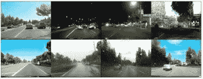
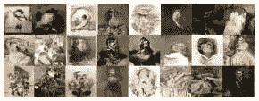
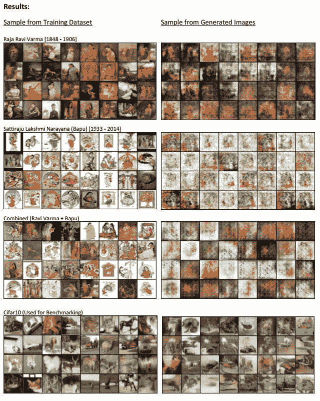
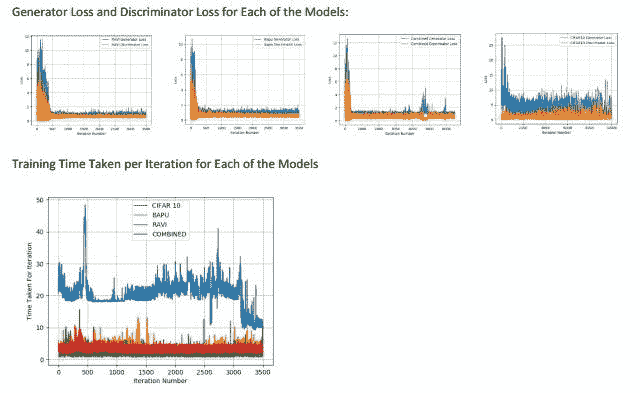

# 运用生成性对抗网络创造新颖的艺术形象

> 原文：<https://towardsdatascience.com/using-a-generative-adversarial-network-gan-to-create-novel-artistic-images-e06c65ff43ad?source=collection_archive---------14----------------------->

## 学习使用小的、不一致的和定制的数据集捕捉艺术家的风格

在这个项目中，我使用了一个生成性对抗网络(GAN)架构来生成新的艺术图像，这些图像捕捉了印度艺术家 Raja Ravi Varma[1848–1906]和 Sattiraju Lakshmi Narayana[1933–2014]的风格。[(链接到源代码的 Github Repo)](https://github.com/aakashpydi/GenerativeAdversarialNetwork)。

**简介:**这个项目的目标是理解生成对立网络(GAN)架构，通过使用 GAN 来生成新的艺术图像，捕捉给定艺术家的风格。生成对抗网络(GAN)架构是由伊恩·古德菲勒[(链接到论文)](https://arxiv.org/abs/1406.2661)博士在 2014 年提出的。GANs 由发生器和鉴别器神经网络组成。生成器神经网络将随机噪声作为输入，并生成图像作为输出，而鉴别器神经网络将图像作为输入，并生成概率值作为输出。由鉴别器评估的概率值指示输入图像是训练集的一部分的概率。发生器的目的是用它产生的图像“欺骗”鉴别器，而鉴别器的目的是正确地“找到”发生器产生的图像。竞争网络的这种对抗性、零和性质导致生成器越来越多地产生在概率上更有可能属于训练集的图像。下面给出了 GAN 的示例架构。

**其他作品:**当我看到英伟达科学家在 2017 年发表的一篇题为[“无监督图像到图像翻译网络”的论文时，我被介绍到了 GAN 架构。](https://arxiv.org/pdf/1703.00848.pdf)他们使用 GAN(耦合 GAN)架构的变体来训练模型，这些模型可以有效地获取(I)白天拍摄的照片的输入图像，并在晚上产生照片的令人信服的输出图像，(ii)动物，并产生变形为不同动物的动物的令人信服的输出图像，(iii)个体，并产生添加了特征(改变发型，添加附件)的个体的令人信服的输出图像。下面是他们论文中的一个例子。对于每一对图像，左边的图像是输入，右边的图像是输出。

为了进一步理解这个模型，我找到了伯克利科学家在 2017 年发表的一篇题为[‘使用循环一致的对抗网络进行不成对的图像到图像的翻译’](https://arxiv.org/pdf/1703.10593.pdf)的论文。他们还使用 GAN(循环 GAN)架构的变体来训练模型，这些模型可以有效地获取(I)照片的输入图像，并以各种画家的风格产生照片的令人信服的输出图像，(ii)在夏天拍摄的照片，并在冬天产生照片的令人信服的输出图像。下面是他们论文中的一个例子。

到目前为止讨论的 GAN 模型本质上是将输入图像转换成具有一些期望特征的修改的输出图像。我想看看甘的建筑是否可以用来创造新的艺术形象，捕捉特定艺术家的风格。我随后在脸书找到了一个 2017 年由几个人独立完成的研究项目，名为[‘GANGogh:用 GANs 创造艺术’](/gangogh-creating-art-with-gans-8d087d8f74a1)。他们使用甘建筑来(I)了解各种艺术家的风格，然后(ii)创造一种新的应用学习的风格，以产生新的艺术。

**我的贡献:**我希望我通过这个项目的主要贡献是为(I)时间紧迫，(ii)处理能力不足，(iii)希望使用小型自定义数据集，以及(iv)制作新颖、印象主义的艺术图像(捕捉给定艺术家的风格)的开发人员提供一种了解 GAN 架构的方法。时间和处理能力对我来说是一个很大的限制，因为我不得不在一个很慢的虚拟机上很晚才开始我的项目工作。因此，我对大幅减少训练一个模型的时间很感兴趣。我通过使用一个非常小的定制数据集(大约 200 张图片)做到了这一点。然而，与这种选择相关的权衡是，生成器或鉴别器更有可能“压倒”另一个(即，生成器学习速度比鉴别器快得多，或者鉴别器学习速度比生成器快得多)。这使输出图像退化为噪声。我通过引入条件反向传播来解决这个问题。当高于某个阈值时，与网络相关的损失被反向传播。通过分析模型产生的损失，我发现这是有效的。这种方法允许生成新颖的印象主义图像，其用相对少的训练时间和数据集有效地捕捉给定艺术家的风格。注意，小数据集导致生成的图像本质上是印象式的。然而，这是可以的，因为我们通过一个新的印象派图像实现了捕捉艺术家风格的目标，并大大降低了处理成本。这个小数据集也让我们能够在没有太多作品的情况下，捕捉较小的地区性艺术家的风格。我使用 cifar10 模型进行基准测试。由于 cifar10 数据集包含 60，000 幅图像，处理时间明显更长，因此生成的图像印象不深，因此它是一个很好的对比。

**结果:**

**讨论:**我们可以看到产生的图像本质上是印象派的。Ravi Varma 模型和 Bapu 模型在以艺术家的风格产生新颖的印象主义图像方面特别有效。组合模型显然具有较差的印象质量。我们可以推断这是可能的，因为鉴别器在这种情况下可以学习得更快，因为在非常小的数据集(~400 张图像)中有两种截然不同的风格。这一推论得到了上面给出的损失图的支持。注意发生器和鉴频器损耗如何在对应于组合模型的图中的一点处彼此产生显著偏差。尽管有条件反向传播，这种情况仍然存在。显然，当我们试图以不止一位艺术家的风格创作出新颖的印象派作品时，我们需要更多的数据。考虑 cifar10 基准测试示例。我们可以看到，尽管有 10 个不同的类别标签，但输出图像的印象要差得多。这是因为数据集的规模要大得多(约 60，000 张图像)。然而，我们要考虑的关键指标是上面给出的每次迭代的训练时间。请注意，Cifar10 模型的训练时间比其他模型要长得多。因此，我们能够(I)大幅减少训练时间，(ii)使用小型定制数据集，以及(iii)以特定艺术家的风格创建新颖的印象派图像。

[(视频演示链接)](https://www.youtube.com/watch?v=4UGvb_A2p7U)

*写于 2018 年 4 月 25 日*