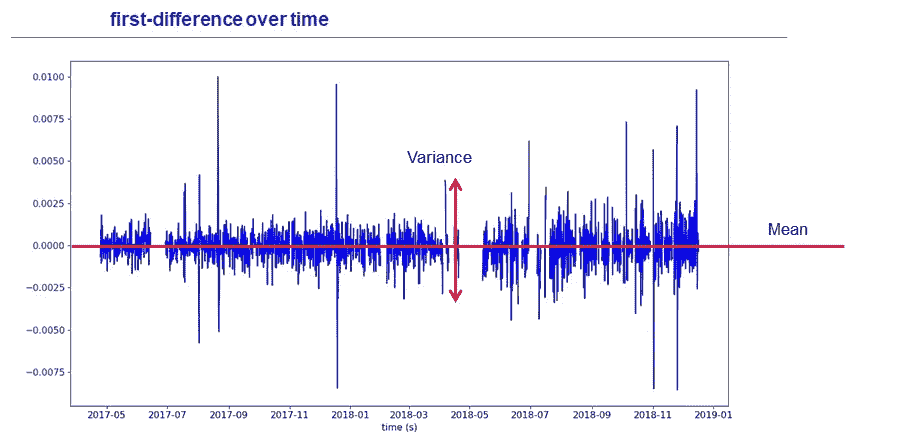
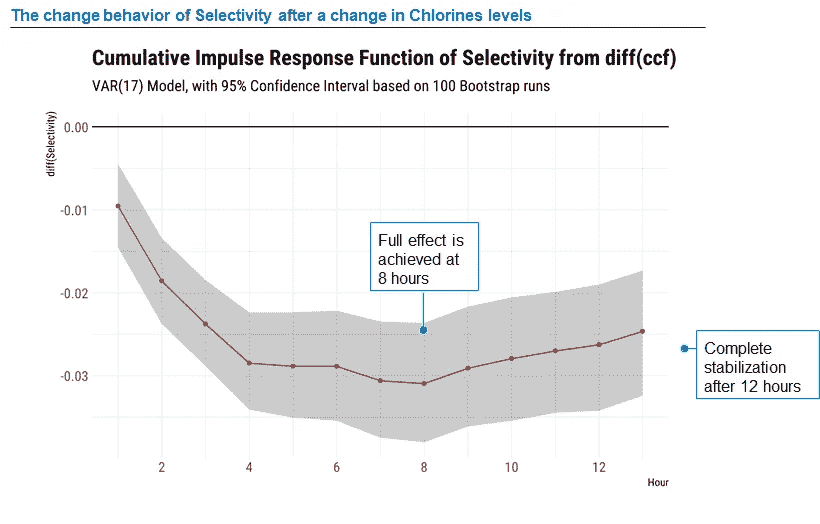
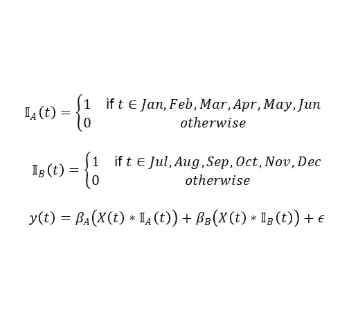

# 使用先进的“智能”分析提高循环化学工艺的盈利能力

> 原文：<https://towardsdatascience.com/using-advanced-and-smart-analytics-to-boost-profitability-in-the-cyclic-chemical-process-21dffe586d82?source=collection_archive---------21----------------------->

> **目的:**针对典型的涉及循环过程的化工行业，通过优化可控参数来提高产量，从而增加利润。

# 背景

我认为，分析将对化学工业的许多领域产生重大影响，主要是在制造绩效方面。化学工业已经在 IT 系统和基础设施方面进行了投资，这些系统和基础设施可以高速生成和跟踪大量数据。然而，他们缺乏利用这种潜在智能的远见和能力。借助市场上更便宜、更先进的分析工具，人们可以利用机器学习&可视化来优化工厂参数，以提高其盈利能力。

高级分析可以帮助他们了解化学过程中发生的事情，这可能是许多化学工程师不知道的。这反过来有助于他们克服各种瓶颈，打破流程监控和运作中的一些刻板印象(传统思维)。

在本文中，我将谈论三个主要的智能和高级分析技巧，它们帮助我们创建了一个稳定的模型，该模型反过来被行业用来实现利润最大化。

1.  **改变时间序列数据的建模**——有时数据表现出一种内在趋势(如收益率持续下降)，这使得模型学习这些趋势非常困难。因此，我们在超时测试数据中观察到非常差的性能。为了克服这一点，我们预测了产量的变化，而不是产量的绝对值。这些值的变化有些稳定，因此模型相对容易学习。
2.  **智能特征工程** —特征工程是任何预测模型中最重要的一步。这是真正的数据科学家花费大部分精力的地方。在行业专家和基础数学的帮助下，我们创建了一组智能(但不是直观的)特征，这些特征被证明在预测产量方面非常重要。此外，同时帮助化学工程师了解工厂的功能。
3.  **在解决基于时间序列的建模时可以派上用场的特殊或非传统技术** -在建立预测模型期间，我们需要多次执行特定的分析，以帮助我们理解数据和过渡过程。在这一节中，我将讨论一些非传统的方法或技术，这些方法或技术可能有助于理解数据，从而有助于构建一个稳定而稳健的模型。

让我们深入研究第一部分，即改变建模，并了解它如何优于传统的时间序列建模。

# 改变建模

对于涉及数据趋势的情况，在没有任何能够捕捉该趋势的功能的情况下，训练模型变得极其困难。趋势中的每日特征将变成模型从未见过的值，因此增加了任何 ML 模型中的噪声和不准确性。为了解决这种情况，数据科学家通常会创建一个合成变量来捕捉趋势，如一年中的月份、经过的时间或简单的行号。在涉及衰减属性或未知速率的自回归属性的情况下，这种策略往往会失败。为了克服这个趋势问题，我们引入了变化建模。我们预测给定时间间隔内产量的变化。利用变化建模，我们对 x 和 y 特征相对于时间进行求导，以平滑趋势。这种方法使我们能够显著提高模型的预测能力。

```
△ P(time = t) = P(time = t) - P(time = t-1)P is the distribution which is dependent on time.
```

请注意，离群值处理和缺失值插补现在应该应用于这些衍生产品。


A graph showing a declining yield of a plant over the course of 2 years. It is called as ‘non-stationary’ behavior i.e. changing mean & variance which is not ideal for the time series modeling.

当我们对这种趋势求导时，结果看起来更稳定，更适合时间序列建模。



Constant mean and variance over time and mitigate the noises due to any reasons in data collection.

# 智能特征工程

我将谈论三种不同于传统的广泛特征-

1.  **由于建模变化而定义发生变化的特性:**当你对 x 和 y 求导时，特性会发生一些疯狂的事情。
    通过研究二元关系和咨询行业专家，很多时候数据科学家需要创建一些特征转换。例如，一个特征的对数，乘以二，取一的平方等等。现在，根据变更建模，这种转换将会完全改变。这是变化-

```
y = log (x)                        ||          △y = △x / x
y = x²                             ||          △y = x △x
y = p X q                          ||          △y = p △q + q △p
y = 1 / x                          ||          △y = -△x / x²
```

2.**从商业和数据科学的角度来看，其他一些很酷的功能可能会有所帮助:**一些功能，如变化变量的滞后，采用二次微分来捕捉变化率以及绝对变量的滞后。输入所有这些变量有时会让您对模型性能感到惊讶。然而，在时间序列建模中，数据泄漏是一个非常严重的问题。
**数据泄漏**是指来自训练数据集之外的信息被用于创建模型。这些额外的信息可以让模型学习或知道一些它本来不知道的东西，从而使正在构建的模式的估计性能无效。屡试不爽的防止数据泄露的方法是问问你自己

> *如果在您希望使用模型进行预测时，任何其他特性的值实际上不可用，则该特性会给您的模型带来泄漏*

3.**利用高级算法获取创新特征，特别是针对时间序列建模:**在特征工程自动编码模块中总是有新的进步，这些模块可以捕获时间序列数据的特殊特征。其中一个模块是“ *tsfresh* ”，它在 *Python* 中可用。
自动计算大量时间序列特征。此外，该软件包包含评估回归或分类任务的这些特征的解释能力和重要性的方法。要详细了解该包的工作和实现，请参考下一页。
需要注意的一点是:在使用这样的包时，企业很难解释这个特性及其在现实世界中的重要性。因此，当预测不是模型构建的唯一目的，而是涉及到预测的驱动因素时，我们不应该使用这样的库。

```
pip install tsfreshfrom tsfresh.examples.robot_execution_failures import download_robot_execution_failures, load_robot_execution_failuresdownload_robot_execution_failures()
timeseries, y = load_robot_execution_failures()
```

# 智能或非传统技术，在解决基于时间序列的建模时可以派上用场

在这里，我们将讨论我在各种时间序列问题中学习和实现的一些技术。这些技术是非传统的，很难在网上找到任何有用的内容。然而，在回答涉及化学过程的复杂问题时，尤其是循环问题时，它们被证明是超级方便的。

1.  **脉冲响应函数**:了解当另一个不同的变量发生变化时，一个变量发生变化所需的时间。根据这一分析，您可以回答以下类型的问题—
    a .如果我对温度稍作改变，稳定产量需要多长时间？
    b .系统意识到氯含量变化的影响需要多长时间？



The y-axis shows the change in selectivity given a change in chlorine level is initiated at t= 0 hours. The x-axis shows the time from the change in chlorine levels. Grey region is the confidence interval of changes recorded in selectivity at t = T hours after the change in chlorines. This graph shows that the selectivity levels effect recorded after 8 hours of the change in chlorine and it finally stabilized after 12 hours.

在 R 中，我们有一个库“*VARS”*，它有一个函数 *irf* (脉冲反应函数)，做的工作和上面提到的一样。下面是所用代码( *R，tidyverse* )的图示—

```
library(vars)# p represents the lag order. This have 17 orders of all lag variables.
m.var <- df.reg %>% 
  VAR(p = 17, type = "const") irf.var.cum.ccf <- irf(m.var, 
                       n.ahead = 12, # No of Steps
                       runs = 1000, #Runs for the bootstrapping
                       impulse = "d_ccf", #Variable which changes
                       response = "d_S44" #Variable wohse effect is recorded)# Generates the plot
irf.var.cum.ccf %>% 
  plot()
```

**2。基础扩展:**它是一种技术，使我们能够通过在线性模型中保持其他变量的长期影响来捕捉一个变量的近期影响。在时间序列模型中，当您希望一个变量的系数捕获更近期的样本和来自长期样本的其他系数时。你也可以尝试其他传统技术——

*   **对样本集**进行加权，以便最近的时间段具有更高的权重(可能会导致整体预测能力的损失)
*   **创造特征**或试图理解为什么这种积极和消极的行为会随着时间的推移而改变(非常困难且依赖于数据)
*   **改变训练周期的长度**(可能不会产生期望的结果，如系数趋于零等。)

有时，一个 X 变量对 Y 的影响随着时间的推移而变化。例如，在 6 个月中，它对 Y 变量有积极的影响，而在接下来的 4 个月中，这种影响是消极的。你应该确保**其他变量必须与 Y 变量有稳定的关系。**

一个简单的线性模型应该是这样的—

```
𝑦(𝑡)=𝛽𝑋(𝑡)+𝜖
Where y(t) is some output (yield) that changes over time, t
```

可以有许多其他时变信号，但为了简单起见，我们假设只有一个:X(t)。你在尝试根据某个有误差的线性模型，学习 X(t)和 Y(t)之间的关系，ε。这种关系由系数β来描述。

**复杂:**根据你使用的数据周期，β值会发生变化，这表明 X 和 y 之间的关系实际上可能会随着时间的推移而变化。

**解析:**在这种情况下，我们需要引入一个叫做“指标函数”的新函数。指示器函数是一个简单的函数，当满足某些条件时为“1”，否则为“0”。



Mathematical representations of the equations mentioned to the right of the image

让我们把一月到六月的月份集合称为“A”。我们可以用一个指标函数来描述这一点，如右图所示。
类似地，我们可以创建一个类似的函数来描述 7 月到 12 月这几个月的集合，称这些集合为“B”。
现在，使用这些指标函数，我们可以通过重写我们的方程来说明随时间变化的关系(β)。

为了在实践中实现这一点，您将按照前面的描述设计特性，创建 X 的两个副本，并在适当的时间将值清零。

然后，您可以像往常一样拟合模型。

**新的复杂因素:**你的回归模型中不仅仅只有一个单一特征。你的回归方程实际上更像这样(尽管更复杂):

```
𝑦=𝛽_1*𝑋_1(𝑡) + 𝛽_2*𝑋_2(𝑡) + 𝛽_3*𝑓(𝑋_1(𝑡), 𝑋_2(𝑡)) + 𝜖
```

它被简化为只有两个独立变量，假设 x1 是我们目前讨论的变量。X_2 是植物发出的其他信号，f(X_1，X_2)是你根据 X_1 和 X_2 的相互作用设计的特征。

如果我们实现上面建议的更改，并将 X_1 的影响分成两个特性，您将得到:

```
𝑦(𝑡) = 𝛽_𝐴1*(𝑋_1(𝑡)∗𝕀_𝐴(𝑡)) + 𝛽_𝐵1*(𝑋_1(𝑡)∗𝕀_𝐵 (𝑡)) + 𝛽_2*𝑋_2(𝑡) + 
𝛽_3*𝑓(𝑋_1(𝑡),𝑋_2(𝑡)) + 𝜖
```

> **“如果我们相信 X_1 和 y 之间的关系随时间变化，我们是否也需要重新评估 X_1 和 X_2 随时间变化的关系？”**

**新决心:**答案是，要看你自己搞清楚是否有必要改变这一点。没有快速的答案，但是你可以尝试一些事情:

*   仅更改单个有问题的特征(X _ 1)-保持其他工程特征不变
*   改变你单一的有问题的特性(x1)和一些包含 x1 的影响更大的工程特性
*   改变所有依赖于 X_1 的特性

所有这些方法都是完全合理的，可能会也可能不会提高你的模型的拟合度。当然，你的解释会随着你采取的方法而改变。

如果你只实现了 X_1 上描述的单基函数，你实际上是在说:“我们相信 X_1 对收益率的影响会随着时间而变化——我们可以证明这一点。然而，受 X_1 影响的其它过程，例如 f(X_1，X_2)，具有随时间的恒定关系，并且它们与产量的关系不随时间改变。”

你需要运用你对数据和过程的了解来判断这样的结论是否合理。

**3。分位数回归:**这种技术并不常用，但它比传统的线性回归有自己的优势。相对于普通的最小二乘回归，分位数回归的一个优点是，分位数回归估计对响应测量中的异常值更稳健。

分位数回归已由多位统计学家提出，并被用作在变量的均值之间没有关系或只有弱关系的情况下发现变量之间更有用的预测关系的方法。

Python 中的分位数回归实现

```
# Quantile regression package
import statsmodels.formula.api as smf# Building the formula
formula = 'Conversion_Change ~ ' + ' + '.join(X_columns)# Training the model
mod = smf.quantreg(formula, df_train)
res = mod.fit(q=.5)# Evaluation metrics on test dataset
r2_test = r2_score(y_test, res.predict(df_test))
```

# 参考

[1]h[ttps://en . Wikipedia . org/wiki/Quantile _ regression # Advantages _ and _ applications](https://en.wikipedia.org/wiki/Quantile_regression#Advantages_and_applications)

[2]https://web.stanford.edu/~hastie/Papers/ESLII.pdf

[3][https://en.wikipedia.org/wiki/Indicator_function](https://en.wikipedia.org/wiki/Indicator_function)

[4][https://machine learning mastery . com/data-leakage-machine-learning/](https://machinelearningmastery.com/data-leakage-machine-learning/)

[https://tsfresh.readthedocs.io/en/latest/](https://tsfresh.readthedocs.io/en/latest/)