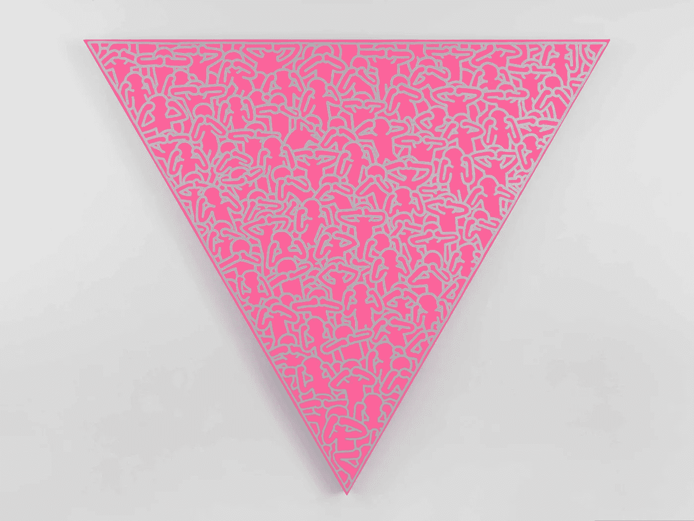

# 使用人工智能来确定具象艺术还是抽象艺术在今天更受欢迎

> 原文：<https://towardsdatascience.com/using-ai-to-determine-whether-figurative-or-abstract-art-is-more-popular-today-401bb18435bf?source=collection_archive---------21----------------------->

虽然智人在大约 10 万年前就有抽象思维的能力，但人类大脑花了更长的时间才发明了 T2 抽象画。直到 20 世纪初，像[瓦西里·康丁斯基](https://www.artsy.net/artist/wassily-kandinsky)、[卡齐米尔·马列维奇](https://www.artsy.net/artist/kasimir-severinovich-malevich)和[希尔玛·阿夫·克林特](https://www.artsy.net/artist/hilma-af-klint)这样的艺术家才创作出与现实世界毫无关联的抽象作品。抽象很快成为推动艺术创作的指路明灯，这一趋势在很大程度上延续至今。

但是抽象艺术到底有多受收藏家和艺术爱好者的欢迎呢？为了尝试回答这个问题，我们收集了去年 12 月 112，600 个 Instagram 帖子的数据库，这些帖子的地理位置和/或标签显示用户在迈阿密海滩举办巴塞尔艺术展期间在迈阿密。剔除自拍和其他无关图片后，产生了大约 74，760 张图片，这代表了 Instagram 用户亲自看到的所有艺术作品的集体视觉记录，他们也选择了与粉丝分享。基于我们早期的作品，我们然后通过一个为艺术设计和优化的人工智能工具来运行这些图像，以便按照流派(例如，抽象、具象)将艺术分为几大类，并识别出 10 种最常见的艺术作品。这些算法是由纽约的科技初创公司 Artrendex 开发的，Ahmed Elgammal 是该公司的创始人兼首席执行官。一些令人惊讶的结果出现了。

当今最流行的艺术表现方式是什么？

虽然抽象仍然流行，但它对艺术爱好者的相对重要性似乎在下降。在去年 12 月所有在 Instagram 上分享照片的迈阿密博览会参观者中，抽象艺术作品仅占帖子总数的 36%，低于去年的 52%。相比之下，去年 12 月的作品数量从 30%上升到 36%。第三个最受欢迎的类别是以某种方式涉及风景或室内的艺术作品，占 18%。主要基于文本的艺术品占 9%，而只有 1%的图像代表特定的物体——例如，一把螺丝刀或一双鞋。

我们将迈阿密的帖子与 Instagram 帖子的更大数据集进行了比较，这些帖子是我们在过去 18 个月里从其他顶级艺术博览会收集的。在过去的一年里，Instagram 用户对抽象艺术的兴趣有所下降，取而代之的是对外形、风景、内部装饰和基于文本的艺术的兴趣日益增长。虽然因果关系很难确定，但我们的感觉是，艺术家试图在抽象中创新，从而在市场上脱颖而出已经变得越来越困难。在拥挤的艺术市场中，调整更传统的比喻可能是一种更保险的脱颖而出的方式。

对这种变化的一个可能的解释是，在过去几年里，画廊和博物馆明显转向展示女性艺术家和有色人种艺术家的作品。这种艺术的一个显著特征是它倾向于表现和肖像。最近的例子包括在[现代艺术博物馆](https://www.artsy.net/museum-of-modern-art)举办的[查尔斯·怀特](https://www.artsy.net/artist/charles-white-1)回顾展；泰特现代美术馆和布鲁克林博物馆[举办的“国家的灵魂:黑人权力时代的艺术”中的许多艺术家；恩迪卡·阿库尼里·克罗斯比](https://www.artsy.net/brooklyn-museum)[和达纳·史高斯](https://www.artsy.net/artist/njideka-akunyili-crosby)[的画廊展览。这些艺术家中的许多人都以将与他们社区相关的人和地方的图像“画入画面”而闻名。抽象根本无法表达他们的艺术意图。正在展出的艺术家的这种转变——在可预见的未来很可能会继续——表明抽象艺术在艺术爱好者中可能会越来越不受重视。](https://www.artsy.net/artist/dana-schutz)

**2018 迈阿密艺术周期间最受欢迎的艺术作品有哪些？**

当我们看到 10 件最具 Instagrammed 化的艺术作品时，对抽象的兴趣下降变得更加明显，其中只有一件是抽象的。

#1 — *KAWS X Campana* (2018) by KAWS and Fernando and Humberto Campana

这是一个天上人间的混搭。[费南多](https://www.artsy.net/artist/fernando-campana)和[温贝托·坎帕纳](https://www.artsy.net/artist/humberto-campana)——以用填充玩具装饰沙发、椅子和长凳而闻名的巴西设计师和兄弟——与布鲁克林的艺术家 [KAWS](https://www.artsy.net/artist/kaws) 合作，创造了一系列限量版的椅子和沙发。每一件物品上都有 75 到 120 个由 KAWS 制作的填充玩具。

#2 — *Positive Vibes* (2018) by Jack Pierson

在从事各种媒体工作的同时， [Jack Pierson](https://www.artsy.net/artist/jack-pierson) 最出名的作品是用来自垃圾场的不匹配字母拼出令人回味的短语的雕塑。去年 12 月，三家不同的画廊展出了他的单词雕塑，但公平的参观者显然更喜欢张贴“积极情绪”的图像，而不是拼出“富家子弟忧郁”或“想要更少”的雕塑。

#3 — American Power (2017) by Tristan Eaton

特里斯坦·伊顿的喷漆肖像*美国力量*中描绘了 10 英尺高的大胆女性形象。虽然这位洛杉矶艺术家在 2017 年安装了这件作品，作为 Wynwood Walls 计划的一部分，但它在一年后继续吸引人们的注意，成为 2018 年迈阿密艺术博览会期间第三大被安装的作品。

#4 — We Belong Here (2018) by Tavares Strachan

出生于巴哈马群岛，拥有耶鲁大学艺术硕士学位，[塔瓦雷斯·斯特拉坎](https://www.artsy.net/artist/tavares-strachan)以其充满概念的大型装置作品而闻名。在迈阿密，他为 Faena Festival 创作了一个霓虹灯雕塑，Faena Festival 是一个新的艺术节，与迈阿密海滩的巴塞尔艺术博览会同时举行。就像杰克·皮尔逊一样,“我们属于这里”这句精辟的话既可以被解释为宣示性的陈述，也可以被解释为间接的问题。

#5 — Hello Beautiful (2018) by Queen Andrea

安德里亚女王是纽约的美术家、壁画家和平面设计师。她是少数几个以男性为主的女性涂鸦艺术家之一。她的欢乐壁画是排名第五的艺术作品。

#6 — *Untitled (Yellow, Orange, Yellow, Light Orange)* (1955) by Mark Rothko

在迈阿密海滩巴塞尔艺术博览会上出售的最昂贵的艺术品是马克·罗斯科 1955 年的一幅画，要价 5000 万美元。这个价格尤其引人注目，因为四年前[画廊在苏富比以 3660 万美元买下了这幅画](https://www.artsy.net/article/artsy-editorial-sold-art-basel-miami-beach-12-10-18)。

#7 — *Large Fancy Room Filled With Crap* (2018) by David Shrigley

在迈阿密海滩巴塞尔艺术博览会的所有展位中，有一件由[大卫·施莱格利](https://www.artsy.net/artist/david-shrigley)创作的霓虹灯作品，上面写着“堆满垃圾的大房间”施莱格里以讽刺性的雕塑、绘画和视频闻名，他的作品经常出现在大型艺术博览会上。在最近伦敦的 Frieze 艺术博览会上，他的蓝色霓虹雕塑“我的作品很糟糕，我是一个非常坏的人”是博览会上最受欢迎的作品。

#8 — *Smooth Egg with Bow (Magenta/Orange)* (1994–2009) by Jeff Koons

[杰弗·昆斯](https://www.artsy.net/artist/jeff-koons)的*带蝴蝶结的光滑蛋(洋红色/橙色)*几乎有 7 英尺高，出自他广受好评的“庆典”系列。这座雕塑有五个不同颜色组合的独特版本(蓝色/洋红色、洋红色/紫色、洋红色/橙色、红色/黄色和银色/红色)，其中一个[于 2016 年 5 月在佳士得](https://www.christies.com/lotfinder/Lot/jeff-koons-b-1955-smooth-egg-with-5994676-details.aspx)以 740 万美元的价格售出。据报道，提供这件特殊作品的画廊要价约为 1000 万美元。

#9 — *Sora Versailles* (2018) by Miya Ando

凭借这幅迷人而空灵的作品，[陈美雅·安藤](https://www.artsy.net/artist/miya-ando)通过在建筑的各个侧面描绘日落和日出，改变了建筑的外观。从海滩木板路到邻近的街道，这是一个令人难忘的地方。

#10 — *Silence = Death* (1988) by Keith Haring

Lévy Gorvy 将其在迈阿密海滩巴塞尔艺术博览会上的展台改造成了向[基斯·哈林](https://www.artsy.net/artist/keith-haring)曼哈顿下城流行商店的致敬。这幅画是艺术家被诊断出患有艾滋病的那一年的作品。这幅画描绘了一些人在一个粉红色的三角形主题中表现出“视而不见，听而不见，说而不闻”的行为，这个主题因艾滋病活动家团体“行动起来”而闻名。

___________________________________

道格·伍德汉姆是*艺术信托顾问*的管理合伙人，这是一家总部位于纽约的公司，专注于向收藏家和机构提供与艺术相关的金融建议。在他职业生涯的早期，道格是佳士得美洲区总裁，也是麦肯锡公司的合伙人。他也是畅销书*今日艺术收藏:给每个热爱艺术的人的市场洞察*的作者(2017)。

艾哈迈德·埃尔加马尔是罗格斯大学艺术和人工智能实验室的主任，也是 Artrendex 的创始人兼首席执行官。