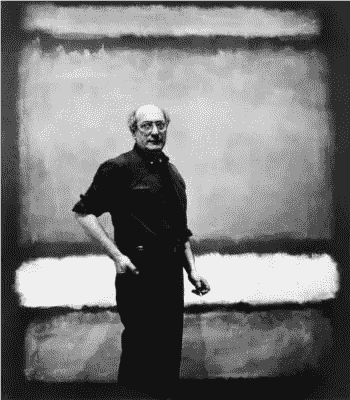
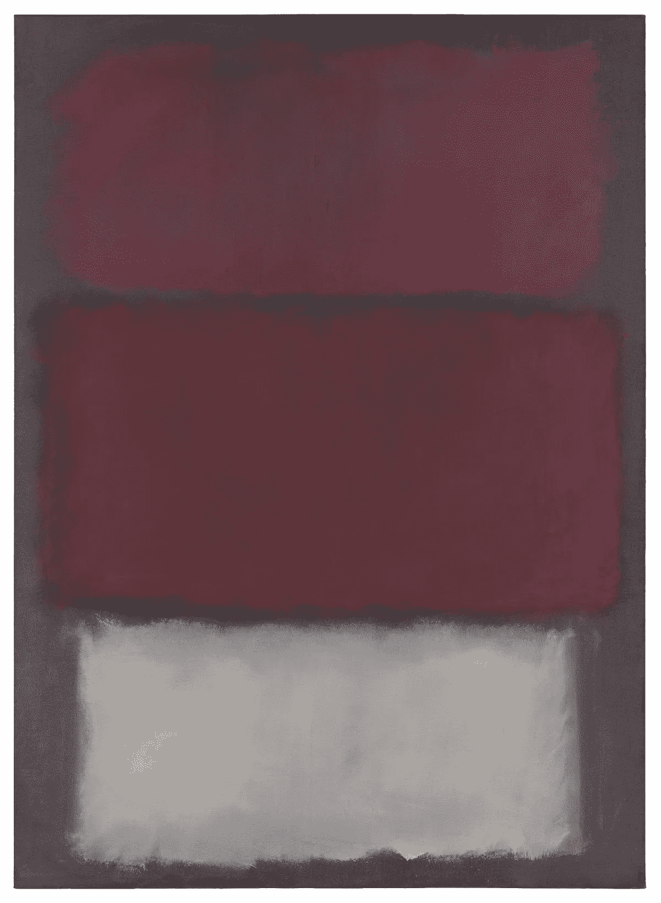
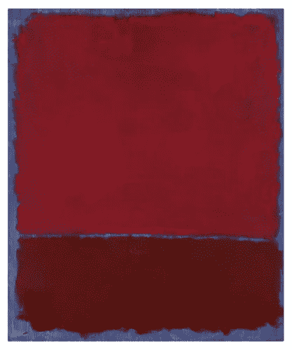
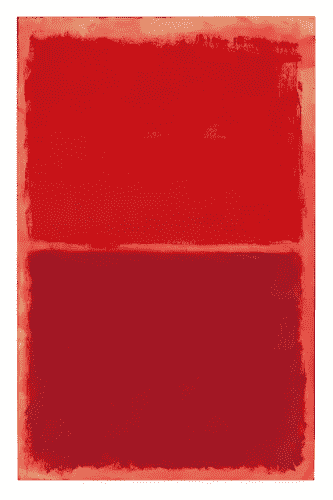

# 用人工智能预测罗斯科画作的拍卖价格

> 原文：<https://towardsdatascience.com/using-ai-to-predict-rothko-paintings-auction-prices-1e26a83abd30?source=collection_archive---------24----------------------->

马克·罗斯科悬浮在单色区域中的彩色悬浮矩形是 20 世纪最容易辨认的画作之一。在高度受限的形式下，他创作出了令人惊讶的多样化作品，为世界各地的收藏家和博物馆所垂涎。他在艺术史经典中的广泛声望和稳固地位，加上拥有[手段和欲望](https://www.artsy.net/article/artsy-editorial-new-wealth-evolving-taste-changing-art-market)拥有它的人数的快速增长，使他的作品变成了极其昂贵的“战利品艺术”。自 2010 年以来，拍卖会上的买家已经在他的画作上花费了总计 11 亿美元。

罗斯科作品的相对一致性，特别是与毕加索和沃霍尔等其他艺术界偶像相比，使他成为使用人工智能工具开发预测模型以估计拍卖价格的理想候选人。我们在下面解释我们是如何开发这个模型的，使用了世界上亿万富翁的数量和他们控制的财富等变量。然后，我们使用该模型预测将出现在 5 月 16 日苏富比当代艺术晚间拍卖会上的三件罗斯科作品的销售价格。但首先，简单介绍一下罗斯科市场。

**耶鲁辍学生**

罗斯科是来自拉托维亚的移民，1913 年末他十岁时来到爱丽丝岛。他的家人定居在俄勒冈州的波特兰，他在那里上高中，之后他在耶鲁大学学习了两年，然后辍学。他于 1923 年搬到纽约，并在那里一直呆到 1970 年去世。

学者们倾向于把他的职业生涯分为三个时期。在*早年*(1924-1939)期间，他经常画神话主题或受超现实主义启发的作品，其中很少有特别杰出或有趣的。在过渡的*年*(1940–1950)，他从表现转向探索色彩和形式的并置如何被用来创造有趣的空间关系。他举世闻名的大部分画作都是在他晚年创作的，学者们称之为“经典时期”(1951-1970)。

在这第三个也是最重要的时期，罗斯科作品不多。华盛顿国家美术馆于 1998 年出版了一份他所有帆布和硬纸板作品的目录清单，其中仅包括这一时期的 386 件作品。这意味着平均每年只创作 20 幅画。

罗斯科还在纸上创作了许多作品，他认为这些作品是成熟的绘画，而不是素描。艺术家的儿子克里斯托弗·罗斯科(Christopher Rothko)写道，罗斯科坚持认为，他所有的纸上作品“……都要装在支架上，呈现出来时要无垫、无框、无釉。换句话说，他们应该像绘画一样被对待，没有任何东西阻碍我们的观点和方法。据我所知，我父亲在世时展出或出售的所有罗斯科的经典纸质作品都是装裱的，而不是装裱的，有些作品比其他作品更成功，但这种一致性清楚地表明了我父亲的愿望。”国家美术馆目前正在收集这位艺术家的纸质作品目录，预计将于 2022 年面世。因为纸更便宜，更容易使用，这位艺术家在纸上创作的经典画作可能比在画布上创作的更多，尽管准确的数字要到目录出版后才能清楚。

他的纸上作品和画布作品都会定期出现在拍卖会上。罗斯科的作品也私下出售，主要是通过佩斯画廊，自 1978 年以来一直代表艺术家的财产。

**罗斯科价格预测模型**

想象一下，站在一幅罗斯科作品前，认真地看着它。你会很快注意到矩形的数量，它们的颜色，以及它们与它们所绘制的单色场相比如何。这些是这幅画容易测量的方面。但罗斯科作品还有许多其他难以用语言表达的品质，更不用说量化了，这些品质有助于它的情感之美，比如矩形的边缘如何融入基色，绘画的亮度，以及颜色和形式并置创造的不寻常的空间关系。我们的眼睛看到这些信息，并将其传输到我们的大脑，引发情绪反应。

人工智能现在使机器能够在某些方面像人类一样看待世界，并允许它们将这些知识用于各种任务，包括驾驶自动驾驶汽车和使用视频监控系统监控时代广场的人们。计算机视觉的革命在很大程度上归功于一种叫做卷积神经网络(CNN)的模式识别算法。CNN 观察数字图像中的像素并从中寻找模式，而不需要机器先被告知要寻找什么。换句话说，这种技术提取图像本身的潜在特征，包括难以预先指定的特征。我们使用这种方法来分析罗斯科画作的数字图像，生成可用于预测销售价格的信息。

为了建立我们的模型，我们创建了一个数据库，包含了自 2000 年以来拍卖的这位艺术家的所有经典时期和晚期过渡时期的作品，总共有 118 件。该数据库不仅包括从 ArtNet 收集的全包销售价格(即，锤子价格加上买家溢价)和对象描述符(例如，尺寸、绘画制作日期、销售日期、画布或纸张上的绘画)，还包括我们从网络上获取的每件作品的数字图像。作为数字图像的潜在替代品，我们还对每幅画的形式属性进行了“手动评分”:色块的数量、艺术家可能用来分隔这些色块的水平条纹的数量、画中的主色以及背景色。这四个变量通常会被鉴定人用来比较画作。除了这些“供给”变量，我们还收集了艺术品“需求”的各种衡量标准，如全球财富的增长、各种股票指数的增长，以及[福布斯亿万富翁指数](https://en.wikipedia.org/wiki/The_World%27s_Billionaires)中亿万富翁的总财富和总数。然后，我们使用这些数据开发了一个模型来预测拍卖价格。

我们创建的模型惊人的准确，只有 5.5%的预测误差。这意味着，在我们数据库中的所有画作中，实际销售价格和预测销售价格之间的差异平均只有 5.5%。让这个表现最好的模型如此有趣的是，它的预测仅仅基于数字图像加上五个变量:绘画高度和宽度，是纸上还是画布上的作品，世界上亿万富翁的数量，以及他们控制的财富。我们数据库中的其他变量似乎都与价格无关，包括这幅画的制作日期。我们还将计算机生成的模型与我们自己的评估进行了比较，用上面提到的四个手动评分变量代替了数字图像。有了这些手动评分的变量，预测误差飙升至 20 %,作为一个模型，这是非常不够的。这种差异生动地提醒我们，机器可以比人的眼睛更敏锐地“观察”一幅画。

在将模型投入使用之前，对其进行一些一般性的观察。首先，亿万富翁的数量和他们控制的财富是解释销售价格的最重要的需求变量。其次，规模很重要。在其他条件不变的情况下，作品越大，越有价值。第三，在所有其他因素保持不变的情况下，纸上绘画相对于画布上的绘画有很大的折扣。最后，与深色的棕色和灰色相比，挂在墙上的鲜艳的橙色和紫色画作更容易打开买家的钱包。

**5 月拍卖成交价预测**

这让我们看到了马克·罗斯科的三幅作品，它们将在 5 月 16 日的苏富比当代艺术晚间拍卖会上拍卖。

旧金山现代艺术博物馆(SFMOMA)收藏了七幅罗斯科的作品，正在取消一幅 1960 年的未命名的古典时期画作。在宣布出售的新闻稿中，博物馆表示，它打算使用出售所得来购买作品，以帮助他们的收藏多样化。像今天的许多博物馆一样，SFMOMA 希望购买女性、有色人种和其他被忽视或边缘化群体的作品。

Untitled (1960), Oil on canvas, 69 x 50 1/8 inches

苏富比[估计这幅画的拍卖价将在 3500 万美元到 5000 万美元之间。但中标者还需要支付苏富比的买方溢价，相当于拍卖价格的 25%，最高不超过 400，000 美元，超过 400，000 美元部分的 20%，最高不超过 4，000，000 美元部分的 13.9%。加上买方溢价后，苏富比预计这幅画的售价将在 4010 万美元至 5720 万美元之间。](http://www.sothebys.com/en/auctions/ecatalogue/2019/contemporary-art-evening-auction-n10069/lot.12.html)

在通过我们的算法运行这幅画后，该模型预测它将卖到 4230 万美元(锤子价加上买家溢价)，接近苏富比拍卖估计的低端。这仍然是一笔令人震惊的巨款，将会给贪婪的 SFMOMA 策展人带来快乐。苏富比的专家可能认为这件作品会卖出更高的价格，因为博物馆拍卖的艺术品往往在拍卖会上卖出高价。但是这种可能性在我们的模型中是无法解释的。

为了好玩，我们还玩了模型，看看 SFMOMA 画作的变化会如何影响其价值。如果颜色比目前的棕色勃艮第更偏向橙色，预计售价将跃升至 6650 万美元，比现有作品高出近 60%。如果这是一幅纸上作品，它的价值将降至 2030 万美元，这反映了收藏家们长期以来对画布上的画作比对纸上画作的偏好。

两幅 1969 年的经典纸质画作也将于今年 5 月在苏富比拍卖。两幅作品中较大的一幅名为*《无题(红色和酒红色盖过蓝色)】*，[的预售估价](http://www.sothebys.com/en/auctions/ecatalogue/2019/contemporary-art-evening-auction-n10069/lot.15.html)为 900 万美元至 1200 万美元，或 1050 万美元至 1390 万美元(含买方溢价)。我们的人工智能模型预测这幅画的售价将达到 1660 万美元，高于拍卖估价的上限，这将使它成为该艺术家在拍卖中出售的第二昂贵的纸上作品。如果这幅画的一切都是一样的，除了它是在画布上，模型预测它会卖到 3340 万美元，几乎是它的纸质复制品的两倍。

Untitled (Red and Burgundy Over Blue), 1969, Oil on paper mounted on panel, 48 x 40 1/2 inches

第二幅纸上作品，*无题(红上红)，*较小，但以其明亮的红色调色板而闻名。苏富比[估计](http://www.sothebys.com/en/auctions/ecatalogue/2019/contemporary-art-evening-auction-n10069/lot.16.html)它将以 700 万美元到 1000 万美元之间的价格售出，或 820 万美元到 1170 万美元(含买方溢价)。鉴于其诱人的配色方案，我们的模型预测它的售价将达到 1370 万美元，也高于拍卖估价的上限。两幅作品都以高于拍卖估价的价格出售的前景，不仅反映了作品的内在质量，也反映了拍卖行长期以来的做法，即试图将估价保持在尽可能低的水平，以吸引更多的竞标者。

Untitled (Red on Red), 1969, Oil on paper mounted on canvas, 38 3/4 x 25 inches

马克·罗斯科是 20 世纪最受喜爱的艺术家之一。因为他的成熟作品属于受限制的视觉词汇，罗斯科画作的数字图像可以用来创建可靠的价格预测模型。我们急切地等待着即将到来的苏富比拍卖会的结果，看看这个模型表现如何。

*本文发表于 2019 年 5 月 7 日《Artsy》杂志。原文发表于 2019 年 5 月 3 日[*https://dougwoodham.com*](https://dougwoodham.com/blog/2019/5/3/how-much-is-that-rothko-in-the-window)*。*

— — — — — — — — — — — — — — — — —

本文由道格·伍德汉姆和德文·刘撰写。

道格是纽约艺术信托顾问公司的管理合伙人，该公司专注于为收藏家和机构提供与艺术相关的金融建议。在他职业生涯的早期，道格是佳士得美洲区总裁，也是麦肯锡公司的合伙人。他也是畅销书*今日艺术收藏:给每个热爱艺术的人的市场洞察* (2017)的作者。

Devin 是一名软件工程师，专门研究将人工智能应用于未来的工作。他目前正在湾区人工智能初创公司 Cresta 为大型企业公司实现重复性工作职能的自动化。他刚刚开始收集，并对探索人工智能和艺术的交叉感到兴奋。