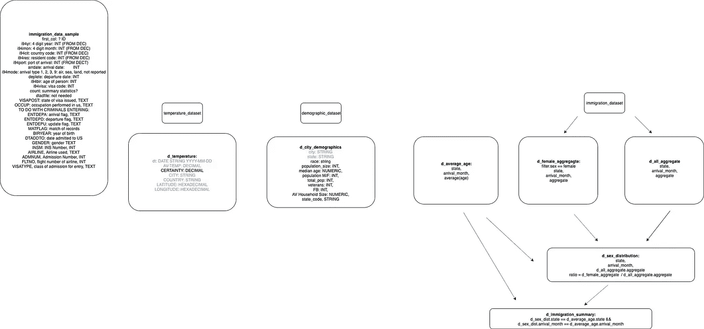
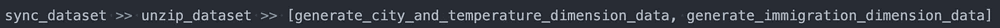
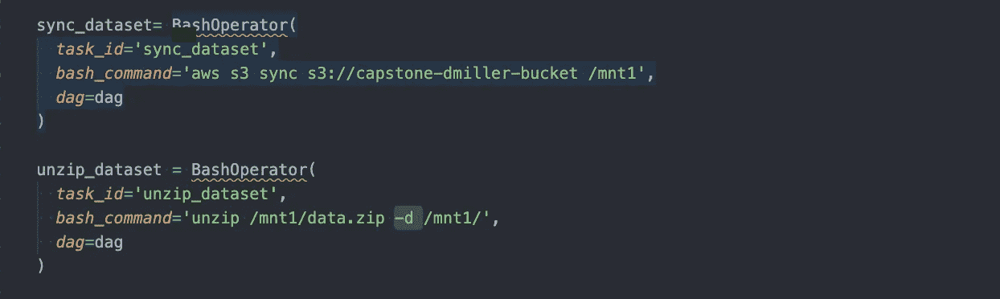
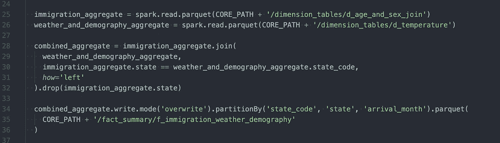
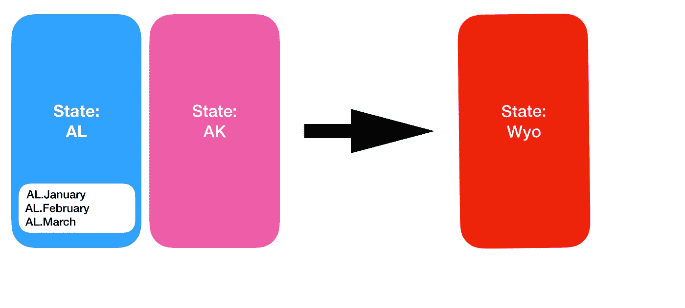
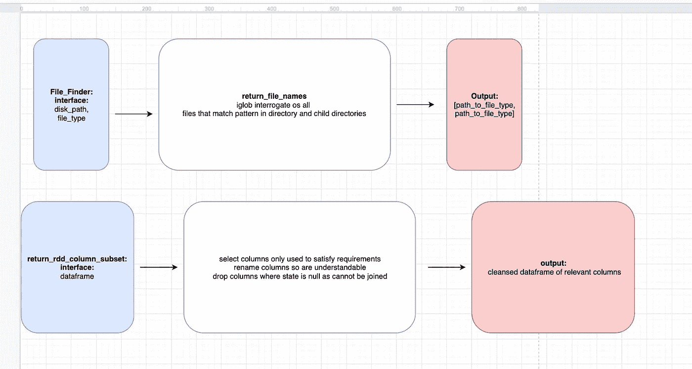
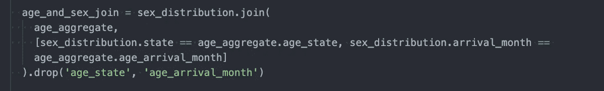
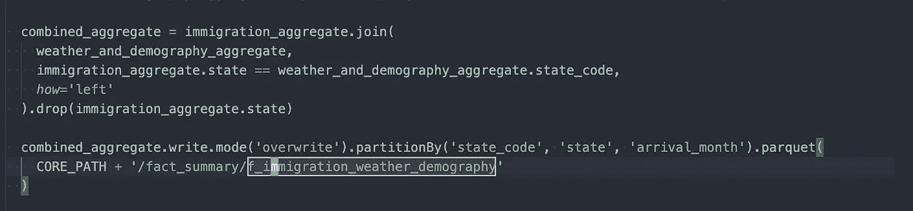

# 利用气流和火花处理美国移民数据

> 原文：<https://towardsdatascience.com/using-airflow-and-spark-to-crunch-us-immigration-data-aa7c95b37031?source=collection_archive---------13----------------------->

Photo by [Matthew Smith](https://unsplash.com/@whale?utm_source=unsplash&utm_medium=referral&utm_content=creditCopyText) on [Unsplash](https://unsplash.com/s/photos/departures?utm_source=unsplash&utm_medium=referral&utm_content=creditCopyText)

为了促进从 DevOps 工程师到数据工程师的转变，我完成了 Udacity 数据工程纳米学位。

我完成的最后一个项目涉及结合美国移民数据、世界气温数据和美国城市人口数据。使用这些数据集，以及一些简单的连接和聚合，我能够确定到达美国城市的平均年龄和性别。

然后将这些数据与每个城市的温度数据相结合，这样就可以将到达人数与天气趋势联系起来。人口统计数据还可以说明参与者的平均年龄和城市之间是否存在关系。或者，可以重新利用这些数据，看看到达者的种族和城市/州的人口统计数据之间存在什么关系。

在这篇文章中，我将解释我完成这个项目的步骤。我发现“逆向工程”解决方案非常有效。明确定义最终结果有助于确保我采取的每一步都有助于最终目标，并且没有浪费时间。

然后，我将讨论整个项目中出现的一些挑战。在 2015 年的 Macbook Pro 上处理 7gb 的数据集是不可能的。利用 AWS EMR 和气流提供动力，创建高效的管道。最后，如果有第二次机会(和更多时间)，我将讨论性能改进，这将极大地提高代码的可伸缩性和运行时间。

# **数据第一，代码第二**

在编写**任何**代码之前，我首先回顾了数据集，并明确定义了最终的数据结构应该是什么样子。为此，我首先回顾了三个数据集的模式以及它们应该在哪里连接。

在这里，我能够绘制一个模式来定义数据集之间的关系。从软件的角度来看，这是定义我如何结合数据来理解美国城市移民模式的关键。

在定义了数据集之间的关系之后，最终的数据结构被明确地定义了。下面的字典实际上并没有在项目中实现。然而，它使我能够为数据创建一个层次结构，并在项目结束时定义数据的结构。对于每个州，应该有一个每月到达的汇总，一些关于人的年龄和性别以及平均温度的平均值。

我花了大约 35%的时间来理解数据、创建模式和定义最终结果。这使我能够为这个项目创建一个清晰的目标，这个项目的实现将完全围绕这个目标。我现在将讨论为实现该项目而创建的步骤。

# 创建管道

定义了成功的最终结果后，我接着开发软件来汇总数据。数据集的大小(7gb)使得在本地执行部署不可行。因此，我利用了 AWS EMR，它为执行 Spark 作业提供了一个预配置的主从集群。

为了编排和协调管道，我使用了 Apache Airflow。Airflow 提供了一个 web-ui 和图表，记录了哪些功能或步骤需要在连续功能之前执行，以及哪些功能可以同时运行。

例如，在任何 Spark 作业触发之前，需要从 s3 下载数据集并解压缩。使用 Airflow 记录这种依赖性，如果下游任务失败(从 s3 同步文件),那么依赖的上游任务将不会被调用。这提高了管道的稳定性，防止失控代码被执行并导致意外问题。

# 提取

提取步骤相当简单，包括将 zip 文件从 S3 存储桶同步到主 EMR 节点上的挂载目录(文件系统指向不同的服务器)。一旦文件成功同步，更复杂的工作就开始了。

# 负荷

数据集成功下载到服务器后，我就可以开始实现管道了。数组样式的符号用于说明城市/温度任务和移民数据聚合可以并且理想情况下应该同时执行。

**温度和人口统计数据加载**

回到最终结果，需要确定美国城市每月的平均温度。然后，这个平均值必须与每个城市的人口统计数据相结合。

由于移民数据来自 2015 年*事实核查*因此，只选择尽可能接近今年的温度数据是有意义的，并在相同的加载步骤下将其与人口数据相结合。

移民和人口统计数据同时加载。虽然这打破了单一的责任，数据集的连接是简单的。在数据清理方面也没有预先的工作，所以将这些数据集的加载分组到一个任务中是有意义的。

最后一步记录数据应该如何保存到磁盘。Partition by 确保数据按照指定的列以降序排序并保存到磁盘。如果您知道将通过查询这些列来选择数据，这将显著提高未来的读取性能。

Binary Search (LogN) can be applied when data sorted is sorted into buckets. More performant hash searches can be applied if uniqueness of buckets is guaranteed.

**移民数据加载**

汇总移民数据更加复杂，原因有二:

*   数据集要大得多，而且分布在几个文件上，需要一个额外的库来加载。
*   需要对数据集进行汇总和转换，以确定移民的平均年龄和性别。

为了解决这个问题，我使用了一种**接口输出**的方法。在这里，首先定义函数的最终结果，然后定义它们的输入。一旦这些都清楚了，你就可以把中间部分，或者说代码，作为实现细节来对待，这些细节必须对输出有所贡献。

我从工作中的一位资深朋友那里学会了将代码定义为一系列清晰的函数/对象。它极大地提高了我的生产率和代码质量。这也非常符合 TDD 的工作风格，在这种风格下，每个功能都应该有一个可以清楚评估的特定输出。

这种方法使我能够定义从磁盘文件加载数据所需完成的确切步骤，并根据数据创建一个统一的数据帧。

从这个数据框架中，我创建了代表每个需求的子集:

*   每个州移民的平均年龄
*   每个州所有女性移民的数量
*   每个州的移民总数

使用女性和所有移民数据框架，我可以通过连接女性和所有移民数据框架，并使用女性计数/所有移民计数创建一个新列来确定性别分布。

该数据框架随后与年龄数据框架相结合，以创建一个包含每个州所有抵达者的平均年龄和性别分布的数据集。

**最终加入**

在管道的这一点上，我已经连接了温度和人口统计数据。移民数据按州汇总，确定了移民的平均年龄和男女比例。

从这一点来看，所有需要的是一个结合了温度、人口统计和移民数据的综合集合。由于所有的数据集都是按照州来划分的，所以加载数据集并通过州代码将它们连接起来既简单又高效。

这些代码行完成后，我创建了一个数据结构，它标识了以下内容:

*   每个州移民的平均年龄
*   各州移民的平均性别
*   每个日历月每个州/城市的平均温度
*   每个城市/州的人口统计数据

满足要求！

# 转学？

我不明白的一件事是如何处理这些数据！在当前状态下，它位于 EMR 集群上，实际上没有任何商业价值，也不能用于任何下游流程。

由于时间限制，我把这一部分漏掉了。Udacity 课程每月 300 英镑，所以我自然想完成它。

正是因为这个原因，您还会看到零单元测试，可以说是将代码呈现为非生产就绪。

尽管如此，该软件实现了最终目标:证明我在数据工程领域的熟练程度。它很好地完成了这项任务，在完成课程的几周内，我就能在 Sainsbury's 获得一份数据工程师的工作，在那里我将学习所有这些东西是如何在规模上实际使用的。

# 结束语

在本文中，我展示了如何通过首先定义确切的最终目标来分解一个(相当)复杂的软件需求。这有助于确保我随后提交的每一段代码都有助于相同的最终目标。通过显式定义每个函数的接口和输出，我能够将注意力从函数逻辑的实现细节上移开。

最终的结果是，每一行代码都有助于一个产生清晰输出的功能，这个功能在最终目标的实现中有一个清晰的角色。

除非我能想到更好的方法来思考复杂系统，否则我会坚持:

*   在计划任何软件之前，明确定义最终结果
*   明确规划软件以创造最终结果
*   清楚地将功能输入和输出定义为软件的构件

*要查看所有代码，并运行管道 [**请单击此处。**](https://github.com/Daniel57910/capstone_project) *