# 利用蚁群和遗传进化优化拼车出行时长

> 原文：<https://towardsdatascience.com/using-ant-colony-and-genetic-evolution-to-optimize-ride-sharing-trip-duration-56194215923f?source=collection_archive---------5----------------------->

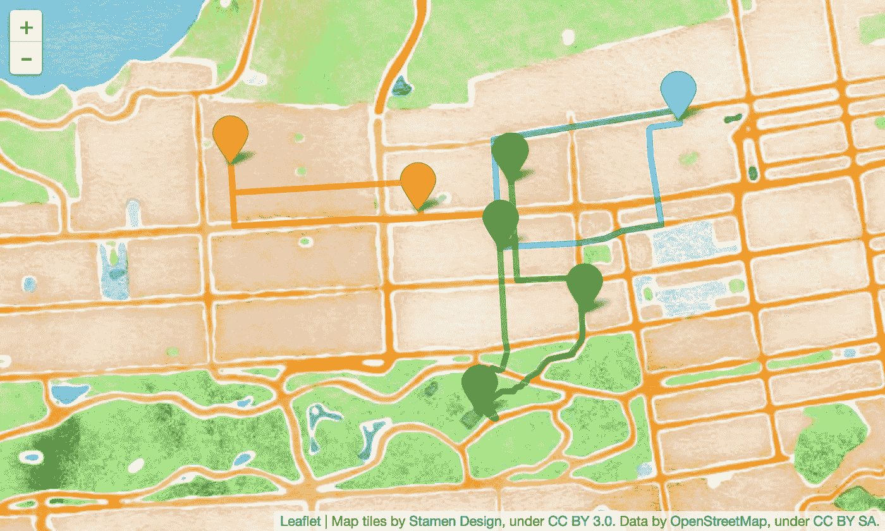

城市交通正在经历一场快速而重大的变革。自从互联网和智能手机诞生以来，我们的联系越来越紧密，并且能够规划和优化我们的日常通勤。与此同时，大量数据被收集并用于提高现有交通系统的效率。优步和 Lyft 等实时拼车公司正在利用这些数据改革出租车行业，为更加互联和集中控制的交通结构奠定基础，并建立拼车等创新系统。

在这个项目中，我解决了出租车的行程时间优化问题。这可以被框定为**旅行推销员问题**，一个众所周知的计算机科学问题。目标是找到访问一组位置的最短路径。对于这个问题，需要优化技术来智能地搜索解空间，找到接近最优的解。更具体地说，我首先使用机器学习来预测每一对接送地点之间的旅行时间。然后我使用进化算法，即蚁群和遗传算法，为数据集中的车辆找到最佳旅行路线。

# **问题描述**

## 资料组

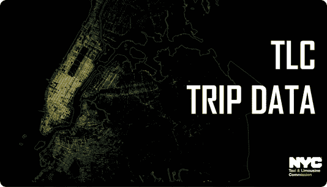

我使用的数据是纽约市出租车和豪华轿车委员会的出行记录数据，可以通过以下网址访问:[https://www1 . NYC . gov/site/TLC/about/TLC-Trip-Record-data . page .](https://www1.nyc.gov/site/tlc/about/tlc-trip-record-data.page.)我有 2016 年黄色出租车、绿色出租车和出租车辆的月度数据。该数据集有近 150 万条出行记录，具有以下 11 个属性:

*   **id** —每次行程的唯一标识符
*   **vendor_id** —表示与行程记录相关的供应商的代码
*   **拾取日期时间** —血糖仪启用的日期和时间
*   **dropoff_datetime** —血糖仪脱离的日期和时间
*   **乘客计数** —车内乘客数量(驾驶员输入值)
*   **pickup_longitude** —电表接合的经度
*   **pickup_latitude** —仪表接合的纬度
*   **dropoff_longitude** —电表脱离的经度
*   **dropoff_latitude** —仪表脱离的纬度
*   **store_and_fwd_flag** —该标志表示在发送给供应商之前，行程记录是否保存在车辆存储器中，因为车辆没有连接到服务器:Y =存储和转发，N =不是存储和转发行程
*   **trip_duration** —以秒为单位的行程持续时间(也是目标变量)

我进行了简单的数据预处理技术，如消除重复、检查纬度和经度界限、删除明显的异常值、将数据字段转换为合理的单位等。为我的实验获取一个干净的数据集。

## 数据可视化

这个项目的一个重要组成部分是可视化数据，并找出下一步用于机器学习模型的最佳特征。**取货时间**是我首先关注的一个特性。

图 1 是一天中不同小时的取件时间分布。可以看出，最受欢迎的接送时间是下午 6 点到 10 点，超过 70，000 次。另一方面，最不活跃的接车时间是凌晨 2 点到 6 点，不到 35，000 次。

图 2 是一周中工作日的取件时间分布。似乎周五是最受欢迎的打车日，有近 220，000 次出行，而周日则是另一端，约 165，000 次。

图 3 是图 1 和图 2 结果的拾取时间热图。最活跃的接送时间是从周四到周日的下午 6 点到 9 点。最不活跃的接送时间是从周三到周日的下午 2 点到 5 点。

我研究的下一个特征是**旅行持续时间**。

图 4 是按分钟计算的出行持续时间分布。我观察到分布严重左倾，超过 75%的行程在 3 到 12 分钟之间。超过 10，000 次的行程持续 5 到 7 分钟。

图 5 显示了按分钟与按纬度和经度划分的旅行持续时间分布的比较。经度的分布也非常左偏，峰值大约在 1 公里处。按纬度分布更为正态分布，峰值在 0 公里处。

图 6 是一天中不同时段的出行时长热图。最长的旅行通常发生在周三至周五的下午 2 点至 4 点。最短的行程发生在周一和周二的上午 8 点到 9 点。

我还对**取车**和**下车地点**感兴趣。

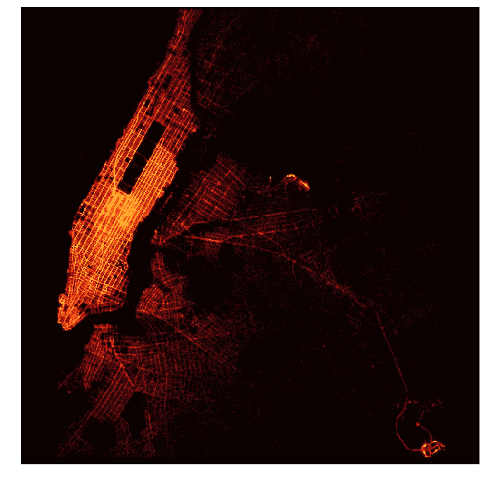

我绘制了接送位置的空间密度，如图 7 所示。这看起来有点像你从太空中看到的图像，曼哈顿和两个机场(LGA 和 JFK)“点亮”得很清楚。

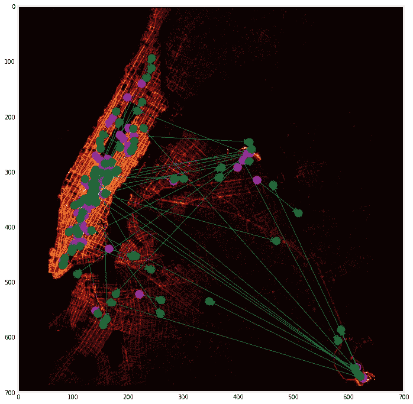

我进一步在图 8 的地图上展示了典型的旅行。洋红色圆圈是上车地点，绿色圆圈是下车地点，青色箭头线是行程长度。我可以看到接送地点的不均匀分布，因为曼哈顿以外(皇后区和布鲁克林区)有更多的接送地点。

## 机器学习

我的下一步计划是建立一个机器学习模型来预测接送地点之间的旅行时间。有了数据和目标，简单的线性回归就不够强大了。在庞大的数据集中有一些随机异常值，并且可能有一些分类特征，我决定使用梯度提升树，它可以轻松捕捉非线性关系，适应复杂性，并处理分类特征。使用的输入要素有:乘客计数、接送经度、接送纬度、接送经度、接送纬度和商店和转发标志。输出目标是 trip_duration。

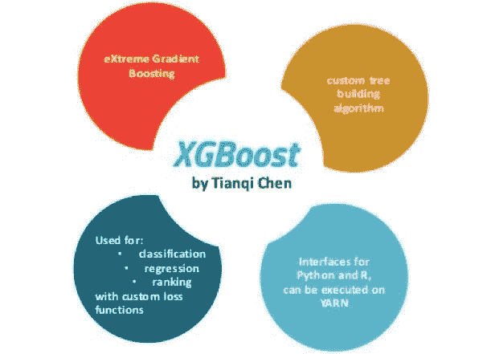

我通过 XGBoost 实现了这个模型，XGBoost 是一个优化的分布式梯度增强库，旨在高效、灵活和可移植。这个模型很容易建立，但很难微调和解释。我使用均方根对数误差作为评估指标，因为它降低了误差幅度。根据这一指标，我选择了不同的超参数并比较了结果。我为我的 XGBoost 模型使用的最终参数是:*{ fbooster = GB tree；目标=线性；learning _ rate = 0.05max _ depth = 14 子样本= 0.9；colsample _ bytree = 0.7colsample _ bylevel = 0.7 无声= 1；feval = rmsleg}* 。

我们获得的平均绝对误差为 4.83。XGBoost 模型被保存为 pickle 文件，然后将被用作下一步的输入:**优化**。

# 提议的解决方案

因为这个问题涉及最小化旅行时间，同时还要访问每个地点，所以它类似于旅行推销员问题(TSP)。旅行商问题是一个组合 NP-hard 优化问题。这意味着这个问题没有多项式时间的解。添加的位置越多，可能的解决方案就越多。解决这个问题的强力方法包括检查每个可能的位置组合。如果我要评估每条可能的路径，其中 n 代表位置的数量，那么它的运行时间如下:***O(n)=[(1/2)(n-1)！]***

考虑到这个运行时间，一旦我开始向问题定义添加更多的位置，解决方案空间很快变得难以处理。因此，我使用元启发式直接搜索解空间。我不会遍历每一条可能的路径，而是会生成可能的路径，并以一种有指导的随机方式搜索它们。

## 蚁群优化

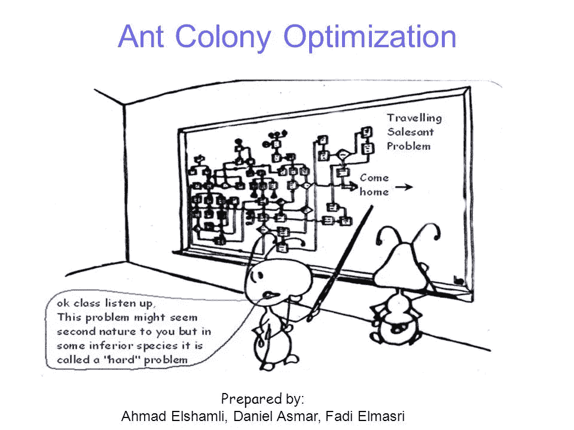

蚁群优化(ACO)算法是一种生物启发的元启发式算法，它以模拟蚂蚁搜索可能路径的方式来搜索解决方案空间。蚂蚁在它们的行进路线上留下信息素，这取决于路线的质量。由于我试图最小化旅行成本，我将使我的**信息素质量τ**等同于更低的旅行时间。完整图中的每条边都有一个对应的逆**旅行时间成本 eta** 和**信息素 tau** 。

每一代都有一定数量的蚂蚁随机出现在图中的起点。然后，每只蚂蚁通过遍历该图来构建解决方案。它通过以加权概率选择下一个位置来实现。计算从位置 I 到位置 j 的概率的公式是:

其中**τ**表示 n 乘 n 信息素矩阵，并且**η**表示 n 乘 n 逆行进时间成本矩阵。信息素矩阵中的所有值首先被初始化为 1/n。我发现用 1 初始化信息素矩阵对我的结果几乎没有影响。相应的指数 **alph** a 和**β**用于控制信息素和旅行时间成本在两个节点间概率计算中的影响。在分母中，我有这些值的总和，其中 **h** 表示蚂蚁可以访问的所有可能的位置。这些是特定蚂蚁还没有访问过的节点。将这些项加在一起，计算从节点 I 到节点 j 的加权概率。

每只蚂蚁生成相应的解后，更新信息素矩阵。如何做到这一点取决于所采用的策略。在这个解决方案中，我通过首先将它乘以 **p** (剩余系数)来更新每个信息素边缘。这代表了信息素“蒸发”或降低其影响的速率。然后，我们添加到信息素边缘 **q/c** ，其中 **q** 代表信息素强度，而 **C** 代表生成路径的总成本。因为行驶时间成本是分母，所以行驶时间较长的路径被选中的概率较低。这个过程重复 **g** 次，其中 **g** 代表世代数。

## 遗传进化

遗传进化(GE)是另一种生物启发的元启发式方法，它从进化过程中采取步骤。它利用连续世代的变异、交叉和选择功能。这些代构成了解决方案的群体。该优化算法遵循以下步骤:

1.  创建一组路径。
2.  使突变
3.  交叉
4.  确定适合度(行驶时间)
5.  为下一代选择父代
6.  *重复步骤 2*

通过随机生成 n 条路径来创建初始群体。变异和交叉操作基于**变异率 m** 和**交叉率 c** 。这两个值都在 0 和 1 之间。当遍历当前种群中的每条路径时，我随机选择一条不同的路径并对其进行变异。这种变异是通过遍历路径中的每个位置，并随机与前一个索引的位置进行交换来完成的。这种随机交换由变异因子 m 加权。

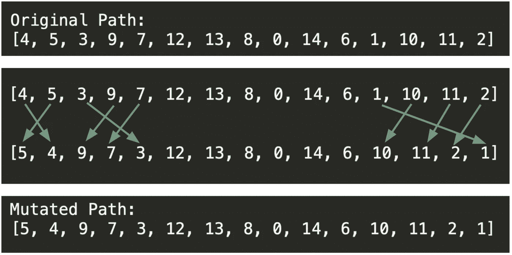

在我创造了突变体之后，我开始杂交。我遍历当前路径和变异路径中的每个索引，并根据交叉率 c:

行程路径中的顺序问题。仅仅在这里结束我的跨界行动是不够的。如上图所示，位置 1 和 12 出现了不止一次。因此，我需要删除重复的。然后，我找到丢失的位置，将它们打乱，并添加到路径中:

一旦我有了最终的后代路径，我就可以评估它与当前路径的适合度。如果它的旅行时间更短，那么它将被选择作为下一代的父路线，取代当前路线。这个过程重复 g 次，其中 g 代表世代数。

# 实验结果

在我对每种优化算法的试运行中，我发现蚁群优化比遗传进化表现得更好。这是意料之中的，因为蚁群优化算法是专门为解决旅行推销员问题而设计的。对于两种算法的每次试验，我都使用了 15 个不同的位置。

## ACO 结果

对于蚁群优化的试验，我使用了以下值: *alpha = 1.0，beta = 10.0，p = 0.5，q = 10.0* ，同时我改变了蚂蚁的数量和世代数 g。

下图是用 10 只蚂蚁和 g = 100 生成的。从每代平均成本图中可以看出，ACO 没有陷入局部最小值。它继续探索其他可能的解决办法。这从平均成本的巨大差异中可以明显看出。

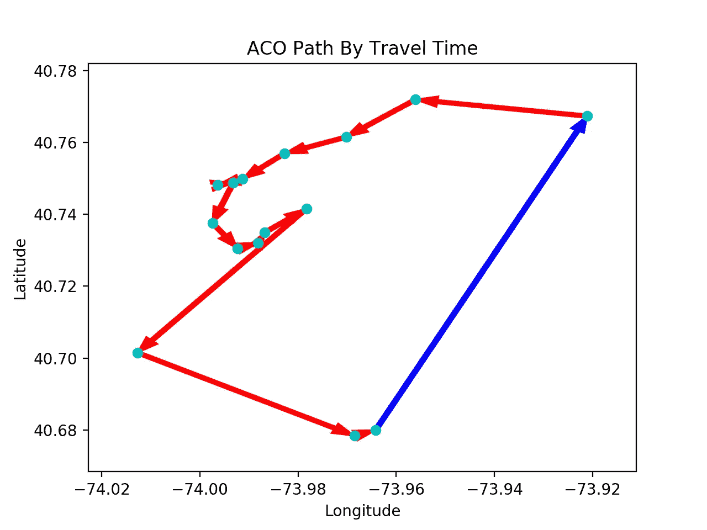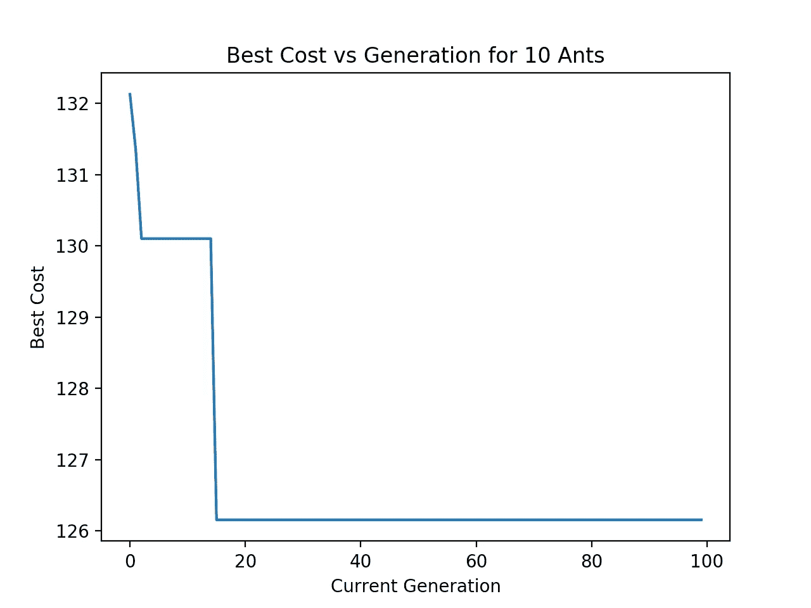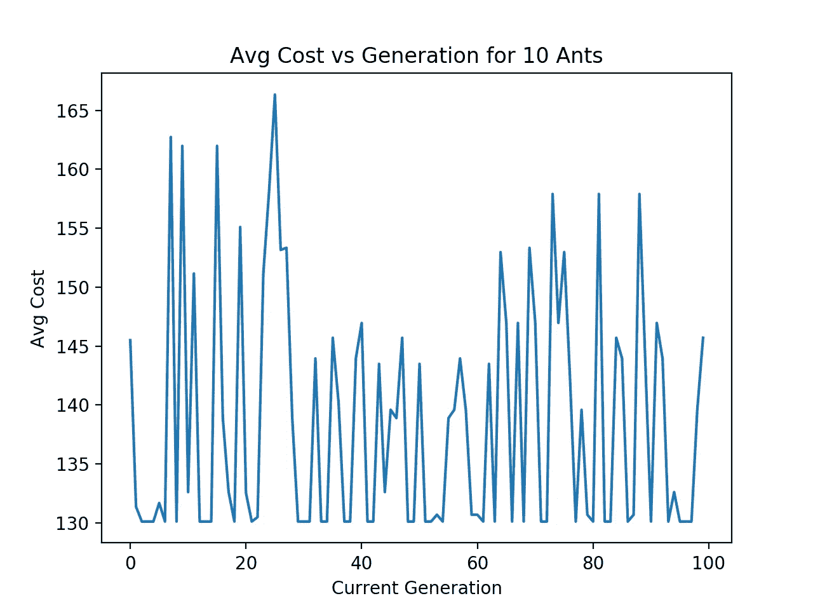

## 通用电气结果

对于遗传进化优化的试验，我使用了以下值:*突变率 m= 0.5，交叉率 c = 0.7* 同时我改变了群体 p 的大小和世代数 g。从结果中，我可以看到世代越多，群体越大，算法找到的解决方案越好。然而，相比蚁群优化，这种解决方案仍然是劣势。

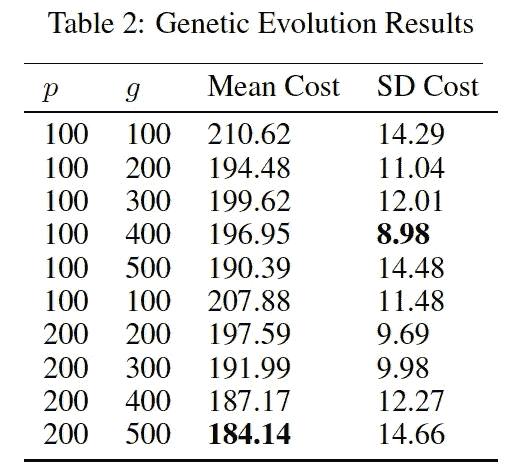

# 讨论

实验结果表明，蚁群算法是优化我们的问题的较好算法，该问题类似于旅行商问题。无论我在我的遗传进化程序中使用哪个参数作为**种群 p** 、**突变率 m** 或**交叉率 s** ，它都无法找到成本像 ACO 一样低的路径。我认为这是由多种因素造成的。

首先，考虑两种算法中的解路径是如何生成的。在蚁群中，旅行时间成本 n_ij 是蚂蚁做出的每个决定的考虑因素。这是因为在概率计算中使用了逆传播时间矩阵来确定蚂蚁接下来应该访问哪个位置。遗传进化仅在应用了它的变异和交叉操作之后评估成本。旅行费用对遗传进化的随机成分没有影响。突变和交叉是随机进行的，尽管受到交叉和突变率的影响，但不考虑这些变化是否会给我们带来更低的值。只有在选择阶段，我才会检查后代是否有更好的价值。

这可以解释为什么蚁群不仅表现得更好，而且表现得如此显著，以至于它的第一代产生的结果比遗传进化快了一百多分钟。另一个要考虑的因素是我如何实现我的变异和交叉操作。可能有更好的方法来实现它们，在选择之前也考虑路径的成本。

看到蚁群每一代的平均成本是很有趣的。它向我展示了算法没有陷入局部最小值。相反，它仍在寻找各种其他途径，没有一条比它找到的更好。由于蚂蚁的决定是基于加权概率，这是有意义的。将此与遗传进化的平均成本图进行比较，可以告诉我们该算法可能如何收敛。我从这条曲线上看到的趋势是一个下降的斜率，看起来很快就会变平。

# 结论

虽然旅行推销员问题本身可能很古老，但它在优步和 Lyft 等现代服务中的应用让我想起了它的相关性和丑陋的阶乘运行时间。随着生物启发优化算法的最新进展，我仍然可以找到可行的解决方案，而不需要多项式时间的解决方案。

在这个问题领域中，遗传进化优化还有进一步的工作要做。挑战在于找到一种更有效的方法，将路径成本纳入变异和交叉操作。但正如这个项目的结果所表明的，我可以肯定地说，蚁群优化确实是为了解决这类问题而产生的。

**注:**你可以从这个 GitHub repo 中查看该项目的完整代码:【https://github.com/khanhnamle1994/trip-optimizer

— —

如果你喜欢这个作品，你可以在 [*GitHub*](https://github.com/khanhnamle1994) *上找到我自己的代码，在*[*https://jameskle.com/*](https://jameskle.com/)*上找到更多我的写作和项目。也可以在* [*推特*](https://twitter.com/@james_aka_yale)*[*上关注我直接发邮件给我*](mailto:khanhle.1013@gmail.com) *或者* [*在 LinkedIn 上找我*](http://www.linkedin.com/in/khanhnamle94) *。**