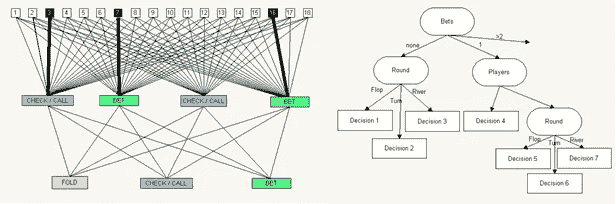
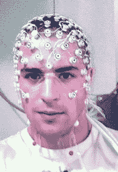

# 使用人工智能方法在扑克中获胜

> 原文：<https://towardsdatascience.com/using-artificial-intelligence-methods-to-win-in-poker-5559cc522f3b?source=collection_archive---------6----------------------->

## 这篇文章最初写于 2015 年，回顾了当时扑克研究的最新水平以及脑机接口技术如何影响它。

Victoria Peak, Hong Kong. Ori Cohen.

在扑克中获胜的概念很简单，理论上，你所要做的就是获得获胜的一手牌；价值最高的五张牌的组合。但由于其多种形式和多种动态，在实际操作中，扑克是一种依赖于偶然性的复杂游戏，需要对策略的深刻理解；有些是数学上的，有些是基于个人经验。

使用人工智能(AI)解决游戏是一种常见的做法。游戏不允许随机性，遵循预定义的规则，并使用一个相对简单的因素来衡量性能和胜算(例如，在国际象棋中，你通过拿下国王来获胜，在跳棋中，你通过锁定对手或抓住他的所有棋子来获胜)，这些游戏是人工智能的经典测试平台。这些游戏可以在计算机上完美地定义[1]，因此完全可以通过使用数学公式、统计方法、机器学习方法(ML)或策略和启发式方法来解决。用今天的 CPU 处理术语来说，它并不昂贵，而且相对容易完成。像国际象棋和跳棋这样的游戏已经被成熟的人工智能软件完全解决了，这些软件能够像人类大师甚至更高的水平进行游戏。通过利用人工智能编程建立一个所有动作的深度树，他们能够以很高的速度遍历树，并选择最佳的动作来获胜。相比之下，像扑克这样的游戏引入了运气的元素，或者换句话说，当你或你的对手从一副牌中抽出一张牌时，这张牌会提高还是阻碍你获胜的机会是未知的。因此，扑克是一种比那些不涉及随机元素的游戏更难解决的游戏，并且不能通过使用适用于非随机游戏的完全相同的技术来解决。

几项有影响力的研究集中在赢得扑克游戏的不同方法上。在这篇综述中，我们将介绍这些方面。通常，在扑克中获胜可以通过模拟对手并利用他们的弱点，通过使用学习专家策略并实时应用它们的算法，或者通过“读取”对手的想法来确定对手是否在虚张声势，所有这些方法都是为了在扑克中获胜而研究的。

扑克是一个不完美信息游戏，有竞争对手，有风险管理，有成功概率，有欺骗。不像在国际象棋中忽略对手建模是无关紧要的，在扑克中承认他们是非常有价值的，因此许多努力被投入到对手建模中[4，5，6，7，8]。有几种方法可以预测敌方可能采取的行动:1。专家系统——为了硬连接我们自己的或固定的策略，这种方法通常作为基线测量是好的。2.试探法——一种解决问题的方法，其结果是决策的近似值，而不是最佳值。3.统计学——根据对手的记录预测对手的行为。但是，这种方法容易受到不断改变下注习惯的对手的影响。4.神经网络(NN)——一种通用系统，能够预测对手的下一步行动，基于 ML 方法，并大致受我们大脑生物学的启发。神经网络相对容易创建，准确，并且明显优于前三种，但我们无法从它们那里获得学习信息(图 1a)。一般来说，NN 接收大量输入(我们下一步行动的可能性)并处理它，直到选择一个输出(下一步行动)。5.决策树(DT)-是经典 ML 中的另一种方法，可以对对手的未来行动进行分类，方法是在每个树节点(图 1b)提出一个问题，然后沿着树向下爬到拥有最终决策的末端叶子。DT 不像 NN 那样健壮，但是是人类可读的，并且获得相似的结果。

Figure 1: a (left) A Neural Network predicting an opponent future action. b (right) A subset of a decision tree model. **[4]**

Loki [4]和 Poki [5]是两个扑克程序，旨在观察对手，模拟他们的行为，并动态适应他们的游戏，以利用他们薄弱的游戏模式。这种“技能”在现实世界中提供了巨大的好处，因为它可以增强玩家发现虚张声势或从游戏中理解对手意图的自然能力。对手建模程序旨在检测经常弃牌和不经常弃牌的玩家，他们的游戏有多被动或激进，他们根据手中的牌下注或加注的行为，以及他们对动态策略的适应程度。洛基和波基在击败强大的扑克玩家方面无疑是一个进步，但它们肯定有其局限性，因为人类玩家也擅长对手建模，并可以实时改变他们的策略。然而，艾伯塔小组一直在研究扑克，最近宣布，他们首次创建了一个名为 Cepheus [9，10]的计算机程序，解决了“单挑限制德州扑克”(HULHE)。这个高度复杂的游戏有超过 10 个⁴决策点，挑战人工智能研究超过十年。实现仙王座需要 68 天，使用 4800 个 CPU 的高性能计算机集群，加上数据压缩和最先进的计算算法。呼和是一个需要人类玩家使用欺骗和虚张声势的游戏，显然不是机器式的特点；仙王座能够在不欺骗人类玩家的情况下和他们进行比赛，并且不让他们知道他们是在和一台机器比赛。

另一种使用人工智能在扑克中获胜的方法是通过脑电图(EEG)检测虚张声势。脑电图是一种从大脑读取电信号的方法，通常使用一个基于电极的帽子，戴在一个人的头上，如图 2 所示。测量隐蔽的人类状态[11]，可以用 EEG 来执行，EEG 提供被注册为生理特征的健壮信号，并且可以通过 ML 方法来分类。虚张声势是一种故意误导游戏中其他对手的行为，是一项复杂的任务，需要有预谋的风险评估、虚假意图的行为和持续的跟进，尤其是在保持镇静方面。人工智能方法被用来分类玩家是否在虚张声势，这种方法可以帮助玩家通过了解对手的心理状态并抵消其隐藏的意图来赢得扑克比赛。经验结果表明，平均有 81.4%的概率可以检测到虚张声势。换句话说，在 200 毫秒的时间框架内，10 个人中有 8 个人可以持续检测到虚张声势。时间足够短，以赢得大多数使用诈唬或其他隐蔽状态作为策略工具的游戏。脑电图也可以记录额外的改善，如果眼球运动或肌肉紧张将被考虑在内，这两者都可以用脑电图记录。

Figure 2: an electrode array used to read electric signals from a person’s brain [[from wikipedia](https://en.wikipedia.org/wiki/Electroencephalography#/media/File:EEG_cap.jpg)]

已经有[的消费者解决方案](https://emotiv.com/)用于读取 EEG 大脑信号。虽然脑电图已经使用了 20 多年，但消费产品仍处于起步阶段。我假设脑电图设备将会进一步小型化，让非技术人员也能使用，并进行微调，以高精度读取房间内特定的大脑模式。自动诈唬分析方法也将得到改进，从而可以在锦标赛和私人高赌注游戏中秘密使用这种技术。然而，即使有这些进步，总有办法检测或阻止新技术无线工作，并防止扑克玩家拥有不公平的优势。虽然扑克在许多方面仍然是一种具有挑战性的游戏，但过去的经验告诉我们，随着研究和硬件的进步，人工智能的未来可以在我们的有生之年解决其他扑克变种。

参考资料:

[1] S .罗素和 p .诺维格。人工智能:现代方法。普伦蒂斯霍尔，1995 年。

[2] M .坎贝尔、A. J .霍恩和 F . h .徐。深蓝色。人工智能，134(1–2):57 { 83，2002}。

[3] J. Schaeffer、J. Culberson、N . Treloar、B. Knight、P. Lu 和 D. Szafron。世界锦标赛口径跳棋计划。人工智能，53(2–3):273 { 290，1992}。

[4] [戴维森。扑克中的对手建模:在敌对和不确定的环境中学习和行动(2002)](http://citeseerx.ist.psu.edu/viewdoc/download?doi=10.1.1.2.7433&rep=rep1&type=pdf)

[5] [D .比林斯，A .戴维森，j .谢弗，d .萨弗朗。扑克的挑战。人工智能，2002 年第 134 期，201–240 页。](http://www.sciencedirect.com/science/article/pii/S0004370201001308)

[6] A .戴维森、d .比林斯、j .谢弗和 d .萨夫龙。改进了扑克中的对手建模。国际人工智能会议(ICAI，2000 年)，第 1467 页{1473，2000}。

【7】[比林斯、达瑟等，《对手建模在](http://www.aaai.org/Papers/AAAI/1998/AAAI98-070.pdf) [扑克](http://www.google.com/url?q=http%3A%2F%2Fwww.aaai.org%2FPapers%2FAAAI%2F1998%2FAAAI98-070.pdf&sa=D&sntz=1&usg=AFQjCNEm9Lb2q4xblBISM_EKY8YEuKv99Q) [》AAAI/IAAI。1998.](http://www.aaai.org/Papers/AAAI/1998/AAAI98-070.pdf)

[8]f . sou they，m . p . Bowling，b . Larson，c . Piccione，n . Burch，Billings d .，& Rayner，C. (2012 年)。贝叶斯的虚张声势:扑克中的对手建模。 *arXiv 预印本 arXiv:1207.1411* 。

[9] [Tammelin，Oskari 等人，“解决德州扑克的单挑限制。”](http://webdocs.cs.ualberta.ca/~johanson/publications/poker/2015-ijcai-cfrplus/2015-ijcai-cfrplus.pdf)

迈克尔·鲍林、尼尔·伯奇、迈克尔·约翰逊和奥斯卡里·塔梅林。单挑限注德州扑克 [扑克](https://www.google.com/url?q=https%3A%2F%2Fnoppa.aalto.fi%2Fnoppa%2Fkurssi%2Fics-e4000%2Fmateriaali%2FICS-E4000_heads-up_limit_holdem_poker_is_solved_2.pdf&sa=D&sntz=1&usg=AFQjCNE9TNdveeRQHesD8l1DshsbNdC4vg) [解决了。科学，347(6218):145–149，2015。](https://noppa.aalto.fi/noppa/kurssi/ics-e4000/materiaali/ICS-E4000_heads-up_limit_holdem_poker_is_solved_2.pdf)

[11]Jessika Reiss land、Christian Kothe、Sabine Jatzev、Matti Gä rtner、Sebastian Welke 和 Thorsten O. Zander。BCI 检测故意隐藏的用户状态——或者:我们能检测出游戏中的虚张声势吗？

Ori Cohen 博士拥有计算机科学博士学位，专注于机器学习和脑机接口(BCI)。他领导着 Zencity.io 的研究团队，试图积极影响市民的生活。