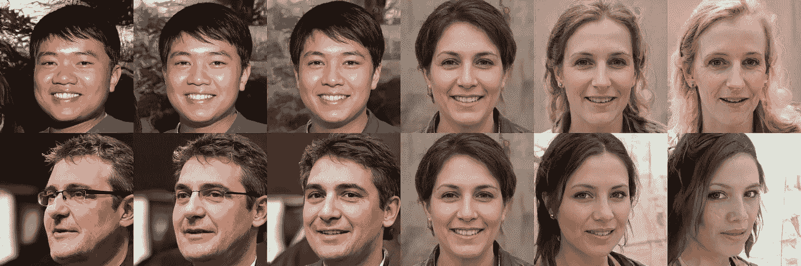
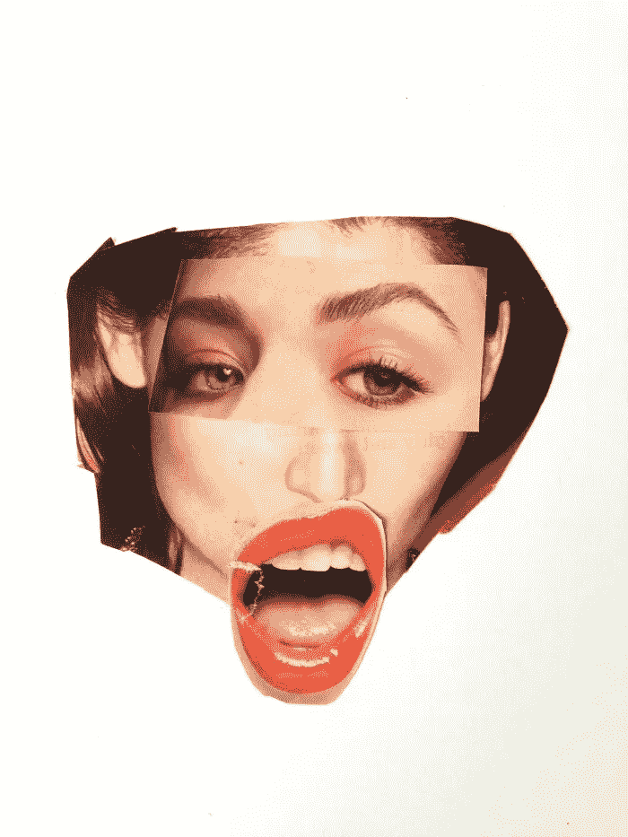
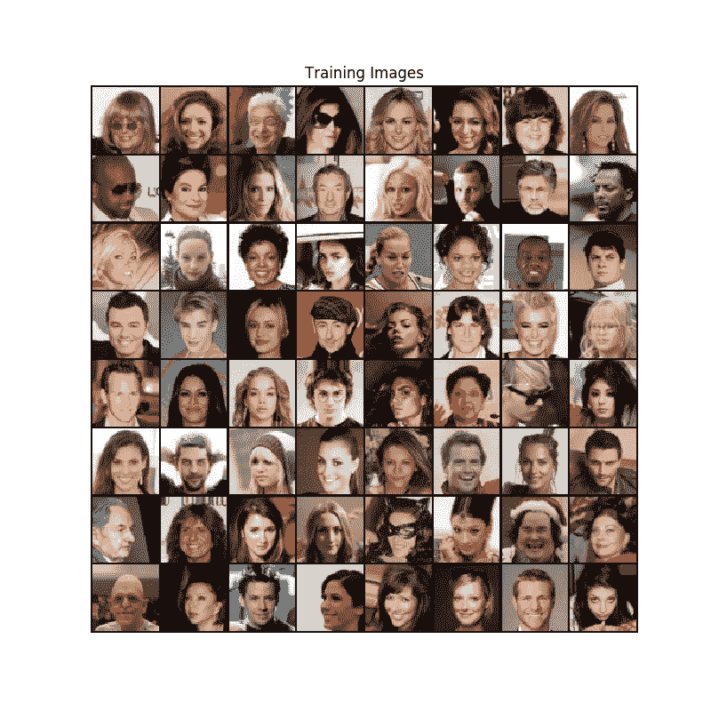
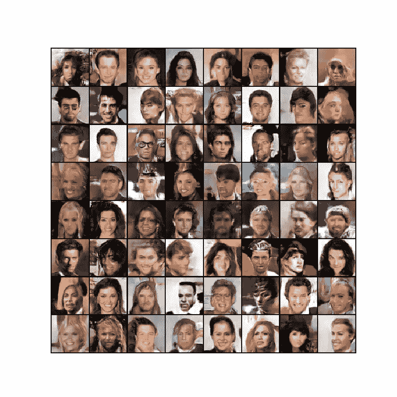
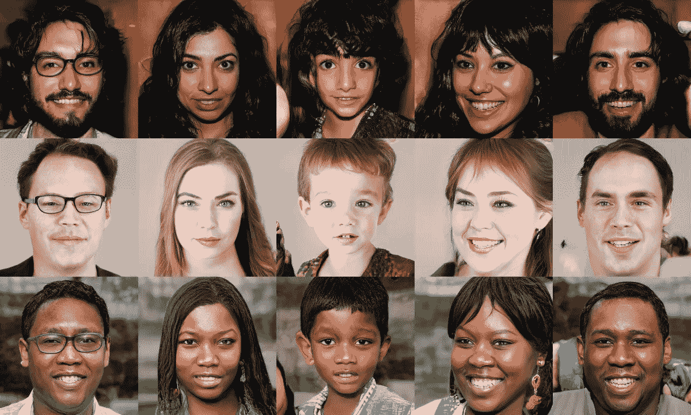
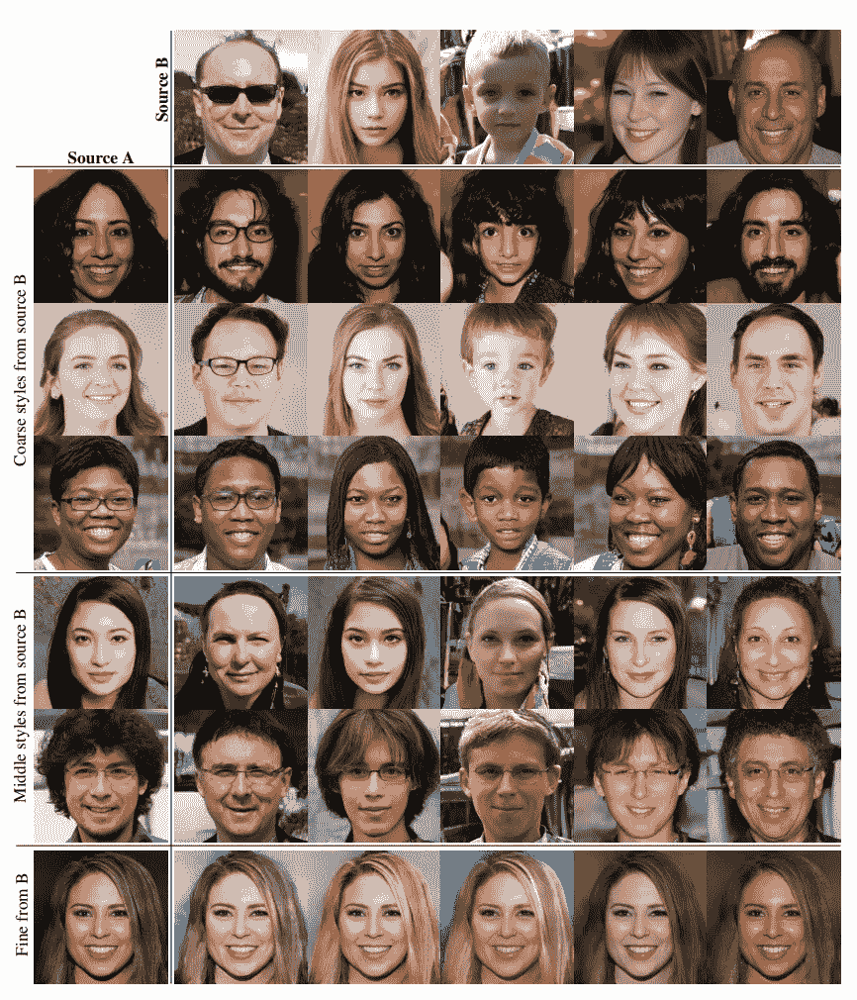
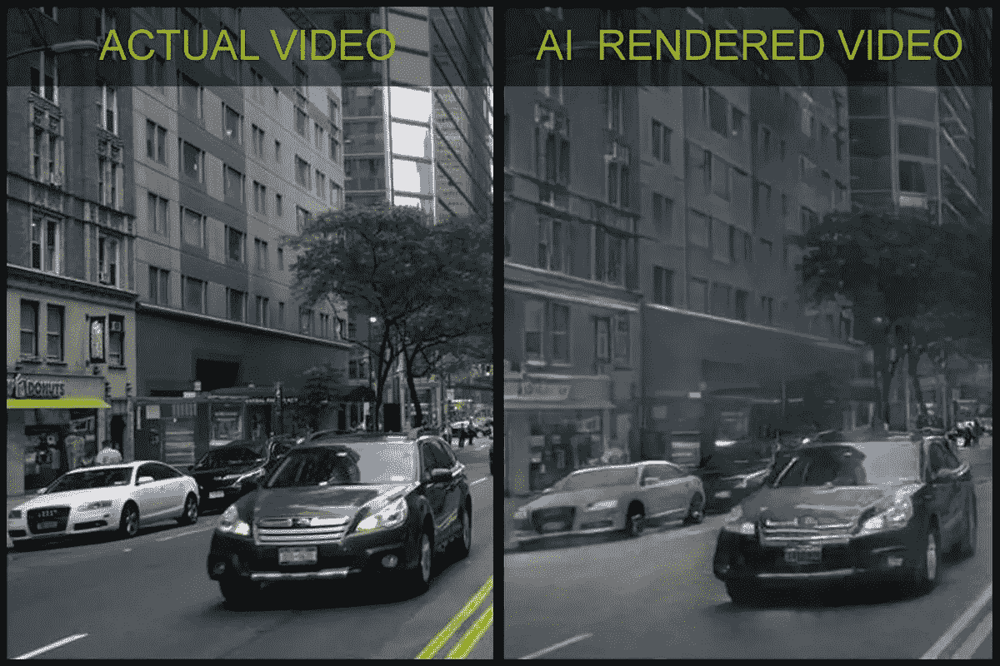
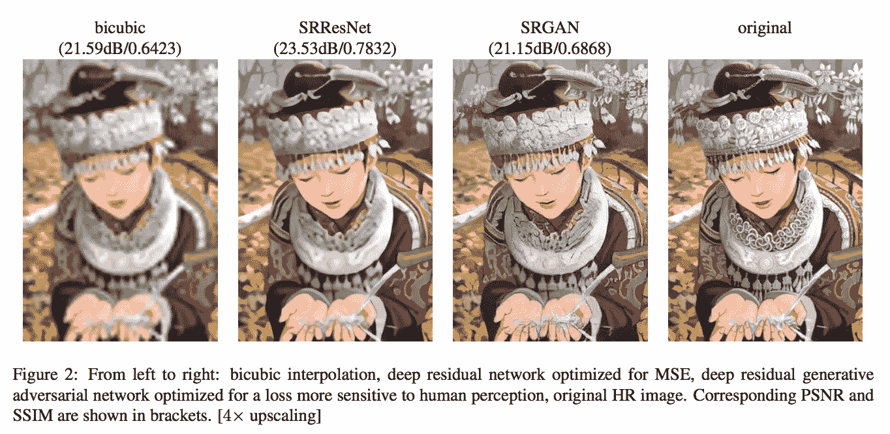
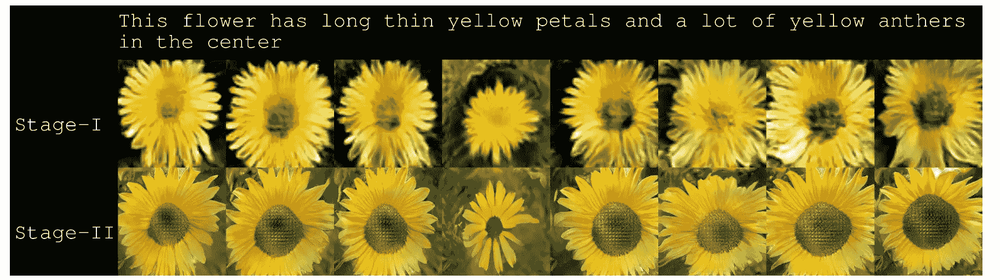

# 利用人工智能创造人、车和猫

> 原文：<https://towardsdatascience.com/using-artificial-intelligence-to-create-people-cars-and-cats-5117189d0625?source=collection_archive---------12----------------------->

## 我们如何利用生成性对抗网络制作超现实的图像



None of the people in these images are real, they’ve just been generated by a neural network! [Source.](https://github.com/NVlabs/stylegan)

想想你平常的一天是什么样的。除非你整天锁在房间里看《网飞》或者睡觉，否则当你去你想去的地方时，你很可能会经过很多人。有些人长头发，有些人短头发，有些人大鼻子，有些人小眼睛。

关键是，我们多久会停下来思考一下我们每天所看到的不同特征。你有没有想过，“是什么让一张脸变成了一张脸？”它是有两只眼睛、一个鼻子、一张嘴和一些头发的东西吗？如果是这样，难道我们不能编写一个超级简单的计算机程序，通过组合这些特征来生成新的面孔吗？

不完全是，我们遗漏了很多细节。比如皱纹、阴影和微笑。当我们被要求描述一张脸的特征时，我们可能通常不会想到的东西，但为了让它看起来真实，这些东西必须存在。



Something is off but I can’t put my finger on it… [Source.](https://craftwhack.com/hilarious-magazine-face-collages/)

那么，如果它不只是告诉神经网络将两只眼睛、一个鼻子、一张嘴和一些头发放在一个大肉球上，并希望它看起来合理，那么我们如何才能真正生成人脸呢？

# 猫捉老鼠的游戏

首先，让我们花一点时间来了解生成性敌对网络(GANs)是如何工作的。

GAN 实际上由两个神经网络组成，一个生成器和一个鉴别器。生成器的工作是根据它所知道的生成新数据，鉴别器的工作是查看生成的数据是否合法。因此，在我们的例子中，生成器会尝试创建新的人脸图像，鉴别器会尽最大努力确定人脸的真假。

假设我们在和一家美术馆打交道。制造者是试图创作假艺术品并出售的人，鉴别者是试图鉴别艺术品真假的馆长。一开始，他们都不擅长自己的工作，但他们都从经验中学习。随着时间的推移，伪造者慢慢变得更擅长根据接受与否伪造艺术品，策展人也变得更擅长辨别真伪。


这基本上是一个生成性对抗网络如何训练的，生成器接受一个随机数，并根据输入吐出一个图像。鉴别器评估发生器的输出，并试图预测图像是否真实。如果猜测正确，网络会将其考虑在内，并更新它们的权重。如果它猜错了，也会发生同样的事情。

最终，目标是让这两个网络达到这样一个点，即生成器非常擅长生成假货，以至于鉴别器将始终徘徊在 50%左右的置信度。

然而，在训练 GAN 时需要注意的一点是，当一方过于擅长自己的工作时，可能会出现问题，因为另一方将无法学到任何东西。如果馆长能够正确地猜测每一件艺术品，伪造者将无法知道它做错了什么。如果伪造者做得太好，策展人总是会被骗，也不会学到东西。

# 绘制概率分布图

好吧，这很酷，对吧？你可以训练两个相互竞争的神经网络，让它们相互竞争，最终你会得到一个生成模型，它在创建可信的图像方面做得非常棒。但是让我们更深入地了解一下这实际上是如何工作的。

*生成式对抗网络实际上做的是映射数据的概率分布。*

这到底是什么意思？

我们可以把图片想象成一个高维概率分布的样本。每当你拍照时，你都是在从像素的概率分布中取样。基本上存在产生一些像素排列的概率或可能性，GAN 基于数据绘制概率分布。

对于我们的例子，基本上是学习什么使一张脸成为一张脸。眼睛、鼻子和嘴巴等不同的特征在这个概率分布中有一个表示。因此，改变输入到模型中的噪声将改变对应于这些数字的图像的一些质量。通过从这个分布中采样，我们可以得到一个模型，根据它所知道的图像某一部分中像素的概率来生成全新的图像。

# 使用 DCGAN 生成新的人脸


An image from the DCGAN paper. [Source.](https://arxiv.org/abs/1511.06434)

DCGAN 基本上是常规 GAN 的改进版本，但有一些重要的变化:

*   最大池函数被步长卷积取代，让网络学习自己的空间下采样和上采样。
*   去除卷积特征之上的全连接层。一个例子是全局平均池，它经常增加模型的稳定性，但损害收敛速度。最佳解决方案是将最高卷积特征直接连接到发生器和鉴别器的输入和输出。
*   通过将输入标准化为零均值和单位方差，使用批量标准化来稳定学习。这有助于渐变在更深的模型中流动，但不应该应用于所有层。当 batchnorm 不应用于生成器输出层和鉴别器输入层时，可以避免模型不稳定。
*   ReLU 激活在发生器中用于所有层，除了使用 Tanh 的输出。据观察，这有助于模型更快地学习并覆盖训练分布的颜色空间。
*   LeakyReLU 激活用于所有层的鉴别器中。

如果您对实现 DCGAN 感兴趣，有一个很棒的 PyTorch 教程，它使用了 CelebFaces 属性数据集(CelebA)，这是一个包含超过 200，000 张名人脸部照片的数据集。

以下是数据集中的一些图像示例，这些图像被调整为 64x64，以便于训练:



这两个模型的结构如下:

```
Generator(
  (main): Sequential(
    (0): ConvTranspose2d(100, 512, kernel_size=(4, 4), stride=(1, 1), bias=False)
    (1): BatchNorm2d(512, eps=1e-05, momentum=0.1, affine=True, track_running_stats=True)
    (2): ReLU(inplace)
    (3): ConvTranspose2d(512, 256, kernel_size=(4, 4), stride=(2, 2), padding=(1, 1), bias=False)
    (4): BatchNorm2d(256, eps=1e-05, momentum=0.1, affine=True, track_running_stats=True)
    (5): ReLU(inplace)
    (6): ConvTranspose2d(256, 128, kernel_size=(4, 4), stride=(2, 2), padding=(1, 1), bias=False)
    (7): BatchNorm2d(128, eps=1e-05, momentum=0.1, affine=True, track_running_stats=True)
    (8): ReLU(inplace)
    (9): ConvTranspose2d(128, 64, kernel_size=(4, 4), stride=(2, 2), padding=(1, 1), bias=False)
    (10): BatchNorm2d(64, eps=1e-05, momentum=0.1, affine=True, track_running_stats=True)
    (11): ReLU(inplace)
    (12): ConvTranspose2d(64, 3, kernel_size=(4, 4), stride=(2, 2), padding=(1, 1), bias=False)
    (13): Tanh()
  )
)Discriminator(
  (main): Sequential(
    (0): Conv2d(3, 64, kernel_size=(4, 4), stride=(2, 2), padding=(1, 1), bias=False)
    (1): LeakyReLU(negative_slope=0.2, inplace)
    (2): Conv2d(64, 128, kernel_size=(4, 4), stride=(2, 2), padding=(1, 1), bias=False)
    (3): BatchNorm2d(128, eps=1e-05, momentum=0.1, affine=True, track_running_stats=True)
    (4): LeakyReLU(negative_slope=0.2, inplace)
    (5): Conv2d(128, 256, kernel_size=(4, 4), stride=(2, 2), padding=(1, 1), bias=False)
    (6): BatchNorm2d(256, eps=1e-05, momentum=0.1, affine=True, track_running_stats=True)
    (7): LeakyReLU(negative_slope=0.2, inplace)
    (8): Conv2d(256, 512, kernel_size=(4, 4), stride=(2, 2), padding=(1, 1), bias=False)
    (9): BatchNorm2d(512, eps=1e-05, momentum=0.1, affine=True, track_running_stats=True)
    (10): LeakyReLU(negative_slope=0.2, inplace)
    (11): Conv2d(512, 1, kernel_size=(4, 4), stride=(1, 1), bias=False)
    (12): Sigmoid()
  )
)
```

那么现在发生了什么，我们已经在一堆人脸上训练了一个神经网络，结果一定很好，对吗？这取决于你对好的定义。



老实说，如果你不仔细看，有些看起来可能是真的脸。不过，其他人看起来像是直接从噩梦中走出来的。

不会是这个吧？一定有更好的方法让假人看起来像真的。英伟达的一些研究人员可能已经找到了秘方。

# Nvidia 的 StyleGAN

结果公布后，英伟达用于生成新图像的生成对抗模型在新闻中得到了大量炒作和报道，这是有充分理由的。大多数照片都非常逼真，几乎无法与真实照片区分开来。



“These people are not real — they were produced by our generator that allows control over different aspects of the image.” [Source.](https://github.com/NVlabs/stylegan)

老实说，这个模型得出的结果相当疯狂。如果我不是一名高中生，我肯定会尝试自己训练这个模型，但在它真正开始产生可识别的图片之前，我可能已经 40 岁了。他们毫不夸张地推荐一款配有 8 个特斯拉 V100 GPUs 的 NVIDIA DGX-1。因此，除非你手头有 15 万美元的闲钱，或者有一个企业级深度学习系统，否则你可能也不走运。

## 但是它实际上是如何工作的呢？

关于 StyleGAN 的[论文](https://arxiv.org/abs/1812.04948)提出了一个重要的问题。即使 GAN 产生的图像的分辨率和质量越来越好，我们仍然很难解释这些机器到底在做什么。它仍然像一个黑匣子。我们也不理解潜在空间，特征到变量的映射，没有定量的方法来比较生成器。

通过从经典的[风格转移](https://medium.com/@alexjy/using-neural-networks-to-create-paintings-ee76ddb3fff6)中获取灵感，我们的目标是以一种允许我们看到图像合成过程的方式重新创建生成器，并让我们调整每层图像的风格以操纵不同的功能。

在高层次上，Nvidia 的 StyleGAN 做了一些类似的事情，它在没有任何人类帮助的情况下学习图像的不同方面，在训练模型后，可以在不同层次上组合这些风格，以获得具有粗糙、中等和精细风格的最终图像。

看看这个恶心的造型吧！

这张图片展示了一些混合的风格:



# 生成模型的未来

Nvidia 的 StyleGAN 是生成式对抗网络的一个重大突破。网络生成的一些图像与实际照片几乎无法区分。但是 GANs 有哪些实际应用呢？

*   **AI 为视频生成图形**



*   **甘斯超分辨率**



*   **用于文本到图像生成的 GANs】**



mediu

感谢阅读！如果您喜欢，请:

*   在 LinkedIn 上添加我，关注我的媒体，了解我的旅程
*   在我的[个人网站](https://alexyu.ca)查看我的一些其他项目
*   留下一些反馈或者给我发邮件(alex@alexyu.ca)
*   与你的网络分享这篇文章