# 利用人工神经网络分析总统演讲

> 原文：<https://towardsdatascience.com/using-artificial-neural-networks-to-analyze-presidential-speeches-6fbd446c5bad?source=collection_archive---------18----------------------->

## [深入分析](https://towardsdatascience.com/in-depth-analysis/home)

## 大多数分类任务都是为了区分不同层次的独特性而设计的，但是如果我们已经知道了不同之处，还想寻找相似之处呢？


在大多数分类任务中，总的目标是简单地最大化一些准确度的度量，无论是 F1 分数、平衡准确度等。在这些情况下，我们寻求理解错误的唯一目的是为了在将来最小化它们的频率。总的来说，我们希望将数据集分成尽可能清晰和不同的组。但是如果我们想反其道而行之呢？如果我们已经有了非常清晰的数据，但我们想了解它们是如何组合在一起的，该怎么办？在这种情况下，我们从误差中获得的信息可能比从预测的准确度中获得的信息更多。

考虑两个著名的，但非常独特的电影制作人:昆汀·塔伦蒂诺和韦斯·安德森。为了简单起见，让我们说前者的电影可能被描述为*暴力，*，而后者将被描述为*古怪。*有了这些知识，看看你是否能正确识别这些电影对白的作者:


*   如果你在梦里开枪打我，你最好醒来道歉
*   “我爱你，但你不知道你在说什么。”
*   *“在我们像一群疯子一样互相攻击，把自己撕成碎片之前，让我们先打开麻袋，看看里面究竟是什么。这甚至可能不值得麻烦。”*

在这里，我们看到前两个引号非常容易识别。第一个来自塔伦蒂诺经典*落水狗*，第二个来自安德森的*月出王国。然而，第三部更具挑战性，因为它既有点暴力又有点古怪。我的妻子是这两个编剧兼导演的超级粉丝，她还没有看过这部电影，猜测它来自塔伦蒂诺。事实上，它来自安德森的最新电影《狗之岛》。有趣的是，虽然前两个引语很容易看出它们之间的区别，但第三个引语突出了它们的一些相似之处。*

给出一系列这样的引用，你很可能会犯更多的错误。但这些错误实际上可以帮助我们更好地理解两个截然不同的人有什么共同点，尽管乍一看可能并不明显。

在今天的政治气候中，分歧的领域是明显的，我们都可以非常清楚地确定争论的焦点。真正的挑战在于找到共同点，并找到合作的机会。这是深度学习算法可以帮助我们完成的任务吗？这就是我们要努力解决的问题。

我们将采用与任何其他文本分类任务基本相同的方式来完成这项任务，真正的区别在于我们稍后如何解释结果。[语法实验室](http://www.thegrammarlab.com/?nor-portfolio=corpus-of-presidential-speeches-cops-and-a-clintontrump-corpus)储存了从华盛顿到奥巴马的总统演讲语料库，以及唐纳德·特朗普和希拉里·克林顿在 2016 年总统竞选期间的辩论和演讲的文字记录。所有工作都是使用 Jupyter 实验室和相关库在 Python 中完成的。

首先，我们将利用 2016 年的竞选数据建立和训练一个网络，然后看看这种方法在其他总统比较中的适用程度。由于大多数演讲将涵盖广泛的主题，我们希望能够在我们的预测误差中识别出明确的主题，因此每篇演讲被分成 50-100 个单词的部分，并保存到带有适当标签的数据帧中。

## 预处理

由于这不是本次分析的主要重点，我将快速强调一些关键步骤。如果你想更深入地了解这个话题，我鼓励你看看这篇[的博文](/a-practitioners-guide-to-natural-language-processing-part-i-processing-understanding-text-9f4abfd13e72)，它对我帮助很大。简而言之，大多数预处理包括以下步骤:

1.  **去除标签**:所有的演讲都以一致的方式格式化，日期、标题、以及除了预定演讲者之外的其他人所说的话的标签都被包含在 *< >中。*在保存到数据帧之前，所有这些文本都从样本中移除，并且不包括在每个样本的字数中。
2.  **扩展缩略:**像“不会”和“应该”这样的词被识别出来，并用完整的词“不会”和“应该”代替一个标准的收缩列表和它们的对应物被用来完成这项任务。
3.  **删除特殊字符:**撇号、连字符等。
4.  **文本词汇化:**获取单词变体的基本形式(即 running = > run，cats = > cat，等等)。).
5.  **删除停用词:**使用了自然语言工具包(nltk)中的标准英语停用词列表，删除了单词 *no* 和 *not* ，因为它们会改变周围单词的解释。
6.  **标记化:**将字符串转换为单个单词的列表。
7.  创造二元模型:许多单词作为短语的一部分比它们本身有更多的含义。对于专有名词来说尤其如此，比如*美国，乔治·华盛顿，*等。但是它对像*核武器这样的术语同样重要。*我们不是将所有的单词转换成二元模型，而是只希望转换那些有一定规律性的短语。幸运的是，Gensim 库有一个工具可以让这变得非常简单，这个工具叫做短语。请参见下面的代码来查看实现。

```
*Output:
Maximum Sample Word Count: 88

Sample:
maggie elizabeth walk stage lot folk hang window glad get good view also exciting* ***two_week*** *leave* ***consequential_election*** *lifetime*
```

## 数据不平衡

事实证明，特朗普花在竞选演讲上的时间比克林顿多得多，导致数据严重失衡。如下图所示，特朗普语料库的样本量是克林顿的近 4 倍。

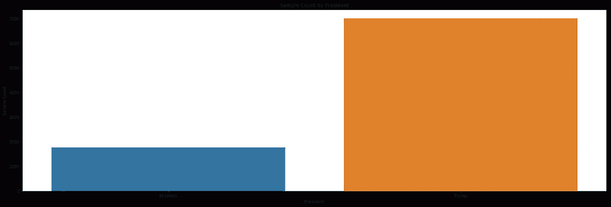

如果用这种状态下的数据训练一个模型，它可以学会 100%的时间简单猜测特朗普，并达到 80%的准确率，这将是相当误导的。为了解释这一点，必须从特朗普的语料库中抽取一部分样本，其规模相当于克林顿的语料库。

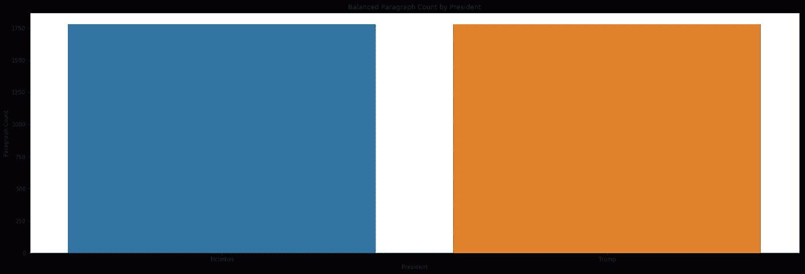

## **使用手套矢量化**

从这里开始，我们可以使用斯坦福大学的单词表示全局向量来将单词转换成向量。使用 100 维的向量来表示语料库中的每个单词，然后链接到每个样本中的每个单词。这可以通过下面的代码块来完成。

W2vVectorizer 类将在以后为基准目的训练模型时调用。

## **标杆管理**

为了有一个有效的方法来衡量神经网络的性能，必须建立一个使用传统机器学习方法的基准。在这个项目中，使用了支持向量机、对数回归和随机森林。

```
Output:*[('Random Forest', 0.7851123595505618),  
('Support Vector Machine', 0.7202247191011235),  
('Logistic Regression', 0.7789325842696628)]*
```

从这里，我们可以看到一个随机森林模型获得了 78.5%的最高准确率。出于这个项目的目的，我们并不真正关心错误偏向哪个方向，因为数据集已经平衡，所以没有理由担心模型被不适当地偏向以获得异常高的准确性分数。

## **网络建设**

因此，我们对数据进行了预处理、清理、平衡和标记，我们有了一个基准。现在是时候卷起袖子准备好玩的东西了！为了分析这些数据，我们将尝试递归和卷积神经网络(RNN 和 CNN 的),每种网络都首先需要创建一个嵌入层，它可以有效地将我们的样本转换为向量序列集。

现在，与其简单地创建一个 RNN 和 CNN 来进行分析，不如我们可以实现网格搜索来找到性能最佳的模型，这不是很好吗？不幸的是，没有理想的方法来实现一个 SKLearn 管道而不丢失以后可能是无价的信息，所以我们将从头开始创建这个网格搜索。我们首先从卷积网络开始。

## **构建卷积神经网络**

首先:CNN 通常用于图像处理任务，所以你可能想知道为什么我们在这里应用它。据报道，CNN 实际上也很擅长 NLP 任务。我们将简单地使用一维层作为解释序列的方式，而不是使用三维层。当词库作为向量被收集时，网络可以识别紧密相连的词之间的共性。理论上，这应该允许我们的网络有效地识别语音模式。稍后将详细介绍。

目前，我们需要一个可以构建、训练和评分一个 CNN 的函数。它将使用默认参数和固定架构进行设置，该架构已被多个来源确定为 NLP 任务的有效起始架构。总共有 10 层，包括嵌入层。

需要注意的一点是，默认设置是经历 100 个时期。考虑到我们正计划实现网格搜索，这似乎有点极端。然而，提前停止已经在耐心水平为 5 的情况下实现。换句话说，如果损失函数在连续 5 个时期后没有产生改进的结果，训练将停止，并且记录结果。

除了模型、历史和结果，还将提供处理时间，以便我们可以跟踪完成每一步的时间。

## **CNN 网格搜索**

从这里开始，只需要为我们的超参数定义网格并记录结果。

你可能想知道为什么**要尝试；除了**语法在这里。嗯，整个笔记本允许选择任何字长的样本序列。考虑到这一点，举例来说，试图从 20 个单词中汇集 35 个单词将会导致错误。因此，考虑到给定源数据，某些超参数集可能是无效的。

另一项值得注意的是，我们的模型被保存，并在网格搜索的每次迭代中被覆盖。这样做的原因是有 72 个网格要搜索，我们不想浪费内存保存每一个。取而代之的是，结果被存储，并且模型将使用最高性能的参数被再次创建。这将使我们能够更好地了解最佳表现模型的培训进度和历史，并使我们能够更有效地将结果与 RNN 进行比较。

## **构建递归神经网络**

从这里开始，我们将使用与上面相同的方法构建一个带有网格搜索的递归神经网络。一个关键的区别是，RNN 氏症可以使用两种不同类型的神经元:长短期记忆(LSTM)或门控循环单位(GRU)。这些选项会影响网络本身的架构，但这可以通过一个简单的条件语句来说明。

从这里开始，RNN 和 CNN 网络之间唯一真正的区别是网格本身。

## **可视化结果**

一旦我们的 RNN 和 CNN 网络经过训练和测试，我们就可以开始看结果了。具体来说，我们希望比较基准测试、表现最佳的 RNN 和表现最佳的 CNN 之间的准确度分数。

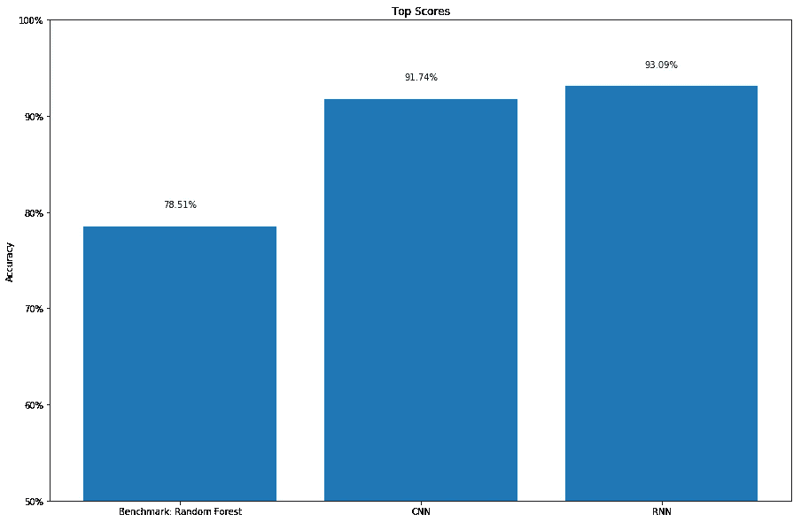

从这里，我们可以看到我们的递归神经网络优于卷积神经网络，并且大大优于基准。通过将模型保存到一个名为 *best_model，*的变量中，并对其调用 predict 方法，我们可以开始更详细地研究结果，从创建混淆矩阵开始。这里需要做的就是调用顶层模型的 predict 方法，并将其传递给一个函数，该函数将为我们创建可视化效果。

```
Output:
Confusion matrix, without normalization
F1 Score: 93.08%
```

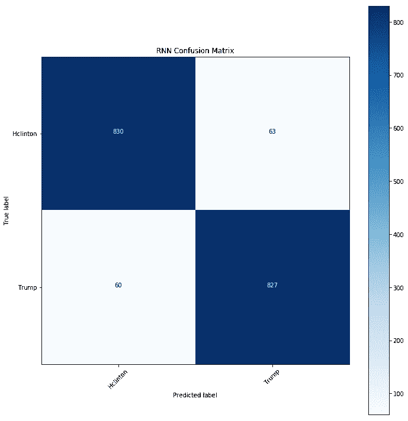

在网络做出的 1，780 个预测中，有 123 个是不准确的，第一类和第二类误差相当均衡。由于我们并不真正关心错误类型的平衡，F1 分数被用作衡量性能的主要指标。从这里，我们可以从结果中创建一些单词云，以了解我们的网络在哪里、为什么以及如何出错，希望它能揭示我们两位候选人的共同点。

## **字云可视化**

从这些结果中创建词云的关键是确保我们的原始样本与每一步的转换保持紧密结合。例如，参见下面的代码，它说明了原始文本样本是如何通过排序和训练/测试分割保持完整的:

这里的关键是文本样本和 bigram 数据被添加到 dataframe 的最后两列，即第 21 行和第 22 行。然而，只有向量被传递到嵌入中，如第 34 行所示。因此，我们可以稍后从测试集的模型中调用 predict 方法，我们的原始文本数据将被绑定到同一个索引。

此时，只需将字符串列表转换成由逗号分隔的单个单词字符串。在这个实例中，我们有三个不同的字符串:一个用于每个候选项(p1_cloud & p2_cloud)，一个用于错误数据(error_cloud)。从这里开始，你所要做的就是找到并下载你想要的矢量图像，然后使用下面的代码创建你想要的形状的单词云:

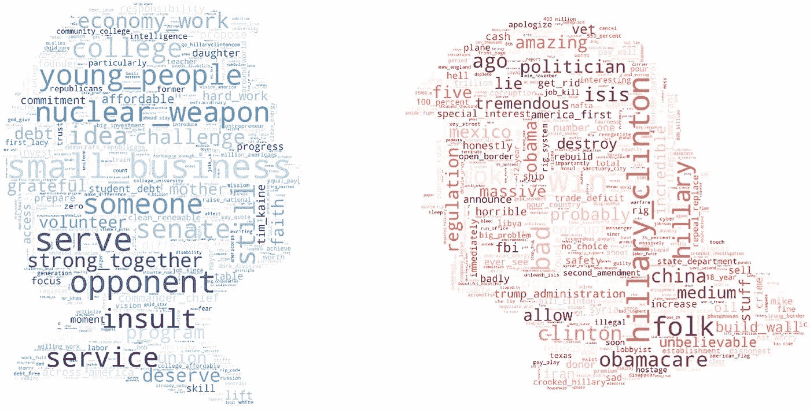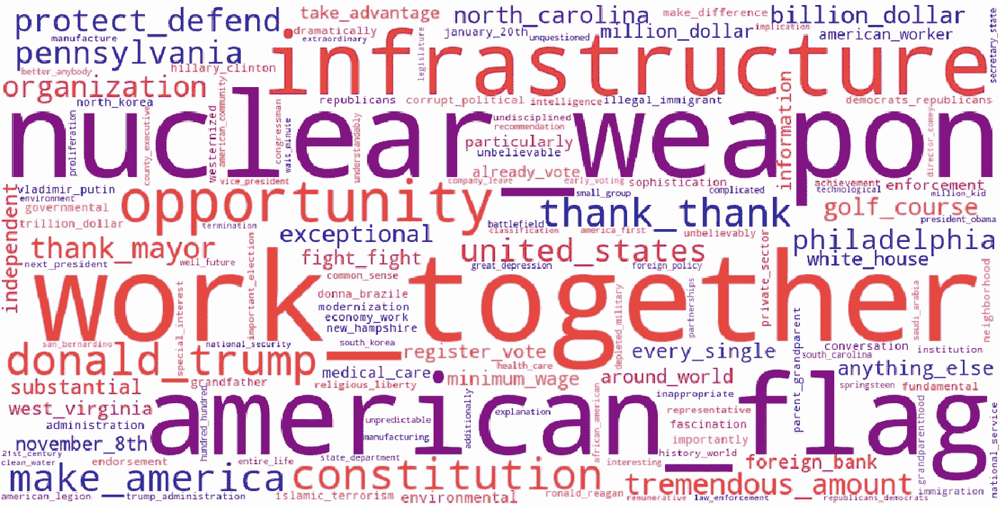

关于为每个候选人的词云选择词，我选择关注它们之间使用频率差异最大的词。换句话说，像*美国*这样的短语对任何总统候选人来说都会被频繁使用，而且不会突出任何独特性。候选词之间使用差异最大的词被使用。

对于错误，由于目标正好相反(突出相似之处)，使用了简单的频率计数，因为说话者的身份不太重要。

以下几对总统也完成了上述所有步骤，准确性和词云结果如下:

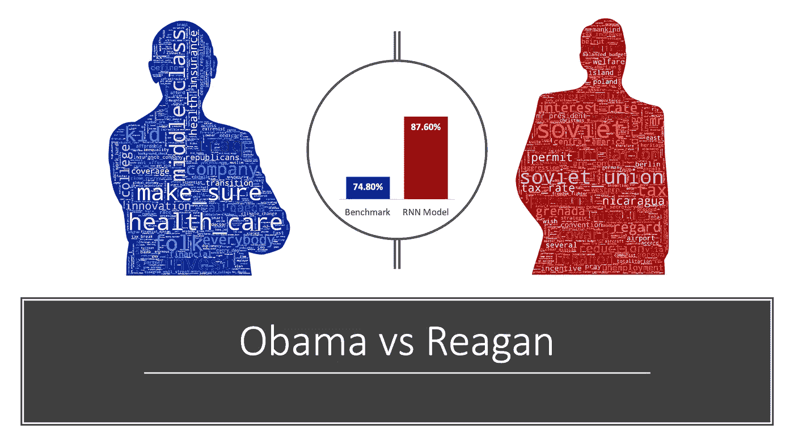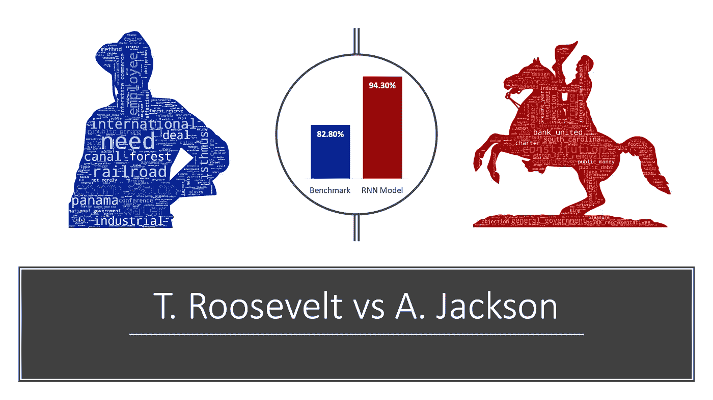

综合来看，我们可以看到我们的模型达到了 84.3%到 94.3%之间的平均准确率。这可能是由于模型性能的不一致性，但也可能是由于每对模型之间不同程度的相似性和差异。换句话说，林肯和华盛顿的准确率较低，表明他们比特朗普和克林顿有更多的共同点。相反，西奥多·罗斯福和安德鲁·杰克逊之间的差异很可能大于特朗普和克林顿。

需要说明的是，这些仅仅是第一印象，还需要进一步的调查来确认事实是否如此。目前，我们将继续关注特朗普和克林顿。

## **解读结果**

不出所料，结果突出了这两位候选人之间的明显区别。一方面，我们有克林顿，她努力吸引妇女和年轻人，并花了很大力气强调她的执政经验。另一方面是特朗普，他的竞选活动似乎主要侧重于直接攻击克林顿。尽管他确实提到了移民、监管和贸易，但它们在他的词汇索引中的重要性远没有人们想象的那么明显。

通过查看与预测误差相关的单词 cloud，我们希望能够找到一些共同的主题。不幸的是，它并没有像预期的那样工作，尽管通过搜索术语*机会*的错误确实产生了一些有希望的结果。看看希拉里·克林顿的下面这段话:

> 但是你们的政府可以做一些常识性的事情，给美国人更多的成功机会。我们为什么不做呢？因为强大的特殊利益集团和将意识形态置于政治进步之前的倾向导致了国会的僵局。当你看到什么都没做时，你怎么能不沮丧，甚至生气呢？许多人觉得没有人站在他们一边，没有人支持他们，这在美国是不应该的。

我们的网络将此错误归类为特朗普的话，这表明特朗普和克林顿都同意，代表们没有有效地代表或代表他们选区的最佳利益:政府已经崩溃，需要修复。

因此，可能是我们的网络仅仅需要更多的改进，但也可能是错误云这个词需要不同的编译。可能两者都有一点，需要一些时间来解决，特别是在网络优化方面。幸运的是，有一项在这方面向前推进的战略。

**下一步:模型细化**

我们想找出是否存在一组特定的超参数来最大限度地提高测试精度。为了进行这样的分析，我们需要数据。为了实现这一点，随机选择了 500 对总统，对其进行了基准测试，并使用 2 个神经网络(1 个 CNN 和 1 个 RNN)和随机选择的超参数集进行了测试。所有的结果和数据都保存在一个数据框架中(其子集可以在下面找到)，并进行初步的探索性分析。

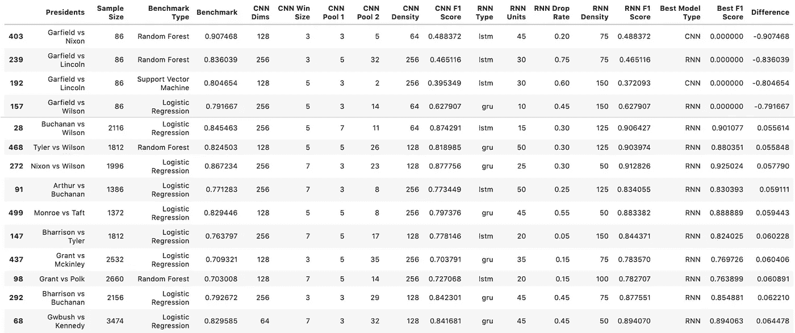

我首先关注的是样本大小对准确性的影响，因为阶级不平衡是一个大问题。正如我们在上面所看到的，与詹姆斯·加菲尔德的所有比较只选择了 86 个样本，这是因为他唯一有记录的演讲是他的就职演说，在他就任总统仅 100 天后就被暗杀了。从这些分析中无法得出有意义的结果。从下面可以看出，要得到有意义的结果，至少需要 500 个样本。任何低于这个数字的结果都会变化很大，平均准确率接近随机水平。

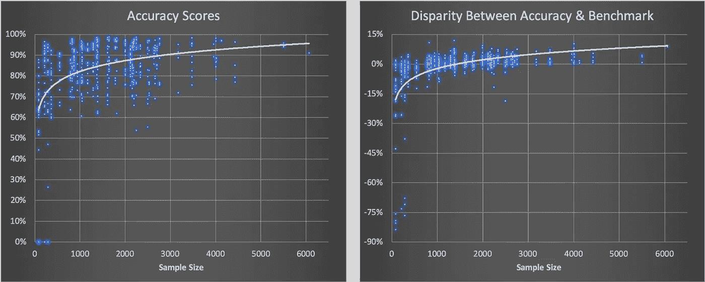

然而，要清楚的是，某些结果产生 0%的准确度分数的事实导致了对代码中的错误的怀疑，该错误还没有被识别。这种影响似乎范围有限，不会对总体结论产生重大影响，但我确实认为，为了透明起见，这一点值得一提。这将在未来的更新中解决。

看一看网络架构，我们还可以探究所选不同模型的有效性。在这种情况下，循环网络被细分为长短期记忆(LSTM)模型和门控循环单元(GRU)模型。

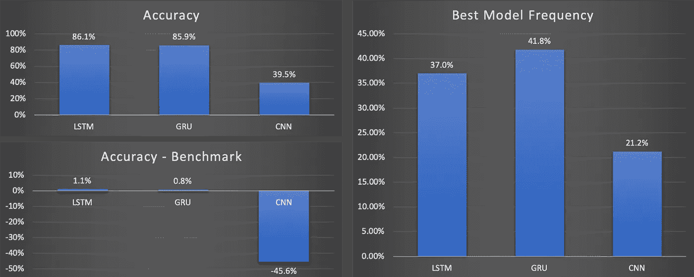

在这里，可以观察到递归网络大大优于卷积网络，尽管后者在大多数情况下确实取得了最好的成绩。这可能是因为这些网络具有工作得非常好的特定超参数集，或者当存在某些样本特征时，它们通常工作得更好。无论哪种方式，都绝对是值得进一步探索的东西。

从更长远的角度来看，理想的做法是采用贝叶斯方法来构建网络，更新架构，并根据每一组新的结果以增量和编程的方式调整参数。实际上，这是一种训练机器制造机器的方法。但那将是另一天的挑战。

## 结论

从目前的观察来看，这个项目的目标在原则上似乎是合理的，我们有一个模型构建方法可以帮助我们实现这个目标。不幸的是，该方法目前的有效性仍然需要大量的手动搜索来找到共同的主题，但进一步调整模型，我们可以提高准确性，从而缩小我们的 spotlight 搜索的焦点。

然而，当收集随机选择的 500 位总统的数据时，当准确性达到足够的水平时(定义为分数超过 90%或网络优于基准时)，错误数据会继续被跟踪。由此，可以创造出最后一个词云，人们可能会将其解读为反映了美国总统政治历史上的共同主题。尽管需要做更多的工作来弄清楚我们要去哪里，但反思我们去过哪里总是一个好的做法。

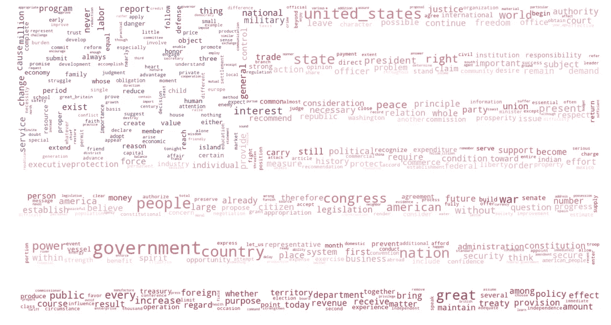

## 参考

可以在 [Github](https://github.com/rwilleynyc/presidential_speech_corpora) 上找到这个项目的存储库以及所有相关的 Jupyter 笔记本。