# 使用 Azure 认知服务对特朗普的推文进行情感分析

> 原文：<https://towardsdatascience.com/using-azure-cognitive-services-for-sentiment-analysis-of-trumps-tweets-part-1-f42d68c7e40a?source=collection_archive---------11----------------------->

## 一个关于如何使用 Azure 认知服务(文本分析 API)的广泛教程，通过 Databricks (Python，Scala)执行情感分析


Photo by [Con Karampelas](https://unsplash.com/@conkarampelas?utm_source=medium&utm_medium=referral) on [Unsplash](https://unsplash.com?utm_source=medium&utm_medium=referral)

# 第一部分——提取推文

情感可以在任何地方表现出来，比如评论、新闻、现实生活中的对话、新闻等等。通过采用机器学习方法来准确识别情感极性的能力开启了一系列可以为企业带来巨大价值的业务用例。如果机器可以自动确定情感，而不是人类通过分析内容来推断情感，这是一个低效率的过程，需要大量的成本和时间来评估；企业可以利用这种洞察力来调整他们的战略(例如，对于一家零售公司，他们可以加快定制营销，以降低流失风险并限制负面口碑的影响，这可以是一个反馈循环，以重新审视产品/服务并改进它，正如比尔·盖茨曾经说过的一句名言:“你最不满意的客户是你最大的学习来源”)

考虑到这种情况，如果必须建立大规模执行情感学习的能力，一种选择是使用传统的机器学习方法来建立分类器，该分类器预测输入(可以是从其原始形式转换成机器学习算法可理解的形式(包括单词包或 TF/IDF 或任何其他表示，例如 word2vec)的文本)是否属于离散的二进制类别(肯定或否定)。人们可以使用传统的监督机器学习算法，如朴素贝叶斯、逻辑回归、SVM、决策树或基于集成的随机森林来完成任务，并且可以基于所选的评估度量来实现相对较好的性能水平。或者，人们可以探索像多层感知器这样的深度学习方法，以实现类似的目标。但不管你的数据科学团队有多先进或完善，除非你是微软或谷歌或类似的公司，否则在性能和效率方面，与大公司(如微软)使用的方法竞争并不容易。云服务的一个优点是，它们基于数十年的研发投资，提供即时消费的分析服务，如 Azure Cognitive Services 或 AWS intensive。人们可以将这些服务用于情感分析用例，以快速实现价值。在我的上一篇文章中，我们探讨了 Azure 认知服务在内容审核中的使用，而这篇文章是关于使用 Azure 认知服务套件中的另一个服务进行情感分析！

为了让事情变得有趣，我将演示如何使用 Azure 认知服务对唐纳德·特朗普发布的推文进行情感分析。我不确定你，但许多人可能会先入为主，有偏见地认为他的推文确实带有“特定极性”。这项练习将努力验证这一假设，并分析他最近的推文，看看他们有什么情绪。

该员额将由两部分组成。在第一部分中，我将演示如何使用 Python 检索数据(本例中是 Trump 的 tweet ),在下一部分中，我将重点介绍如何使用 Scala 和 Databricks (Spark)以可扩展的方式分析 tweet。同样，代码实现不会是产品级的，只是为了证明其功能。

让我们从第一部分开始，即数据提取。为此，您将需要以下内容:

1.  Python(我用的是 Python 3.5)
2.  开发环境(IDE 或笔记本。我正在使用数据块)

工作流看起来会像这样:

**提取推文- >执行一些处理- >在文件系统中持久化** - >在 Spark 中读取推文- >与 Azure 认知服务集成- >生成情感预测- >执行分析

粗体部分将是这篇文章的范围。其余的将在第二部分讨论。我们开始吧，好吗？

如果你还没有注册社区版的 Databricks，你可以访问[下面的链接](http://databricks.com)。注册后，您必须在使用笔记本电脑之前启动一个集群。有了 community edition，可用的集群非常小，但对我们来说已经足够了。要创建集群，请单击左侧菜单上的“集群”,然后单击“+创建集群”按钮:

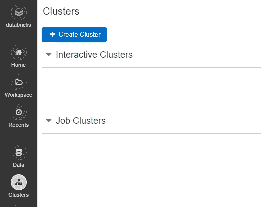

它将为您提供创建集群的选项。为群集指定您选择的名称。参数的默认值应该没问题。完成后，单击“创建集群”。安装群集需要几分钟时间。

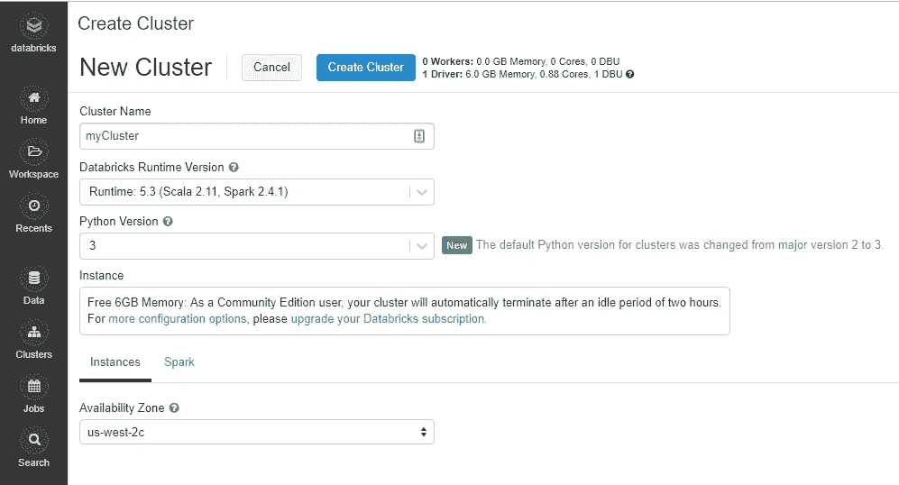

该群集将安装最少的软件包。为了提取推文，我们将使用 tweepy。要使用它，您首先必须在集群中安装它。为此，单击 Workspace -> Users。

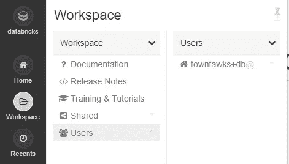

单击您的电子邮件 id，然后右键单击级联部分->创建->库

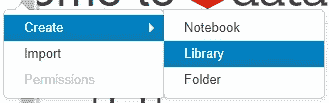

然后在该部分中，选择 PyPI，在包区域中写入“tweepy ”,并单击“创建”

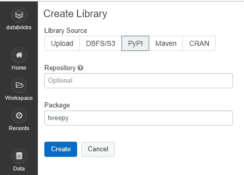

完成后，点击 Databricks 主页中的“新建笔记本”:

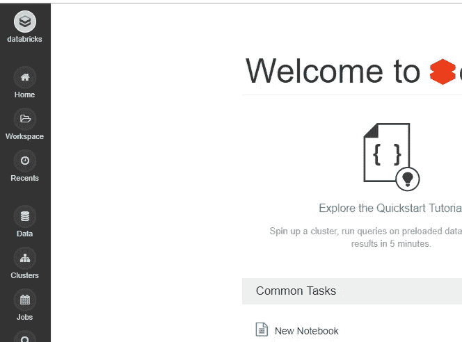

给你的笔记本命名，选择 Python，点击“创建”

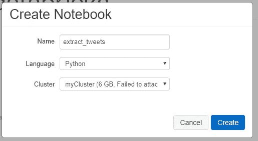

完成后，您就可以使用笔记本了。如果你以前用过 Jupyter 笔记本，UX 看起来会有些相似。

现在，随着环境的初始化和供应，需要满足另一个依赖性:为了能够与 Twitter 集成，您需要创建一个 Twitter 应用程序。我不会深入讨论这个步骤的细节，但是[这个链接](https://iag.me/socialmedia/how-to-create-a-twitter-app-in-8-easy-steps/)提供了一步一步的操作步骤。一旦你注册了一个 Twitter 应用，你需要以下四个相关的凭证:

API 密钥

API 密钥

访问令牌

访问令牌秘密

现在我们已经准备好实际编码了！在我们进行的过程中，我会尽力解释这些代码。

让我们从导入所需的模块和初始化所需的变量开始。

```
from tweepy import OAuthHandler
from tweepy import API
from tweepy import Cursorconsumer_key = "" #twitter app’s API Key
consumer_secret = "" #twitter app’s API secret Key
access_token = "" #twitter app’s Access token
access_token_secret = "" #twitter app’s access token secret
```

使用 twitter 应用程序时的身份验证机制是 OAuth，tweepy 的 API 使得使用 OAuthHandler 类来执行身份验证变得很方便，在 OAuth handler 类中，您可以指定与 Twitter 应用程序相关的凭据。然后用 tweepy。API 是 Twitter 为其余步骤提供的包装 API:

```
auth = OAuthHandler(consumer_key, consumer_secret)
auth.set_access_token(access_token, access_token_secret)
auth_api = API(auth)
```

tweepy 返回的对象。API 类提供了许多可以用来提取 tweets 的方法。在这篇文章中，我们将使用的是 user_timeline()函数，它允许我们指定 Twitter 句柄、推文数量:

```
trump_tweets = auth_api.user_timeline(screen_name = ‘realDonaldTrump’, count = 600, include_rts = False, tweet_mode = ‘extended’)
```

许多参数是不言自明的。具体来说，将 include_rts 设置为 False 会将 retweets 从帐户中排除，而 tweet_mode 作为 extended 会提供 tweets 的完整文本，否则会被截断。trump_tweets 是一个 tweepy.models.ResultSet 类型的对象。它就像一个可遍历的 iterable，其中的每个元素都包含属性 full_text，该属性包含所需的 tweets 文本。因此，让我们使用 Python 的列表理解来完成这项任务，如下所示:

```
final_tweets = [each_tweet.full_text for each_tweet in trump_tweets]
```

以下是我试图提取时的推文。您的可能会有所不同。

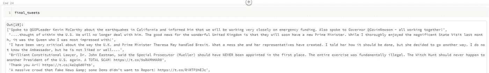

现在让我们以文本文件的形式保存这个列表，这样我们可以在管道的第二阶段使用它们。因为我们将在第 2 部分的 Databricks 中使用 Spark 分析 tweets，所以在这种情况下使用分布式文件系统或对象存储是有意义的。这就是 Databricks DBFS (Databricks 文件系统)让事情变得更简单的地方。这个主题本身需要大量的理解，但在这个阶段，知道 DBFS 也是一个分布式文件系统就足够了，它根据云环境物理化在对象存储上(Blob 代表 Azure，S3 代表 AWS)。您还可以在 DBFS 挂载您的对象存储，并可以访问其名称空间下的对象存储。最后，您还可以使用本地文件系统 API(例如 Python 的)在 DBFS 上进行读/写(由 [FUSE mount](https://docs.databricks.com/user-guide/dbfs-databricks-file-system.html) 提供)。因此:

```
with open(‘/dbfs/FileStore/tables/trump_tweets.txt’, ‘w’) as f:
 for item in final_tweets:
 f.write(“%s\n” % item)
```

您可以通过多种方式验证数据是否已成功写入。其中一种方法是再次读取该文件，以确保它已被正确写入:

```
read_tweets = []
with open(‘/dbfs/FileStore/tables/trump_tweets.txt’,’r’) as f:
 read_tweets.append(f.read())
```

下面是一个输出示例:

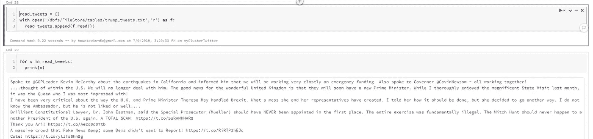

这篇博文的第一部分到此结束，其中重点介绍了使用 Python(通过 tweepy 模块)从特定用户提取 tweets 的过程，以及使用 Databricks 笔记本的配置步骤。

# 第二部分—面向情感分析的 Azure 认知服务集成

在您从指定的 twitter 句柄(本例中为 [@realDonaldTrump](http://twitter.com/realDonaldTrump) )中提取所需的一组推文之后，这个分析管道的下一部分是与 Azure 认知服务集成，以获得情绪预测。我们将在数据块中使用 [Spark](https://www.udemy.com/apache-spark-hands-on-course-big-data-analytics/) 来实现大规模处理(有一些警告)。如前所述，Azure 认知服务是一套服务，对于推文的情感分析，我们将使用 [Azure 文本分析 API](https://azure.microsoft.com/en-gb/services/cognitive-services/text-analytics/) 。此外，为了扩大这篇文章的影响，增加你的技能，我将演示你如何在使用 Scala 时做到这一点！所以让我们开始吧。

## 依赖性管理:

首先，你需要注意一些依赖关系:
**1。Azure 认知服务中的文本分析 API—**如果你有 Azure 订阅(免费试用也适用于本例)，你需要在 Azure 认知服务中提供文本分析 API。这个过程应该类似于我之前的帖子，在那里我演示了如何使用 Azure Cognitive Services 的内容审核服务。在提供了文本分析 API 之后，您需要获取以下详细信息:

>文本分析 API 端点
> API 认证密钥

一旦完成，您的文本分析 API 就可以从基于 REST 的客户机上使用了，它是用您选择的语言编写的(在这里是 Scala)。

**2。Scala 库—** 我们将依靠几个 Scala 库来完成这项工作。具体来说，我们将需要以下几个:
> [scalaj](https://mvnrepository.com/artifact/org.scalaj/scalaj-http) (向 Azure 文本分析 API 发送 REST 调用)
> [spray json](https://mvnrepository.com/artifact/io.spray/spray-json) (解析 Azure 文本分析 API 的 json 响应，我们将使用这些响应进行后续处理)

由于我们使用数据块，因此为您的环境管理这些依赖项的过程将是相似的。也就是说，您必须创建一个库，并将其附加到您启动的集群。对于 JVM 语言，maven 通常是您可以找到许多此类依赖项的首选存储库。要在 Databricks 中管理这些库，您必须为它们提供 maven 存储库坐标(由(group id:artifact id:Version)组成)。当您指定这些 maven 存储库坐标时，依赖关系管理(就像 Databricks 中使用的那样)能够在 maven 存储库中找到这些坐标，下载并在您的环境中安装/供应它们。下面举例说明如何在 Databricks 中指定 Spray Json 库的 maven 坐标:

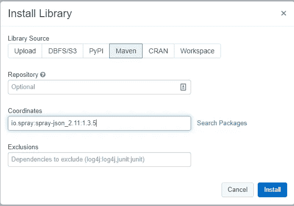

您必须为 scalaj 库做同样的事情。
现在来看实施部分，监督您将要实施的工作流程总是有帮助的，因此我们的工作流程将由以下步骤组成:

*阅读来自 DBFS 的推文- >删除推文文件中仅包含 URL 的任何行(因为它们不会包含任何情绪信号)- >以 Azure Text Analytics API 端点所需的 REST 调用的形式格式化每个推文行- >将 REST 调用发送到 Azure Text Analytics API 端点- >处理分析洞察的结果*

有了这个工作流，让我们来考虑每个步骤的实现。作为一个好的实践，我们将首先创建一些帮助函数，它们将帮助我们执行上面提到的许多任务。

## Scala 函数将 tweets 数据格式化为 REST POST 调用格式:

创建一个 Databricks 笔记本，选择 Scala 作为语言，并在一个单元格中编写以下代码:

```
def requestFormatter(givenTweet:String):String={
  s"""{
    "documents":[
        {
        "language":"en",
        "id":1,
        "text":"${givenTweet}"
        }
    ]
  }"""
}
```

让我们了解一下这段代码中发生了什么:
1。我们创建了一个名为 requestFormatter 的函数，它接受一个 String 类型的参数(givenTweet)。
2。该函数返回字符串
3。该函数根据 Azure Text Analytics API 的要求创建一个 Json，该 Json 由一个键-值对组成，键为“文档”，值为由语言、id 和文本字段组成的对象列表。这些字段不言自明。列表中的 id 字段应该是唯一的。在这种情况下，文本是实际数据(tweet)将嵌入的字段。此外，因为 documents 是一个列表，所以您可以有多个语言、id 和文本字段的对象，并且您可以在一个 REST 调用中发送多达 5000 个对象。然而为了简单起见，我只是在一个 REST POST 调用中发送一个对象。

## Scala 函数发送 REST POST 调用:

在另一个单元格中，键入以下代码:

```
def sendPostRequest(textAnalyticsUrl:String,subscriptionKey:String,requestBody:String):String={
  import scalaj.http.Http
  Thread.sleep(3000)
  val result = Http(textAnalyticsUrl).postData(requestBody)
  .header("Content-Type", "application/json")
  .header("Ocp-Apim-Subscription-Key", subscriptionKey).asString
  result.body
}
```

下面是我们在这个函数中所做的:
1。函数 sendPostRequest 接受三个参数(textAnalyticsUrl 表示 Azure 文本分析 API 端点 URI，subscriptionKey 表示您之前检索的将用于 REST 调用身份验证的密钥，requestBody 是将作为 REST 调用的一部分发送的数据
2。我们为这个实现引入了 3 秒的延迟，这样 Azure 就不会阻塞我们的请求。有更好的方法来解决这个限制。
3。然后，我们发送一个 REST POST 调用，指定 URI、标头(“Content-Type”、“application/json”、“Ocp-Apim-Subscription-Key”、subscriptionKey)，并用我们将通过前面的函数获得的 json 填充请求体。
4。最后，我们从这个函数中以字符串形式返回 REST 响应的结果，其形式如下:

```
{
 “documents”:[{“id”:”1",”score”:0.85717505216598511}],
 “errors”:[]
}
```

其中 documents 对象包含一个列表，特别是对应于文档 id 的分数。返回的分数从 0 到 1 不等，它是调用 Azure Text Analytics API 后的预测结果。接近 0 的值代表消极情绪，接近 1 的值代表积极情绪。

## Scala 函数移除 Tweets 中的 HTTP 行函数:

该函数用于删除 tweets 文件中可能存在的 HTTP 行。

```
def removeHttpLines(textLine:String):Boolean={
  import scala.util.matching.Regex
  val pattern = "^http".r
  pattern.findFirstIn(textLine) match {
    case Some(x)=>false
    case _ => true
  }
}
```

1.该函数需要一个参数(字符串类型的 textLine)并返回布尔值(true 或 false)。
2。它利用正则表达式并在文本文件中寻找一个特定的模式，其中一行以“http”开始。它确实可以进一步细化，但为了简单起见，让我们使用它。
3。然后，它试图在文本文件中找到该模式。在这里，Scala 的模式匹配结构用于匹配两种可能性:如果找到匹配，即 Some(x ),那么返回值将为 false，否则将返回 true。我们返回这些值的原因将很快变得显而易见。

现在有了这些函数，让我们实现剩下的逻辑，有趣的是，由于 Scala 是一种函数式编程语言，它可以用一行代码来表示:

```
val tweetsSentimentsRdd = sc.textFile("/FileStore/tables/trump_tweets.txt").filter(removeHttpLines).map(x=>requestFormatter(x)).map(y=>sendPostRequest(url,subscriptionKey,y))
```

让我们来破译这里发生了什么:
1。首先，我们使用 SparkContext (sc) textFile 函数，该函数用于从文本文件中读取数据(通常来自 HDFS，在本例中是实现其接口的 DBFS)。它接受字符串形式的文件路径，这就是我们指定 tweets 文件的位置。此函数返回字符串类型的 RDD，其中每个元素对应于文件中的每一行。下一步是过滤掉任何只包含 http URLs 的行。这就是我们使用 Spark 的滤镜变换的地方。在它的参数中，我们传递了一个函数(再次感谢函数式编程)，特别是 removeHttpLines，它将对数据的每一行进行操作，并将只返回那些从该函数中产生 true 的行(即，在它们的开头没有 http)。
3。下一部分转换过滤文本的每一行(即删除 http 行),并(使用 requestFormatter 函数)将每条 tweet 转换为所需的 Json 字符串，格式如下:

```
{
 “documents”:[
 {
 “language”:”en”,
 “id”:1,
 “text”:”tweet text will come here”
 }
 ]
 }
```

3.接下来的部分使用函数 sendPostRequest 调用 Azure 文本分析 API 端点

在执行时，由于 Spark 的懒惰执行模型，不会发生任何执行。由于数据很小并且是 PoC 设置，因此使用“收集”操作是安全的(但是在生产设置中尽量避免这种情况，因为它会将 Spark 的所有分布式执行器节点的数据返回到驱动程序，从而导致内存溢出问题)。

```
val tweetsSentimentList = tweetsSentimentsRdd.collect()
```

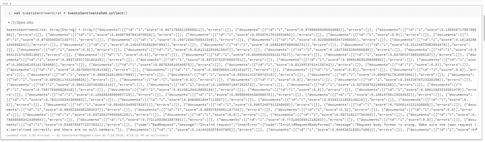

现在我们有了 Scala 集合形式的响应。列表中的每个元素都是一个字符串(Json ),由来自 Azure Text Analytics API 的响应组成，在当前状态下，我们对此无能为力。如果要回答几个问题像:
>分数的最大值和最小值是多少？
>这条推文语料库的平均情感分是多少？
>本语料库中特朗普最积极的推文有哪些？

为了回答这些分析问题(以及许多其他问题)，可以对这种形式的数据进行的一种处理是将现有的 Json 字符串转换为针对这种处理进行了优化的 Scala case 类。有很多方法可以做到这一点，但是我求助于使用 spray json 库来做到这一点:

为此，首先我们必须为 Json 创建一个解析器。这包括创建表示 Json 结构的 case 类，如下所示:

```
case class ResponseBody(id:String, score:Double)
case class AzureTextAnalyticsResponse(documents: List[ResponseBody], errors: List[String])
```

然后使用 spray json 构造来指定 json 的结构，包括 key 的值以及不同的部分如何相互嵌入

```
object ResponseJsonUtility extends java.io.Serializable {
 import spray.json._
 import DefaultJsonProtocol._object MyJsonProtocol extends DefaultJsonProtocol {
 implicit val responseBodyFormat = jsonFormat(ResponseBody,"id","score") //this represents the inner document object of the Json
 implicit val responseFormat = jsonFormat(AzureTextAnalyticsResponse,"documents","errors") //this represents the outer key-value pairs of the Json
 }//and lastly, a function to parse the Json (string) needs to be written which after parsing the Json string returns data in the form of case class object.import MyJsonProtocol._
 import spray.json._

 def parser(givenJson:String):AzureTextAnalyticsResponse = {
 givenJson.parseJson.convertTo[AzureTextAnalyticsResponse]
 }
}
```

现在创建了这些函数和对象，剩下的就是在 Scala 集合中使用它们来获得想要的结果:

```
val tweetsSentimentScore = tweetsSentimentList.filter(eachResponse=>eachResponse.contains(“documents”)).map(eachResponse=>ResponseJsonUtility.parser(eachResponse)).map(parsedResponse=>parsedResponse.documents(0).score)
```

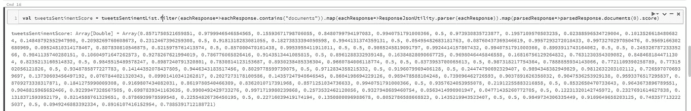

到现在为止，upstated 的表达对你来说应该很熟悉了，但是这里仍然是对步骤的分解理解。首先，我们将执行过滤，只考虑 Json
2 中具有“documents”部分的元素。然后我们解析每个 Json 字符串并转换成 AzureTextAnalyticsResponse 案例类
3。然后，我们只需访问每个解析后的 Json 对象的分数，就可以得到一个只包含情感分数的列表

一旦我们有了这个，那么做进一步的分析就变得方便了，例如我们可以计算平均情绪得分如下:

```
(tweetsSentimentScore.sum)/(tweetsSentimentScore.length)
```

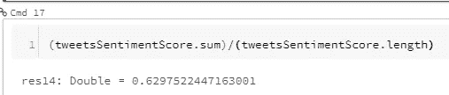

分数结果是 0.629，这意味着被分析的推文平均有轻微的正面情绪:-)

同样，我们可以获得特朗普推文的最大情绪得分:

```
tweetsSentimentScore.max
```

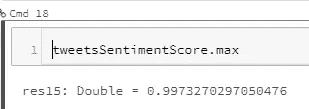

结果是 0.99，这意味着相当多的推文有相当高的积极度:-)

因此，总之，我们可以使用这种方法来做一些分析，以解决不同的问题。此外，这是一个非常基本的实现，有很多增强的机会，所以我们很想知道你用这些基础知识做什么。如果你很难理解 Scala 和 Spark 的一些概念，可以看看我最近的[由 Apress 出版的《大数据分析的 Scala 编程》一书](https://apress.com/gp/book/9781484248096)。