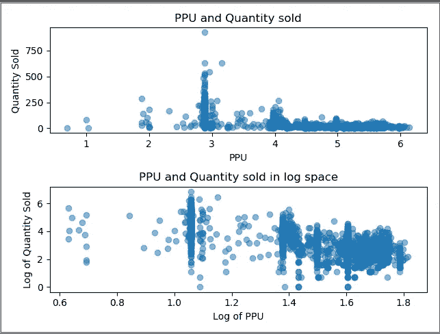
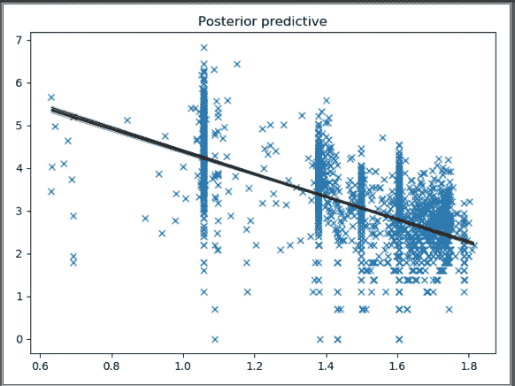
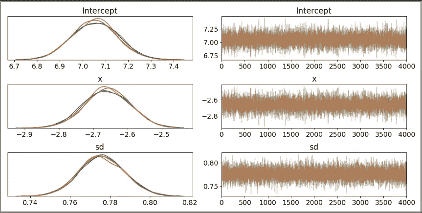
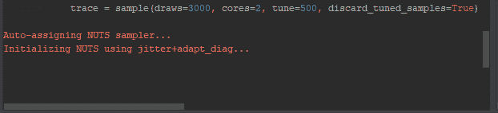
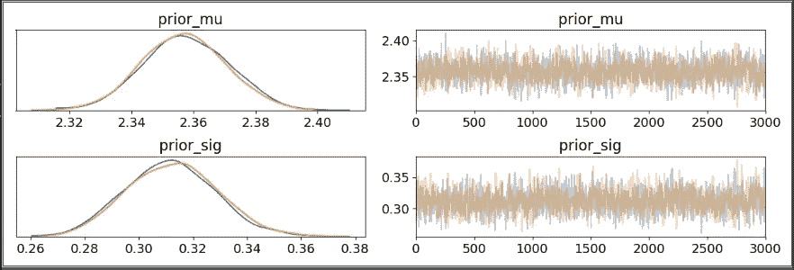
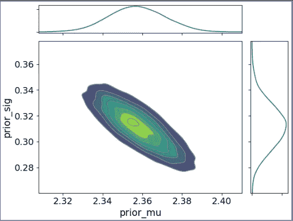
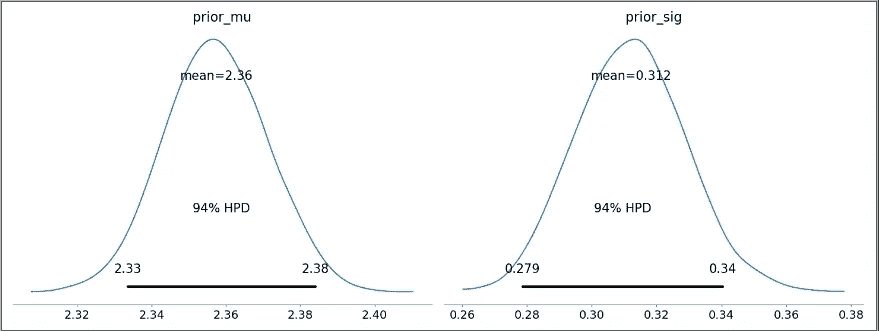

# 提高价格弹性准确性的贝叶斯建模

> 原文：<https://towardsdatascience.com/using-bayesian-modeling-to-improve-price-elasticity-accuracy-8748881d99ba?source=collection_archive---------9----------------------->

## 使用贝叶斯方法提高价格弹性，以包装消费品行业为例

# 介绍

一般来说，贝叶斯数据分析(BDA)和贝叶斯推理对我个人来说，在现实世界中理解和应用总是令人生畏。如果你对它不熟悉，或者想更新一下，我找到了这本很棒的书，它把所有的东西都联系在了一起。

使用 Python 进行贝叶斯分析——第二版，作者 Osvaldo Martin。

也许和我一样，你可能摆弄过文本分析的潜在狄利克雷分配，但从未真正理解它背后的概率主题建模。或者你可能看过一个教程，用抛硬币或其他一些我们在现实世界中无法应用的基本例子来解释先验和后验概率。

因此，我设定了一个目标，在业余时间花两周时间研读 BDA，并通过一个*相对*真实的例子来分享我所学到的东西；至少在我的行业——消费品包装。

# 动机

站在一家消费品公司的立场上，我们意识到**大量资金被投入到支付给零售商**如沃尔玛、Wholefoods 和其他杂货连锁店的促销、传单和折扣上。因此，这些投资获得我们期望的投资回报率是至关重要的。估算投资回报率的一个重要工具是弹性系数，这是一个价格变化对需求影响程度的比率。此外，预测或估计价格变动后的需求是准确了解促销投资回报率的基础。

组织通常在类别、细分市场(价格促销组)或单个 SKU 级别具有这些弹性系数。然而，就准确性而言，最好的是——你猜对了——在 **SKU 级别**,因为每个产品在一个细分市场中的表现略有不同。

# 目标和假设

因此，没有进一步的拖延，我们的目标将是获得一个特定产品的弹性系数在 SKU 水平使用 BDA，当我们所有的是:

1.弹性系数 a **t 分段水平**

2.加拿大一个省内多家商店的产品销售额和销售量。

因此，我们将使用我们对细分层次弹性的**先验知识以及我们观察到的**销售金额和数量来估算 SKU 层次**的弹性值。**

# 第一步:清洁

将数据加载到数据框中并进行标准数据输入。

计算产品的单位价格，因为我们以后需要用它来计算弹性。

接下来，我们将使用贝叶斯线性回归来获得 SKU 水平的弹性值，但首先我们需要将 PPU 和销售量转换成对数空间。这是因为一旦因变量和自变量都转换成对数-对数，弹性就是对数 PPU 的系数。很酷吧？

> 关于为什么双对数模型是描述需求弹性的最合理模型，有很强的微观经济学论据。潜在需求曲线描述了最像经济学家假设的需求行为。它确保需求不会随着价格的上涨而降到零以下，另一方面，需求会随着价格的下降而呈指数增长。[2]

移除一些额外的异常值。

# 第二步:贝叶斯广义线性模型

现在我们终于可以使用广义线性模型(GLM)“from _ formula”函数来创建贝叶斯线性模型了。这个函数的好处在于，它在“~”方面遵循与 R 相同的语法。我不得不将 log_PPU 改为 x，因为在我的 pymc3 版本中有一个错误，独立变量必须被称为 x。比我更聪明的人可能知道一个修复方法，但我只是跟着它走。

通过使用 family 属性，我们可以将可能性的分布，或者换句话说，观察数据的建议形状更改为非正态分布，但是对于此示例，让它保持正态分布。例如，将其转换为二项式会导致逻辑回归。

然后，我们从该模型中采样 4000 次，每个内核在 4 个内核中进行 500 步老化，这相当于 18，000 个样本。把烧伤想象成向一块软木板投掷飞镖，你最初投掷的飞镖很糟糕，几乎没有在木板上出现，但是经过几次尝试后，你会变得更好，并开始在同一区域持续击中它们。你最初几次扔得太差，不能代表你的真正技术，所以你把飞镖从板上拿下来，没人知道！

我们可以根据对数数量和对数 PPU 的散点图绘制 16，000 条回归线。

Trace Plot — x is our coefficient of the PPU, since in the previous step we renamed PPU to x.

上面的轨迹图表示模型的核密度估计和收敛。基本上，由于我们运行 4 个独立的马尔可夫链，3 个折线图中的 4 条彩色线越接近相同的模式，我们的模型就越有代表性(没有大的漂移或其他奇怪的模式)。

我们关心的是轨迹图中 PPU (x)值的分布，它实际上是我们运行的 18，000 次回归的 x 系数，如您所见，它的平均值为-2.66。

# 步骤 3:贝叶斯建模

现在你可能想知道为什么不做一个常规的 OLS 回归，如果这就是我们到目前为止所做的。原因是现在我们有一个可能的弹性值的**分布**，平均值为 2.66，标准偏差约为 0.067。因此，没有什么可以阻止我们从这个新的正态分布中进行采样，以获得尽可能多的弹性值！

在这一点上，我们还没有将我们的**先验知识**结合到这个模型中，即在细分水平上的弹性是什么。所以，让我们现在就开始吧！

我决定使用 pymc3 处理得很好的坚果采样做一个简单的贝叶斯推断。我们的**观测数据样本现在将是我们从 GLM** 获得的弹性值，我们在分段水平的**弹性先验信念将在我们的模型参数中表示。**

一行一行地走。

**第 1 行:**出现次数是我们从正态分布中取样的观察值。这些参数来自我们从 GLM 得到的分布。通常，观察值是实际的数据点，而不是分布。然而，我们有点创造性，使用了上面讨论过的 GLM 分布。我还将负 2.66 翻转为正，因为弹性通常表示为正数。

**第 4 行:** prior_mu 表示我们在段级别被给定的弹性值，具体是参数 mu=2.2。我选择 sigma 或方差为 0.01 的正态分布，只是因为我没有更好的方差估计。值得注意的是，prior_mu 的平均值和 sigma 也可以是分布本身。当这种情况发生时，它被称为有自己参数的超先验。所以，我们可以很快进入一个[海龟一直到](https://en.wikipedia.org/wiki/Turtles_all_the_way_down)的情况。

**第 5 行:** prior_sig 表示我们的先验信念有多大的方差。为此，我选择了一个逆伽马分布，因为它不可能是负的，而且分布大多在 0 到 0.5 之间。这很有帮助，因为我不希望我们先前的信念 2.2 有太大的波动。

**第 6 行:**这是橡胶接触路面的地方，我们将观察结果与先前的信念联系起来。我再次选择了正态分布，并使用了参数*观察到的*，它有一个非常简单的作用，它允许我们将数据输入到我们的模型中。

**第 10 行:**之后，我们在 2 个核心上采样 3000 次，并丢弃前 500 个样本以说明老化期(总共 7000 个)。

就结果的可视化而言，首先我们有一个迹线图，它在左边显示了核密度估计，这是基于观察到的和先前的数据的弹性条件的可能值的分布。

> 请注意， *prior_mu* 值是我们的弹性系数，它既不是 2.2 也不是 2.66，而是在中间的某个位置。**这清楚地显示了我们先前的和我们观察到的数据点对模型的影响。**尝试用**增加**观察数据的*出现次数*，看看这个分布如何变化！

# 第四步:视觉化

Plot_join 基本上和 trace plot 是一样的，只是它们不是两个独立的图表，而是组合在一起的。但是它看起来真的很酷吗？

plot_posterior 给出了平均值和 94%的最高概率分布(HPD ),也就是说，我们讨论的参数弹性在 94%的时间里都在此范围内。

# 结论

通过 GLM 对该特定产品的弹性进行建模的对数-对数方法似乎是合适的，因为它在细分水平提供的弹性范围内(在 2.2 和 2.6 之间)。老实说，这是最让我吃惊的！

然而，给定足够的观察值，我们将很快看到观察到的弹性值优先于分段水平值。在我们的案例中，我们有超过 2000 个跨越多年的销售点交易，因此如果我们将观察到的发生次数从 500 次增加到 2000 次，我们会看到 2.6 是**平均值**模型值。

[https://github.com/mattbitter/W2_BayesianGLM](https://github.com/mattbitter/W2_BayesianGLM)

# 参考

[1]伊利亚·卡佐夫，[动态定价算法指南](https://blog.griddynamics.com/dynamic-pricing-algorithms/) (2019)，网络

[2]丹尼尔·吕 Data，U [回归食品:利用销售数据确定价格弹性](https://www.statworx.com/ch/blog/food-for-regression-using-sales-data-to-identify-price-elasticity/) (2018)，网络

[3]戴夫·贾尔斯，[计量经济学学生 MCMC 第四部分](https://www.r-bloggers.com/mcmc-for-econometrics-students-part-iv/) (2014)，网络

[4]威尔·科尔森，[用贝叶斯推理估计概率](https://github.com/WillKoehrsen/probabilistic-programming/blob/master/Estimating%20Probabilities%20with%20Bayesian%20Inference.ipynb) (2018)，Web GitHub

[5] Will Koehrsen，[Python 中的贝叶斯线性回归:使用机器学习预测学生成绩第 2 部分](/bayesian-linear-regression-in-python-using-machine-learning-to-predict-student-grades-part-2-b72059a8ac7e) (2018)，网络媒体

[6]埃罗·卡雷拉，[黑客的概率编程和贝叶斯方法](https://github.com/CamDavidsonPilon/Probabilistic-Programming-and-Bayesian-Methods-for-Hackers/blob/master/Chapter2_MorePyMC/Ch2_MorePyMC_PyMC3.ipynb) (2018)，Web GitHub