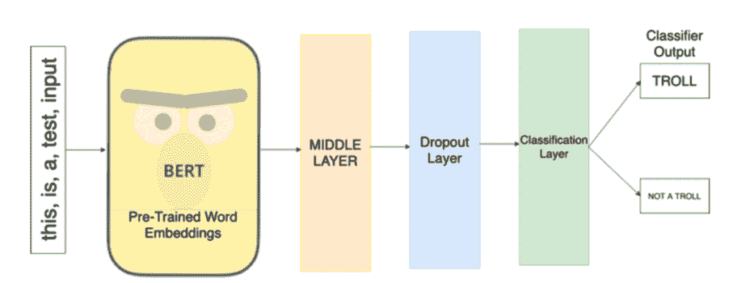
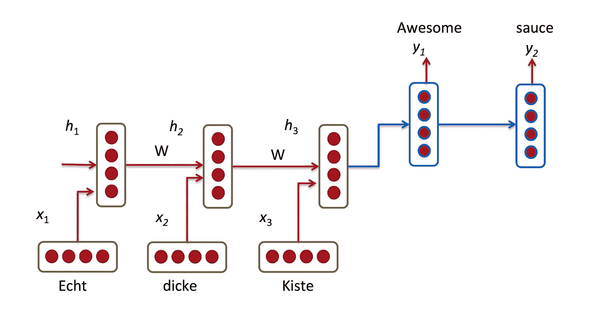
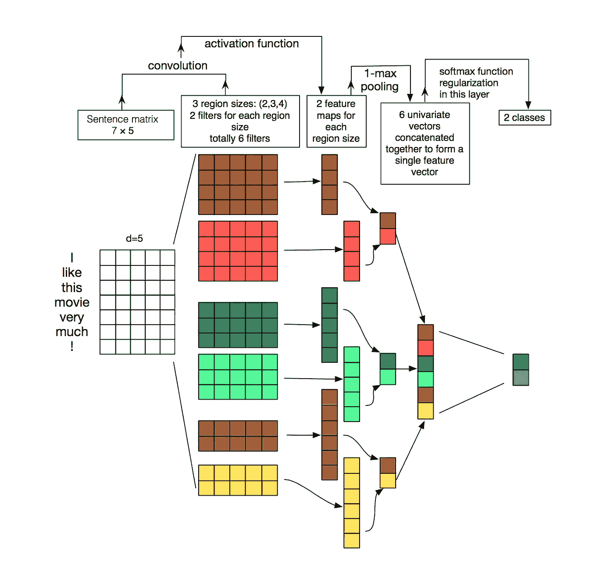
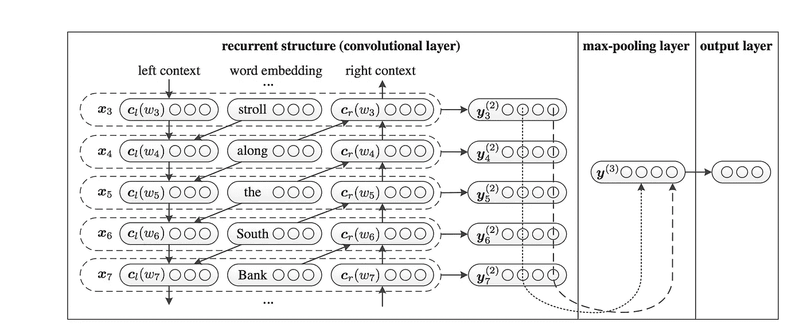
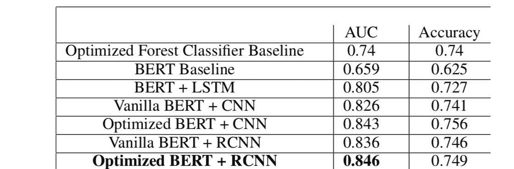
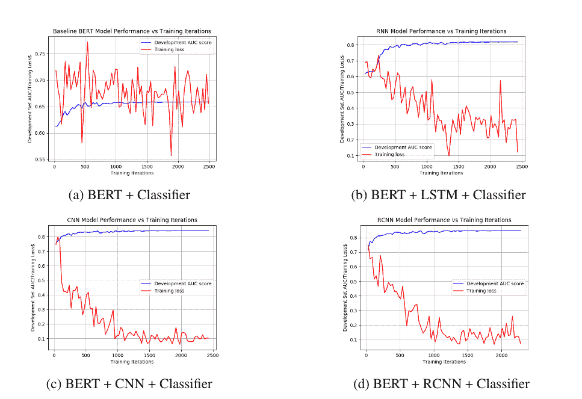
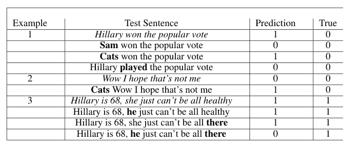

# 使用 BERT 和 CNN 在 Reddit 上检测俄罗斯巨魔

> 原文：<https://towardsdatascience.com/using-bert-and-cnns-for-russian-troll-detection-on-reddit-8ae59066b1c?source=collection_archive---------10----------------------->

这篇文章旨在对我和杰夫·吴在斯坦福大学的 CS 224N 期末项目做一个高层次的概述。对我们工作的技术细节感兴趣的人可以得到[文件](http://web.stanford.edu/class/cs224n/reports/custom/15739845.pdf)和[海报](http://web.stanford.edu/class/cs224n/posters/15739845.pdf)。

# 背景和数据集

在 2016 年选举季，俄罗斯巨魔利用社交媒体[瞄准美国选民。特别是一个名为 troll farm 的互联网研究机构，伪装成保守的特朗普支持者，分享旨在分裂美国人、压制选民和吹捧特朗普为优秀候选人的内容。根据网络安全公司 The New Knowledge 的数据，爱尔兰共和军和类似的巨魔农场制作的内容数量惊人，从 2015 年到 2017 年，共有 1040 万条推文，1100 个 YouTube 视频，116，000 个 Instagram 帖子和 61，500 个独特的脸书帖子。随着另一场总统选举的临近，正确识别俄罗斯巨魔并删除其内容的问题变得比以往任何时候都更加紧迫。](https://www.wired.com/story/russia-ira-propaganda-senate-report/)

当谈到解决俄罗斯巨魔的问题时，一个社交媒体网站似乎被排除在对话之外:Reddit。Reddit 拥有许多政治留言板，如 [r/politics](https://www.reddit.com/r/politics) 和 [r/The_Donald](https://www.reddit.com/r/The_Donald/) ，这使得它特别容易受到政治干预，但标记的 troll 数据数量极其有限。唯一的来源是 Reddit 2018 年 4 月的透明度报告，其中包括与互联网研究机构关联的 [944 个账户](https://www.reddit.com/wiki/suspiciousaccounts)。其中一些帐户是多产的，有数百条评论和数万个 Reddit 因果点，表明这些 trolls 在被 Reddit“淘汰”之前已经深深地嵌入了 Reddit 文化。

# 目前的技术水平

Brandon Punturo 在 1 月份发布了一篇很棒的文章,该文章探索了传统机器学习技术在透明报告数据集上的使用，以及使用 Google BigQuery 获得的 Reddit 评论选集。他使用 AUC 作为性能指标来衡量他的分类器有多准确，并对假阳性和假阴性进行惩罚。他的分类器使用随机森林分类器成功实现了 0.74 的 AUC 分数，这是一个令人印象深刻的壮举。他考虑了每条评论的元数据，包括发布时间、发布的子编辑、评论收到的投票以及评论正文。

除了评论本身，这些额外的元数据有助于理解用户的上下文，但他的方法没有利用自然语言处理的深度学习的最新研究。通过单独查看评论，您可以使用这些方法来理解隐藏在巨魔和非巨魔评论中的潜在信息，并使用这些信息对它们进行分类。

# 神经架构

与传统的机器学习或统计技术相比，神经网络已被证明在特定的语言任务上取得了优异的性能。在基本水平上，这些网络通过使用由权重连接的隐藏神经元来发挥作用，权重代表神经元之间的连接强度。每次对样本评论训练神经层时，预测和真实输出之间的差异会通过称为反向传播的过程导致权重的更新。反向传播与 ReLU 或 sigmoid 函数等非线性层一起构成了神经网络的主干，并提供了在同一 Reddit 数据集上实现最先进(SOTA)性能的机会。

针对这个问题，我们设计了一个包含四个主要组件的神经架构:

1.  BERT 预训练嵌入层
2.  神经中间层
3.  脱落层
4.  分类层

嵌入层给出了每个单词的张量表示以及它们在 n 维空间中的相互关系。神经中间层接受这些嵌入，并将其传递到神经网络的隐藏层，而退出层在训练期间保留中间层内的一定百分比的神经元，以防止过度拟合。然后，这些内容的张量输出被整形，并通过分类层产生逻辑，这些逻辑表明一个评论成为巨魔的可能性有多大。

# 1.伯特嵌入层

来自数据集的每个 Reddit 评论首先通过 BERT 层运行，以创建句子的嵌入表示。单词嵌入是给定词汇表中的单词或短语到相应的实数稀疏向量的映射，表示该单词与 vocab 中所有其他单词的关系。10 月，谷歌发布了一份关于变形金刚双向编码器表示的白皮书,这是一种新的单词嵌入类型，它共同取决于句子中单词的左右上下文。当用作神经架构中的嵌入层时，这种语言模型表示已被证明在问答数据集[小队](https://rajpurkar.github.io/SQuAD-explorer/)上实现了最先进的性能，并且也开始应用于其他 NLP 任务。

BERT 对这个数据集特别感兴趣的一个主要原因是因为我们正在处理这样一个小数据集(大约 14000 个 troll 和非 troll 评论)，很难仅从这个语料库建立一个语言模型。通过使用 BERT 产生的单词嵌入，我们可以将 Google 获得的未标记数据训练的预训练模型与根据我们的标记数据训练的下游神经层相结合。这个过程被称为迁移学习，并且已经被证明在大量的 NLP 应用上实现了 SOTA 性能。

我们将比较各种中间神经层和 BERT 与普通迁移学习的性能改善，这意味着没有中间神经层。

# 2.中

对于神经网络的中间层，有许多不同的可行选择。将其中的每一个与 Puntoro 的随机森林模型和带有 BERT 和分类器的香草迁移学习的基准进行比较，可以展示每一个的有效性。

[http://www.wildml.com/2015/09/recurrent-neural-networks-tutorial-part-1-introduction-to-rnns/](http://www.wildml.com/2015/09/recurrent-neural-networks-tutorial-part-1-introduction-to-rnns/)

传统的神经网络具有前馈结构，本质上从头开始考虑每个新的输入，而不考虑先前的输入。[递归神经网络](https://arxiv.org/pdf/1506.00019.pdf)连接了隐藏状态，每当对输入张量做出决定时，隐藏状态就会更新，从而创建一个反馈回路，使过去的决定影响未来的决定。这种保留先前样本信息的特性使得 rnn，尤其是[长短期记忆网络](https://www.bioinf.jku.at/publications/older/2604.pdf)成为该架构中间层的良好选择。LSTMs 是 rnn 的类型，其具有额外的隐藏单元来维持长上下文中的信息，解决消失梯度问题。

[http://www.wildml.com/2015/11/understanding-convolutional-neural-networks-for-nlp/](http://www.wildml.com/2015/11/understanding-convolutional-neural-networks-for-nlp/)

卷积神经网络执行类似的任务，但它是通过对每个评论进行操作并将它们卷积成低维向量来完成的，这些低维向量通过使用过滤器来捕获关于存储在每个评论中的 n 元语法关系的信息。然后，这些卷积通过最大汇集层，以压缩来自卷积的信息，从而从每个卷积中捕获最重要的信号。通常，已知 CNN 比 LSTMs 更擅长分类任务，因为它们能够更有效地捕捉单词之间的短期和长期依赖性。部分原因是因为 rnn 倾向于将太多的权重放在输入的最后状态，这对于分类来说是不理想的。

[https://www.aaai.org/ocs/index.php/AAAI/AAAI15/paper/view/9745/9552](https://www.aaai.org/ocs/index.php/AAAI/AAAI15/paper/view/9745/9552)

最后，还有第三种类型的模型架构，称为[递归卷积神经网络](https://www.aaai.org/ocs/index.php/AAAI/AAAI15/paper/view/9745/9552)，旨在利用两种架构的优势，并且在从单词的左右上下文中捕捉含义时特别有效。这种类型的模型是在 2015 年推出的，不如前两个模型出名，但它代表了我们中间层的第三个有趣的选项。

# 3.脱落层

丢弃层的目的是在向前和向后训练过程中忽略随机选择的神经元。这通过忽略神经元之间的一些连接来限制神经元之间的相互依赖，从而减少对训练数据的过度拟合。在传统的机器学习术语中，这相当于损失函数的正则化。

# 4.分类层

这最后一层获取 dropout 层的输出，并将其重新整形为大小为 batch_size x 2 的 logits 张量，其中每个评论被赋予被分类为 troll(列 1)或非 troll(列 2)的未标准化的可能性。为了使这些分数正常化，我们使用 Softmax 函数来获得总和为 1 的概率。使用交叉熵损失的反向传播使用这些逻辑来执行，并且相应地更新网络中的权重。

# 结果

不同类型的模型表现明显好于预期，我们对每个中间层模型的开发 AUC 分数明显优于随机森林分类器和 BERT 基线。

我们执行了随机超参数搜索，以优化 RCNN 中隐藏单元的数量、每个样本的填充/截断注释长度以及退出率。我们发现了优化的超参数，使我们能够用 RCNN 实现 0.846 的测试 AUC，用 CNN 和 3 的波束大小实现 0.843 的测试 AUC。

尽管这个模型在我们的数据集上是准确的，但还是有几个值得注意的失效模式。其中之一是，某些包含像“希拉里”这样带有政治意味的词语的简短评论往往会产生更多的误报。通过观察几个带有这些触发词的较短输入句子，以及几个带有其他翻转词的较长句子，我们注意到假阳性和假阴性经常出现在单个神经元上。

值得注意的是，上面和我们的论文中执行的输出分析是在测试集上完成的，这不是最佳实践。虽然我们使用测试数据纯粹是为了理解我们模型的定性故障模式，而不是以任何方式调整权重，但是通常最好完全不要管它，而是在开发集上执行这个分析。

# 结论

这个项目的一个主要目标是改进最先进的 Reddit 检测，这是我们通过多种类型的神经网络成功实现的。然而，这仍然是在一个非常有限的数据集上完成的，并且这将无法扩展其分类巨魔的能力的可能性相当高。我们的希望是，Reddit 今年 4 月发布另一份透明度报告，以便其他研究人员可以建立类似的模型，进一步解决 Reddit 上的俄罗斯巨魔问题。自然语言处理，即使有迁移学习技术，也只能达到现有的标记数据的质量——现在 Reddit 基本上是一个数据沙漠。

# 在那之前，有大量有趣的子主题可供阅读(风险自负)。