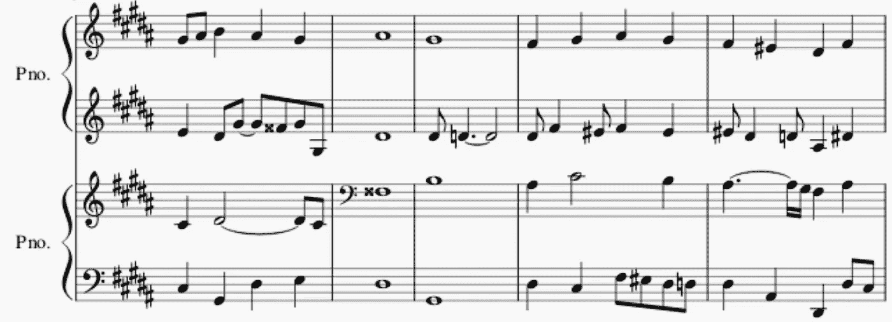
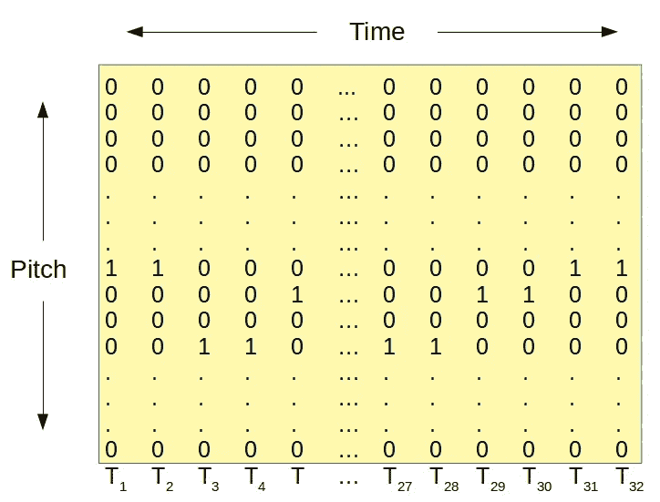
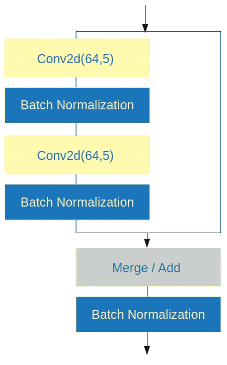
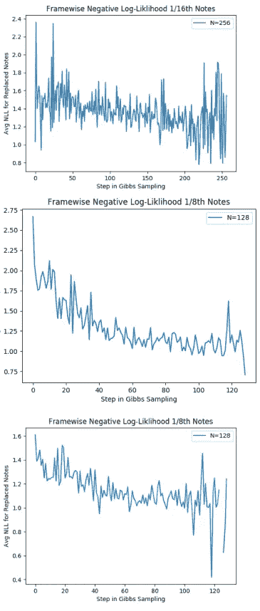

# 使用卷积神经网络生成和声

> 原文：<https://towardsdatascience.com/using-convolutional-neural-networks-to-generate-harmony-1a1cdfd7ec56?source=collection_archive---------19----------------------->

## 探讨了主观质量的数据表示和时间分辨率以及生成笔记的负对数似然性。

使用神经网络(NN)生成音乐已经在数据科学方面讨论过几次，但通常是在使用递归神经网络(RNNs)和一些卷积神经网络(CNN)生成序列的背景下。这篇文章是关于一种使用卷积来产生和声的方法，这种方法可以用四种乐器在任何给定的时间产生一个音高。

Transposition of BWV 364 using Music21, Image by MuseScore

使用卷积神经网络的主要优势是，像图像识别一样，音乐在时间(主题/主题)和音高(变调)下是不变的。因此，当数据被组织为表示时间和音高的矩阵时，卷积是寻找音乐中的模式(如和弦进行或节奏)的理想操作。具体来说，对于这个项目，时间被组织成离散的时间，其基础是以特定频率对给定乐器(声音)的音高进行采样。正如我们很快会看到的，频率的选择对模型的表现有影响。

这个项目最终确定了八分音符离散时间尺度和 128 个半音音高矢量。midi 文件功能。对于数据集来说，163 首巴赫合唱曲是基于对有四个声部和 4:4 拍号的合唱曲的[音乐 21](https://web.mit.edu/music21/) 语料库的分析而选择的。这种数据表示和模型架构首先由[谷歌人工智能团队](https://magenta.tensorflow.org/coconet)完成，他们还发表了一篇关于他们技术的[有趣论文](https://arxiv.org/abs/1903.07227)。这个项目使用了许多这样的技术，但是是用 Keras 和 Music21 实现的。

使用 CNN 的基本思想是为不同的模式(节奏、和弦等)使用几个过滤器。)来生成每个离散时间步长的所有可能音高的概率分布。通过从未知音符重复采样并生成新的概率分布，可以从无输入或部分输入中生成一段音乐。

# 数据准备

Music21 的语料库处理 musicXML 格式的音乐文件，因此需要构建一个助手类，以便将这些文件转换成表示钢琴卷首的 numpy 数组(在 github 存储库中的 utils.py 中可以找到)。我建立的另一个方法是通过从音高(半音阶有 12 个音符)中增加或减去音程[1，11]上的一个数字，将钢琴卷转置为随机键。这样，通过从巴赫合唱曲之一中随机选择 4 个小节，并将其转换为随机键，就可以生成一批输入。

Piano Roll for a Single Voice as Input

然后，四个钢琴卷帘窗(女高音、女低音、男高音和男低音各一个)与四个遮罩矩阵堆叠在一起，这四个遮罩矩阵表示包含每个声部的已知音高的时间步长。然后，通过获取一批巴赫合唱曲并删除该批中每首作品的相同音符来训练该模型。然后，定制损失函数最小化擦除值的正确音高的负对数似然的总和(除以擦除音符的总数，以避免对具有更多擦除音符的批次或具有不同排序的批次进行更重的加权)。

在 Keras 中实现这一点需要使用自定义的生成器来批量生成输入，以及自定义的损失函数，这使得模型有点难以保存和加载。幸运的是，一旦一个模型被训练。json 和. h5 文件可以加载一个模型用于推理目的。

# 模型架构

该模型使用了 64 个卷积层和 128 个滤波器。他们最终能够使用扩张卷积来节省计算能力。因为我必须在没有大量 GPU 的单台计算机上训练这个模型，所以我使用的架构是 20 个卷积层和 64 个 5x5 过滤器。和原论文一样，每两层使用 BatchNormalization 和 [skip connections](/understanding-and-coding-a-resnet-in-keras-446d7ff84d33) 。对于卷积层，ReLU 激活与填充一起使用，以在时间和音高方面保持输入的原始大小。

Iterated Model Architecture

最后一层是卷积层，输出四个通道并使用 softmax 激活。这样，输出可以被训练成四个声部，其概率分布在每个时间步长的 128 个音高上。然后，通过对与输入中被擦除音符的实际音符相对应的概率的负对数求和来计算损失。

# 使用吉布斯采样生成音乐

一些论文研究了音乐生成的不同采样和重采样方法。Bach2Bach 的架构使用伪吉布斯采样程序来重写部分生成的乐谱。Coconet 的论文研究了不同的技术，发现创建最佳生成音乐样本的技术是使用退火概率从被擦除或未知的音符中采样。这个退火概率的公式很容易理解，它是:α_n = max(α_min，n(α_ max-α_ min)/BN，其中α值表示输入中被擦除的音符在下一次采样迭代中被擦除的概率。b 表示采样应在α_min 以上发生的步数，N 是总步数，通常设置为声部数(4)乘以时间步数(32)。

吉布斯采样的工作方式以及它如此有效的原因与概率分布收敛于一段连贯的音乐有关。如果我们将大部分被擦除的乐谱(或随机噪声)输入到模型中，概率分布通常会分布在几个音高上，因为每个音高取决于它之前和之后的内容，以及其他声部中发生的事情。实际上，我们试图在没有足够的其他变量背景的情况下建立一个联合概率分布模型。

因此，我们从概率分布中采样，以获得每个未知时间步长的音高，然后以概率α_n 再次擦除所有这些音高。这样，在吉布斯采样开始时发生的块采样使音乐不会简单地停留在同一音符上。随着过程的进行，越来越少的音符被重新采样，这使得被擦除音符的概率分布收敛于音乐上连贯的音高。

# 时间分辨率的影响:

使用负对数似然的度量，可以看出较高的时间分辨率有利于音乐质量。例如，为了训练网络，当使用十六分音符分辨率时，最小损失函数是 0.168，或者相对于被擦除的音符大约 85%的平均概率。四分之一音符分辨率的最佳损失函数是 0.487，平均概率约为 61%。然而，十六分音符分辨率可以通过在其自身声音中高度加权当前时间步长之前和之后的音高来获得更好的成功，因为在十六分音符分辨率中，四分音符代表四个时间步长。一个更好的度量是看吉布斯抽样程序是否减少了平均负对数似然。

TOP: 1/16th resolution, melody input. MID: 1/8th resolution, melody input. BOT: 1/8th resolution, random input.

对于经过训练的模型，1/16 音符分辨率似乎是过拟合的，因为它在训练数据上表现得非常好，并且可以在那里实现低 NLL，但是 NLL 在 Gibbs 采样过程中不收敛。最佳行为表现在八分音符分辨率，其中一段旋律被输入到模型中，而其他声音未知。

# GitHub 和参考资料

该项目的代码库和音乐样本可以在下面的 [GitHub 库](https://github.com/Kickflip89/Convolution-Music-AI)中找到。

参考资料:

[1]库斯伯特和阿里萨。music21:计算机辅助音乐学和符号音乐数据工具包。2010.在*国际音乐信息检索学会的会议录中。*

[2] G .哈杰雷斯、f .帕切特和 f .尼尔森。DeepBach:巴赫合唱曲生成的可操纵模型。2010.在*第 34 届机器学习国际会议论文集。*

[3] C .黄，t .库伊曼斯，a .罗伯茨，等艾尔。卷积对位法。2017.第 18 届国际音乐信息检索学会会议论文集。