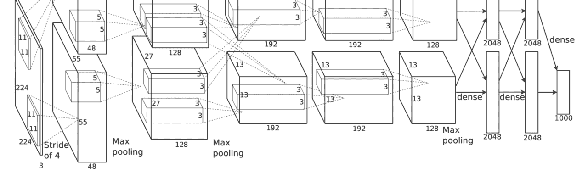
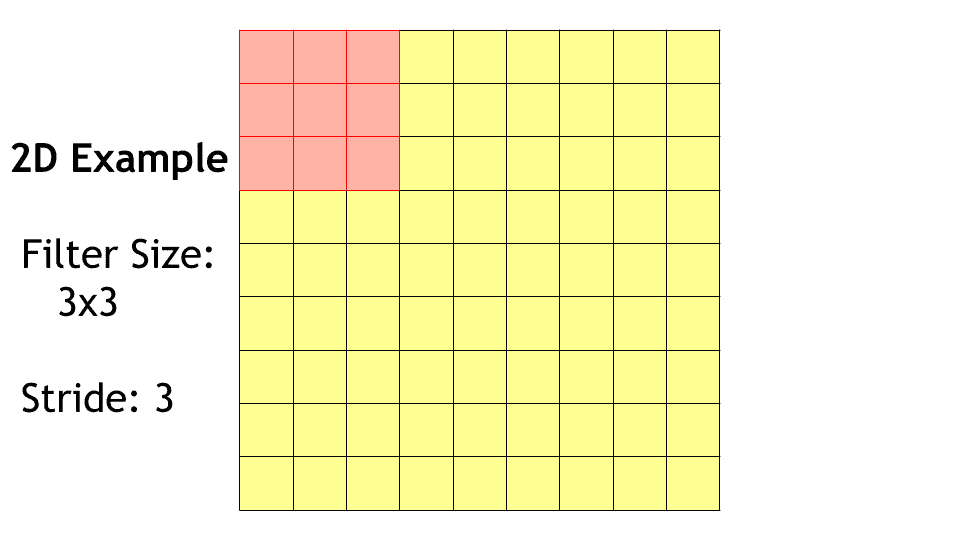
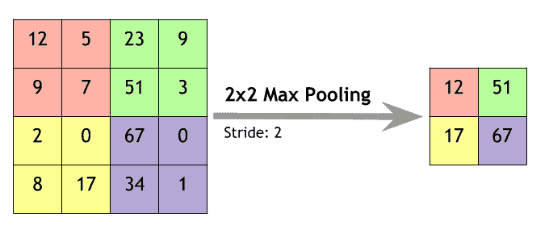
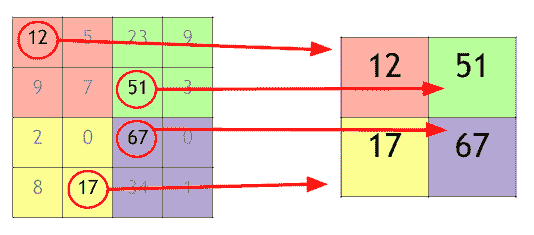
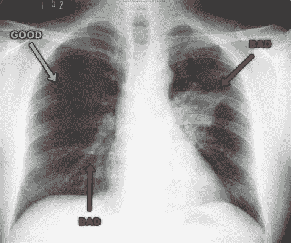
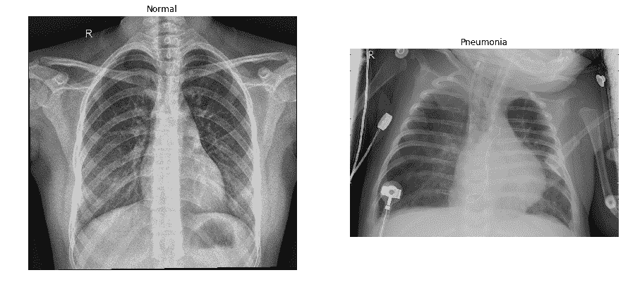
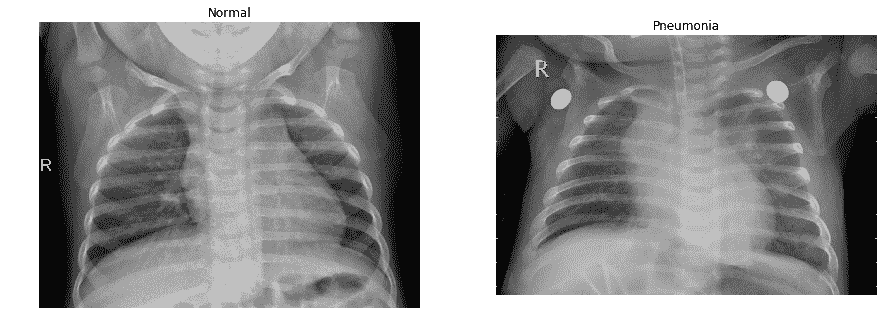
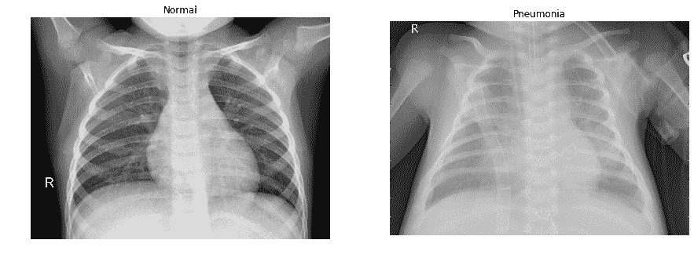
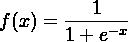
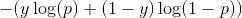

# 使用卷积神经网络预测肺炎

> 原文：<https://towardsdatascience.com/using-convolutional-neural-networks-to-predict-pneumonia-550b773cacff?source=collection_archive---------26----------------------->

## 细胞神经网络及其应用简介。

这篇博客文章将从卷积神经网络的简要介绍和概述开始，然后过渡到应用这一新知识，通过 x 射线图像预测肺炎，准确率超过 92%。虽然这样的精度没有什么好兴奋的，但对于这样一个简单的卷积神经网络来说，这是一个值得尊敬的结果。

当需要显示代码示例时，代码将首先显示，然后在每个代码示例下面会有一个关于代码的解释。

**数据集** : [肺炎 x 光数据集](https://data.mendeley.com/datasets/rscbjbr9sj/2)

# 中枢神经系统和视觉皮层的简史

卷积神经网络(CNN)或 ConvNets 是通常用于图像和音频识别和分类的神经网络。CNN 来源于动物大脑的视觉皮层。研究表明，猴子和猫的视觉皮层有神经元对视野的小子域做出反应。每个神经元负责视野的一小部分，称为感受野。视觉皮层中的所有神经元将一起覆盖整个视觉空间 [(Hubel，1968)](https://www.ncbi.nlm.nih.gov/pmc/articles/PMC1557912/pdf/jphysiol01104-0228.pdf) 。

人类大脑的视觉皮层是由具有相似功能的多列神经元组成的。这些神经元列的阵列构成了所谓的模块[(神经科学挑战，2016)](https://www.neuroscientificallychallenged.com/blog/know-your-brain-primary-visual-cortex) 。每个模块只能够对视野的一小部分做出反应，因此，视觉皮层由许多这些模块组成，以覆盖整个区域。虽然这并不完全是我们的卷积神经网络的功能，但它与动物的视觉皮层有明显的相似之处。

# CNN 简介

像所有常见的神经网络一样，CNN 拥有可调权重和偏差的神经元。正常的神经网络是完全连接的，这意味着每个神经元都连接到上一层的每个神经元。CNN 并不像普通的神经网络那样完全连接，因为它的计算量太大，而且根本不需要达到预期的效果。当处理具有大输入大小的图像数据时，使用完全连接的神经网络不是非常有效。

为了想象大量的参数，想想我们的胸部 x 光图像。这些图像的输入形状为 64x64x3，或 64 宽，64 高，有 3 个颜色通道。如果使用完全连接的神经网络，这将意味着单个隐藏层中的单个神经元将由 12，288 个连接组成(64 x 64 x 3 = 12，288) [(CS231n，2018)](http://cs231n.github.io/convolutional-networks/) 。这是只有一个完全连接的神经元。想象一下在一个有许多神经元的神经网络中所有权重的数量！很容易理解为什么完全连接的神经网络不是分类图像的最有效的方法。这就是 CNN 派上用场的地方，除了 CNN 的架构实际上包括一些完全连接的层。

# CNN 架构简介



像所有的神经网络一样，CNN 有一个输入和输出层，有许多隐藏层，它们将应用一个激活函数，通常是 ReLu。一个 CNN 设计将包括三个主要层:卷积层、池层和全连接层。下面将介绍每一层:

# 卷积层

卷积层负责从输入数据中寻找和提取特征。卷积层使用过滤器，也称为内核，用于这一特征提取过程。由于 CNN 没有完全连接，神经元只连接到输入空间的预定子区域。这个区域的大小被称为过滤器的大小，或感受领域。神经元的感受野就是它接收输入的空间。

对于本例，我们将使用大小为 3x3 的过滤器。我们只设置感受野的宽度和高度，因为过滤器的深度必须与输入的深度相同，并且是自动设置的。在我们的例子中，我们的输入有 3 个颜色通道。因此，输入的深度是 3。这意味着这个卷积层中的每个神经元将有 27 个权重(3x3x3 = 27)。

卷积层通过在输入空间滑动这些滤波器来卷积输入，同时计算权重和输入的点积。过滤器内的像素将被转换成代表整个感受野的单一值。



# 汇集层

汇集层，也称为下采样层，通常位于神经网络的卷积层之后。汇集层的作用是减少输入的空间维度。这将导致参数数量的减少，也将有助于我们的模型泛化，避免过度拟合。这篇博文将使用最常用的池层类型 **max pooling** 。还有其他版本的池层，如平均池，但这篇文章的重点是最大池。

**Max Pooling:** 卷积层会在输入的某个区域中找到一个特定的特征，并为其分配一个较高的激活值。然后，池图层将缩小该区域并创建一个新的制图表达。最大池层通过使用每个子区域中的最大值来创建原始区域的抽象。

最大池将覆盖每个子区域，应用最大过滤器，从每个子区域提取最高值，并创建一个维度减少的抽象。

下面的例子显示了一个 4x4 矩阵作为我们的输入。我们将使用 2x2 滤波器来扫描输入矩阵，我们还将使用步长 2。2x2 池大小或过滤器将决定我们缩小空间维度的数量。对于 2x2 的池大小，我们每次将缩小一半。扫描输入矩阵时，步幅将决定移动的步数。例如，步长为 2 时，我们将从红色的 2x2 到绿色的 2x2 扫描输入矩阵，依此类推。被扫描的区域每次将移动两个街区。



# 全连接层

像正常的神经网络一样，CNN 的全连接层中的每个神经元都连接到前一层中的每个神经元。完全连接的层负责在特征提取后对数据进行分类。全连接层将查看由卷积层或池层创建的高级功能的激活图，然后确定哪些功能与每个类相关联。

对于我们的数据集，我们有两类:肺炎和正常。完全连接的图层将查看先前图层找到的要素，然后确定哪些要素最有助于预测图像所属的类别。

# 肺炎简介

仅在美国，每年就有大约一百万人会因肺炎而去医院就诊。在这 100 万人中，每年约有 5 万人死于肺炎 [(CDC，2017)](https://www.cdc.gov/pneumonia/prevention.html?CDC_AA_refVal=https%3A%2F%2Fwww.cdc.gov%2Ffeatures%2Fpneumonia%2Findex.html) 。

肺炎是一种传染性炎症疾病，影响所有年龄段人群的肺部，通常由病毒或细菌感染引起。肺炎会影响肺部的一侧或两侧，并导致肺泡(气囊)充满液体、细菌、微生物和脓液 [(NIH，2018)](https://a-i-dan.github.io/(https://www.nhlbi.nih.gov/health-topics/pneumonia)) 。

肺炎有多种诊断方法，一种常见的确诊方法是通过胸部 x 光检查。胸部 x 光是确定一个人是否患有肺炎的最好的测试，也是最准确的。虽然检测肺炎至关重要，但有时可能是一项艰巨的任务。肺炎通常在 X 射线中模糊地显示出来，也可能与当地的其他疾病混合在一起。



[Image Source](https://proxy.duckduckgo.com/iu/?u=https%3A%2F%2Ftse4.mm.bing.net%2Fth%3Fid%3DOIP.mznEecI8B-fpfXm8fEQymAHaGN%26pid%3D15.1&f=1)

# 数据准备和分析

代码的第一部分将专门用于准备数据。这一部分更多的是关于模型的实际构建，而不是细节。我将这个*数据准备和分析*部分的所有代码，不包括视觉效果，放在一个名为 [pneumonia_dataset](https://a-i-dan.github.io/pneumonia_dataset.py) 的单独文件中，以便稍后导入到*应用 CNN 预测肺炎*部分。从这个文件导入数据集将在本节的开头解释。

```
import os
import numpy **as** np
import matplotlib.pyplot **as** plt
from glob import glob
from keras.preprocessing.image import ImageDataGenerator
```

前几行是导入准备和可视化数据所需的库。

```
path  **=** "./chest_xray"
dirs  **=** os**.**listdir(path)
**print**(dirs)
```

输出:

```
Output:

['.DS_Store', 'test', 'train', 'val']
```

这里我们设置了 chest_xray 文件夹的路径，以备后用。然后，我们从 chest_xray 文件夹中打印出目录。请注意，该文件夹分为三个子文件夹:测试、训练和 val 或验证。每个文件夹都包含我们将需要用于培训和测试的胸部 x 光图像。

```
train_folder **=** path **+** '/train/'
test_folder  **=** path **+** '/test/'
val_folder   **=** path **+** '/val/'

train_dirs **=** os**.**listdir(train_folder)
**print**(train_dirs)
```

输出:

```
Output:

['.DS_Store', 'PNEUMONIA', 'NORMAL']
```

接下来，我们将为每个文件夹设置路径。我们可以使用之前设置的“path”变量，并将其与每个子文件夹的名称连接起来。然后，我们将希望看到培训文件夹的内容。为了查看目录，我们将对培训文件夹使用`listdir()`功能，然后打印结果。

```
train_normal **=** train_folder **+** 'NORMAL/'
train_pneu   **=** train_folder **+** 'PNEUMONIA/'
```

然后，我们可以使用我们的培训文件夹，并设置每个类的路径。在这种情况下，我们有两个类别:正常的**图像和肺炎的**图像。如果我们想要可视化具体为“正常”或“肺炎”的图像，那么我们将创建一个包含这些图像的路径的变量，以供以后参考。

```
pneu_images   **=** glob(train_pneu **+** "*.jpeg")
normal_images **=** glob(train_normal **+** "*.jpeg")
```

现在，我们已经将培训文件夹分为“正常”和“肺炎”，我们可以从每个类中提取所有图像。这个数据集中的图像都是 jpeg 图像，所以对于每个路径，我们将在末尾添加`.jpeg`,以确保我们提取图像。

```
**def** **show_imgs**(num_of_imgs):

    **for** img **in** range(num_of_imgs):
        pneu_pic   **=** np**.**asarray(plt**.**imread(pneu_images[img]))
        normal_pic **=** np**.**asarray(plt**.**imread(normal_images[img]))

        fig **=** plt**.**figure(figsize**=** (15,10))

        normal_plot **=** fig**.**add_subplot(1,2,1)
        plt**.**imshow(normal_pic, cmap**=**'gray')
        normal_plot**.**set_title('Normal')
        plt**.**axis('off')

        pneu_plot **=** fig**.**add_subplot(1, 2, 2)
        plt**.**imshow(pneu_pic, cmap**=**'gray')
        pneu_plot**.**set_title('Pneumonia')
        plt**.**axis('off')

        plt**.**show()
```

我们将创建一个名为`show_imgs()`的函数来可视化我们训练集中的胸部 X 射线图像。该函数将采用一个参数来指定要显示多少幅图像(`num_of_imgs`)。然后，我们将使用一个范围为“num_of_imgs”的 for 循环来显示指定的图像数量。

我们将并排显示**正常**图像和**肺炎**图像，因此我们将添加两个子图:一个用于正常，一个用于肺炎。这些图像的颜色映射将是“灰色”。如果你想改变颜色图，去 Matplotlb 的[颜色图参考](https://matplotlib.org/examples/color/colormaps_reference.html)页面。

对于显示的每个图像，我们将通过设置每个子图的标题将其标记为“正常”或“肺炎”。

```
show_imgs(3)
```



我们可以这样使用我们的`show_imgs()`函数。我们将调用这个函数，并给它一个参数:我们希望显示的两个类的图像数量。

```
train_datagen **=** ImageDataGenerator(rescale            **=** 1**/**255,
                                   shear_range        **=** 0.2,
                                   zoom_range         **=** 0.2,
                                   horizontal_flip    **=** True,
                                   rotation_range     **=** 40,
                                   width_shift_range  **=** 0.2,
                                   height_shift_range **=** 0.2)
```

这被称为**图像预处理**，或**数据增强**。我们将使用 Keras 的`ImageDataGenerator()`类进行数据扩充。数据扩充有助于我们扩大训练数据集。训练数据越多，种类越多越好。随着更多的训练数据和轻微操纵的数据，过度拟合变得不那么成问题，因为我们的模型必须更一般化。

*   第一步是重新调整我们的数据。重新缩放图像是一种常见的做法，因为大多数图像的 RGB 值范围为 0–255。这些值对于大多数模型来说太高，无法处理，但是通过将这些值乘以 1/255，我们可以将每个 RGB 值压缩到 0–1 之间的值。这对于我们的模型来说更容易处理。
*   接下来我们有`shear_range`，它将随机应用剪切映射，或剪切变换到数据。数值“0.2”是[剪切](https://en.wikipedia.org/wiki/Shear_mapping)强度或剪切角度。
*   `zoom_range`也被设置为“0.2”。这是为了随机放大图像。
*   `horizontal_flip`设置为“真”,因为我们想随机翻转数据集中的一半图像。
*   `rotation_range`是图像可以随机旋转的度数。
*   `width_shift_range`和`height_shift_range`是随机平移图像的范围。

```
test_datagen **=** ImageDataGenerator(rescale **=** 1**/**255)
```

这是我们重新调整测试集的地方。测试集不需要应用于训练数据的所有相同变换。只有训练数据可以被操纵以避免过度拟合。测试集必须是原始图像，以便在真实的、经过最小程度处理的图像上准确预测肺炎。

```
training_set **=** train_datagen**.**flow_from_directory(train_folder,
                                   target_size**=** (64, 64),
                                   batch_size **=** 32,
                                   class_mode **=** 'binary')

val_set **=** test_datagen**.**flow_from_directory(val_folder,
                                   target_size**=**(64, 64),
                                   batch_size **=** 32,
                                   class_mode **=**'binary')

test_set **=** test_datagen**.**flow_from_directory(test_folder,
                                   target_size**=** (64, 64),
                                   batch_size **=** 32,
                                   class_mode **=** 'binary')
```

输出:

```
Found 5216 images belonging to 2 classes.
Found 16 images belonging to 2 classes.
Found 624 images belonging to 2 classes.
```

现在，我们将采用我们的测试、训练和验证文件夹的路径，并使用来自 Keras 的`flow_from_directory()`生成批量扩充数据。

*   第一个参数是要提取的目录。
*   第二个参数是目标尺寸，即调整大小后图像的尺寸。
*   第三个参数是“class_mode”，设置为“binary”。这将返回 1D 二进制标签。由于只有两个类，该数据集需要二进制分类。

现在我们已经准备好了数据，我们可以继续构建模型，训练它，然后测试它，并以准确度分数的形式获得我们的结果。

# 应用细胞神经网络预测肺炎

```
from keras.models import Sequential
from keras.layers import Conv2D, MaxPooling2D, Flatten, Dense, BatchNormalization, Dropout

import pneumonia_dataset
```

[Keras](https://keras.io) 是一个运行在 TensorFlow 之上的高级 python 神经网络库。Keras 能够快速有效地实现和实验深度学习和机器学习算法，同时仍然非常有效。Keras 将是我们这篇博文选择的深度学习库，因此我们将导入一些所需的层和模型，以使我们的卷积神经网络功能良好。

最后一个导入语句是我之前在*数据准备和分析*部分提到的[肺炎 _ 数据集](https://a-i-dan.github.io/pneumonia_dataset.py)文件。

```
training_set, test_set, val_set **=** pneumonia_dataset**.**load_data()
```

输出:

```
Training Set:
Found 5216 images belonging to 2 classes.

Validation Set:
Found 16 images belonging to 2 classes.

Test Set:
Found 624 images belonging to 2 classes.
```

pneumonia_dataset 文件将返回一个训练集、测试集和一个验证集，我们将对它们进行适当的命名。这将返回我们的数据如何在每个集合中分割的摘要，包括每个集合中的图像数量以及这些图像将适合多少个类别。

```
model **=** Sequential()

model**.**add(Conv2D(32, (3, 3), activation**=**'relu', input_shape**=**(64, 64, 3), padding**=**'same'))
model**.**add(MaxPooling2D(pool_size**=**(2, 2)))

model**.**add(Conv2D(32, (3, 3), activation**=**'relu', padding**=**'same'))
model**.**add(MaxPooling2D(pool_size**=**(2, 2)))

model**.**add(Conv2D(64, (3, 3), activation**=**'relu', padding**=**'same'))
model**.**add(MaxPooling2D(pool_size**=**(2, 2)))

model**.**add(Flatten())
model**.**add(Dense(128, activation **=** 'relu'))
model**.**add(Dropout(0.5))
model**.**add(Dense(1, activation **=** 'sigmoid'))
```

这是令人兴奋的部分。

*   首先，我们使用 Keras 的“顺序”模型创建我们的模型。这个模型是层的线性堆叠，这意味着我们将逐层创建我们的模型。
*   **第一个卷积层:**第一个卷积层是我们的输入层。
*   第一个参数是在层中使用的卷积滤波器的数量，设置为“32”。这也是这一层中神经元或节点的数量。
*   第二个参数是过滤器的大小，或感受野。想象一下，我们正在创建一个大小为(3，3)的窗口，或者宽度为 3，高度为 3，我们的卷积层被限制在任何给定的时间进行查看。
*   我们将设置的第三个参数是激活函数。我们的非线性激活函数是 ReLu，或校正线性单位。ReLu 功能是`*f(x) = max(0, x)*`。因此，所有负值都转换为零，而所有正值保持不变。ReLu 是最流行的激活函数之一，因为它减少了消失梯度问题，并且计算成本更低。这并不意味着 ReLu 函数是完美的，但是它将完成大多数应用程序的工作。
*   第四个参数是输入形状。这个参数**只需要在第一个卷积层**中指定。在第一层之后，我们的模型可以处理剩下的部分。输入形状只是将被馈送到 CNN 的图像的形状。我们的输入图像的形状将是(64，64，3)(宽度，高度，深度)。
*   最后一个参数是填充，设置为“same”。这将填充输入，使输出具有与初始输入相同的长度。
*   **第一个最大池层:**该模型的最大池层只有一个参数。
*   **第二卷积和最大池层:**第二卷积层和最大池层将与上面的前几层相同。第二卷积层将不需要指定输入大小。
*   **第三卷积层:**在第三卷积层，第一个参数会被改变。在前两个卷积层中，该层中的滤波器或神经元的数量被设置为“32”，但是对于第三层，它将被设置为“64”。除了这一点变化之外，其他一切都将保持不变。
*   **第三个最大池层:**第三个最大池层将与前两个最大池层相同。
*   **展平:**展平是将多维数据转换为全连接层的可用数据所必需的。为了让全连接层工作，我们需要将卷积层的输出转换为 1D 向量。我们的卷积层将使用 2D 数据(图像)。在将它送入分类器之前，必须将其整形或展平为一维。

```
_________________________________________________________________ Layer (type) Output Shape Param # ================================================================= max_pooling2d_16 (MaxPooling (None, 6, 6, 64) 0 _________________________________________________________________ flatten_5 (Flatten) (None, 2304) 0 _________________________________________________________________
```

*   **Dense — ReLu:** 密集层是完全连接的层，意味着每个神经元都连接到前几层的所有神经元。我们将使用 128 个节点。这也意味着完全连接的层的输出大小为 128。对于这个完全连接的层，将使用 ReLu 激活功能。
*   **Dropout:** Dropout 用于正则化我们的模型并减少过度拟合。丢弃将暂时“丢弃”完全连接的层中的随机节点。节点的这种丢失将导致由未被丢失的节点组成的变薄的神经网络。由于没有特定的节点是 100%可靠的，因此丢弃减少了过度拟合，并有助于模型一般化。“. 5”表示某个节点被丢弃的概率为 50%。要阅读更多关于辍学的内容，请查阅本文。
*   **Dense — Sigmoid:** 我们最终的全连接层将使用 **sigmoid 函数**。我们的问题包括两类:肺炎和正常。这是一个二元分类问题，其中 sigmoid 可用于返回介于 0 和 1 之间的概率。如果这是一个多类分类，乙状结肠激活功能将不会是选择的武器。然而，对于这个简单的模型，sigmoid 函数工作得很好。sigmoid 函数可以定义为:



```
model**.**compile(optimizer**=**'adam', loss**=**'binary_crossentropy', metrics**=**['accuracy'])
```

我们现在可以使用 Keras 中的 compile 方法来配置模型。

*   第一个参数是优化器，它将被设置为“adam”。亚当优化器是目前深度学习中最流行的算法之一。《Adam:一种随机优化的方法》的作者表示，Adam 结合了另外两种流行的优化器的优点:RMSProp 和 AdaGrad。你可以在 Adam 论文的第 6.3 节中读到关于 CNN 的 Adam 的有效性。
*   第二个参数是损失函数。这个模型将使用**二元交叉熵**损失函数。我们的模型将进行二元分类，因此我们可以将此损失函数写成如下所示，其中“y”为 0 或 1，表示类别标签是否是正确的分类，其中“p”是模型的预测概率:



*   最后一个参数是度量函数，它将判断模型的性能。在这种情况下，我们希望返回精度。

```
model_train **=** model**.**fit_generator(training_set,
                         steps_per_epoch **=** 200,
                         epochs **=** 5,
                         validation_data **=** val_set,
                         validation_steps **=** 100)
```

输出:

```
Epoch 1/5
200/200 [==============================] - 139s 697ms/step - loss: 0.2614 - acc: 0.8877 - val_loss: 0.5523 - val_acc: 0.8125
Epoch 2/5
200/200 [==============================] - 124s 618ms/step - loss: 0.2703 - acc: 0.8811 - val_loss: 0.5808 - val_acc: 0.8125
Epoch 3/5
200/200 [==============================] - 124s 618ms/step - loss: 0.2448 - acc: 0.8984 - val_loss: 0.7902 - val_acc: 0.8125
Epoch 4/5
200/200 [==============================] - 121s 607ms/step - loss: 0.2444 - acc: 0.8955 - val_loss: 0.8172 - val_acc: 0.7500
Epoch 5/5
200/200 [==============================] - 119s 597ms/step - loss: 0.2177 - acc: 0.9092 - val_loss: 0.8556 - val_acc: 0.6250
```

现在是训练模型的时候了！这将使用 Keras 的`fit_generator()`方法来完成。这将根据从训练集生成的批数据来训练模型。

*   第一个参数是每个时期的步数。这将被设置为 200。每个时期的步骤将告诉模型在结束特定时期之前从发生器产生的样本批次的总数。
*   第二个参数是历元的数量，或训练迭代。Keras 文档指出，一个历元被定义为对所提供的全部数据的迭代，如 steps_per_epoch 所定义的。
*   第三个参数是模型将使用的验证数据。该模型不会根据验证数据进行训练，但这将有助于测量每个时期结束时的损失。
*   最后一个论点是验证步骤。我们的验证数据来自一个生成器(见上面的代码)，所以必须设置从生成器生成的样本批次数，类似于每个时期的步骤数。

```
test_accuracy **=** model**.**evaluate_generator(test_set,steps**=**624)

**print**('Testing Accuracy: {:.2f}%'**.**format(test_accuracy[1] ***** 100))
```

输出:

```
Testing Accuracy: 90.22%
```

既然已经对模型进行了训练，那么是时候根据测试数据来评估模型的准确性了。这将通过使用 Keras 的`evaluate_generator()`方法来完成。该评估将返回测试集丢失和准确性结果。

*   与拟合生成器一样，评估生成器的第一个参数是从中提取样本的文件夹。因为我们正在测试模型的准确性，所以将使用测试集。
*   第二个参数是在完成之前从生成器中提取的样本批次数。

然后，我们可以打印精度，并将其缩短为仅显示两位小数。精确度将作为 0-1 之间的值返回，因此我们将它乘以 100 以获得百分比。

之后，模型就完成了！我们已经在从胸部 x 光图像预测肺炎方面取得了一些成功！

# 所有东西放在一起(20 个时代)

```
Output:

Found 5216 images belonging to 2 classes.
Found 16 images belonging to 2 classes.
Found 624 images belonging to 2 classes.
Epoch 1/20
200/200 [==============================] - 142s 708ms/step - loss: 0.5141 - acc: 0.7369 - val_loss: 0.6429 - val_acc: 0.6250
Epoch 2/20
200/200 [==============================] - 137s 683ms/step - loss: 0.4034 - acc: 0.8058 - val_loss: 0.6182 - val_acc: 0.7500
Epoch 3/20
200/200 [==============================] - 134s 670ms/step - loss: 0.3334 - acc: 0.8483 - val_loss: 0.6855 - val_acc: 0.6875
Epoch 4/20
200/200 [==============================] - 129s 644ms/step - loss: 0.3337 - acc: 0.8516 - val_loss: 0.8377 - val_acc: 0.6875
Epoch 5/20
200/200 [==============================] - 139s 696ms/step - loss: 0.3012 - acc: 0.8672 - val_loss: 0.6252 - val_acc: 0.8750
Epoch 6/20
200/200 [==============================] - 132s 662ms/step - loss: 0.2719 - acc: 0.8808 - val_loss: 0.6599 - val_acc: 0.6875
Epoch 7/20
200/200 [==============================] - 125s 627ms/step - loss: 0.2503 - acc: 0.8969 - val_loss: 0.6470 - val_acc: 0.7500
Epoch 8/20
200/200 [==============================] - 128s 638ms/step - loss: 0.2347 - acc: 0.9016 - val_loss: 0.8703 - val_acc: 0.6875
Epoch 9/20
200/200 [==============================] - 131s 656ms/step - loss: 0.2337 - acc: 0.9075 - val_loss: 0.6313 - val_acc: 0.6875
Epoch 10/20
200/200 [==============================] - 124s 619ms/step - loss: 0.2159 - acc: 0.9133 - val_loss: 0.7781 - val_acc: 0.7500
Epoch 11/20
200/200 [==============================] - 129s 647ms/step - loss: 0.1962 - acc: 0.9228 - val_loss: 0.6118 - val_acc: 0.8125
Epoch 12/20
200/200 [==============================] - 127s 634ms/step - loss: 0.1826 - acc: 0.9306 - val_loss: 0.5831 - val_acc: 0.8125
Epoch 13/20
200/200 [==============================] - 128s 638ms/step - loss: 0.2071 - acc: 0.9178 - val_loss: 0.4661 - val_acc: 0.8125
Epoch 14/20
200/200 [==============================] - 124s 619ms/step - loss: 0.1902 - acc: 0.9234 - val_loss: 0.6944 - val_acc: 0.7500
Epoch 15/20
200/200 [==============================] - 128s 638ms/step - loss: 0.1763 - acc: 0.9281 - val_loss: 0.6350 - val_acc: 0.6875
Epoch 16/20
200/200 [==============================] - 139s 696ms/step - loss: 0.1727 - acc: 0.9337 - val_loss: 0.4813 - val_acc: 0.8750
Epoch 17/20
200/200 [==============================] - 145s 724ms/step - loss: 0.1689 - acc: 0.9334 - val_loss: 0.3188 - val_acc: 0.7500
Epoch 18/20
200/200 [==============================] - 133s 664ms/step - loss: 0.1650 - acc: 0.9366 - val_loss: 0.4164 - val_acc: 0.8750
Epoch 19/20
200/200 [==============================] - 132s 661ms/step - loss: 0.1755 - acc: 0.9316 - val_loss: 0.5974 - val_acc: 0.8125
Epoch 20/20
200/200 [==============================] - 132s 662ms/step - loss: 0.1616 - acc: 0.9395 - val_loss: 0.4295 - val_acc: 0.8750
Testing Accuracy: 92.13%
```

# 结论

卷积神经网络在测试集上取得了 92.13%的准确率。你可以自己决定这是否应该被称为“成功”。对于一个简单的模型，我认为这是非常合理的。