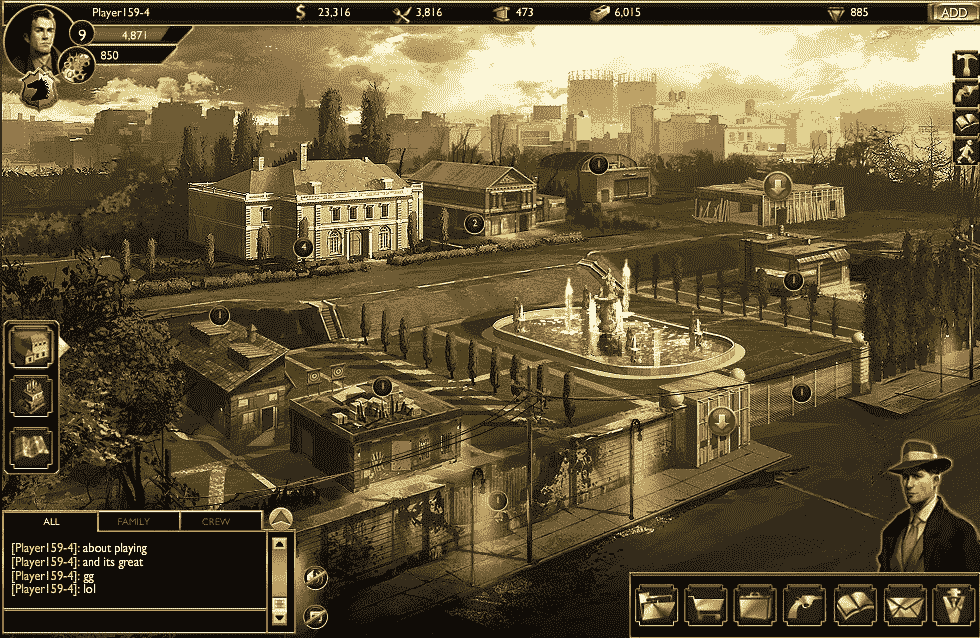
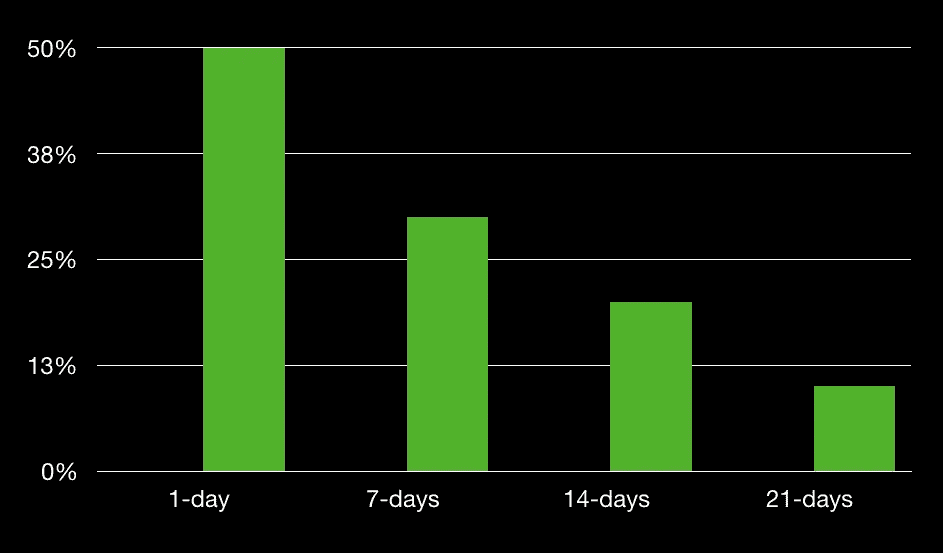

# 使用数据科学进行行为游戏设计

> 原文：<https://towardsdatascience.com/using-data-science-for-game-design-bcb7a00ad40b?source=collection_archive---------37----------------------->

## 这是一个关于数据科学专业知识和对人类心理学的理解如何帮助我获得有趣的见解来设计更好的游戏的故事。

Screenshot of a game. ([https://www.flickr.com/photos/bagogames/31959169544](https://www.flickr.com/photos/bagogames/31959169544))

# 背景

上周，作为谷歌初创公司的导师，我有机会与来自中东欧的 10 家游戏工作室合作。这些初创公司拥有 200 万到 1000 万活跃用户，每月经常性收入在 15 万到 20 万之间，团队规模在 10 到 80 人之间。尽管它们在收入和用户群方面有所不同，但它们都面临着同样的挑战:

1.  **留存率低**:在大多数情况下，95%的用户在 21 天后离开。在一个游戏中，保留时间为 1 天— 50%，7 天— 30%，14 天— 20%，21 天— 10%(见图 1)。

Figure #1: Retention of users in one of the games.

**2。应用内货币化水平低**:付费用户数量很低，行业标准是 3%左右，而游戏只有 0.15%到 1%。他们的大部分收入来自广告。

**3。无病毒效应:**几乎没有病毒效应，所有新用户都是通过付费渠道获取的。

# 出了什么问题？

当问到“你真的知道谁是你的用户吗？”，没有一家创业公司自信地说是。游戏工作室有一些想法，但他们不确定用户的动机和用户是如何细分的。

为什么这样他们有大量数据，但没有进行适当的数据分析。例如，他们不分析数据，因此他们可以看到用户行为的模式，这可以帮助他们获得关于用户的有意义的见解，将用户分组，在他们离开之前找到行为模式，等等。

# 这些创业公司如何提高用户留存率？

我们做某件事总是有理由的——包括玩游戏。关键在于理解心理学玩家如何反应，他们的潜在动机是什么。

## 第一步:是什么促使人们玩你的游戏？

数据无法完全回答这个问题。人们可以看到用户的某些行为模式，并使用试探法或常识来得出结论。例如，两个常见的动机是

*   感觉像个胜利者
*   消磨时间

太好了！所以这创造了两个用户群。下一步是绘制他们在游戏中的旅程，并与动机联系起来。

## **第二步:为每个细分市场绘制用户旅程图**

每个用户群在游戏中都遵循一条特定的路径，主要是由他们的动机驱动的。通过数据分析，人们可以发现给定的用户群遵循什么样的路径。比如说，在一个游戏中，我们发现那些以获胜为主要动机的人，大体上遵循以下路径

*   跳过教程—开始游戏—赢得—获得免费积分—赢得—进入下一层— …

## **第三步:描绘动机**

尝试将动机与用户旅程联系起来。最有可能的是，在游戏过程中动机会改变，这会导致用户改变行为。例如，在一个游戏中，开发人员发现那些主要动机是想赢的用户在连续输了 3-4 场后最终离开了。看起来用户觉得他们不能再赢了，变得沮丧并离开。

## **第四步:创建一个激励结构来保持最初的动机**

我们如何让他们回到理想的旅程，或者保持用户开始游戏的动机？对于上面提到的情况，其中一个人由于沮丧而离开，如果用户面临多次失败，游戏可以让她赢——这将增加他们留在游戏中的动机。

所有上述步骤都非常直观和简单，但令我惊讶的是，没有一个游戏工作室遵循上述步骤。

# **但是如何增加应用内购买呢？**

当用户看到无法免费获得的价值时，他们愿意付费。**在游戏中，当有人想要打破“游戏规则”或者获得新的体验时，最适合开口要钱。**让我们用一个简单的例子来说明——假设规则是“每个人都必须通过教程来获得一些积分”。如果有人想跳过教程(因为缺乏耐心)，开发者可以让用户购买通过完成教程获得的积分，允许他们继续游戏并跳过教程。

为了帮助游戏赚钱，找到那些用户(或部分用户)愿意打破规则的地方。

如何处理那些以消磨时间为主要动机的用户？要求他们“打破规则”进入下一个阶段并不会真正有所帮助。这些用户可能喜欢帮助他们改善体验的东西，比如定制背景，这是他们很可能愿意花钱购买的东西。

# 创造一种病毒效应怎么样？

这里的规则也是一样的，一旦我们知道了动机，我们就可以要求他们做一些事情，比如在适当的时候邀请朋友。例如，如果我们知道用户很高兴，并给出了积极的评价，那么我们可以要求他们在这一点上邀请其他朋友，并创建一个激励结构(给予免费积分或只是做好事的内在动机)。

# 结论

我上面解释的是数据科学如何结合对人类心理学的一些理解来帮助游戏工作室解决保留、支付和病毒式传播问题的一个例子。

> 基于玩家行为，针对每个细分市场，绘制动机地图。然后创建一个激励结构来保持动机，并为他们提供类似支付或邀请朋友来实现目标的行动，这使他们玩游戏。

我还要补充一点，有些试图建立这样一个基于用户地理位置的行为模型，假设是某些地区/国家的人以某种方式行为。这可能是真的，但请记住，你的用户可能不会反映该国人民的平均行为。例如，有富裕的印度人，也有贫穷的印度人。富有的印度人的行为可能与欧洲人相似，完全有可能你所有的游戏用户都属于富有的印度人。

我希望你喜欢这篇文章。随意分享，喜欢。