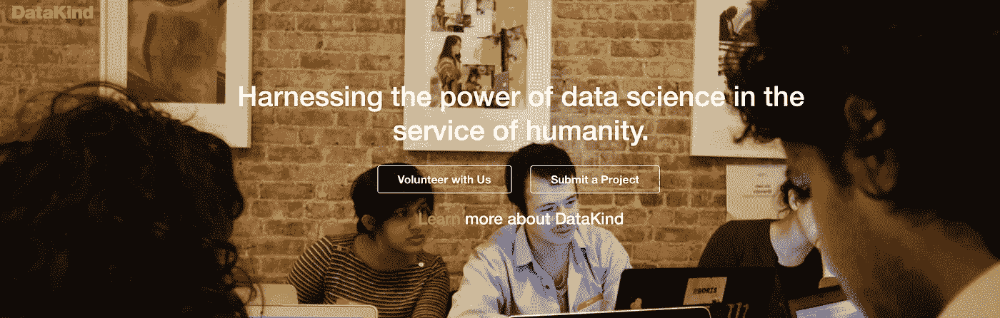
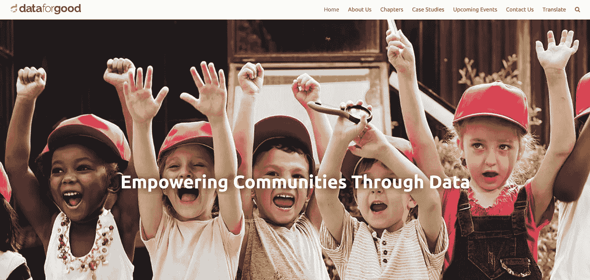
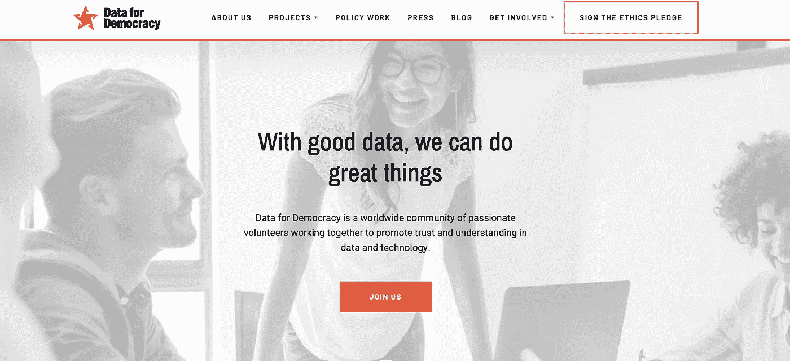
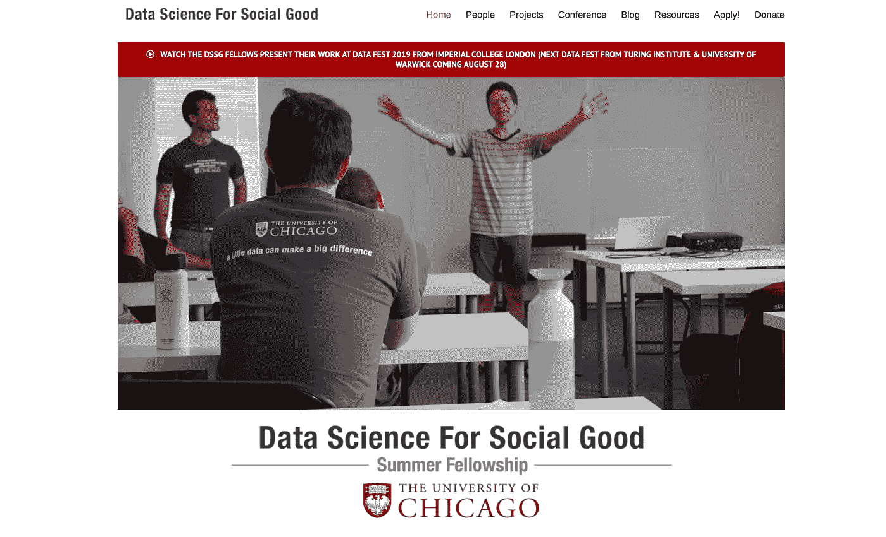
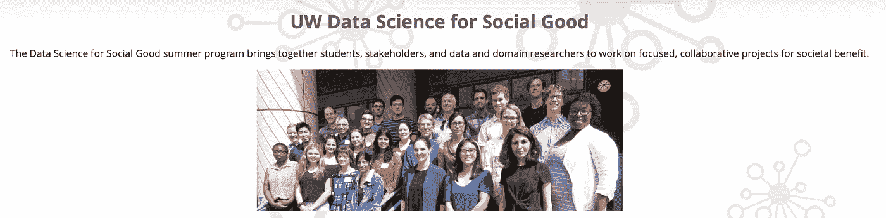
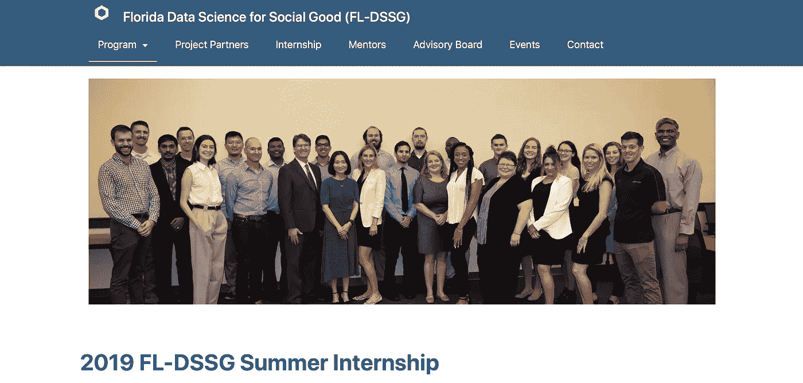
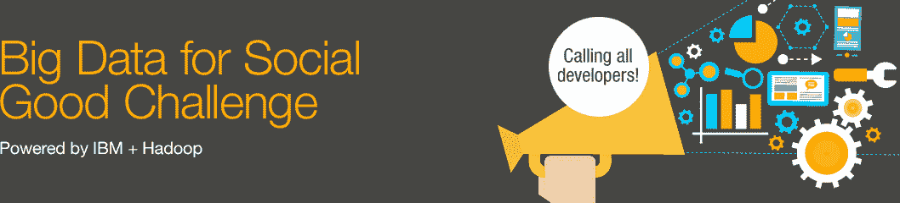
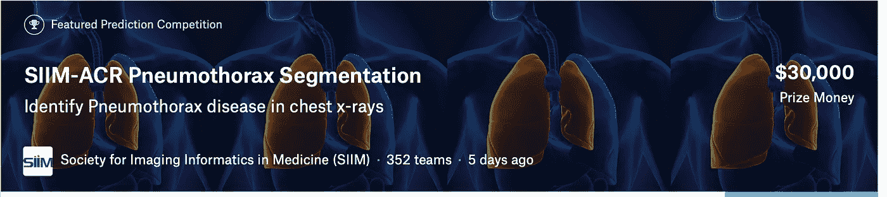
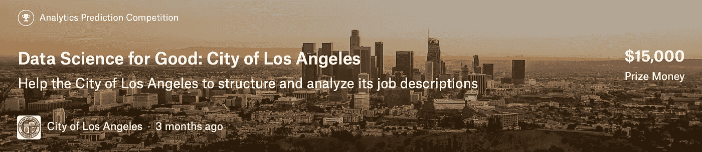
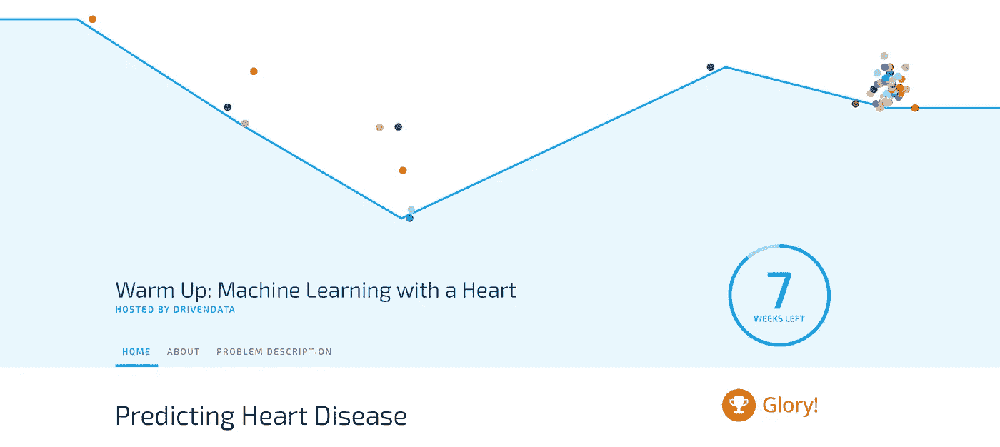

# 利用数据科学改善社会

> 原文：<https://towardsdatascience.com/using-data-science-for-societys-betterment-783163e40a3b?source=collection_archive---------36----------------------->

## Tech4Good 是技术界的一种趋势。数据科学是这场精彩比赛的领跑者。

越来越多的企业家和学者正在开发技术来解决社会问题，识别和治疗疾病，弥合经济差距，并倡导变革。Tech4good 和 DataScience4Good 是越来越多地被采用的运动。

Photo by [Clark Tibbs](https://unsplash.com/@clarktibbs?utm_source=medium&utm_medium=referral) on [Unsplash](https://unsplash.com?utm_source=medium&utm_medium=referral)

技术总是遵循**什么**和**如何的叙述。**技术开始回答**为什么的时候到了！**

每个领域现在都有它的“数据尤里卡时刻”，给使命驱动的组织全新的机会来利用数据。从解决贫困到改善医疗保健到教育民主化，数据科学有可能使天平向弱势群体和穷人倾斜。

许多组织正在迅速利用数据科学做好事。让我们来看看，并从中获得灵感。

## [1。数据种类](https://www.datakind.org)

DataKind 将高影响力组织与领先的数据科学家聚集在一起，使用数据科学为人类服务。

Data Kind Home Page

从一小时的活动到长达一年的活动，他们设计了一些项目，让数据科学家和社会变革者能够共同应对严峻的人道主义挑战。它还向数据科学家介绍了“数据换利益”运动，并向他们展示了他们的技能有多么有价值。

他们执行的项目类型

*   [及早识别食物银行依赖性](https://www.datakind.org/projects/identifying-food-bank-dependency-early)
*   [用数据解决无家可归问题](https://www.datakind.org/projects/using-data-to-create-paths-out-of-homelessness)
*   [给予农村妇女发言权](https://www.datakind.org/projects/giving-a-voice-to-rural-women-through-mobile-surveys)

> 我们一丝不苟地专注于将各种形式的数据科学带给那些与我们共享可持续地球愿景的人，在这个星球上，我们都可以获得我们的基本人类需求。我们设想这样一个世界，解决这些问题的组织可以像华尔街和硅谷一样访问数据科学资源。
> 
> —杰克·波威，DataKind 创始人兼执行董事

## [2。良好数据](https://dataforgood.ca)

“数据为善”是加拿大的一个行善者的集体，他们想用他们的力量为善，而不是为恶，通过数据来帮助社区变得更好。

Data For Good Homepage

他们是一个加拿大非营利组织，在全国各地都有分会，帮助其他非营利和非政府组织，利用他们的数据做出更明智和更好的决定，以促进他们社区的繁荣。

他们通过自己的数据技能帮助了以下事业。

*   [加拿大儿童癌症](https://dataforgood.ca/case-studies/case-study-childhood-cancer-canada/)
*   [预防用药过量](https://dataforgood.ca/case-studies/case-study-overdose-prevention-society/)
*   [劳工权利和可维持生活的工资](https://dataforgood.ca/case-studies/case-study-retail-action-network/)

## [3。民主数据](https://www.datafordemocracy.org)

Data for Democracy 是一个由热情的志愿者组成的全球社区，致力于促进数据和技术领域的信任和理解。它最初是一个小型的基层团队，共同的目标是利用数据推动积极的变革，但很快发展成为一个拥有 4000 多名员工(人数还在增加)的全球性组织。

以下是他们做的一些项目—

*   [了解药物研发的资金是如何和从哪里支出的](https://www.datafordemocracy.org/project/drug-spending)
*   [建设更安全的道路](https://www.datafordemocracy.org/project/insight-lane-the-d4d-crash-model)
*   [识别仇恨言论](https://www.datafordemocracy.org/project/hate-speech)

## 4.暑期项目

许多大学与社会组织合作，提供暑期项目来实施数据科学 4Good 项目

*   [芝加哥大学—数据科学促进社会公益暑期奖学金](http://www.dssgfellowship.org)

**数据科学造福社会奖学金**是芝加哥大学[的一个夏季项目，旨在培训有抱负的数据科学家从事数据挖掘、机器学习、大数据和具有社会影响的数据科学项目。研究员与政府和非营利组织密切合作，解决教育、卫生、能源、公共安全、交通、经济发展、国际发展等领域的现实问题。](http://dsapp.uchicago.edu/)

在三个月的时间里，他们学习、磨练并应用他们的数据科学、分析和编码技能，在快节奏的氛围中合作，并向来自工业界和学术界的导师学习。

*   [UW 数据科学造福社会](https://escience.washington.edu/dssg/)

每年大约有 16 名 DSSG 大学的学生研究员被挑选出来从事具有具体相关性和社会影响的数据密集型项目。在为期 10 周(6 月至 8 月)的项目中，学生应在现场与团队成员密切合作。

*   [弗罗里达大学 DSSG 分校](https://dssg.unf.edu/2019program.html)

佛罗里达州 DSSG 实习生从事影响佛罗里达州非营利组织的数据科学项目。DSSG 项目是一个为期 12 周的带薪实习项目。学生被安排在多学科团队中，并与导师一起解决现实世界中的问题。

## 5.竞争

许多比赛鼓励数据科学家尝试解决一些最大的挑战，以获得高额奖金。Kaggle 是此类比赛的最大中心，但也有其他玩家，如 DrivenData、IBM Challenges 等。

*   [在胸片中鉴别肺孢子虫病](https://www.kaggle.com/c/siim-acr-pneumothorax-segmentation) — Kaggle

*   [更好的求职体验](https://www.kaggle.com/c/data-science-for-good-city-of-los-angeles)——**Kaggle**

*   [心脏病预测](https://www.drivendata.org/competitions/54/machine-learning-with-a-heart/) — **驱动数据**

无论媒介是什么，我们都必须通过任何必要的工具参与帮助我们的社会进步。数据科学将对我们的社会产生深远的影响。