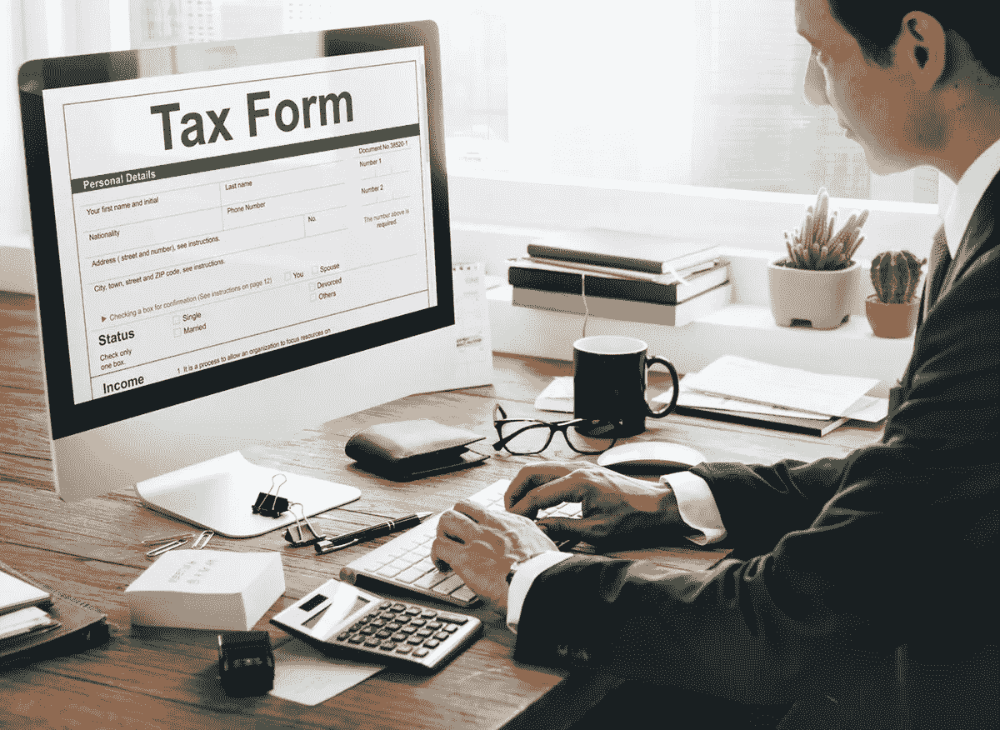

# 利用数据科学进行税收改革

> 原文：<https://towardsdatascience.com/using-data-science-for-tax-reform-2d584a884c82?source=collection_archive---------21----------------------->

财务压力和人员减少导致税务机构尽可能实现自动化。

最大的创新是将大数据分析应用到现代税收管理中，大数据分析是对大量数据的自动化分析。利用数据科学推动财务运营已经开始改变政府最高层的税收管理。

事实证明，将大数据应用于税务管理可以有效帮助税务人员识别欺诈和预测违规行为。但是一些公司正在努力适应一个比以往任何时候都需要更多数据的世界——以发票、海关申报和账户报表的形式。

## **数据科学和税收**

使用电脑打击税务欺诈并不是什么新鲜事——美国国税局自 1962 年就开始使用电脑了。然而，大数据分析的使用是一项新的发展。这一策略似乎正在发挥作用——尽管自 2011 年以来员工和预算每年都在减少，但美国国税局报告称[发现的欺诈案件增加了 400%](https://freemanlaw-pllc.com/the-irs-and-big-data-the-future-of-fighting-tax-fraud/),从刑事欺诈起诉中获得的收益增加了 1000%。

国税局正在从过去无法访问或无法获得的来源获取数据。政府服务部门[正在从社交媒体账户](https://www.law.columbia.edu/sites/default/files/microsites/public-integrity/article_the_use_of_big_data_analytics_by_the_irs_efficient_solutions_or_the_end_of_privacy_as_we_1.pdf)中挖掘数据，以帮助创建纳税人档案，并在此基础上进行分析——这可能被用于在纳税季检测欺诈行为。来自社交媒体帖子和个人资料的信息，以及从其他来源和国税局报税档案中提取的数据，被用来确定某个人不遵守税法的可能性。

这种整理公共和私人数据的做法引起了隐私倡导者的关注，尤其是因为除了国税局以外，没有人能完全确定哪些信息被用来做这些决定。(国税局在法律上没有义务说。)目前，纳税人不能审查或质疑国税局存储的关于他们的数据。然而，很难想象，如果大数据的使用能让国税局更好地发现欺诈，它会逆转这一进程。

## **大数据和企业税**

作为推动使用越来越多的数据来防止欺诈和收税的一部分，税务当局要求企业提供更多信息。在这样做的同时，这些机构也在标准化他们接收客户和供应商发票、报关单和银行对账单等数据的方式。这对公司来说是一个问题，因为公司的税务和财务数据通常分散在多个系统和格式中。

税务部门也在增加他们期望从企业获得的数据量。例如，在巴西，公司必须遵守 29 种不同的提交要求。有些提交必须一个月一次。

某些公司结构[可能会比其他公司更好地应对税务管理方面的这些变化](https://sesesop.com/the-esop-advantage-for-s-corporations/)。例如，私人员工持股退休计划(或 S 公司员工持股计划)可能比可比的标准普尔 500 指数公司更容易提供税务信息。

100%员工持股计划拥有的 S 公司员工持股计划不直接或间接支付任何当前公司所得税。(标准普尔 500 公司支付 20%到 25%的税率。)由于这些公司纳税的方式，管理层应该少花时间对公司的会计账目吹毛求疵，寻找机会减少纳税。更简单的会计可以使这些公司更容易向税务机关提供他们需要的各种信息。

大数据分析也可能改变企业会计的运作方式。公司可以使用税务管理人员使用的同样的[技术](https://www.thetaxadviser.com/issues/2018/may/use-big-data-to-identify-tax-risk.html)来审计他们自己。会计师可能会发现，近似国税局的税务分析将有助于他们确保他们工作的企业的合规性。

## **大数据将如何改变税收管理**

目前还不清楚这些变化对个人和企业的长期影响。受隐私倡导者启发的立法可能会限制国税局从公共和私人来源收集的数据量。企业可能会抵制对财务数据日益增长的需求。

然而，每当预算下降时，自动化就成了一个诱人的前景。更少的员工做更好的工作是难以抗拒的，特别是对于像国税局这样现金短缺的政府服务机构。

企业和个人都应该为未来做好准备，未来税收管理将由来自各种来源的数据驱动。

*图像经由* [*Rawpixel*](https://www.rawpixel.com/image/1021552/free-image-rawpixelcom)