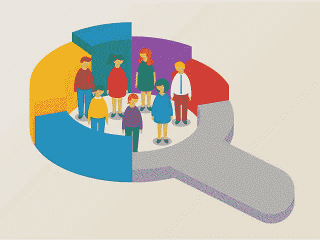
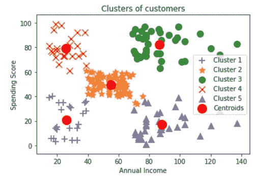

# 如何利用数据科学更好地了解您的客户

> 原文：<https://towardsdatascience.com/using-data-science-to-better-understand-your-customers-part-1-of-2-398d11049785?source=collection_archive---------30----------------------->

客户在你的业务布局中占多大比重？这是一个反问句。我们都知道，大多数企业的兴旺只是因为他们的客户。因此，在为客户服务之前，你必须充分了解他们。了解你的客户有助于你提供量身定制的服务。这提高了客户参与度，增加了销售额。



This picture is definitely worth a thousand words. S*ource:* [*economictimes*](https://economictimes.indiatimes.com)

你了解你的顾客吗？嗯，这个问题很模糊。如果你不能从客户的某些定性方面来回答这个问题，那么你现在就需要开始工作了。我确信所有的企业主在他们的脑海中都有一个理想顾客的形象，不管这个形象有多模糊。通常这种形象是凭直觉编造出来的。它可能没有任何同义反复的证据支持。

数据从不说谎。它只不过是事实和数字的集合，有时它可以向我们展示一面镜子。本文将解释如何使用数据科学的“魔力”来获得对客户的一致理解。确切地说，我们将学习如何对这个[商场客户数据集](https://www.kaggle.com/shwetabh123/mall-customers)应用聚类算法。然后，我们将从输出中进行推断，以更好地了解经常光顾商场的顾客。感谢您忍受如此冗长的前奏，并因您的耐心为您获得[项目源代码](https://github.com/AssiduousArchitect/Customer-Clustering)。

# 什么是客户分桶？

客户细分或客户分组是将公司的客户分成反映每个组中客户相似性的组(也称为分组)的做法。对客户进行细分的目标是决定如何与每个细分市场中的客户建立联系，以最大化每个客户对企业的价值。

吸引客户使您能够以最大化销售的方式迎合每个客户群体。对于营销人员来说，细分目标客户可以让你以一种能产生最大影响的方式来塑造你的沟通。

在这个项目中，我们将使用聚类分析，根据客户的年收入将他们分成不同的类别。为此，我们将使用 Kmeans，这是目前最好的聚类算法之一。K-means 聚类是一种无监督学习算法，它在数据中寻找组。组数用字母 k 表示。

# 让我们开始吧。

请随意跟随。数据集可以在这里[下载。](https://www.kaggle.com/shwetabh123/mall-customers)

## 偷看数据。

商场客户数据集是一个相对较小的数据集，因为它仅包含 199 行和 5 列。如果你看一下这一段下面的图片，你会注意到这五个栏目的标题是客户 ID、流派、年龄、年收入(k$)和支出分数(1-100)。


我们将从导入必要的库开始。

```
import pandas as pd
import numpy as np
from sklearn.cluster import KMeansimport matplotlib.pyplot as plt 
plt.rc(“font”, size=14)
```

现在，我们将导入数据集。

```
data_path = "Mall_Customers.csv"
df = pd.read_csv(data_path)
```

也许这只是我，但我发现出于某种原因，一些列标题令人不安。让我们开始改变这些。

```
df.rename(columns={'Genre':'Gender',
                   'Annual Income (k$)':'Annual_Income',
                   'Spending Score (1-100)':'Spending_Score'
                  }, 
                   inplace=True
          )
```

在这个项目中，我们将使用客户的年收入和支出得分(1 到 100 分)对客户进行聚类。因此，我们将只使用这两列。

```
X = df.iloc[:, [3, 4]].values
```

现在我们已经在数据方面做好了准备，是时候开始我们的集群工作了。在我们运行我们的聚类算法之前，有必要确定将我们的客户分成多少个聚类。有几种不同的方法可以确定该数据集的理想聚类数。为此，我们将使用肘法。

## 肘法

计算集群数量的一种方法是使用肘方法。该方法包括对不同 K 值的数据运行 K 均值聚类算法，并计算每个 K 值的误差平方和(S.S.E .)

然后，将这些值绘制在图表上，我们可以看到，随着 K 值的增加，S.S.E .趋于减小。当 K 的值等于数据点的数量时，S.S.E .变为 0，因为这样每个数据点就是它自己的聚类。我们的目标是找到一个 K 值很小且 S.S.E 很低的点。

在本实验中，我们将对 0 到 10 范围内的不同 K 值运行 K 均值，并将 S.S.E .存储在一个名为 distortions 的列表中。

```
distortions = []
K = range(1, 10)
for k in K:
    kmeansModel = KMeans(n_clusters = k, init = 'k-means++',    random_state = 23)
    kmeansModel.fit(X)
    distortions.append(kmeansModel.inertia_)plt.plot(K, distortions)
plt.title("The Elbow Method")
plt.xlabel("Number of Clusters")
plt.ylabel("S.S.E.")
plt.show()
```

现在，让我们看一下图表。


在此图中，您可以观察到，在 K 的每次迭代之后，S.S.E .急剧下降。您还可以观察到，在 K 达到 5 之后，它是一个下坡。因此，5 似乎是 K 的最佳值，这意味着我们将把客户分成 5 个集群。

现在我们已经计算出了集群的数量，我们可以继续创建这些集群。

```
kmeansModel = KMeans(n_clusters = 5, init = 'k-means++', random_state = 23)
Y = kmeansModel.fit_predict(X)
```

由于数据集很小，所有这些过程都不需要花时间来完成。一旦创建了集群，我们就可以将它们绘制在图表上。每个聚类点使用不同的符号进行标记，每个聚类的质心使用实心红点进行标记。



Just look at them!

只要看一下图表，我们就能了解到经常光顾购物中心的五种不同类型的顾客。如果我们给他们命名，那么他们可以被命名如下:
i .低收入，高消费(红色)。
二。低收入、低消费人群(蓝色)。
三世。平均收入，平均支出(橙色)。
四。高收入，高消费，和(绿色)
诉高收入，低消费(紫色)。

这些群体中的每一个成员都有更多的共同特征，因此我们有一个同质群体。这些群体中的每一个人都可能有相似的需求和愿望。记住这一点，所有的营销/销售活动都可以满足这些需求和愿望，以吸引更多这样的客户。例如，迎合低收入群体的每周折扣销售或迎合高消费群体的购买奖励积分，将他们转变为常客。可能性是无限的，只受我们想象力的限制。

# 结论

了解一个企业的客户群是至关重要的。深入了解客户行为的方法之一是根据他们的行为(本实验中的收入和支出)将他们分成不同的类别。)相似的人往往行为相似，这就是客户细分的症结所在。因此，通过围绕这些桶计划所有的销售和营销活动，它将承诺更高的投资回报和愉快的客户体验。