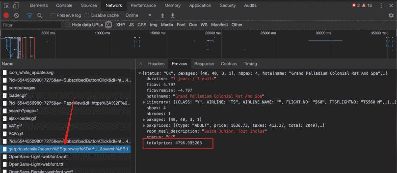
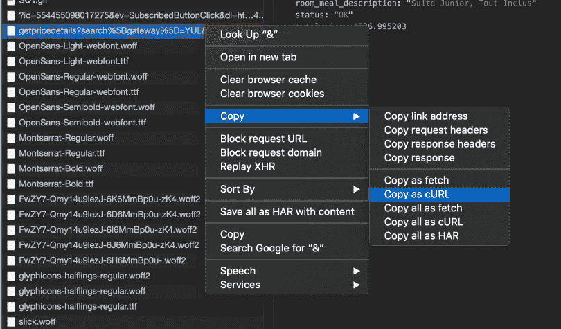
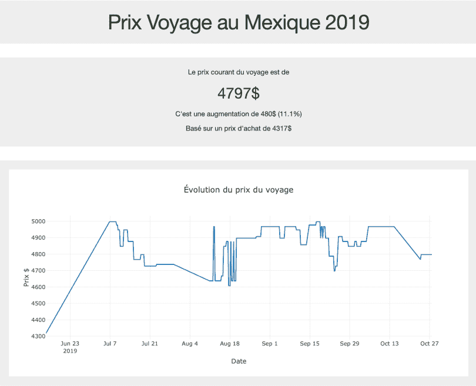
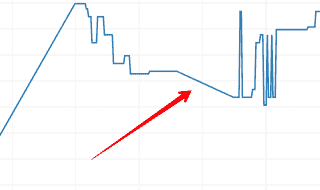
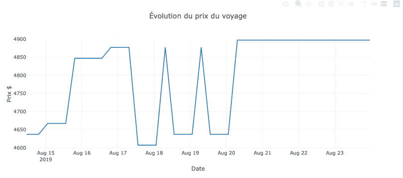

# 利用数据科学为我下次墨西哥之行省钱

> 原文：<https://towardsdatascience.com/using-data-science-to-save-money-on-my-next-trip-to-mexico-1b1b5920535b?source=collection_archive---------15----------------------->

## 我如何使用基本的数据工作来确保我的旅行价格合理。

我和妻子在阳光明媚的地方度假已经有 4 年了。上次我们度蜜月时，在墨西哥度过了一段美好时光。我们在里维埃拉玛雅一个非常好的全包式度假村度过了 10 天。从那以后，一栋房子，两个孩子，一份新工作和许多其他事情。经过一番思考，我们决定是时候回到海滩上去了。因此，明年 12 月(2019 年)，我们(我的妻子，我们 3 岁的孩子，我们 4 个月大的孩子和我)将再次前往里维埃拉玛雅。

别担心，我不会把我的数据博客变成一个旅游和生活博客。我想和你分享一下我是如何确保这次旅行价格合理的。

这就是有趣的地方，当我们今年夏天(6 月)签署合同时，合同说，如果价格下降，我可以，**一次**，要求价格匹配。因为旅行是在+-6 个月后，这看起来是一个非常有趣的功能。顺便说一句，这是我们选择那家旅游公司的原因之一。坦率地说，我们为整个家庭支付了 4317 加元。

# 不那么容易的部分

几周后，我回去查看价格。它还是一样的。然后我意识到，我怎么能追踪价格。没有办法我可以花时间去，通过一系列的网络界面点击查询价格。那将意味着一天 2-3 分钟的烦人时间，我真的没有那个时间。

下面是获取价格更新的样子:

The full process of getting the price update.

显然，旅游公司并不认为跟踪价格是一个很好的功能。在搜索了几次之后，没有办法做到这一点。至少用网站上的一个工具。

如果它低于我的原价，我是接受这个价格还是再等一会儿。因为记住，我只能做一次价格匹配。拥有所有历史价格真的很有用，如果/当它低于原价时，我可以观察趋势并做出更明智的决定。

所以现在我需要每天花几分钟获取价格，然后再花几分钟将价格复制到某种电子表格中。任何做过这种事情的人都知道，在最初的几天，甚至几周，这种方法还行。但是在某个时候，你开始错过日期，复制粘贴错误，等等。

手动处理数据或多或少相当于没有处理。

# 写剧本就行了。

我的想法是，我可以获得 URL，从 python 或其他什么地方下载 HTML，然后用一些 regex 魔术来提取价格。

当然，这不可能那么容易。首先，URL 并没有真正改变。所有价格的东西都是另一页上面的某种模式。所以复制 URL 基本上会把你带回主页。

现在，当我开始查看 Chrome 开发者工具时，我认为我可以在某个地方看到数据。数据必须正确…正确…

在每一个文件中挖掘了几次之后，我找到了金块。

看起来我们走在正确的道路上。我们有一个 JSON 文件和定制的 URL 来获取它。显然，当我在新页面中直接使用这个 URL 时，它不起作用。我收到相当于页面不可用的信息。真的，看起来他们不想让我们这么做。他们设置了许多路障来阻止我们做这件事。谢谢奥巴马。

然后，我在 chrome 开发工具中发现了一个非常简洁的选项。

复制为卷曲。您最终得到一个非常长的命令，可以粘贴到您的终端并获得 JSON。

终于，有东西起作用了。我现在有办法提取价格了。

正如你所看到的，这个查询非常糟糕。真的，就像他们不希望我们自动提取价格一样。至少，现在，我们有一本很好的字典可以使用。

# 现在如何处理这个值

既然我们可以访问这个值，我们如何提取它。我决定创建一个每 6 小时运行一次的 AWS Lambda 函数来提取价格。以这个价格，一天 4 次，我们做 3 件事:

1.  我们检查价格是否合理。由于我支付了 4300 多一点，如果价格低于 4 千美元，我给自己发了一封电子邮件。以确保需要时我能迅速行动。
2.  我将值(带有时间戳)存储在数据库中。(DynamoDB)
3.  我将该值(带有时间戳)存储在 AWS S3 中

为什么是 2 和 3，我不确定我将如何使用它，因为 AWS 有一些关于什么可以访问什么的规则，而且因为存储非常便宜，我存储了两次。

# 价格

因此，可悲的是，价格还没有低于 4300 美元，公平地说，我怀疑它会。旅行现在根据天数定价 4700/5000。

为了构建这个视图，我使用了一个叫做 [Dash](https://plot.ly/dash/) 的神奇工具，它允许你用不到 100 行代码构建这个视图。有兴趣可以去看看这里的 app:[https://voyage . coffeeanddata . ca](https://voyage.coffeeanddata.ca)。

# 发现

有几天，我没有收集到任何新的数据点。事实上，cURL 命令从服务器获得了一个 404。我花了一段时间才意识到我没有新数据。

因为我没有在代码中实现任何验证。Lambda 脚本会无声无息地失败，我也不会收集新的数据点。

因此，我在代码中添加了一个验证，当 cookie 需要更新时，它会向我发送一封电子邮件。我假设 cookie 中加密了一些过期信息。因此，简单地获得一个新令牌似乎就足够了。

## 明智地选择

到目前为止，我从数据中得到的另一个有趣的点是曲线的这一部分:

连续几天，早上 7 点左右，价格飙升了 200 美元。这是我下次预订旅行时会注意的事情。

# 结论

可悲的是，我没有存下任何钱…到目前为止。我将在两个多月后飞往墨西哥，所以我会继续在我的网站上跟踪价格。旅游公司似乎正在努力阻止我们自动提取价格。

价格看起来很不稳定，我很想知道是什么影响了每小时的价格。

如果你感兴趣，所有的代码都可以在我的 Github 回购:[https://github.com/marcolivierarsenault/triptracker](https://github.com/marcolivierarsenault/triptracker)

你可以在这里查看我的 web app:[https://voyage . coffeeanddata . ca](https://voyage.coffeeanddata.ca)

*原载于 2019 年 10 月 28 日*[*https://coffeeanddata . ca*](https://coffeeanddata.ca/using-data-science-to-save-money-on-my-next-trip-to-mexico/)*。*