# 利用数据科学揭露 Twitter 上国家支持的巨魔

> 原文：<https://towardsdatascience.com/using-data-science-to-uncover-state-backed-trolls-on-twitter-dc04dc749d69?source=collection_archive---------14----------------------->

## 国家运营商在社交媒体上发起的造谣运动已成为对民主的严重威胁。以下是如何用三步法揭开它们的面纱。

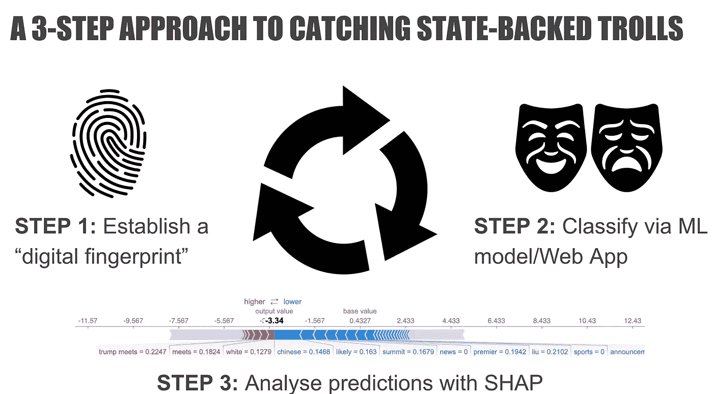

面对越来越大的公众和政治压力，脸书和 Twitter 等社交媒体巨头被迫加大对其平台上国家支持的虚假信息活动的打击力度。

[FB 已经对来自伊朗和以色列的违规账户采取了行动](https://newsroom.fb.com/news/)，而 [Twitter 发布了数百万条被认为是俄罗斯、伊朗、委内瑞拉和孟加拉国政府支持的运营商所为的推文](https://about.twitter.com/en_us/values/elections-integrity.html#data)。

然而，尚不清楚的是这些账户和社交媒体帖子的识别过程。比如说，在新加坡，人们该如何在社交媒体上揭露这些经营者？

我在 General Assembly(新加坡)的最后一个项目中解决了这个问题，当时我参加了一个为期 12 周的数据科学训练营。通过结合使用数据科学技术，我相信以下三个步骤可以用来帮助揭示国家运营商在社交媒体上的工作:

*   步骤 1:建立巨魔的“数字指纹”——探索性数据分析和可视化可以有效地识别国家运营商的数字踪迹和作案手法。
*   第二步:建立一个机器学习模型和 web 应用程序，更有效地对可疑的推文/帖子进行分类。
*   第三步:使用 [SHAP](https://github.com/slundberg/shap) 获得模型预测正确或错误的详细信息。这一步的见解可以反馈到第一步，在调查中形成良性循环。

# 更新—2020 年 9 月

我上传了一份新的报告，内容是关于如何使用一个微调过的 transformer 模型来检测 state troll tweets。详细的笔记本和数据可以在[这里](https://github.com/chuachinhon/transformers_state_trolls_cch)找到。可以在[这篇文章](/detecting-state-backed-twitter-trolls-with-transformers-5d7825945938)中找到有关步骤和测试的概述。

# 重要的事情先来

我的项目专注于 Twitter，尽管我认为这种方法可以广泛应用于 FB 或 Instagram 帖子。这篇文章是对结果的概括，我不会深入研究代码。

我的项目回购可以在这里找到:[http://bit.ly/StateTrolls](https://github.com/chuachinhon/twitter_state_trolls_cch)(最好克隆或下载笔记本。它们巨大的文件大小使它们在线加载很痛苦。)

我还开发了一个简单的网络应用程序来检测俄罗斯的国家巨魔，你可以在这里试试:【http://bit.ly/TrollDetector 

这个项目中使用的国家支持的推文(Twitter 官方发布)可以在这里下载[。](https://about.twitter.com/en_us/values/elections-integrity.html#data)

# 背景

那么，这些国家支持的巨魔是谁，他们的目标是什么？迄今为止最知名的肇事者是俄罗斯的互联网研究机构(IRA)及其多年来影响 2016 年美国大选的努力。

对其活动的详细讨论可以占据几个中等篇幅，因此谨慎的做法是在此强调关于这一主题的两个更广泛的报告:

*   在线情报公司[新知关于爱尔兰共和军战术和比喻的深度报道](https://cdn2.hubspot.net/hubfs/4326998/ira-report-rebrand_FinalJ14.pdf)。
*   彭博关于世界各地政府控制行动的长篇报告。

爱尔兰共和军的成功引发了世界各地的效仿行为，包括伊朗、委内瑞拉和孟加拉国的类似行动。在一个全面的解决方案出台之前，这个问题只会变得更糟。

# 本项目中使用的数据

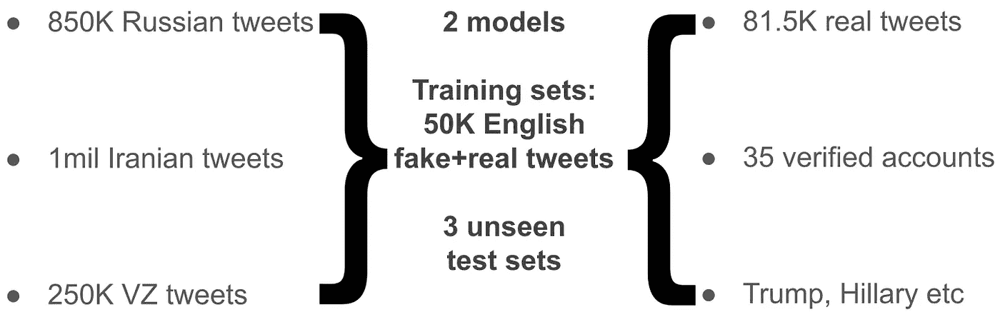

上面的图表总结了我如何为这个项目收集和筛选数据。

这类项目中的关键挑战一直是建立“地面真相”的困难，也就是说，你如何知道哪些是国家巨魔的推文？在我的案例中，我依赖于 Twitter 官方发布的大量 state troll 推文(Twitter 没有披露其识别这些推文/账户的内部流程)。

我过滤掉了非英语的推文，以及转发，这样分类模型就不会以语言为基础区分推文。这显然是我的项目的一个限制，因为语言和 RTs 是 Twitter 上国家巨魔行为的一个关键方面。

对于真实的推文，我使用 [Tweepy](https://www.tweepy.org/) 到[从 35 个经过验证的账户中收集了超过 81，500 条推文——包括新闻媒体、像川普和希拉里这样的政治家，以及美国的活跃用户。](https://github.com/chuachinhon/twitter_state_trolls_cch/blob/master/notebooks/1.0_real_tweets_collect_cch.ipynb)

清理后的数据被用于建立两个分类模型(稍后将详细介绍)，一个用于检测俄罗斯国家巨魔的推文，另一个用于挑选伊朗的推文。每个模型都接受了 50，000 条推文的训练——真实推文/巨魔推文各占一半。这些模型还在看不见的推文测试集上进行了测试，这些推文包含来自俄罗斯、伊朗和委内瑞拉的不同比例的国家巨魔推文。

# **第一步:建立“数字指纹”**

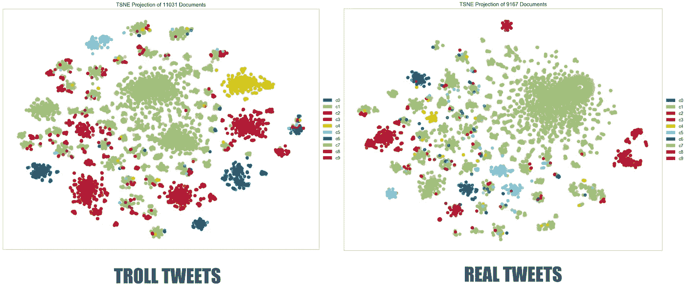

t-SNE plots of samples tweets from 10 troll and real accounts.

国家巨魔可能在幕后运作，但他们的最终目标迫使他们在社交媒体上留下清晰的数字痕迹，正如 10 个巨魔和真实账户的推文的 t-SNE 图(上图)所示。

从我对俄罗斯爱尔兰共和军推文的探索性数据分析来看，很明显，在时间、活动和伪装方式方面有明确的结构模式。虽然一些特征是爱尔兰共和军在 2016 年选举中的目标所独有的，但我认为在 Twitter 这样的开放平台上运作的国家巨魔会留下大致相似的痕迹。

就其本身而言，这些线索都不符合“确凿证据”的条件。但综合来看，它们描绘了一幅相当一致的行为图景。让我们来看看其中的一些关键特征:

# 1.1 账户创建日期

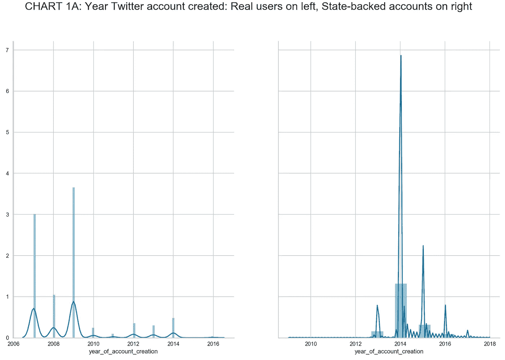

现在，Twitter 是一个成熟的平台，用户增长正在放缓。它的受欢迎程度在 2009 年达到顶峰，这意味着在美国等成熟市场，新用户注册量的突然激增应该会敲响警钟。

分析俄罗斯巨魔账户的创建日期，很明显，可疑的大多数是在 2014 年创建的。一个勤劳的国有运营商可以通过缓慢地传播他们的账户创建日期来隐藏他们的踪迹。但是人们不应该低估人类马虎的能力。

# 1.2 真实与国家支持的推文/账户的结构特征

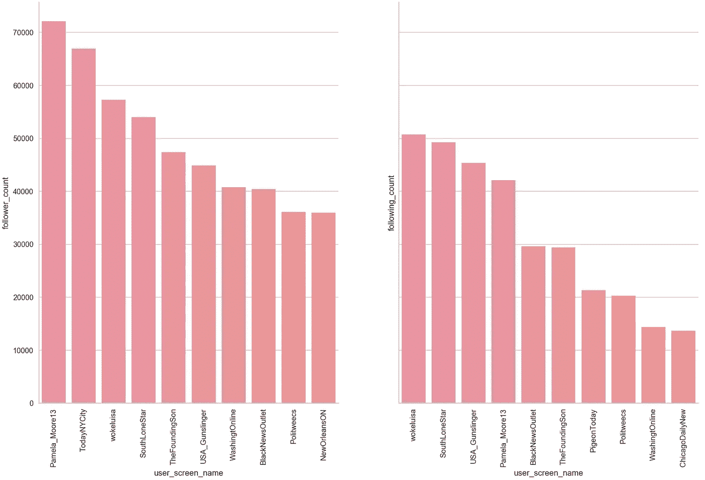

Comparison of number of followers for top state-backed accounts (left), versus the number of accounts they follow (right).

如果你了解社交平台上的用户体验，辨别可疑行为就会变得更容易。在 Twitter 的背景下(以及该平台内容的消防性质)，没有一个正常的真实用户会关注成千上万的其他用户，因为那会完全破坏用户体验。

上面的图表显示了我的数据集中前 10 个俄罗斯巨魔账户的关注者数量(左)，以及他们关注的可疑的高数量的账户(右)。因此，关注者对关注者的比率是巨魔账户的一个关键迹象。

这种模式与真实用户形成鲜明对比，如下图所示:

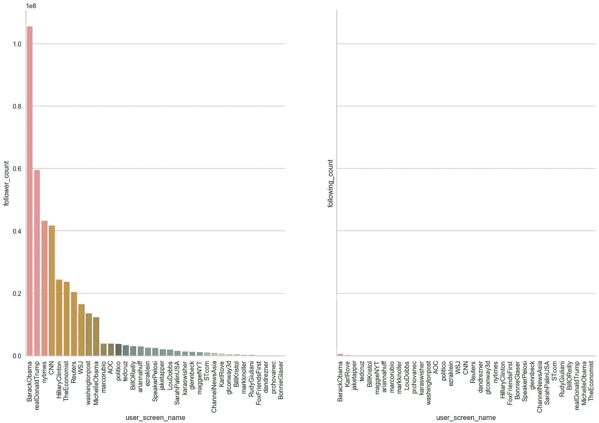

来自国家巨魔的推文也大多较短，由大约 11-14 个单词组成，少于 70 个字符。参见我的[笔记本](https://github.com/chuachinhon/twitter_state_trolls_cch/blob/master/notebooks/2.0_EDA_visualisation_cch.ipynb),了解与真实 tweets 相比，巨魔 tweets 更详细的结构特征。

# **1.3:藏在众目睽睽之下**

也许俄罗斯国家巨魔最有趣的一面是他们伪装自己的方式——在这种情况下，他们试图伪装成美国当地的新闻机构。看看真实和巨魔推文的主题建模结果之间的相似之处。

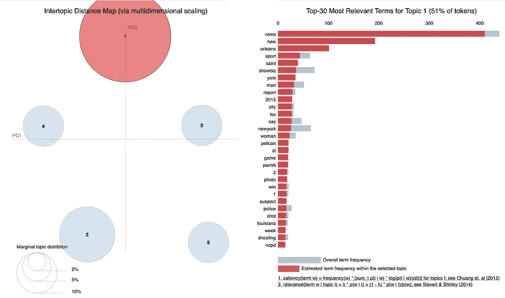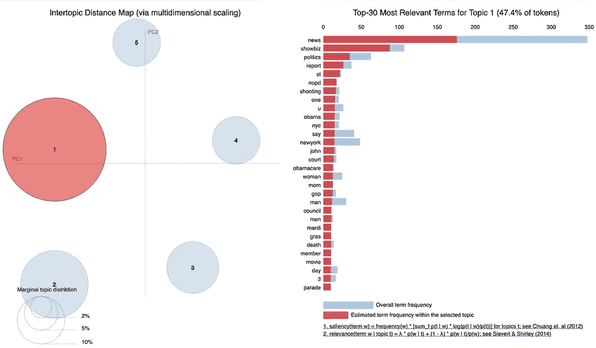

“news” is the No 1 most relevant term in the topic models for real tweets (left) versus troll tweets (right).

乍一看，真实和巨魔推文的主题模型看起来如此相似，这似乎很奇怪。为什么“娱乐圈”、“政治”和“纽约”这些无关痛痒的术语会在巨魔推文主题模型的 30 个最相关术语中占据很高的位置？

但是当你从用户的角度考虑它的时候，它是完全有意义的。突发新闻和信息更新是美国人使用 Twitter 的主要方式。

因此，俄罗斯巨魔潜入目标明确的宣传的最佳方式之一是欺骗真实用户，让他们认为巨魔账户是新闻和有用信息的合法来源(可以是体育或娱乐更新)。最终，他们的目标不是用巨魔内容的弹幕淹没普通用户，而是把假的和真的混在一起，这样用户在很长一段时间后就分不清两者了。

关于俄罗斯虚假信息运动的新知识报告称之为“[媒体海市蜃楼](https://cdn2.hubspot.net/hubfs/4326998/ira-report-rebrand_FinalJ14.pdf)”。看看下面这组推文。不知情的用户可能不会立即意识到这些是俄罗斯运营商发布的 troll tweets。

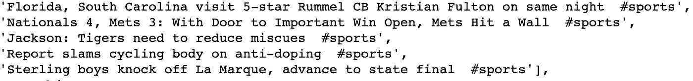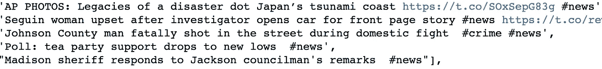

显然需要大量的市场调查来补充这些 EDA 技术和图表。例如，只有在了解政治日历的情况下，对特定年份或月份的账户创建量异常激增的洞察才有意义。

但是底线是清楚的:有一种方法可以让这些国家巨魔疯狂。他们的目标和社交平台的开放性将迫使他们留下数字痕迹和独特的行为模式。

在试图使用机器学习模型将可疑的推文与真实的推文区分开来之前，拼凑他们的“数字指纹”是必不可少的第一步。

# 步骤 2:构建+训练-测试分类器

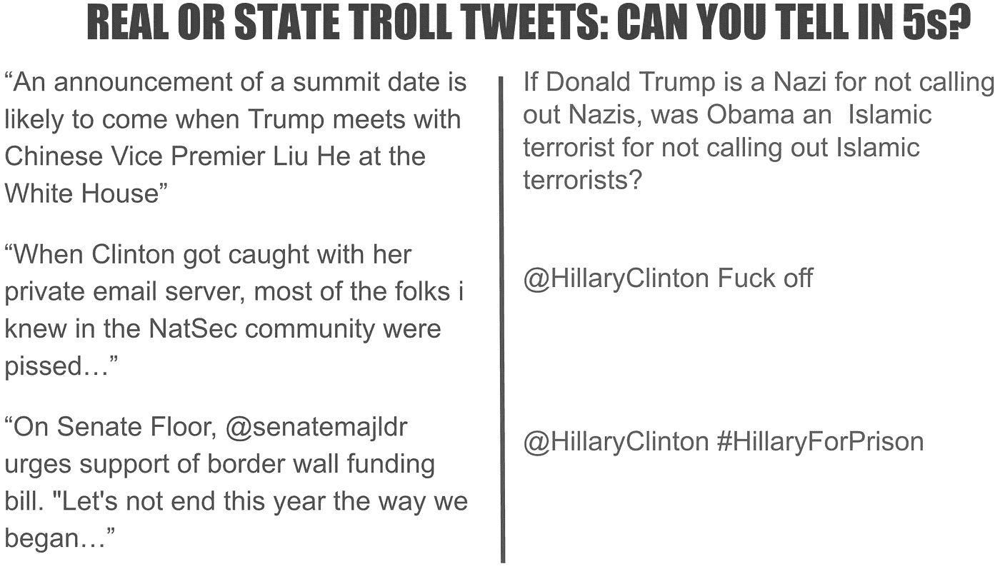

你能多快把上面的六条推文整理成巨魔和真实推文？600 或 6000 条推文呢？手动识别和分类巨魔推文在大规模应用中并不现实。这就是分类器发挥作用的地方。

您可以构建一个非常复杂的模型，使用从步骤 1 中收集的特征组合以及 tweet 文本的内容来辨别 troll/real tweet。但是这确实会使配套 web 应用程序的构建变得复杂(稍后将详细介绍)。这也使得在步骤 3 中分析单个预测变得更加困难。

出于这些原因，我已经尽可能简单地保持了我的模型的[设计。我只使用了 1 个预测值——一个“干净的 tweet”列，其中原始 tweet 文本已被清除标点符号等——而目标列为“bot _ or _ not”(0 表示真实 tweet，1 表示 troll tweets)。](https://github.com/chuachinhon/twitter_state_trolls_cch/blob/master/notebooks/3.0_Russian_model_cch.ipynb)

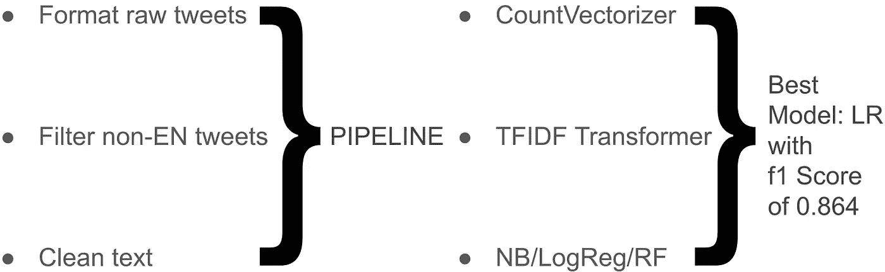

上图总结了[笔记本 3.0](https://github.com/chuachinhon/twitter_state_trolls_cch/blob/master/notebooks/3.0_Russian_model_cch.ipynb) 中俄罗斯巨魔探测器模型的工作流程，以及[笔记本 3.2](https://github.com/chuachinhon/twitter_state_trolls_cch/blob/master/notebooks/3.2_Iranian_model_cch.ipynb) 中伊朗巨魔探测器模型的工作流程。这是一个简单的过程，包括对原始的英文推文进行标准化的清理，然后通过一个管道进行处理，其中包括一个 CountVectorizer、一个 TFIDF 转换器和一个分类器。

在这个项目中，我选择了更常见的分类器——朴素贝叶斯、逻辑回归和随机森林。您可以选择更复杂的分类器，但是考虑到训练集的大小(50，000 行)，完成管道运行所需的时间可能会呈指数增长。

总的来说，逻辑回归模型是我尝试的三个模型中最好的。它拥有最好的 f1 分数——精确度和召回率的平衡——以及最快的平均拟合时间。

让我们从模型 1 开始，它用俄罗斯巨魔推文训练，看看它在 3 个不同的 100 条推文的看不见的测试集上的表现如何，其中巨魔推文的比例从 50%逐渐减少到大约 10%:

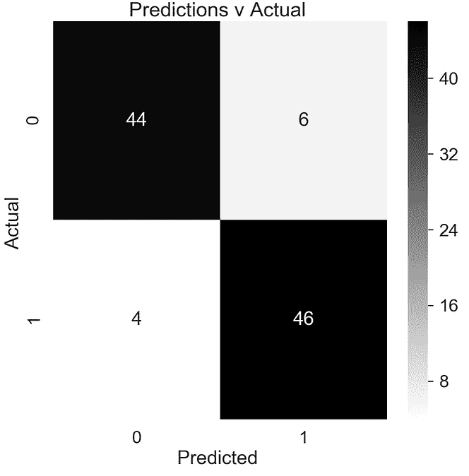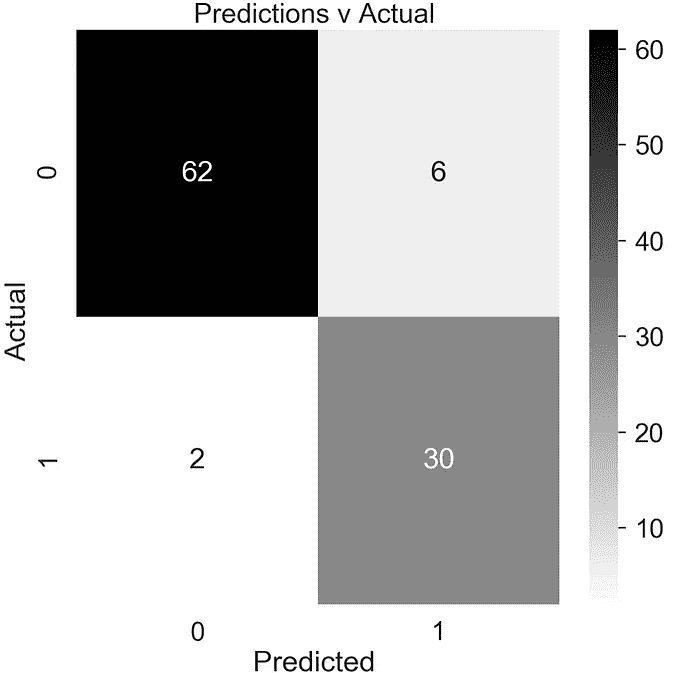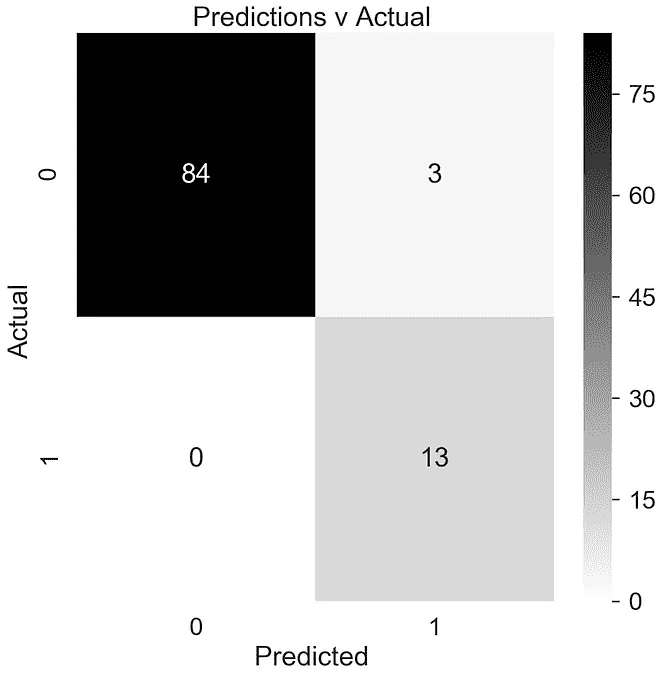

L-R: Confusion matrices for Model 1 Vs 3 unseen test sets with 50% Russian troll tweets, 30% troll tweets and 10% troll tweets.

模型 1 出人意料地善于从真实的推文中挑出新的俄罗斯巨魔推文，即使巨魔推文的比例逐渐减少。在整个测试过程中，它的 f1 分数保持在 0.8-0.9 之间。该模型正确地挑选出了绝大多数看不见的 troll 推文，甚至在 90-10 的测试集中获得了 1.0 的完美回忆分数(上图中最右边)。

但它对其他国有运营商的推文有用吗？我用来自伊朗和委内瑞拉的 troll tweets 对 Model 1 进行了测试，结果很糟糕:

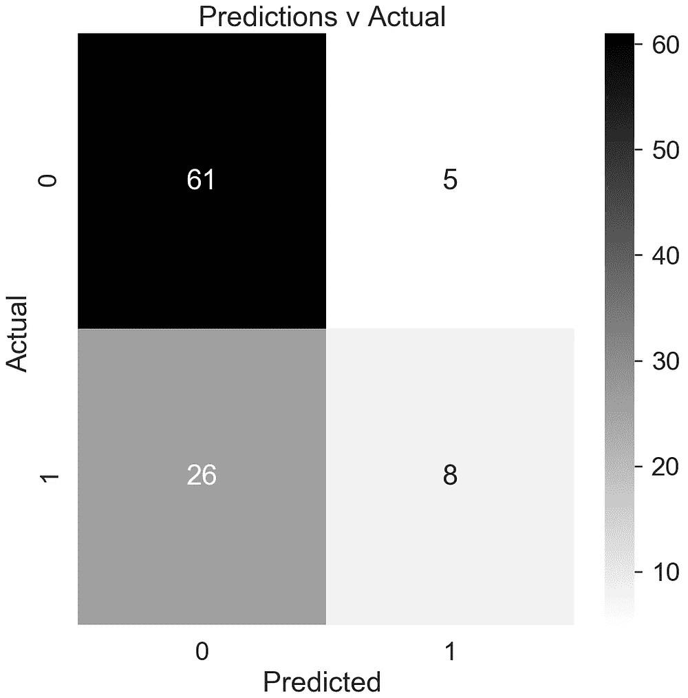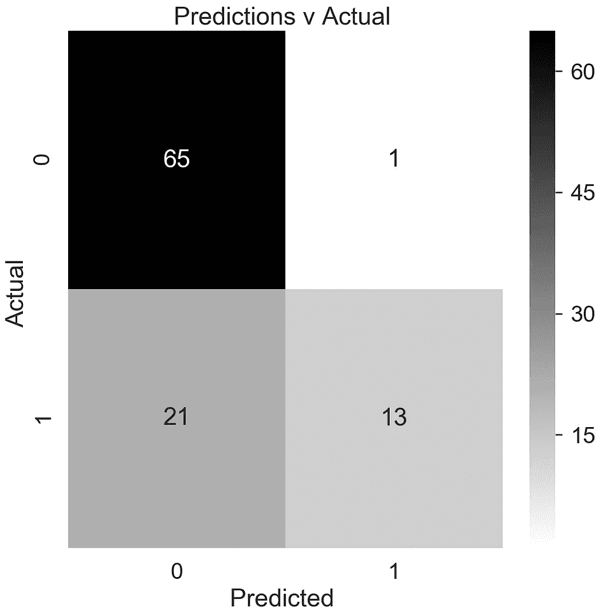

L-R: Confusion Matrices for Model 1 Vs unseen test sets with Iranian troll tweets (L) and Venezuelan troll tweets (R).

Model 1 的召回分数在与伊朗和委内瑞拉 troll tweets 的未知测试集的测试中惨败。虽然它继续很好地挑选出美国用户的真实推文，但它未能捕捉到大多数伊朗或委内瑞拉的推文。

这些结果似乎表明，每个国家支持的运营商的工作都非常具体。与其试图建立一个庞大的“全球”模型来捕捉所有的国有运营商，不如建立更小、更灵活的模型来更好地识别特定的国有运营商。

我建立了第二个模型来测试这一论点，这一次是在伊朗巨魔的推文中结合经过验证的美国和国际用户的真实推文来训练模型。以下是类似测试条件下的结果，伊朗巨魔推文的比例从 50%逐渐降低到 14%左右:

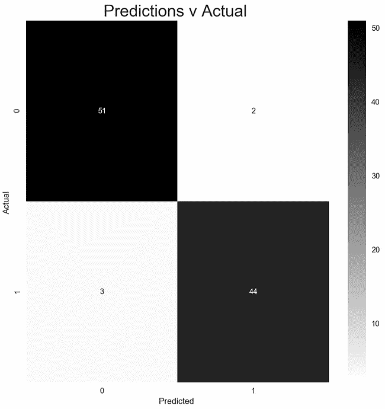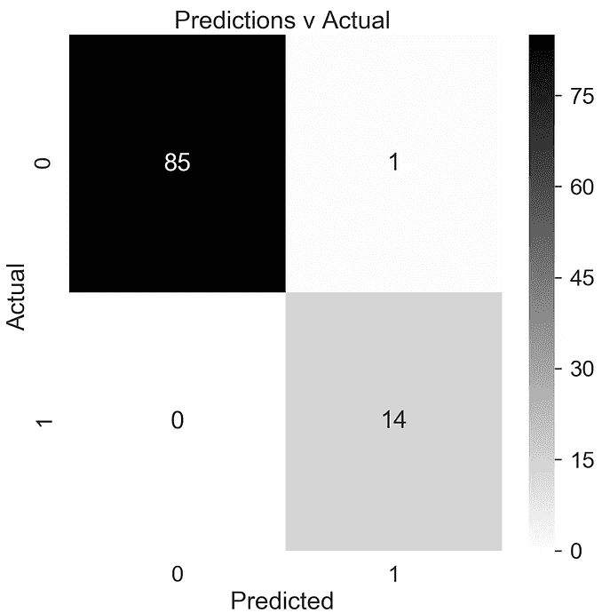

L-R: Confusion matrices for Model 2Vs 3 unseen test sets with 50% Iranian troll tweets, 30% troll tweets and 10% troll tweets.

Model 2 的表现也很出色，它能够挑选出以前从未见过的新的伊朗巨魔推文。它的 f1 分数在所有 3 次测试中都高于 0.9。

正如上面的 3 个混淆矩阵所示，该模型非常善于挑选出巨魔推文，在 90-10 的集合中获得了完美的召回分数，它挑选出了所有 14 条巨魔推文，并且在 100 条推文中仅错误分类了 1 条。

结论是显而易见的(尽管在一开始并不完全明显):一个根据特定国家支持的运营商的推文训练的模型不会很好地推广。为了抓住国家巨魔，你需要为他们所在的每个市场量身定制解决方案。

# 第 2.1 步:**使用网络应用程序快速办理登机手续**

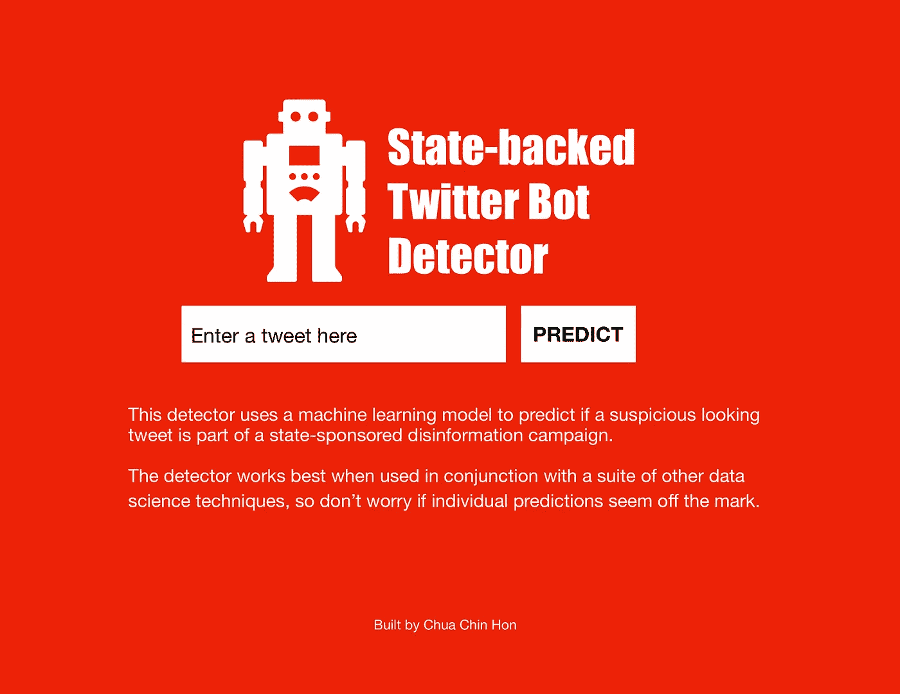

Go to [http://chuachinhon.pythonanywhere.com/](http://chuachinhon.pythonanywhere.com/) to try out the web app.

抓住这些国家支持的运营商需要团队的努力，并不是每个参与其中的人都有技能通过机器学习模型运行大量可疑的推文。每当你想检查一些潜在的可疑推文时，运行一个模型也是没有效率的。

为此，我开发了一个简单的[网络应用](http://chuachinhon.pythonanywhere.com/)——【http://chuachinhon.pythonanywhere.com/】T2——用户只需要输入一条可疑推文的文本，就可以快速检查它是否是俄罗斯巨魔的推文。该应用程序很简单，如果你需要将它们放在 10 个不同国家或市场的团队手中，你可以轻松地构建 10 个不同的版本。

它不会像数据科学家的计算机上的最新模型那样准确，但它可以作为一种快速诊断工具，可以补充第一步中使用的其他工具，以识别 state troll 的数字指纹。

# 第三步:用 SHAP 分析预测

至少有两种方法可以进一步分析模型的预测，例如通过检查预测的概率或绘制最常出现的关键词的频率。

但这两种方法都无法提供 SHAP 所能提供的粒度水平，即揭示哪些特征促使模型预测一条推文是真实推文还是巨魔推文。SHAP 还可以用于深入了解模型的预测哪里出错了，以及是什么导致了不正确的分类——这是在巨魔更新他们的策略时更新模型的重要洞察。

SHAP 的详细解释，或者说[沙普利附加解释](https://github.com/slundberg/shap)，超出了这篇文章的范围。在这个项目的背景下，用几个例子来说明 SHAP 是如何工作的可能更容易。

# SHAP 示例 1

这是一条被 Model 1 准确归类为真正的推文的推文:“特朗普在白宫会见中国副总理刘鹤时，可能会宣布峰会日期。”

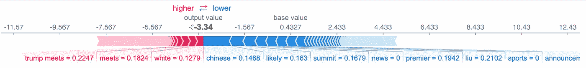

根据通过的训练数据集的平均模型输出，每个模型都有一个唯一的基值。在这种情况下，模型 1 的基值是 0.4327。

不同的矢量化要素会将模型的预测推向不同的方向。如果最终输出低于基准值，则被归类为真正的 tweet。如果输出高于基本值，它被认为是一个 troll tweet(在我如何在这个项目中标记输出的上下文中)。

在上面的例子中，我们可以看到像“中国”、“峰会”、“总理”这样的事实词推动模型将推文归类为真实的推文，而有趣的是，“特朗普会见”这些词则推动模型向相反的方向发展。

# SHAP 实施例 2 和 3

让我们再看两条推文，其中 Model 正确地分类为俄罗斯巨魔推文:“@HillaryClinton # HillaryForPrison”和“@ HillaryClinton 滚蛋”。

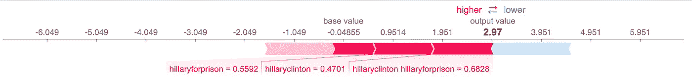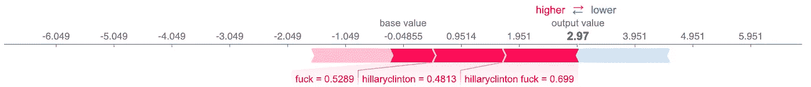

在上面的第一条推文中，“hillaryforprison”标签是推动模型将这条推文归类为巨魔推文的最强特征。在第二条推文中，脏话及其与希拉里·克林顿名字的组合是推动模型将其归类为巨魔推文的最强因素。

虽然该模型对美国政治或新闻没有天生的理解，但它已经获得了足够多的真实和虚假推文的例子，能够区分这两组推文。

当然，这种模式可以被巨魔推文打败。让我们看看模型 1 预测错误的一些例子。

# SHAP 实施例 4 和 5

俄罗斯巨魔探测器 Model 1 错误地将这条推文归类为巨魔推文(高于基础值)，而实际上它是一条真正的推文:“当克林顿被抓到使用她的私人电子邮件服务器时，我在国家安全委员会社区认识的大多数人都很愤怒……”

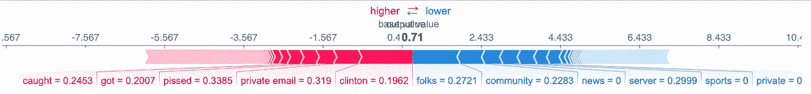

“生气”、“私人邮件”和“被抓”这些词促使 Model 1 将这条推文归类为巨魔推文——而事实上，这条推文是弗莱彻学院教授、《华盛顿邮报》专栏作家丹·德雷兹纳(Dan Drezner)写的。

Model 1 在面对伊朗巨魔的推文时也多次失败，因为它没有接受过训练。它将这条推文归类为真实的，而实际上它是一条巨魔推文:“西班牙，意大利警告不要投资以色列定居点。”

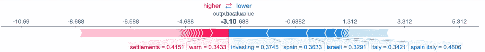

像新闻标题一样写的简短而真实的推文似乎会绊倒机器学习模型。同样，该模型似乎很难处理稍微复杂一点的推文，比如涉及电子邮件服务器的推文。

**我对此的看法很简单:**有效识别社交媒体上国家支持的虚假信息活动，需要将人工输入/分析与机器学习和数据分析工具的智能使用很好地结合起来。

对人类来说似乎显而易见的事情，对一台没有地缘政治知识的机器来说可能并非如此，而机器在发现模式方面可能会更有效率，而这需要人类花很长时间来手工整理。

# 限制

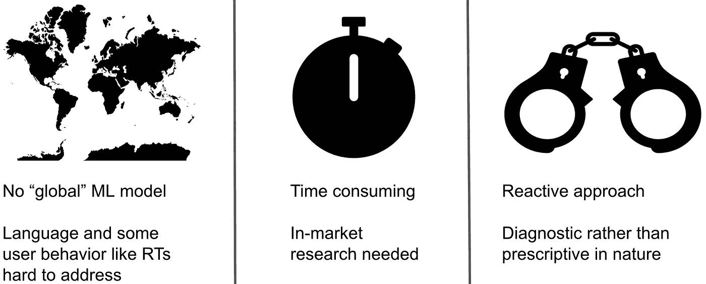

上面的图表总结了我揭露 Twitter 上国家支持的巨魔的方法的一些局限性。从建模的角度来看，语言可能是最棘手的问题。

一方面，您不希望您的 troll 检测器成为一个美化的语言分类器。另一方面，通过只在英语推特上训练模型，你错过了国家支持的巨魔的一个关键特征。

熟悉深度学习技术的数据科学家可能会在这一领域有更好的解决方案。

最大的限制是这个过程完全是反应性和诊断性的。没有办法先发制人的国家巨魔的工作，至少没有公开可用的工具。

这是我第一次尝试将我新生的数据科学技能应用于像在线虚假信息这样的复杂问题。这里和笔记本上的错误都是我的，我欢迎该领域专家的反馈，或者任何一般性的更正。

最后，非常感谢本杰明·辛格尔顿对这个长期遭受折磨的项目的帮助。特别的大声喊出来还要感谢 [Susan Li](https://medium.com/u/731d8566944a?source=post_page-----dc04dc749d69--------------------------------) 她出色的 NLP 和 Flask 教程，这对我帮助很大。

以下是该项目的主要资源链接:

Github 回购:【https://github.com/chuachinhon 

[穆勒报告:《关于俄罗斯干涉 2016 年总统选举的调查报告》](https://www.justice.gov/storage/report.pdf)